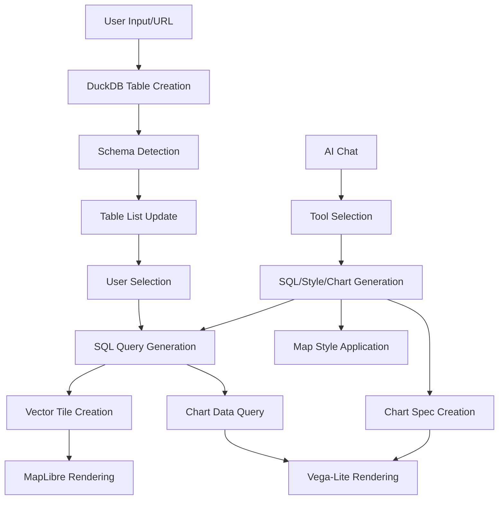

# LINKS BI Prototype - Architecture

## 📋 Table of Contents

1. [Overview](#overview)
2. [Current Architecture](#current-architecture)
3. [Core Features](#core-features)
4. [Technical Implementation](#technical-implementation)
5. [Data Flow](#data-flow)
6. [AI Integration](#ai-integration)
7. [Testing Strategy](#testing-strategy)
8. [Known Issues & Limitations](#known-issues--limitations)
9. [Development Guidelines](#development-guidelines)

---

## 🎯 Overview

LINKS BI Prototype is a modern browser-based Business Intelligence application that combines DuckDB-WASM's analytical capabilities with powerful data visualization through MapLibre GL for geospatial data and Vega-Lite for charts and graphs. The platform enables users to load, analyze, and visualize large datasets directly in the browser without server-side processing.

### Key Technologies
- **Frontend**: React 19 + TypeScript
- **Database**: DuckDB-WASM with Spatial Extension
- **Maps**: MapLibre GL
- **Charts**: Vega-Lite
- **Build**: Vite
- **State Management**: Jotai
- **AI Integration**: Anthropic Claude

---

## 🏗️ Current Architecture

### Component Hierarchy

```
src/
├── pages/
│   └── ChatPage/          # Main application page
│       ├── index.tsx      # Page component
│       ├── hooks/         # Page-specific hooks
│       └── utils/         # Page utilities
├── components/
│   ├── chat/              # AI chat interface
│   │   ├── AIChatModeling.tsx
│   │   ├── ChatInput.tsx
│   │   └── ChatList/
│   ├── map/               # Map visualization
│   │   ├── index.tsx      # MapLibre integration
│   │   └── MapStyleEditor.tsx
│   ├── chart/
│   │   └── VegaLiteChart.tsx
│   ├── table/
│   │   ├── TableView.tsx    # Data grid for table display
│   │   └── TableSelector.tsx # Table selection dropdown
│   ├── query/             # SQL query visualization
│   │   ├── index.tsx      # Main query display component
│   │   └── SQLFlowVisualization.tsx
│   └── remote-file/
│       └── index.tsx
├── lib/
│   ├── ai/                # AI integration
│   │   ├── tools/         # AI tool definitions
│   │   └── useAIChat.ts   # Chat hook
│   └── duckdb/            # Database layer
│       ├── dbContext.ts   # DB context management
│       └── useDuckDB.ts   # DuckDB hook
├── store/                 # Jotai state management
│   ├── atoms.ts           # Re-exports all atoms
│   ├── remoteAtoms.ts     # Remote state
│   ├── localAtoms.ts      # Local UI state
│   ├── derivedAtoms.ts    # Computed atoms
│   └── sync.ts            # State synchronization (useStoreSync)
└── utils/                 # Utility functions
    ├── vectorTileUtils.ts
    ├── maplibreExpressionFixer.ts
    └── geocoding.ts
```

### Core Systems

#### 1. **DuckDB Integration** (`src/lib/duckdb/`)
- Database context with schema support
- Singleton connection management
- Automatic spatial extension loading
- SQL history management with localStorage

#### 2. **Visualization Systems**

##### Map System (`src/utils/vectorTileUtils.ts`)
- Custom protocol handler: `duckdb-vector://`
- Real-time SQL to MVT conversion
- Tile caching for performance
- Automatic JSON property extraction

##### Chart System (`src/components/chart/VegaLiteChart.tsx`)
- Dynamic Vega-Lite spec rendering
- SQL query integration
- Responsive design
- Interactive tooltips and selections

#### 3. **State Management** (`src/store/`)
- **Jotai atoms** for global state
- Persistent state with localStorage
- Chat state, map specs, chart specs
- Table selection and visibility

#### 4. **AI Integration** (`src/lib/ai/`)
- Multiple specialized tools:
  - DuckDB query execution
  - Map style generation
  - Chart creation
  - Geocoding services
- Context-aware prompting
- Error recovery and validation

---

## 🚀 Core Features

### ✅ Data Management
- **Multi-format support**: CSV, JSON, Parquet, GeoJSON, Shapefile
- **URL-based loading**: Direct import from web sources
- **Automatic schema detection**: Column types and geometry
- **Temporary table management**: Hidden analysis tables

### ✅ Map Visualization
- **Vector tile rendering**: Dynamic MVT generation
- **All geometry types**: Points, lines, polygons
- **Interactive styling**: MapLibre expressions
- **JSON property extraction**: Nested field access
- **Click interactions**: Feature popups

### ✅ Chart Visualization
- **Vega-Lite integration**: Declarative chart specifications
- **Chart types**: Bar, line, scatter, heatmap, and more
- **Interactive features**: Tooltips, zoom, pan
- **Data transformations**: Aggregations, filters, calculations
- **AI-powered generation**: Natural language to chart specs

### ✅ Data Analysis
- **Full SQL support**: DuckDB with spatial extension
- **AI-powered queries**: Natural language to SQL
- **Statistical functions**: Aggregations, window functions
- **Geocoding**: Address to coordinates
- **Cross-visualization**: Unified data source for maps and charts

### ✅ Performance Features
- **Tile caching**: Reduces redundant queries
- **Viewport filtering**: Query optimization
- **Worker-based DB**: Non-blocking operations
- **Virtual scrolling**: Large table support

---

## 🔧 Technical Implementation

### Database Context Pattern

```typescript
// Centralized DB management
export class DBContext {
  private connection: AsyncDuckDBConnection;
  
  async executeQuery(sql: string, schema?: string) {
    if (schema) {
      await this.connection.query(`USE ${schema}`);
    }
    return await this.connection.query(sql);
  }
}
```

### Vector Tile Generation

```typescript
// Custom MapLibre protocol
maplibregl.addProtocol('duckdb-vector', async (params) => {
  const { z, x, y } = params;
  const bounds = tileToBounds(x, y, z);
  
  const sql = generateTileQuery(tableName, bounds, columns);
  const mvt = await convertToMVT(await db.query(sql));
  
  return { data: mvt };
});
```

### Chart Generation

```typescript
// Vega-Lite spec generation
export function createChartTool(dbContext: DBContext) {
  return tool({
    description: 'Create data visualizations',
    parameters: z.object({
      spec: z.object({
        data: z.object({ sql: z.string() }),
        mark: z.string(),
        encoding: z.object({
          x: z.object({ field: z.string(), type: z.string() }),
          y: z.object({ field: z.string(), type: z.string() })
        })
      })
    }),
    execute: async ({ spec }) => {
      // Execute SQL and embed results in Vega spec
      const data = await dbContext.executeQuery(spec.data.sql);
      return { success: true, spec: { ...spec, data: { values: data } } };
    }
  });
}
```

### AI Tool Architecture

```typescript
// Tool definition pattern
export function createDuckDBTool(dbContext: DBContext) {
  return tool({
    description: 'Execute SQL queries',
    parameters: z.object({
      sql: z.string()
    }),
    execute: async ({ sql }) => {
      // Validation and execution
      const result = await dbContext.executeQuery(sql);
      return { success: true, data: result };
    }
  });
}
```

### MapLibre Expression Fixing

```typescript
// Fixes incorrect AI-generated expressions
export function fixMaplibreExpression(expr: unknown): unknown {
  // Converts ["get", "properties", ["get", "field"]]
  // To correct: ["get", "field"]
  // Multiple pattern fixes implemented
}
```

---

## 📊 Data Flow



---

## 🤖 AI Integration

### Available Tools

1. **duckdbTool**: SQL execution with safety checks
2. **chartTool**: Vega-Lite chart generation
3. **mapStyleTool**: MapLibre style updates
4. **mapStyleGetTool**: Current style retrieval
5. **geocodingTool**: Address geocoding
6. **completionTool**: SQL completion

### Tool Usage Pattern

```typescript
const tools = {
  execute_sql: duckdbTool,
  create_chart: chartTool,
  update_map_style: mapStyleTool,
  geocode_address: geocodingTool
};

const result = await generateText({
  model: anthropic('claude-sonnet-4-5'),
  tools,
  messages
});
```

---

## 🧪 Testing Strategy

### Test Organization
- **Unit tests** (`.test.ts`): Pure functions, no browser deps
- **Browser tests** (`.browser.test.ts`): DuckDB, MapLibre, WASM
- **Integration tests**: Full workflows

### Running Tests
```bash
npm test              # All tests
npm run test:unit     # Unit tests only
npm run test:browser  # Browser tests only
npm run test:watch    # Watch mode
```

### Test Coverage Areas
- SQL query generation
- MapLibre expression fixing
- Vector tile utilities
- Arrow data conversion
- Column detection
- Style validation

---

## ⚠️ Known Issues & Limitations

### Technical Constraints
1. **SharedArrayBuffer**: Requires HTTPS and COOP/COEP headers
2. **Browser memory**: Limited by available RAM
3. **Safari compatibility**: WebGL performance issues
4. **Vector tile columns**: At least one column must be selected

### Current Limitations
- No persistent storage (browser refresh loses data)
- Single-user (no collaboration)
- Limited to public URLs (no auth)
- No offline support

---

## 📝 Development Guidelines

### Code Principles
1. **Generic over specific**: Avoid dataset-specific code
2. **Composition**: Small, focused functions
3. **Type safety**: Strict TypeScript usage
4. **Performance**: Consider caching and optimization

### Development Workflow
```bash
# Start development
npm run dev

# Before committing
npm run build
npm run lint
npm run typecheck
npm test

# Build for production
npm run build
```

### Adding New Features

1. **AI Tools**: Add to `src/lib/ai/tools/`
2. **Map Features**: Update `src/components/map/`
3. **Chart Features**: Update `src/components/chart/`
4. **State**: Add atoms to `src/store/`
5. **Utils**: Add to `src/utils/`

### PR Checklist
- [ ] Tests pass (`npm test`)
- [ ] Build succeeds (`npm run build`)
- [ ] TypeScript checks pass (`npm run typecheck`)
- [ ] Linting passes (`npm run lint`)
- [ ] Update CLAUDE.md if needed
- [ ] Add tests for new features

---

## 🔗 Related Documentation

- [README.md](./README.md) - Getting started
- [CLAUDE.md](./CLAUDE.md) - AI assistant guide
- [DuckDB Spatial](https://duckdb.org/docs/extensions/spatial)
- [MapLibre Style Spec](https://maplibre.org/maplibre-style-spec/)
- [Vega-Lite](https://vega.github.io/vega-lite/)

---
