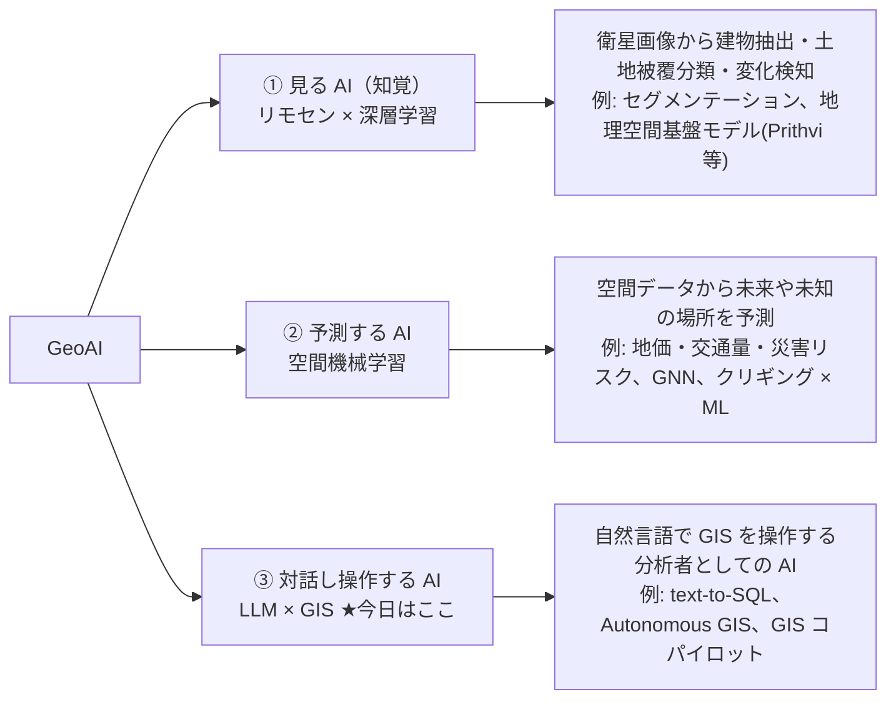

# geo-chat 再構築プラン — FOSS4G ワークショップ教材化

## 0. 背景と方針

- 現リポジトリは `links-bi-prototype` 由来の約 32,000 行のプロトタイプ。国会答弁生成に特化した
  システムプロンプト（1,346 行中 ~350 行がドメイン固有）、回帰・クラスタリングなどの統計ツール群、
  モックの同期レイヤーなど、ワークショップに不要なコードが大半を占める。
- リファレンス実装 `../links-veda/bi-app` には、移植価値の高い設計が揃っている:
    - Markdown ファイルベースの**スキルシステム**（frontmatter + `get_skill` ツール + 前提ゲート）
    - **宣言的 spec 設計**（data 抜き Vega-Lite spec / MapLibre paint layers を table 単位で保持）
    - shadcn/ui + Tailwind v4 のモダンな UI 構成
- **方針: 新規スキャフォールドに価値あるモジュールを移植する「実質書き直し」。**
  差分改修では国会答弁ロジックの除去と god component の解体に同等以上の工数がかかるため。
- **完全クライアントサイド SPA を維持**（バックエンドなし、GitHub Pages デプロイ）。
  bi-app のバックエンドプロキシ（Bedrock + 認証 + 永続化）はスコープ外。
  API キーは UI で入力し、Anthropic API をブラウザから直接呼ぶ
  （`anthropic-dangerous-direct-browser-access` ヘッダ — 現実装で実績あり）。

## 1. スコープ

| 含む                              | 含まない                                           |
| --------------------------------- | -------------------------------------------------- |
| AI チャット（エージェントループ） | 認証・チーム管理                                   |
| DuckDB-WASM + spatial 拡張        | 会話履歴の永続化（リロードで消えて OK）            |
| MapLibre 可視化（DuckDB → MVT）   | ダッシュボード / react-grid-layout                 |
| Vega-Lite グラフ可視化            | 統計ツール（回帰・クラスタリング）                 |
| スキルシステム                    | 国会答弁など MLIT ドメイン機能                     |
| ワークショップ docs               | plan gate / classify_task_shape（docs で紹介のみ） |

## 2. 技術スタック

| 領域           | 選定                                            | 備考                                   |
| -------------- | ----------------------------------------------- | -------------------------------------- |
| フレームワーク | React 19 + Vite + TypeScript                    | 現行踏襲                               |
| UI             | **Tailwind CSS v4 + shadcn/ui（new-york）**     | bi-app と同構成。lucide-react          |
| 状態管理       | jotai（in-memory のみ）                         | 永続化なし。API キーのみ localStorage  |
| AI             | **Vercel AI SDK v6** + `@ai-sdk/anthropic`      | クライアント完結の `streamText` ループ |
| DB             | `@duckdb/duckdb-wasm`（安定版に更新） + spatial | 現在 dev ビルド固定なので解消          |
| 地図           | maplibre-gl v5                                  | `duckdb://` カスタムプロトコル         |
| グラフ         | vega-lite v6 + react-vega                       | `duckdb://` カスタム Loader            |
| テスト         | Vitest（unit / browser 分離を踏襲）             | in-source test 併用も検討              |

## 3. アーキテクチャ

### 3.1 ディレクトリ構成（案）

```
src/
  components/
    chat/          # チャット UI（AI SDK の UIMessage parts をそのまま描画）
    map/           # MapLibre + MVT プロトコル
    chart/         # VegaLiteChart + duckdb:// loader
    table/         # シンプルな仮想スクロールテーブル
    ui/            # shadcn 生成コンポーネント
  lib/
    ai/
      agent.ts         # streamText ループ（stopWhen: stepCountIs(N)）
      systemPrompt.ts  # 簡潔・汎用（~100 行目標）
      toolRegistry.ts  # メタデータ付き登録（skillDomain 等）
      tools/           # 各ツール
      skills/          # ★ Markdown スキルファイル群（教材のキモ）
    duckdb/            # globalDB + 簡素化した dbContext
  store/               # jotai atoms（remote/local 分離を廃止し 1 レイヤーに）
docs/                  # ワークショップ教材（§5）
public/data/           # サンプルデータ（日本の行政界 Parquet 等は流用）
```

### 3.2 移植する資産

**geo-chat（現リポジトリ）から:**

- `components/map/utils/mvt.ts` — DuckDB spatial `ST_AsMVT` によるブラウザ内ベクタータイル生成 + LRU キャッシュ
- `duckdb://` MapLibre プロトコル / Vega Loader
- `lib/duckdb/globalDB.ts` の初期化、`arrowConverter` / `bomUtils`

**bi-app から:**

- **スキルシステム一式**: `skillRegistry.ts`（`import.meta.glob('.../*.md', { query: '?raw' })` で
  ビルド時読み込み、frontmatter = `description` / `tasks` / `deps`）、`get_skill` ツール、
  スキル未取得時にツールがエラーを返す**前提ゲート**（簡略版）
- 地図ツールの堅牢化: 式の well-formedness 検証、`["get", ...]` 内カラム名のファジー補正
- グラフツールの Vega-Lite `compile()` プリフライト検証
- spec 設計: `MapSpecs` / `GraphSpecs`（table 名キー、data/width/height は実行時注入）

### 3.3 捨てる・簡素化するもの

| 対象                                                                    | 処置                                             |
| ----------------------------------------------------------------------- | ------------------------------------------------ |
| `systemPrompt.ts` の国会答弁ルール群                                    | 削除。汎用 GIS アシスタントプロンプトに書き直し  |
| 回帰・クラスタ・予測子選択ツール + ml-matrix/jstat 等                   | 削除（依存ごと）                                 |
| `dbContext.ts` の 949 行接続プール                                      | 単一スキーマ + 直列実行キューに簡素化（~150 行） |
| `pages/ChatPage/index.tsx`（1,297 行）                                  | shadcn Resizable ベースのレイアウトに分割        |
| `StructuredMessageRenderer.tsx`（1,747 行）と HTML コメントマーカー規約 | AI SDK v6 の message parts を素直に描画          |
| `chat-simple/`、dashboards、`store/sync.ts`、`utils/encryption.ts`      | 削除（API キーは平文 localStorage + 注意書き）   |
| チャット複数管理（chatId = スキーマ）                                   | 単一セッション + リセットボタンに簡素化          |

### 3.4 AI ツール（7 個に厳選）

1. `duckdb_query` — SQL 実行（単文制限、統計・ジオメトリ検出、モデルへは 5 行まで返却）
2. `get_skill` — スキル取得（カタログはツール description に埋め込み）
3. `update_chart_spec` / `get_chart_spec` — Vega-Lite spec（vega スキル取得が前提）
4. `update_map_style` / `get_map_style` — MapLibre スタイル（map スキル取得が前提)
5. `geocode_address` — Nominatim ジオコーディング（FOSS4G 的に外せない・OSM 連携の好例）

### 3.5 スキルファイル初期セット（bi-app の ~35 個から厳選 + 新規）

- `duckdb/basics.md`, `duckdb/spatial.md`, `duckdb/file-import.md`
- `vega/basics.md`, `vega/color.md`
- `map/styling.md`, `map/geospatial.md`
- 参加者が **md ファイルを 1 枚書き足すだけでエージェントを拡張できる**構造にする（§5 Step 6）

## 4. 実装フェーズ

進捗: Phase 0–5 完了、Phase 6 は docs/ja 完了・docs/en 進行中（ブランチ `feature/workshop-rebuild`）。

| Phase | 内容                                                                          | 完了条件                           |
| ----- | ----------------------------------------------------------------------------- | ---------------------------------- |
| 0     | リポジトリ掃除: 名称を geo-chat に統一、`dist/`・stale docs・`.DS_Store` 除去 | `npm run check` 通過               |
| 1     | スキャフォールド: Tailwind v4 + shadcn 導入、2 ペインレイアウト               | 空のチャット + タブ UI が表示      |
| 2     | DuckDB コア: 初期化・spatial・ファイル/URL 取り込み・簡素化 dbContext         | SQL 手実行でテーブル作成できる     |
| 3     | 可視化: Map（MVT プロトコル）、Chart（Vega Loader）、Table                    | 手動でデータが地図・グラフに出る   |
| 4     | AI エージェント: API キー入力 UI、streamText ループ、ツール群                 | チャットから SQL→地図→グラフが通る |
| 5     | スキルシステム: registry + get_skill + 前提ゲート                             | スキル md 追加で挙動が変わる       |
| 6     | docs 執筆 + サンプルデータ整備 + GitHub Pages デプロイ                        | ワークショップ通し試走             |

UI レイアウト: 左 = チャットパネル、右 = タブ（Table / Chart / Map / SQL）。
AI ツールが結果を出したら該当タブを自動アクティブ化（bi-app の `setActiveTab` パターン）。

## 5. ワークショップ設計

タイトル案: **「AI エージェントを分解する — GIS × LLM の動作原理」**（半日 / 約 4 時間）

### 5.1 ペルソナと持ち帰りゴール

**ペルソナ:** FOSS4G に来る GIS エンジニア。QGIS / PostGIS / GDAL は使いこなし、
Python や JS も書ける。ChatGPT や Copilot も使っている。しかし「AI エージェント」は
中で何が起きているか分からないブラックボックスで、自分の GIS データや業務と繋げる方法が
想像できない。「AI 活用しろと言われるがチャットへのコピペ以上ができない」というモヤモヤと、
取り残される焦りがあり、本当は GIS の専門性 × AI を掛け算できるエンジニアになりたい人。

**持ち帰りゴール（Transfer Goal）:**

> ワークショップの翌週、参加者が自分のデータと業務課題に対して「ツール」と「スキル」を
> 自分で設計してエージェントに組み込み、その挙動を魔法ではなく API リクエストのレベルで
> 説明・デバッグできる。

「仕組みを知っている」（暗記）ではなく「初見の課題に応用できる」（転移）がゴール。
教材はこの一文に効くものだけに絞り、網羅的解説はしない。

### 5.2 オープニングの問い

冒頭でいきなりデモ。「人口 10 万人以上の市を地図で塗り分けて」と打つと SQL が流れ地図が塗られる。

> **「ChatGPT に同じことを頼んでも地図は出ません。このアプリは同じ Claude を使っていて、
> 追加学習もファインチューニングもしていない。——じゃあ、何が違うんでしょう？」**

「答えたいのに今の知識では答えられない」状態を作り、これを 4 時間のエンジンにする。

### 5.3 GeoAI の中での位置づけ（Step 1 冒頭のスライド）

「GeoAI」は多義的なので、デモ直後に位置づけの地図を見せて期待値を合わせる:



位置づけの一言:

> ①②は AI が「目」や「予測器」になる話——モデル自身が空間データを食べて学習する。
> ③は AI が「分析者」になる話——学習は一切せず、既存の LLM に既存の GIS の道具
> （SQL・地図・グラフ）を持たせる。**だから今日はモデルを 1 個も訓練しない。道具の持たせ方を学ぶ。**

さらに③の中でも、既製のコパイロットを「使う」のではなく自分のアプリに「組み込む」側に
回るのが今日の特徴——とまで言い、ペルソナの「自分の業務と繋げたい」に接続する。

### 5.4 「プロンプト」の 3 層（docs 冒頭で宣言する用語整理）

ワークショップに登場する「プロンプト」は 3 層あり、混同すると迷子になるため最初に区別を宣言する:

| 層                         | 何に入れる文字列か                                                                       | 例                                                                 | ワークショップでの扱い                                                            |
| -------------------------- | ---------------------------------------------------------------------------------------- | ------------------------------------------------------------------ | --------------------------------------------------------------------------------- |
| ① 利用プロンプト           | 完成した geo-chat の**チャット欄**に打つ                                                 | 「人口 10 万人以上の市を塗り分けて」                               | Step 1–2 で体験する入口                                                           |
| ② エージェント内プロンプト | **アプリの一部として組み込まれる**文字列: system prompt、ツールの description、スキル md | 「このツールは SQL を 1 文だけ実行する。地図表示が目的なら…」      | **本命。** Step 3 で読み、Step 4 で description を書き、Step 6 でスキル md を書く |
| ③ 開発プロンプト           | Claude Code 等の**コーディング AI に与える**実装指示                                     | 「このリポジトリに◯◯ツールを追加して。既存ツールの構造に合わせて」 | Step 4 以降の**実装手段**（手打ちコーディングの代替）                             |

③で作ったツールが賢く使われるかは②の description の書き方で決まる——という
②③の連関そのものが学習内容。`appendix-prompts.md` には③を収録し、②は各章本文で扱う。

### 5.5 前提技術ミニ解説（知らない人向け・docs 各章の冒頭に置く）

前提知識ゼロでも参加できるよう、3 つの基盤技術は「それは何か + なぜ AI と相性が良いか」を
セットで 1 ページ以内に解説する:

- **DuckDB(-WASM)** — 組み込み型の**列指向**分析データベース（「分析界の SQLite」）。
  列指向なので集計・分析が速く、**Parquet / CSV / GeoJSON をそのまま読み込んで
  即座に SQL 分析できる**。spatial 拡張で PostGIS 相当の空間関数も使える。
  WASM 版はブラウザ内で完結し、サーバ不要・データが手元から出ない。
  **AI との相性:** SQL は LLM が最も得意とする言語の一つで、スキーマとサンプル行を
  見せるだけで正確なクエリを書ける。
- **MapLibre GL JS** — OSS の地図描画ライブラリ（Mapbox GL JS のフォーク）。
  地図の見た目は **JSON の style spec** で宣言的に記述する。
  **AI との相性:** スタイルが「コード」ではなく「データ」なので、LLM が生成した style を
  機械的に検証・修復・差分適用できる。
- **Vega-Lite** — 宣言的可視化文法。グラフを **JSON spec** で記述し、ライブラリが描画に変換。
  **AI との相性:** 同じく spec がデータなので、`compile()` による事前検証や
  スキーマバリデーションが可能。

3 つに共通する「**spec 駆動（宣言的）だから、生成 → 検証 → 修復のループが回せる**」
という構図が、そのまま Step 5「宣言的 spec がなぜ AI に良いか」の主題になる。

### 5.6 設計原則: 「壊して学ぶ」

動くものを作る前に、動いているものを壊す。各ステップに fail-first
（説明の前にまず失敗を体験する）を仕込む:

| Step | 壊す実験                                                                | 見える原理                                                                      |
| ---- | ----------------------------------------------------------------------- | ------------------------------------------------------------------------------- |
| 1    | ツールを全部外して同じ質問をする                                        | LLM 単体は「口だけ」。手（ツール）が能力の正体                                  |
| 3    | DevTools の Network タブで Anthropic API を覗く                         | エージェントの実体は tool_use → 実行 → tool_result の HTTP 往復ループ           |
| 4    | ツールの description を空にする                                         | LLM は description だけを頼りにツールを選ぶ。API 設計＝プロンプト設計           |
| 5    | 「地図を塗る JavaScript を書いて」と頼む vs spec を頼む                 | 命令的コードは検証不能、宣言的 spec は検証・修復・差分可能                      |
| 6    | スキルなしで複雑な地図スタイルを頼む → 失敗 → スキル md を与える → 成功 | コンテキストは有限資源。必要な知識を必要な時だけ注入する progressive disclosure |

### 5.7 タイムテーブル（半日・約 4 時間）

| 時間      | Step                          | 体験の中心                                                                             |
| --------- | ----------------------------- | -------------------------------------------------------------------------------------- |
| 0:00–0:30 | 1. 分解の前に、まず魔法を見る | デモ → GeoAI の地図 → ツール剥がし実験 → 「LLM + ツール + ループ」の骨組み提示         |
| 0:30–1:00 | 2. ブラウザの中の GIS 基盤    | DuckDB-WASM で手で SQL（spatial 含む）。「サーバなしで空間分析」を体感                 |
| 1:00–1:40 | 3. ループを目撃する           | DevTools で API 往復を実況。system prompt と tool schema の生 JSON を読む              |
| 1:40–2:25 | 4. ツールの解剖学             | name / description / inputSchema / execute。開発プロンプトで新ツールを AI に実装させる |
| 2:25–2:55 | 5. 宣言的 spec という境界線   | Vega-Lite / MapLibre style がなぜ AI と相性抜群か。壊れた spec の自動修復を観察        |
| 2:55–3:35 | 6. スキル＝ md ファイル 1 枚  | 自分のスキル md を書いてエージェントを賢くする。書く → 試す → 直すのループ             |
| 3:35–4:00 | 7. チャレンジ＆言語化         | 各自の課題（`ST_Buffer` 解析、PLATEAU 連携、Overture Maps 等）＋クロージング           |

冒頭に骨組みだけのコンセプトマップ（エージェント = LLM + ツール + ループ + コンテキスト、
その下に DuckDB / 地図 / グラフ = 実行系、境界に宣言的 spec）を提示し、
ステップごとに埋めていく。埋まっていく地図自体が理解の進捗バーになる。

**クロージング（自分の言葉にする）:** 最後のスライドは解説ではなく問いで終える——

> 「あなたの仕事のデータで、エージェントに最初に持たせるツールは何ですか？
> その description を 1 文で書いてください」

書いたものを隣の参加者と交換する。description が書ければツールが設計でき、
ツールが設計できればエージェントが作れる——転移ゴールに直結する締め。

### 5.8 docs/ 構成

**日英両方**で執筆する（`docs/ja/`・`docs/en/` のミラー構成。まず日本語で書き英訳）。

```
docs/{ja,en}/
  00-setup.md                 # clone / npm i / API キー取得と入力
  01-what-is-an-agent.md      # GeoAI の地図（§5.3）、プロンプト 3 層（§5.4）、
                              # エージェントループの図解、tool use の仕組み
  02-duckdb-wasm.md           # DuckDB ミニ解説（§5.5）、WASM 版の意義、spatial 拡張
  03-agent-loop.md            # 本リポジトリの実装を読む（コード参照付き）
  04-building-tools.md        # ツールの解剖学 + 開発プロンプト例
  05-declarative-specs.md     # MapLibre / Vega-Lite ミニ解説（§5.5）、spec 駆動の設計思想
  06-skill-system.md          # スキルシステムの仕組みと書き方
  07-challenge.md             # チャレンジ課題集
  appendix-prompts.md         # 開発プロンプト集（③の層）
  appendix-troubleshooting.md
```

各章は「概念解説 → 該当コードの読みどころ（file:line 参照）→ 壊す実験 →
手を動かす課題 → 開発プロンプト例」の構成で統一する。

## 6. 決定事項と残課題

**決定済み:**

1. **docs の言語** — 日本語 + 英語の両方（`docs/ja/` と `docs/en/`）
2. **モデル既定値** — Sonnet 最新版を既定にし、UI で変更可能にする
3. **git 履歴** — 既存履歴を保持したまま書き換える（必要になったら後からクリア可能）
4. **API キー** — UI での各自入力を基本とする（各自取得・当日配布のどちらでも運用可能な作りにする）

**残課題:**

- 開催回ごとの所要時間調整（4 時間想定 → 実際の枠に合わせて Step 5 を圧縮可能な設計にしておく）
- サンプルデータの最終選定（既存の日本の行政界 Parquet を軸に、チャレンジ用に PLATEAU / Overture を検討）
