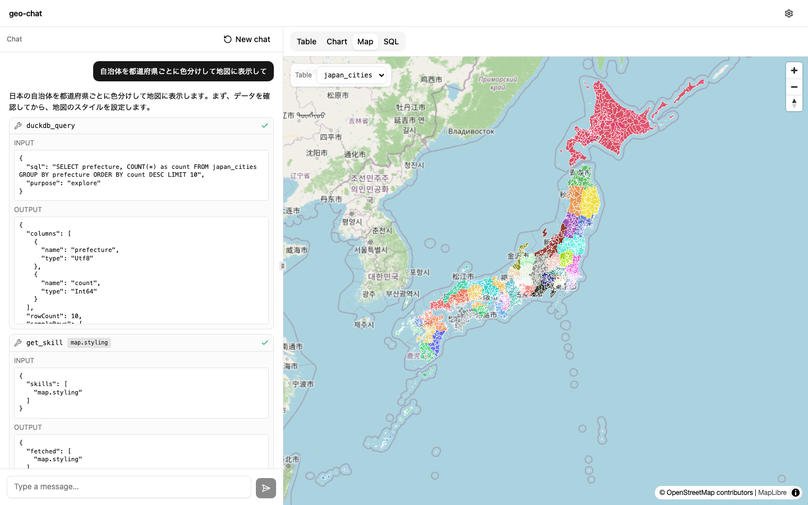
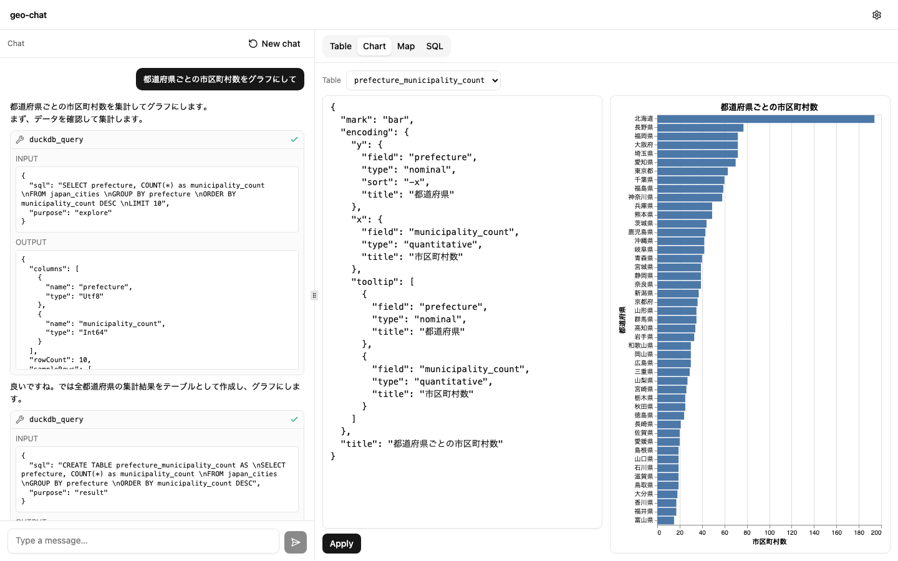

# geo-chat

**Chat with your geospatial data — and learn how AI agents actually work by building one.**

geo-chat is FOSS4G workshop material. Instead of treating "AI agents" as a black box, you
build a working GIS agent and watch every piece: the tool-use loop, the tool schemas, the
declarative map/chart specs, and a markdown-based skill system you extend yourself. The
whole thing runs in the browser — no server, no backend — combining DuckDB-WASM for SQL
analytics, MapLibre GL for maps, Vega-Lite for charts, and Anthropic Claude for the agent.





## Features

- **Natural-language GIS agent** — ask for analysis or a map and the agent runs SQL, styles
  the map, and builds charts through a real tool-use loop (Vercel AI SDK v6 + Claude).
- **In-browser SQL** — DuckDB-WASM with the spatial extension (PostGIS-style `ST_*`
  functions). Load Parquet, CSV, or GeoJSON from a URL and query it instantly.
- **Live maps** — MapLibre GL renders vector tiles generated on the fly from DuckDB via a
  `duckdb://` custom protocol (`ST_AsMVT`), with data-driven styling.
- **Declarative charts** — Vega-Lite specs fed straight from DuckDB.
- **Skill system** — teach the agent new tricks by dropping a single markdown file; the
  workshop's core lesson in progressive disclosure and tool design.
- **100% client-side** — your data and your API key never leave the browser.

## Quickstart

```bash
git clone https://github.com/eukarya-inc/geo-chat.git
cd geo-chat
npm install
npm run dev
```

Open the printed local URL, click **Settings**, and paste your
[Anthropic API key](https://console.anthropic.com/). Then try:

> Load `/geo-chat/data/japan_cities.parquet` and show cities with population over 100,000 on the map.

The API key is stored in plain `localStorage` and sent **only** to the Anthropic API,
directly from your browser (there is no backend). Use a personal key and delete it from
Settings when you are done.

## Workshop docs

The curriculum lives in [`docs/`](./docs) — a 3-hour workshop, "Building a Geospatial Agent, One Failure at a Time." Available in Japanese ([`docs/ja/`](./docs/ja)) and
English ([`docs/en/`](./docs/en)).

## Tech stack

- **React 19 + Vite + TypeScript**
- **Tailwind CSS v4 + shadcn/ui** (lucide-react icons)
- **jotai** for in-memory state
- **Vercel AI SDK v6** + `@ai-sdk/anthropic` (client-side `streamText` agent loop)
- **@duckdb/duckdb-wasm** + spatial extension
- **maplibre-gl** v5 (`duckdb://` tile protocol)
- **vega-lite** v6 + react-vega
- **Vitest** (unit + Playwright browser tests)

Deployed as a static site to GitHub Pages.

## Roadmap — and ideas for your next step

Known gaps and nice-to-haves. If you just finished the workshop, each of these doubles as
a great exercise: write the development prompt yourself (see
[`docs/en/appendix-prompts.md`](./docs/en/appendix-prompts.md)) and let an AI coding agent
implement it with you.

- **Hot-reload skills** — adding a skill `.md` currently requires a dev-server restart
  (`import.meta.glob` is resolved at build time). HMR support would make the
  write → try → fix loop of skill authoring seamless.
- **More map layer types** — `update_map_style` supports point / line / polygon;
  `heatmap-*` and `fill-extrusion-*` (3D) would unlock new visualizations end-to-end.
- **More sample datasets & recipes** — PLATEAU (Japanese 3D city models) and
  Overture Maps GeoParquet make great advanced material (see
  [`docs/en/05-curate-your-stack.md`](./docs/en/05-curate-your-stack.md)).
- **Screenshots / demo GIF in this README.**
- **Workshop timing variants** — the curriculum assumes 3 hours; a compressed
  2-hour variant (skipping ch.05) would fit more conference slots.

## License

[MIT](./LICENSE)
