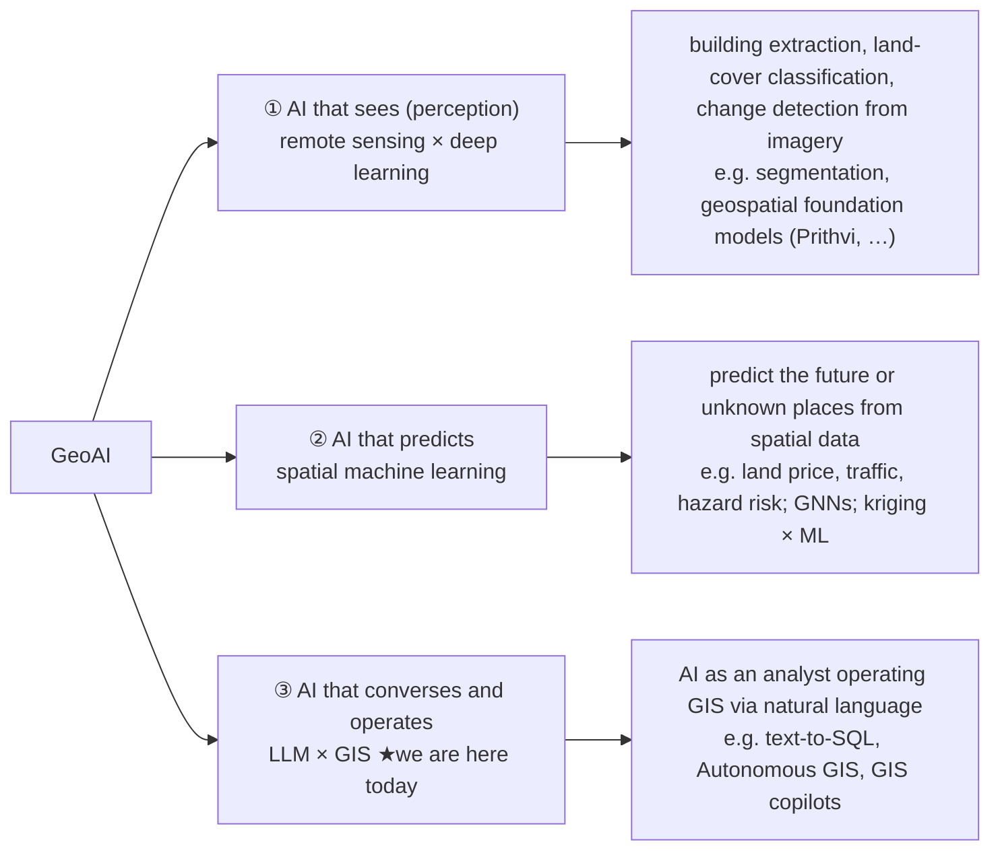

# 00. Setup

Before the workshop starts, get geo-chat running locally, paste in your Anthropic API key,
and confirm the first demo works on the sample data. Then practice this workshop's defining
move: **switching between chapter branches and observing**.

Budget 10–15 minutes. If something goes wrong, see
[appendix-troubleshooting.md](./appendix-troubleshooting.md).

## 1. What you need

- **Node.js 20+** (check with `node -v`; update via [nodejs.org](https://nodejs.org) or
  `nvm` / `volta` if below 20)
- **A modern browser**: latest Chrome / Edge / Firefox. geo-chat uses **WebAssembly and Web
  Workers**, so old browsers and some embedded environments won't run it (more on DuckDB-WASM
  in ch. 20).
- **Git**: especially `git switch` (branch switching) and `git diff`.
- **An Anthropic API key** (obtained in step 3)

## 2. Clone and run

```bash
git clone <this repository URL>
cd geo-chat
npm install       # installs dependencies (DuckDB-WASM and maplibre-gl are large)
npm run dev       # starts the dev server (vite)
```

`npm run dev` prints a local URL (default `http://localhost:5173/geo-chat/`). Open it and
you'll see a chat panel on the left and four tabs on the right — **Table / Chart / Map / SQL**.

> **Note**: the `/geo-chat/` path prefix exists because `vite.config.ts` sets
> `base: '/geo-chat/'` for GitHub Pages hosting. Sample-data URLs carry the same prefix (below).

On first load, DuckDB-WASM initializes in the browser. When the SQL tab says
"Initializing DuckDB…", wait a few seconds until `SELECT 1 AS hello;` runs.

## 3. Get an Anthropic API key

To drive the chat (the AI agent) you need your own Anthropic API key. geo-chat has no
backend and **calls the Anthropic API directly from the browser** (we take this mechanism
apart in ch. 20).

1. Create / log in at [console.anthropic.com](https://console.anthropic.com).
2. Under **Billing**, add a small amount of **prepaid credit** (say $5). One workshop needs
   only $1–2. A zero balance triggers a `400 / credit balance` error even with a valid key.
3. Under **API Keys**, create a new key and copy the `sk-ant-…` string. It's only shown in
   full at creation, so copy it right away.

> **On the day**: some sessions have the organizer hand out a key. In that case, use it.

## 4. Enter the key in Settings

1. Open **Settings** (top-right, or center when the chat isn't configured yet).
2. Paste `sk-ant-…` into **Anthropic API key**.
3. Leave **Model** at the default **Claude Sonnet 4.5** (defined in
   `src/store/settings.ts`, `MODEL_OPTIONS`).

> **⚠️ localStorage caveat**: the key you enter is stored in this browser's **localStorage
> in plaintext (unencrypted)** and sent straight from the browser to the Anthropic API. This
> is a deliberate tradeoff for a backend-less workshop app. **Use a personal key and delete
> it afterward** (clear it in Settings or wipe the browser's localStorage). ——Note that
> **localStorage survives branch switches**: once entered, the key carries across chapters —
> no need to re-enter it after `git switch` (this matters for the branch workflow below).

## 5. Confirm with the finished demo (`main` branch)

First experience the fully-loaded finished app. **Confirm you're on `main`** (`git branch`
shows `* main`). When the chat is empty, **sample prompt chips** appear above the input
(`EXAMPLE_PROMPTS` in `src/components/chat/ChatPanel.tsx`). Use one to check things work:

```
日本の自治体を地図に表示して   (Show the Japanese municipalities on the map)
```

Click the chip to fill the input, then send. On success:

1. **Tool cards** — `load_builtin_dataset`, `duckdb_query`, and so on — appear in the chat in
   order (click to expand input/output). The agent loads the built-in dataset `japan_cities`
   **by itself** — no URL to type.
2. The Map tab opens automatically and draws the Japanese municipalities.

This is the "solved" state we aim for today. In the main sessions we **deliberately strip all
of it away** and add it back one layer at a time. The through-line prompt for the chapters is:

```
自治体を都道府県ごとに色分けして地図に表示して
(Color the municipalities by prefecture and show them on the map)
```

## 6. How the workshop runs — switching chapter branches

The star of this workshop is _observation_. Branches that subtract one layer at a time from
`main` are provided, and you switch between them to see how well the same task gets solved.

```bash
git switch chapter/00-chat-only   # ch. 10: no tools at all
git switch chapter/01-data        # ch. 20: data tools only
git switch chapter/02-viz-naive   # ch. 30: + visualization (no validation)
git switch chapter/03-validation  # ch. 40: + validation layer
git switch chapter/04-skills      # ch. 50: + skills + gate
git switch main                   # ch. 60: + evals (everything)
```

**After switching branches, restart the dev server.** `npm run dev` reloads changed code
automatically, but module composition changes between chapters, so to be safe do
`Ctrl+C` → `npm run dev` to **restart** (especially the ch. 50 skills, which are **loaded at
build time** and require a restart).

> **The key survives**: switching branches keeps the localStorage API key, so you don't need
> to re-enter it as you move between chapters (see the step 4 caveat).

### Reading diffs as "layers"

Each chapter mainly asks you to confirm **what the next layer adds**, via `git diff`. Start
at the file level:

```bash
# e.g. moving from the data layer to the visualization layer — which files appear?
git diff --stat chapter/01-data..chapter/02-viz-naive
```

Because the branches are built by **subtraction from `main`**, `git diff chapter/A..chapter/B`
(A earlier, B next) cleanly shows **the diff B adds over A = that layer**. On GitHub the same
diff is at the `compare/chapter/A...chapter/B` URL, colorized. The **`// CHAPTER SEAM: <layer>`**
comments in the code mark exactly the layer boundaries (the parts a chapter branch drops
wholesale). Each chapter's "⑤ Reading the diff" section practices this.

## 7. Locating today within GeoAI

Before the main sessions, let's calibrate expectations. "GeoAI" is an overloaded term, so
let's see where today sits on the larger map.



- **①②** are AI becoming an "eye" or a "predictor" — the model itself is **trained** on
  spatial data.
- **③** is AI becoming an "analyst" — **no training at all**; you hand an existing LLM the
  existing GIS tools (SQL, maps, charts).

> **So today we train zero models. We learn how to hand it tools.**

And within ③, today's angle is not _using_ an off-the-shelf copilot but being the one who
**embeds** it in your own app. This is where "I want to connect AI to my own GIS work" gets
answered head-on.

## 8. When things go wrong

- **Chat stuck at "Set your API key in Settings…"** → no key entered in Settings.
- **`401` / `unauthorized`** → wrong key. Re-check Settings.
- **`credit balance is too low`** → add credit in the console (step 3-2).
- **Nothing on the map / URL load fails with CORS** → see
  [appendix-troubleshooting.md](./appendix-troubleshooting.md), including the CORS explanation.
- **Switched branches but behavior didn't change** → restart the dev server (step 6).
- **DuckDB won't initialize / blank screen** → check you're on a supported browser (latest
  Chrome / Edge / Firefox).

Ready? Go to [10. The talk-only AI](./10-chat-only.md), starting by switching to the
fully-stripped `chapter/00-chat-only`.
