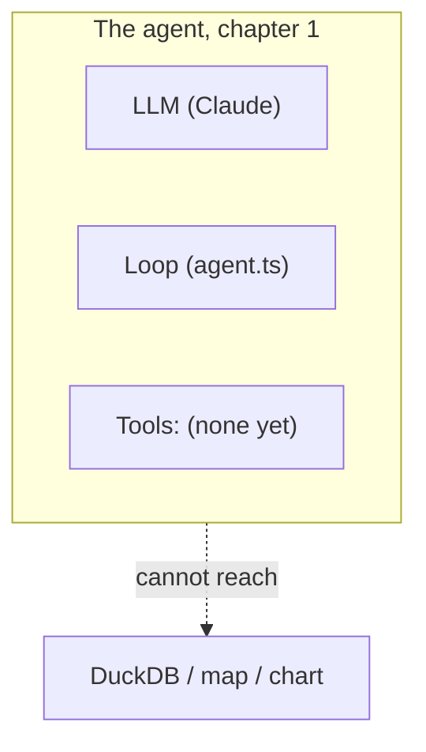
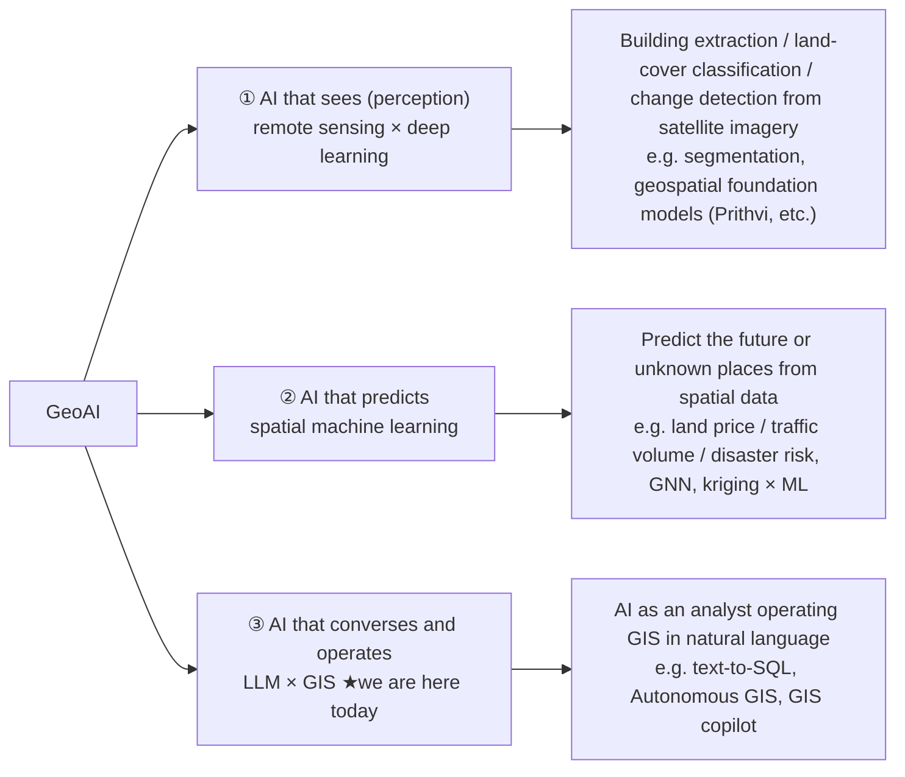
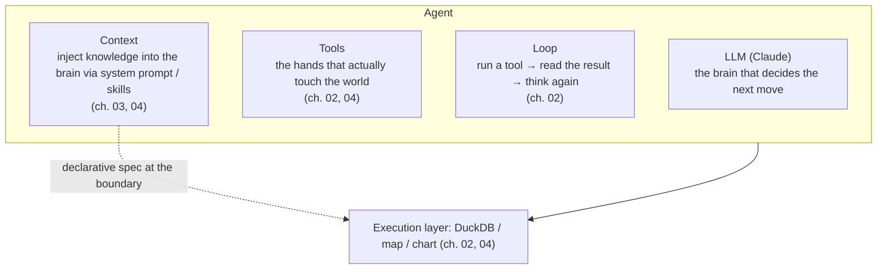

# 01. A bare model

> The first 30 minutes of this workshop. We open with the finished app's "magic," then rewind
> the agent all the way down to its bare minimum — an LLM with a loop, no tools at all — and
> watch it fail honestly. From that failure we extract the skeleton of an "AI agent."

## ① The agent so far

This is the ladder's base rung: an LLM inside a loop, and nothing else. The `Tools` box is
empty on purpose. This diagram is the series template — every remaining chapter adds a node
to it.



The dotted arrow is the whole chapter: the agent cannot reach DuckDB, the map, or the chart —
not because Claude is weak, but because nothing has handed it the hands to do so yet.

## ② The new piece

### See the magic first — a preview of hour 3

Type this into geo-chat's chat box (no need to load data first — the agent fetches the
built-in dataset itself):

```
自治体を都道府県ごとに色分けして地図に表示して
```

(English: "color the municipalities by prefecture and show them on the map." The app handles
both.)

SQL flows, a table is created, and the map gets shaded. **This is a preview of hour 3 — the
finished, full-tier app you will build your way back up to. Now we rewind all the way to
zero.** Before we do, one question:

> **Ask ChatGPT to do the same thing and no map appears. This app uses the same Claude, with no
> additional training and no fine-tuning. So — what is different?**

"I want to answer, but with what I know now I can't" — that state of suspension is the fuel for
the next 3 hours. To give away the answer: the difference is **not the model, but the "tools"
and the "loop" around the model.** This chapter goes only as far as extracting that skeleton —
by the end of it we will have rewound the app to exactly zero tools and watched it fail.

### Where "today" sits on the GeoAI map

"GeoAI" is an ambiguous term. To calibrate expectations first, let's confirm where today's topic sits
on the overall map.



- **①②** are about AI becoming an "eye" or a "predictor" — the model itself eats spatial data and **learns**.
- **③** is about AI becoming an "analyst" — it does **no learning at all**; you hand an existing LLM existing GIS
  tools (SQL, maps, charts).

> **So today we train zero models. We learn how to hand the AI its tools.**

And even within ③, what is distinctive about today is that instead of "using" a ready-made copilot, you move to
the side that **"builds it in"** to your own app. This connects head-on with that nagging feeling of
"I want to hook AI up to my own GIS work."

### Agent = LLM + tools + loop + context

Stripped of magic, the minimal skeleton of an "AI agent" is defined like this.
This concept map is a "progress bar" that fills in as the chapters advance — right now every
box past `LLM` is still empty.



- **The LLM** alone can propose "what to do next," but **it can't actually do anything**
  (it can't run SQL, it can't color a map). We confirm this by experiment later in this
  chapter (③ Run it).
- **Tools** are the "hands." When the LLM says "I want to call this tool with these arguments,"
  the app runs it and returns the result.
- **The loop** repeats the round trip of looking at a tool result and deciding the next move, until an answer emerges.
- **Context** injects into the brain — at the moment it is needed — knowledge like "what tables exist right now"
  and "the conventions for styling a map."

### Tool calling is just token prediction, extended

When you hear "tools," it may feel like a special feature bolted onto the outside of the LLM. In fact,
tool calling **rides on top of the LLM's single operating principle** — nothing more.

What an LLM does, boiled down, is **take a sequence of tokens as input and predict-then-output the next token**.
That's all. Chat, code generation, and **tool calling too are all built on this same one mechanism.**

Early Function Calling was literally that. You had the LLM output markup in a specific format — for example

```text
<tool_name>duckdb_query</tool_name>
<param name="sql">SELECT ...</param>
```

— a token sequence like this, and **the app parsed it mechanically**, called the function, and fed the result
back into the next input. What a "tool call" really was, was a **learned output format**.

Today the Anthropic Messages API provides this as a built-in feature via `tools` / `tool_use` blocks, so you no
longer parse it yourself. But internally, the model is still presumed to be **outputting a token sequence in a
special format, which the API side converts into structured blocks**. The mechanism didn't disappear — it just
**hid beneath the API.**

You can observe the proof in two ways.

- **Inside this material**: In this chapter's ③ **Run it** experiment (below), we strip out all the tools and the
  agent will sometimes **output tool-call-ish XML syntax as plain prose** (behavior observed on a real machine). It
  is the moment the true nature of a tool call — a "learned output format" — is exposed.
- **In the real world**: the Opus 4.8 "court problem" reported in 2026. In long sessions, tool calls were not
  emitted as structured `tool_use` blocks; instead **broken raw XML text plus a stray "court" token leaked into
  the chat and never executed** — a model-side defect[^court]. A case where "tool call = token sequence,"
  normally hidden beneath the API, surfaced into the open.

Once this view sinks in, a lot of debates get simpler. Arguments over "MCP vs. CLI" are, **from the model's point
of view, ultimately all about tools** (= the vocabulary the model can emit, plus whoever executes it). MCP is a
**standard** for distributing and connecting tools; CLI integration is **one form** a tool takes. "It's all tools
in the end" — knowing just this makes the discourse around agents much simpler.

[^court]: References: <https://github.com/anthropics/claude-code/issues/69237> / <https://github.com/anthropics/claude-code/issues/65248>

### The 3 layers of "prompt" (recap)

"Prompt" in this workshop has 3 layers. What you just typed into the chat box, right this moment, is the
**① usage prompt**. The main event is the **② in-agent prompt** (system prompt, tool descriptions, skill md),
which you read and write across the chapters ahead.

| Layer                | What kind of string it goes into                                | Example                                    | Chapters                                            |
| -------------------- | --------------------------------------------------------------- | ------------------------------------------ | --------------------------------------------------- |
| ① usage prompt       | geo-chat's **chat box**                                         | "color the municipalities by prefecture"   | experienced in this chapter                         |
| ② in-agent prompt    | system prompt / tool description / skill md                     | "this tool runs exactly one SQL statement" | **the main event.** read in 02–03, written in 03–04 |
| ③ development prompt | implementation instructions to a **coding AI** like Claude Code | "add an ◯◯ tool"                           | from 04 on (collected in the appendix)              |

### Where to read the code

The heart of the agent is `src/lib/ai/agent.ts` — only about 100 lines (close reading in
chapter 2). For now, just get a feel for "what lives where."

- `src/lib/ai/agent.ts` — `runAgent()`. Calls the LLM and turns the round trip of tool calls and results — the
  **loop body** itself.
- `src/lib/ai/tools/index.ts` — `createTools()`. Assembles the tools handed to the agent.
- `src/lib/ai/systemPrompt.ts` — the **static part of the context** (role, environment, conventions) plus the
  dynamic part injected every turn (current date, schema of the tables that exist right now).
  The existence of the **built-in datasets** (`japan_cities`, etc.; their entries live in
  `src/lib/ai/builtinDatasets.ts`) also reaches the model through here — which is why one line like "show the
  Japanese municipalities…" lets the agent load that data itself. A concrete example of the **② layer carrying
  knowledge**, and part of today's magic.
- `src/lib/ai/useAgentChat.ts` — the React side. Holds the chat state, calls `runAgent`, and does the **wiring**
  that hands it the tools and the context.

Inside `sendMessage` in `useAgentChat.ts`, all of these come together in one place:

```ts
const newMessages = await runAgent({
    apiKey,
    model,
    messages: history.current,
    tools: createTools(defaultToolContext()), // ← this is where the tools (hands) are handed in
    promptContext, // ← this is where the context is handed in
    onEvent,
    abortSignal: abort.signal,
});
```

"LLM + tools + loop + context" — all of it is present in this single call.

That last line, `createTools(defaultToolContext())`, doesn't carry its own tool list — it falls
back to a **fifth file**, and that file is the one you will actually edit this chapter:

- `src/lib/ai/toolTiers.ts` — **the workshop's throttle.** One array, `ENABLED_TOOLS`, decides
  which of the 8 tools declared in `tools/index.ts` the agent actually receives. Every
  remaining chapter in this workshop is staged by editing this one line.

```ts
export const TIER_1 = ['duckdb_query', 'load_builtin_dataset'] as const;
export const TIER_2 = ['get_skill'] as const;
export const TIER_3 = [
    'update_map_style',
    'get_map_style',
    'update_chart_spec',
    'get_chart_spec',
    'geocode_address',
] as const;

export type ToolName = (typeof TIER_1)[number] | (typeof TIER_2)[number] | (typeof TIER_3)[number];

// Workshop participants edit this line — one tier per chapter.
export const ENABLED_TOOLS: readonly ToolName[] = [...TIER_1, ...TIER_2, ...TIER_3];
```

`createTools(ctx, enabled = ENABLED_TOOLS)` in `tools/index.ts` filters its registry down to
whatever is in `enabled`, and `buildSystemPrompt(context, enabled = ENABLED_TOOLS)` in
`systemPrompt.ts` reads that same list — so the agent's hands and its own self-description can
never disagree. Right now, in chapter 1, we are about to set this array to `[]`.

## ③ Run it

Open `src/lib/ai/toolTiers.ts` and edit the one line every chapter of this workshop edits:

```ts
// before (the app's normal default — every tier enabled)
export const ENABLED_TOOLS: readonly ToolName[] = [...TIER_1, ...TIER_2, ...TIER_3];

// after (chapter 1: hand the agent nothing)
export const ENABLED_TOOLS: readonly ToolName[] = [];
```

Save — Vite hot-reloads — and type the same prompt from the top of this chapter:

```
自治体を都道府県ごとに色分けして地図に表示して
```

**Expected result**: the agent **can describe the steps** — "first I'd run a SQL like this in
DuckDB…" — but it **can't actually run the SQL and can't color the map**. No tables are added,
and the Map tab does not change. Confirm that not a single tool card (`duckdb_query` and the
like) appears in the chat. Sometimes — this is the token-prediction proof from ② made visible —
the reply leaks raw, tool-call-shaped XML into its prose instead of a clean tool call.

## ④ Where this fails

This chapter's failure isn't a bug we went hunting for — it **is** the chapter. With
`ENABLED_TOOLS` empty, the agent has a brain and a loop and nothing to act with.

> **The principle you can see**: a model without tools is a **proposer, not an agent**. The
> ability to act on the world lives entirely in the **tools** handed to it from outside the
> model — that is the whole difference from ChatGPT, even running the exact same Claude.

In chapter 2 we hand it exactly one tool — and it turns out one good general-purpose tool goes
a very long way.

## ⑤ Hands-on

1. With `ENABLED_TOOLS` still `[]`, ask 「東京都の市区町村数を数えて」("count the municipalities
   in Tokyo") and read the reply. In one sentence of your own, summarize what the model **can**
   do and what it **can't**.
2. Temporarily restore just the first tier — `export const ENABLED_TOOLS: readonly ToolName[] = [...TIER_1];`
   — ask the same question, open one of the tool cards that appears in the chat, and look at
   `input` (the arguments the LLM decided) and `output` (the execution result). Check that you
   can point to the boundary between the "LLM decided" part and the "app executed" part. When
   you're done, set `ENABLED_TOOLS` back to `[]` — chapter 2 will have you restore `[...TIER_1]`
   again, for real this time.
3. Draw the concept map from ② on paper, and fill in just the "Tools" box you understand so
   far, in your own words. You will fill in the rest of this map as the chapters advance.

## ⑥ Development prompts

We don't implement anything yet in this chapter. From the next chapter on, you will **write the
② prompts yourself** (system prompt, description, skill md), and use ③ development prompts to
**have the AI implement new tools**. Development-prompt templates are collected in
[appendix-prompts.md](./appendix-prompts.md).

Next, in [02. One general-purpose tool](./02-general-purpose-tool.md), we hand the bare model
above exactly one pair of hands, and see how far that alone can carry it.
