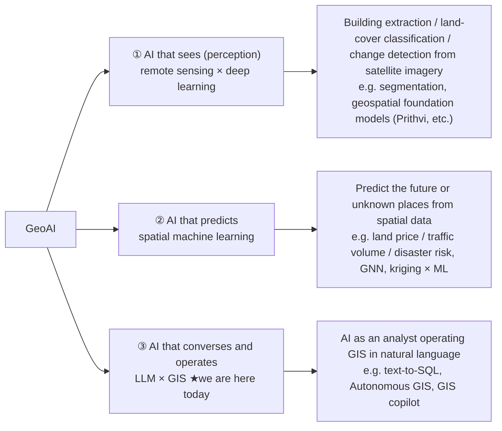
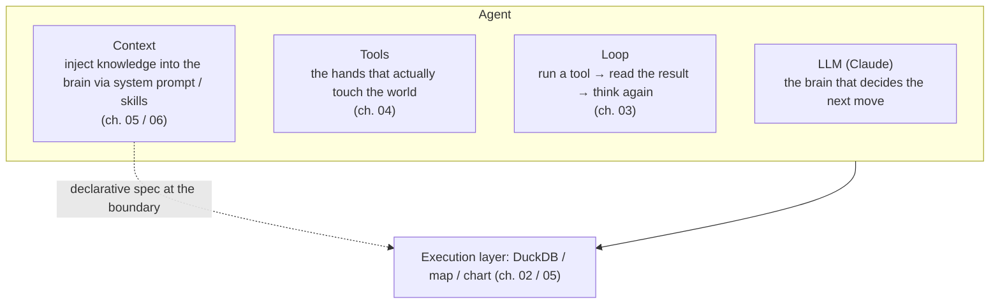

# 01. What is an AI agent

> The first 30 minutes of this workshop. First we see the "magic," then we deliberately break it
> to extract the skeleton of an "AI agent."

## ① Concept

### First, see the magic

Type this into geo-chat's chat box (after loading the sample data):

```
人口 10 万人以上の市を地図で塗り分けて
```

(English: "shade the cities with a population of 100,000 or more on the map." The app handles both.)

SQL flows, a table is created, and the map gets shaded. Here we pose one question.

> **Ask ChatGPT to do the same thing and no map appears. This app uses the same Claude, with no
> additional training and no fine-tuning. So — what is different?**

"I want to answer, but with what I know now I can't" — that state of suspension is the fuel for the next 4 hours.
To give away the answer: the difference is **not the model, but the "tools" and the "loop" around the model.**
This chapter goes only as far as extracting that skeleton.

### Where "today" sits on the GeoAI map

"GeoAI" is an ambiguous term. To calibrate expectations first, let's confirm where today's topic sits
on the overall map.



- **①②** are about AI becoming an "eye" or a "predictor" — the model itself eats spatial data and **learns**.
- **③** is about AI becoming an "analyst" — it does **no learning at all**; you hand an existing LLM existing GIS
  tools (SQL, maps, charts).

> **So today we train zero models. We learn how to hand the AI its tools.**

And even within ③, what is distinctive about today is that instead of "using" a ready-made copilot, you move to
the side that **"builds it in"** to your own app. This connects head-on with that nagging feeling of
"I want to hook AI up to my own GIS work."

### Agent = LLM + tools + loop + context

Stripped of magic, the minimal skeleton of an "AI agent" is defined like this.
This concept map is a "progress bar" that fills in as the chapters advance.



- **The LLM** alone can propose "what to do next," but **it can't actually do anything**
  (it can't run SQL, it can't color a map). We confirm this by experiment in the next section.
- **Tools** are the "hands." When the LLM says "I want to call this tool with these arguments,"
  the app runs it and returns the result.
- **The loop** repeats the round trip of looking at a tool result and deciding the next move, until an answer emerges.
- **Context** injects into the brain — at the moment it is needed — knowledge like "what tables exist right now"
  and "the conventions for styling a map."

### The 3 layers of "prompt" (recap)

"Prompt" in this workshop has 3 layers. What you just typed into the chat box, right this moment, is the
**① usage prompt**. The main event is the **② in-agent prompt** (system prompt, tool descriptions, skill md),
which you read in chapters 03–06 and write yourself.

| Layer                | What kind of string it goes into                                | Example                                                 | Chapters                                             |
| -------------------- | --------------------------------------------------------------- | ------------------------------------------------------- | ---------------------------------------------------- |
| ① usage prompt       | geo-chat's **chat box**                                         | "shade the cities with a population of 100,000 or more" | experienced in this chapter                          |
| ② in-agent prompt    | system prompt / tool description / skill md                     | "this tool runs exactly one SQL statement"              | **the main event.** read in 03, written in 04 and 06 |
| ③ development prompt | implementation instructions to a **coding AI** like Claude Code | "add an ◯◯ tool"                                        | from 04 on (collected in the appendix)               |

## ② Where to read the code

The heart of the agent is `src/lib/ai/agent.ts` — only about 100 lines (close reading in chapter 03).
For now, just get a feel for "what lives where."

- `src/lib/ai/agent.ts` — `runAgent()`. Calls the LLM and turns the round trip of tool calls and results — the **loop body** itself.
- `src/lib/ai/tools/index.ts` — `createTools()`. Assembles the **7 tools** handed to the agent.
- `src/lib/ai/systemPrompt.ts` — the **static part of the context** (role, environment, conventions) plus the
  dynamic part injected every turn (current date, schema of the tables that exist right now).
- `src/lib/ai/useAgentChat.ts` — the React side. Holds the chat state, calls `runAgent`, and does the **wiring**
  that hands it the tools and the context.

Inside `sendMessage` in `useAgentChat.ts`, all of these come together in one place:

```ts
const newMessages = await runAgent({
    apiKey,
    model,
    messages: history.current,
    tools: createTools(defaultToolContext()), // ← this is where the tools (hands) are handed in
    promptContext, // ← this is where the context is handed in
    onEvent,
    abortSignal: abort.signal,
});
```

"LLM + tools + loop + context" — all of it is present in this single call.

## ③ Break-it experiment #1 — strip out all the tools

**We confirm a hypothesis with our own hands: "strip out the tools and the LLM is all talk."**

In `sendMessage` inside `src/lib/ai/useAgentChat.ts`, rewrite the `tools:` line passed to `runAgent(...)`
into an **empty object** like this.

```ts
// before
tools: createTools(defaultToolContext()),

// after (hand it no tools at all)
tools: {},
```

Save and Vite auto-reloads. Type the same question again:

```
人口 10 万人以上の市を地図で塗り分けて
```

**Observation**: The agent **can describe the steps** — "first I'd run a SQL like this in DuckDB…" —
but it **can't actually run the SQL and can't color the map**. No tables are added, and the Map tab does not change.
Also confirm that not a single tool card (`duckdb_query` and the like) appears in the chat.

> **The principle you can see**: The LLM alone is no more than a "smart proposer." The ability to act on the world
> (= what it really is) lives in the **tools** outside the model. This is where the difference from ChatGPT was —
> even with the same Claude, whether it has hands (tools) or not.

Once you've confirmed it, be sure to put it back:

```ts
tools: createTools(defaultToolContext()),
```

## ④ Hands-on exercise

1. With the tools left empty, ask "count the municipalities in Tokyo" and read the reply.
   In one sentence of your own, summarize what the model **can** do and what it **can't**.
2. Put the tools back, ask the same question, open one of the tool cards that appear in the chat, and look at
   `input` (the arguments the LLM decided) and `output` (the execution result).
   Check that you can point to the boundary between the "LLM decided" part and the "app executed" part.
3. Draw the concept map above on paper, and fill in just the "tools" box you understand so far, in your own words.
   You will fill in this map as the chapters advance.

## ⑤ Development prompt examples

We don't implement anything yet in this chapter. From the next chapter on, you will **write the ② prompts yourself**
(system prompt, description, skill md), and use ③ development prompts to **have the AI implement new tools**.
Development-prompt templates are collected in [appendix-prompts.md](./appendix-prompts.md).

Next, in [02. A GIS foundation inside the browser](./02-duckdb-wasm.md), we touch with our bare hands the most
important tool the agent holds — DuckDB-WASM, a spatial database that runs inside the browser.
