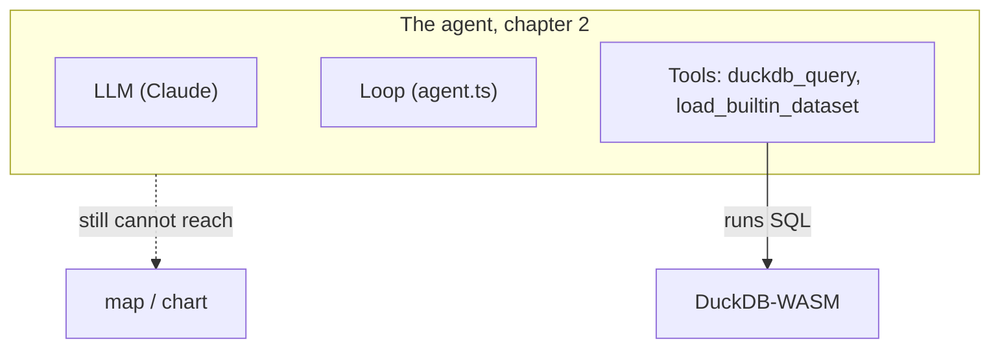
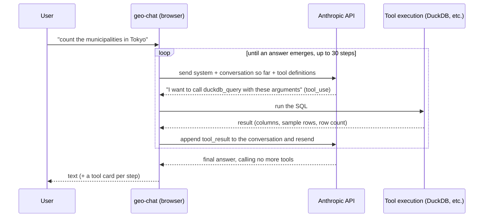

# 02. One general-purpose tool

> Chapter 1 ended with an agent that could talk about SQL but not run it. Here we hand it one
> tool — `duckdb_query` — and take the resulting "magic" apart down to the HTTP request: first
> with our own bare hands in the SQL tab, then by reading the agent's code, then by watching the
> agent drive the same SQL itself in DevTools.

## ① The agent so far

Chapter 1's diagram had an empty `Tools` box and a dotted line to everything. This chapter fills
in one corner of it.



`ENABLED_TOOLS` in `src/lib/ai/toolTiers.ts` goes from `[]` to `[...TIER_1]`. The solid arrow is
new — the agent can finally touch something. The dotted arrow is still there on purpose: a table
can now get created and queried, but nothing yet tells the agent how to color a map or shape a
chart. That gap is chapters 3 and 4.

**A note on honesty**: chapter 1 promised "exactly one tool," and `TIER_1` actually lists two.
That is not a broken promise — it is worth being explicit about which one is doing the work.

```ts
export const TIER_1 = ['duckdb_query', 'load_builtin_dataset'] as const;
```

- **`duckdb_query`** is the one general-purpose tool this chapter is really about. Hand a model
  the ability to run arbitrary SQL against a real analytical database, and it can explore,
  aggregate, join, and create new tables — an open-ended amount of capability from one tool.
- **`load_builtin_dataset`** is a two-line convenience, not a second capability. DuckDB-WASM has
  no `httpfs`, so a bare `read_parquet('<url>')` inside a SQL statement cannot fetch a URL by
  itself (see the comment at the top of `src/lib/ai/tools/loadBuiltinDataset.ts`); some piece of
  code has to fetch the bytes and register them as a virtual file before SQL can see them. Rather
  than making every workshop participant paste a URL into the SQL tab before the agent can do
  anything, `load_builtin_dataset` rides along in `TIER_1` so the chapter-1 demo prompt keeps
  working end to end. It is a loader, not a second general-purpose hand.

So this chapter is really about **one** tool in the sense that matters: one tool that lets the
agent touch data in an open-ended way. Let's see how far that carries it.

## ② The new piece

### The substrate: DuckDB in the browser

**DuckDB** is an embedded, **columnar** analytical database — often called "the SQLite of
analytics." Four things matter here:

- **Columnar** — it stores data by column rather than by row, so aggregation, filtering, and
  analysis are fast. It is good at "average population" and "count per prefecture" style
  queries (it is weak at transaction processing, but for analytical use that is its strength).
- **Embedded** — no server to stand up; it runs in-process as a library. No connection setup.
- **Reads files directly** — it can **read Parquet / CSV / JSON / GeoJSON straight from SQL**,
  no prior ETL or dedicated import tool needed.
- **The spatial extension** — `ST_Read`, `ST_Point`, `ST_Area`, `ST_Distance`, `ST_Intersects`
  and friends give you **PostGIS-equivalent spatial functions**, already `INSTALL`ed and
  `LOAD`ed by the time the app boots, so they are simply available the moment you open the SQL
  tab.

geo-chat uses **DuckDB-WASM** — DuckDB compiled to WebAssembly, running **entirely inside the
browser**. No server, and the data never leaves the browser in your hands. In FOSS4G terms it is
close to "a PostGIS that runs right here, needing no hosting and no auth."

> **Why it pairs so well with an LLM**: SQL is one of the languages LLMs are best at. Show the
> model a schema (column names and types) and a few sample rows, and it writes fairly accurate
> queries. Natural language → (LLM) → SQL → (DuckDB) → result — that text-to-SQL loop is the
> engine under everything this chapter demonstrates. The corollary, which the system-prompt
> dissection below makes concrete, is that the real skill in building this agent is **how you
> show it the schema and the samples** — not the SQL itself.

Since DuckDB-WASM is effectively single-threaded, geo-chat funnels every statement through **one
shared connection**, serialized in submission order:

```ts
// from src/lib/duckdb/db.ts (comment paraphrased)
// One shared connection for the whole app. DuckDB-WASM is effectively
// single-threaded, so we serialize all statements through a promise chain:
// concurrent callers simply await their turn in submission order.
let tail: Promise<unknown> = Promise.resolve();

function enqueue<T>(task: () => Promise<T>): Promise<T> {
    const run = tail.then(task, task); // always runs after the previous task
    tail = run.then(
        () => undefined,
        () => undefined
    );
    return run;
}
```

`executeQuery()` goes through this `enqueue`. Even when the agent loop below fires several tool
calls back to back, they land in order and nothing races. Keep this in the back of your mind —
once the agent starts making multiple `duckdb_query` calls per turn (which it will, later this
chapter), this is the mechanism making sure none of them trip over each other.

### The loop, witnessed

In chapter 1 we defined "agent = LLM + tools + loop + context." With a real tool now in the
picture, the **loop** stops being an abstract idea and becomes a concrete, repeating round trip:



Two things stand out:

1. **The API is called many times within a single turn** — a round trip happens each time a tool
   is called. It is not "1 question = 1 API call."
2. **The model is stateless** — every single time, the system prompt, the entire conversation so
   far, and the tool definitions are **resent in full**. The agent's "memory" exists only because
   the app piles up the conversation history and resends it each time.

#### Surprise: the model has no memory between calls

This second point is the most surprising part for people new to LLMs. In plain terms: **the model
retains nothing between API calls.** When a reply contains a tool call, the app runs the tool,
**appends the result to the conversation history as just another message**, and on the next
request **re-sends the entire history** (system prompt + every prior message + tool
definitions). That is the whole agent loop — there is no other magic. The AI SDK's `streamText`
hides this round trip, which is exactly why it surprises people the first time they see it spelled
out.

You will **confirm this with your own eyes** in the DevTools walkthrough below: the second
request's `messages` array has the first reply's `tool_use` and the tool's `tool_result` appended
to it — concrete proof that "the AI is stateless."

> **Aside**: some providers offer stateful, conversation-style APIs that hold state server-side
> (e.g. OpenAI's Responses / Conversations API), and **prompt caching** (which Anthropic supports)
> makes resending a long history much cheaper. Neither changes the **principle you are about to
> observe**. The default mental model — "the full history is resent every call" — is what makes
> **context-window limits** and **why long agent sessions get expensive** click into place.

### Where to read the code — a close reading of `src/lib/ai/agent.ts`

`runAgent()` is about 100 lines. It is the workshop's "textbook file." Follow it top to bottom
(line numbers approximate as of writing).

**Calling Anthropic directly from the browser (lines 40–43)**

```ts
const anthropic = createAnthropic({
    apiKey: options.apiKey,
    headers: { 'anthropic-dangerous-direct-browser-access': 'true' },
});
```

Anthropic normally **blocks** direct calls from the browser (to prevent key leakage). This header
**explicitly opts in**. It is acceptable here only because this is a **workshop app where users
enter their own key** (a production multi-user app would keep the key on a server and proxy
through it).

**`streamText` — declaring the loop (lines 45–56)**

```ts
const result = streamText({
    model: anthropic(options.model),
    system: buildSystemPrompt(options.promptContext), // ← context (the ② prompt)
    messages: options.messages, // ← the entire conversation so far
    tools: options.tools, // ← the enabled tool definitions (2 at TIER_1)
    temperature: 0, // reproducibility-first (nearly the same decision every time)
    maxOutputTokens: 8000,
    stopWhen: stepCountIs(30), // ← the loop's stopping condition
    abortSignal: options.abortSignal,
});
```

The Vercel AI SDK's `streamText` takes on the loop itself. The crux is
**`stopWhen: stepCountIs(30)`**:

> **Repeat steps (tool call → result → model)** until the model answers without calling a tool,
> and safely cut off at 30 steps at most.

That one line is what "turning the loop" really means. All you write is the stopping condition;
the SDK runs the round trips. `temperature: 0` keeps decisions nearly identical every time, which
makes debugging much easier. Note that `tools: options.tools` always carries **whichever tools
`ENABLED_TOOLS` produced** — right now, exactly the two from `TIER_1`.

**`fullStream` — translating rich events into 5 kinds (lines 59–87)**

```ts
for await (const part of result.fullStream) {
    switch (part.type) {
        case 'text-delta':
            /* characters streamed in */ break;
        case 'tool-call':
            /* wants to call a tool */ break;
        case 'tool-result':
            /* a tool result came out */ break;
        case 'tool-error':
            /* a tool errored */ break;
        case 'error':
            /* overall error */ break;
    }
}
```

`fullStream` carries **every kind of event** — text fragments, tool calls, tool results, errors.
`runAgent` narrows these down to the **5 kinds of `AgentEvent`** the UI needs, and notifies via
`onEvent`. "Pass only what the UI needs, nothing extra" — a design that keeps the boundary thin.

**Returning the conversation history (lines 89–91)**

```ts
options.onEvent({ type: 'finish' });
const { messages } = await result.response;
return messages; // the messages generated in this turn (including tool calls)
```

It returns the messages produced this turn (assistant text + tool calls + results), and the
caller (`useAgentChat`) piles them onto `history.current`. **Because the next turn resends all of
this in full**, the model can "remember" its own past tool calls — the only memory it has.

### Dissecting the system prompt — and what a tier-1 prompt omits

`src/lib/ai/systemPrompt.ts` builds the "context" quarter of "LLM + tools + loop + context." It
used to be one static block of text plus a date/schema suffix; it has since been rewritten so that
**each section only appears if the tool it describes is actually enabled**:

```ts
export function buildSystemPrompt(context: PromptContext, enabled: readonly ToolName[] = ENABLED_TOOLS): string {
    const has = (t: ToolName) => enabled.includes(t);

    const sections = [
        ROLE_AND_ENV,
        howToWorkSection(has),
        builtinDatasetsSection(has),
        skillsSection(has),
        rulesSection(has),
    ].filter((s): s is string => s !== null);

    // ...current date + live table schemas appended as "## Context"
}
```

Each `...Section(has)` function returns either a chunk of prompt text or `null`, by checking the
same `has(t)` closure the tool registry uses. With `enabled = [...TIER_1]` (`duckdb_query`,
`load_builtin_dataset`) and no tables loaded yet, here is the **entire** prompt the model actually
receives — only the date will differ on your machine:

```text
You are a geospatial data assistant running entirely in the user's web browser.

## Environment
- Data lives in a DuckDB-WASM database (schema `main`) with the spatial extension loaded, so PostGIS-style functions (ST_Read, ST_Point, ST_GeometryType, ST_Area, ST_Distance, …) are available.
- You have no filesystem or network access except through your tools. The user sees three visual tabs — Table, Map, and Chart — that render whatever table is selected.
- Tables with a GEOMETRY column can be drawn on the map; any table can be charted.

## How to work
1. Explore before you answer. Use `duckdb_query` to inspect schemas and sample rows. Always add a LIMIT to exploratory SELECTs.
2. When a result is worth visualizing, CREATE TABLE it (a stable, named table the visual tabs can read) rather than returning a huge SELECT.

## Built-in datasets
These bundled sample datasets can be loaded on demand. When the user asks about data matching one of these and its table is not yet listed in the Context below, load it yourself by calling `load_builtin_dataset` with the table name, then continue with the task.
- japan_cities (/data/japan_cities.parquet): Japanese municipalities (市区町村) polygons, GeoParquet. Columns: city (VARCHAR, city/county name), ward (VARCHAR, ward or subdivision), code (VARCHAR, JIS municipality code), prefecture (VARCHAR, prefecture name), geom (GEOMETRY, WGS84).
- japan_prefectures (/data/japan_prefectures.parquet): Japanese prefectures (都道府県) polygons, GeoParquet. Columns: fid (INTEGER, feature id), N03_001 (VARCHAR, prefecture name), geom (GEOMETRY, WGS84).

## Rules
- Keep answers concise and reply in the same language the user writes in.

## Context
Current date: <today's date>

Tables in the database:
No tables yet. Load data first (e.g. read a Parquet/CSV/GeoJSON file with duckdb_query).
```

Now notice what is simply **not there**. There is no `## Skills` heading at all —
`skillsSection(has)` returns `null` the instant `get_skill` is absent from `enabled`, so the model
is never even told skills exist, let alone how to fetch one. And `## Rules` has shrunk to a single
generic bullet — the MapLibre "always use direct `["get", "column"]` access" rule and the
Vega-Lite "never set `data`/`width`/`height`" rule are both still in the source file, but
`rulesSection(has)` only appends them once `update_map_style` / `update_chart_spec` are enabled.
The model was not handed a lobotomized copy of the same instructions; it was handed **exactly the
instructions relevant to the hands it currently has**. This is the same discipline chapter 1
closed on: `createTools(ctx, enabled)` in `tools/index.ts` filters the tool registry down to
`enabled`, and `buildSystemPrompt(context, enabled)` reads that identical list — so the agent's
hands and its own self-description of those hands can never disagree.

The **dynamic** half — current date and the live schema of whatever tables exist — is appended
every turn as `## Context`, regardless of tier. `buildPromptContext()` in `useAgentChat` calls
`getTables()` / `getTableSchema()` fresh each turn to build it. This is "show the LLM the schema,"
made concrete: once you load `japan_cities`, that table's columns appear in `## Context` on the
very next turn, with no code change and no re-teaching.

### DevTools archaeology: watching the round trips happen

We just read, in code, what the loop and the prompt look like. Now confirm it with the **actual
HTTP** flowing across the wire. This only becomes interesting starting _now_, in this chapter —
with zero tools in chapter 1 there was never more than one request per turn to look at.

1. Open `src/lib/ai/toolTiers.ts` and, for real this time, set
   `export const ENABLED_TOOLS: readonly ToolName[] = [...TIER_1];`. Save — Vite hot-reloads.
2. Open the browser's **DevTools**, select the **Network** tab, and filter on `api.anthropic.com`.
3. Send a prompt that needs data, e.g. `東京都の市区町村数を数えて` ("count the municipalities in
   Tokyo").
4. **Multiple** requests to `messages` appear. **Count how many there are.**

**Reading a request** — open the **Payload** of the first request and you see three things:

- `system` — the exact text you just derived above, with the live table schema at the end.
- `messages` — the conversation so far (at first, just the user's one sentence).
- `tools` — the **name / description / input_schema** of the tools currently enabled — right now,
  just `duckdb_query` and `load_builtin_dataset`. Find `duckdb_query`'s `description` and read it:

    > "Run a single SQL statement against the DuckDB-WASM database (main schema, spatial extension
    > loaded). Use it to explore data before answering (always LIMIT exploratory SELECTs) and to
    > CREATE TABLE for results worth visualizing. Returns column types, up to 5 sample rows, the row
    > count, and whether the result has a geometry column."

    This is the entire "instruction manual" the model has for the tool — no other documentation
    reaches it. Keep that sentence in mind; chapter 4 has you write one of these yourself.

**Reading the response (SSE)** — the response is a **Server-Sent Events** stream. Somewhere inside
it a `tool_use` block appears: the model saying "I want to call `duckdb_query` with this `input`."
That block, too, is ultimately just a token sequence the model emitted that the API structured for
you — see [chapter 1, "Tool calling is just token prediction, extended"](./01-bare-model.md).

**Counting the round trips** — look at the `messages` array of the **second** request and you
will see it now contains the **`tool_use`** (the model's request) and **`tool_result`** (the
execution result) that were not present in the first request's `messages`. This is "pile up the
conversation and resend it every time," in the flesh — and it is also the concrete proof that "the
AI is stateless": nothing is remembered anywhere except in the ever-growing `messages` array you
are re-sending yourself.

> **The principle you can see**: the agent's substance is no more than a
> **`tool_use` → execution → `tool_result` HTTP round-trip loop.** Number of requests = number of
> loop iterations. The "magic" turns out to be this humble accumulation of round trips.

### Aggregation belongs in the tool

One design choice is easy to miss unless you look for it: `duckdb_query` never hands the model raw
rows to chew through. Its `execute` caps sample rows and reports a count instead:

```ts
const MAX_SAMPLE_ROWS = 5;
// ...
const sampleRows = result.rows.slice(0, MAX_SAMPLE_ROWS).map(/* ... */);
return { columns, rowCount: result.rowCount, sampleRows, hasGeometry, createdTable, hint };
```

Ask "how many municipalities are in Tokyo," and there are two ways the agent could answer it:
retrieve every row where `prefecture = 'Tokyo'` and count them itself, or run
`SELECT COUNT(*) FROM japan_cities WHERE prefecture = 'Tokyo'` and let DuckDB return a single
number. The system prompt's "How to work" step 1 nudges toward the second — and the tool's own
`rowCount` field makes the first largely unnecessary even if the model reached for a plain
`SELECT`. Whichever SQL it writes, the model never needs to see more than 5 sample rows to know
the shape of the data and the true count.

This matters more once the question is "how many municipalities **per prefecture**" — a `GROUP BY`
returns 47 rows, comfortably over the 5-row sample cap. The model still gets the true `rowCount`
(47) and a 5-row taste of what the columns look like, but not all 47 values in the tool result
itself. That is exactly why "How to work" step 2 says to `CREATE TABLE` a result worth
visualizing rather than returning a huge `SELECT`: the created table is not squeezed through the
5-row cap at all — it is written to DuckDB and the Table/Chart/Map tabs read it directly. **Context
economy is a design decision, not an accident**: aggregate in SQL when a number is the answer,
materialize a table when the shape of many rows is the answer, and never let the model's own
context window be the thing doing either job.

## ③ Run it

With `ENABLED_TOOLS` already at `[...TIER_1]` from the DevTools walkthrough above (set it now if
you jumped straight here), let's put the tool through its paces properly.

### Hand-write the SQL first

Open the **SQL** tab. If `japan_cities` is not loaded yet, click the bundled-sample link under
"Import from URL" (or ask the chat to load it — either works, but do it by hand once so the next
step means something). Then type these yourself, one at a time (Cmd/Ctrl+Enter to run):

```sql
DESCRIBE "japan_cities";
```

Pay attention to the geometry column: this sample is **GeoParquet**, and because the spatial
extension recognizes that metadata at load time, `geom` is already **`GEOMETRY` type** — no
conversion step, straight onto the map. Always use column names exactly as `DESCRIBE` prints them.

```sql
SUMMARIZE "japan_cities";
```

One shot at every column's min/max/avg/null-rate — useful later for picking map color breaks.
While you're here, confirm there is **no** population column: that is why an agent asked to
"shade by population" should honestly say the data is missing rather than invent it.

```sql
SELECT ST_AsText(ST_Centroid("geom")) AS centroid,
       ST_Area(ST_Transform("geom", 'EPSG:4326', 'EPSG:6677', always_xy := true)) AS area_m2
FROM "japan_cities"
ORDER BY area_m2 DESC
LIMIT 5;
```

> **The axis-order trap**: `ST_Transform` interprets axis order as declared by the CRS. EPSG:4326
> is declared as (lat, lon), so unless you pass `always_xy := true` to treat coordinates as
> (lon, lat), X and Y swap and the geometry flies to the other side of the planet. Try running the
> same query **without** `always_xy` and watch the centroid land somewhere absurd — a cheap,
> convincing demonstration you can do in ten seconds. Covered in more depth by the
> `duckdb.spatial` skill you'll meet in chapter 3.

Remember that `ST_Area` is computed in the units of whatever CRS the geometry is in — run it on
raw WGS84 lon/lat and you get "degrees²," a number with no physical meaning. Projecting first (as
above, to `EPSG:6677`) is what makes `area_m2` actually mean square meters. Keep this exact trap in
mind; ④ is about to build a break-it prompt directly out of it.

### Now delegate the same questions — and diff the SQL

Ask the chat, in natural language, for exactly what you just typed by hand:
`japan_cities の一番面積が大きい市区町村と、その重心の座標を教えて` ("tell me the municipality
with the largest area in japan_cities, and its centroid coordinates"). Open the resulting tool
card and compare its `input.sql` against the query you hand-wrote above: does the agent also
project before computing area? Does it pass the equivalent of `always_xy`, or does it pick a
different (but still correct) projected CRS entirely? The point of this comparison is not "did it
get it right" (it almost certainly will — this is exactly the text-to-SQL sweet spot from ②) but
**seeing the boundary**: `input` is what the model decided to write, `output` is what DuckDB
actually returned. Hold onto this result — ④ asks a broader version of the same kind of question,
where getting the projection right turns out to be far less certain.

### A deliberate typo — watch it self-correct

Now type: `"pref" 列でグループ化して市区町村数を数えて` ("group by the `pref` column and count
municipalities" — note `pref` is not a real column; the actual name is `prefecture`). Watch the
tool cards: the first `duckdb_query` call will very likely error (something like a "column not
found" message from DuckDB), and — because the tool's `execute` returns `{ error: "..." }` rather
than throwing, and that error is fed back into the conversation as a normal `tool_result` — the
model gets a second turn in the same loop from ② and typically issues a corrected call with
`prefecture` instead. Open both tool cards side by side: the first is the mistake, the second is
the model reading the error and correcting itself, live, inside a single answer to you. Nothing
about this is special-cased for typos — it is the exact `tool_use → tool_result → model` loop from
② handling an error exactly like it would handle a good result.

## ④ Where this fails

`duckdb_query` genuinely is a general-purpose tool — hand-written SQL and agent-written SQL just
did the same job in ③. So where is the ceiling? Not in what the agent can _run_, but in what it
_knows to ask for_. Run each of these on a **fresh chat** (so no earlier corrections leak in), in
this order.

**1.** `各都道府県の面積を km² で計算して` ("compute each prefecture's area in km²")

The agent has everything it needs: `load_builtin_dataset` for `japan_prefectures`, `ST_Area`,
`ST_Transform`. Watch what it actually does. A model that reaches for `ST_Area` directly on the raw
WGS84 geometry — exactly the trap the ③ callout just named — will hand back a column of numbers
labeled `km²` that are actually **degrees², wildly wrong by many orders of magnitude** (either
absurdly tiny or absurdly large depending on how it scales the raw value, but not anything close
to a real prefecture's area).

**2.** `東京駅から 30km 以内の市を探して` ("cities within 30 km of Tokyo Station")

This one stacks two problems: the agent has no `geocode_address` tool yet (that is `TIER_3`), so
it has to produce Tokyo Station's coordinates from its own training knowledge rather than looking
them up, _and_ it has to reason in meters against geometry stored in degrees. Watch for a distance
comparison done directly in degree units — passing something like `30000` (meters, in the user's
head) straight into a function operating on unprojected coordinates. **Observe the shape of the
failure**: either an absurd result (way too many or way too few cities than a 30 km radius around
central Tokyo should contain), or **zero rows**.

> **Zero results: a valid answer, or a failure mode?** A `duckdb_query` result with `rowCount: 0`
> is not, by itself, wrong — "no cities within 30 km" would be a perfectly good answer if it were
> true. The trouble is _why_ it's zero here: a degree-scaled threshold like `30000` describes a
> radius many times the size of the planet in degree-space, or (if the threshold is instead read
> as if it were already degrees) a radius so small in real terms that it excludes everything. Zero
> rows tells you nothing about which of those happened — you have to open the SQL and check the
> units yourself. A silent, plausible-looking zero is a more dangerous failure than an obviously
> absurd number, because nothing in the tool card flags it as wrong.

**Required fallback — if the model gets it right anyway**: some models, some days, will project
correctly on the first try, without being told to. If that happens to you, do not treat it as
"nothing to see here" — open the transcript and inventory **everything it had to already know** to
land on a correct query: that WGS84 needs a projected CRS before an area or a distance in real-world
units means anything, which CRS to reach for, that `ST_Transform` needs `always_xy := true` for
this app's coordinate order, and Tokyo Station's approximate coordinates. That is a lot of
incidental knowledge for one query to depend on getting right from memory, every time, with no
enforcement if it slips. Chapter 3 is about turning exactly that pile of "it happened to know
this" into "it is told this reliably, every time" — a skill file the agent fetches on demand
instead of gambling on recall.

> **The principle you can see**: `duckdb_query` never once refused to run these queries, and it
> never will — a general-purpose tool has no opinion about whether the SQL it executes is
> geospatially sound. Every failure above was a **knowledge** gap (which CRS, which flag, which
> coordinates), never a **capability** gap (whether the tool could run the statement). Capability
> and knowledge are different axes, and this chapter has been building only the first one.

That gap — knowledge, not capability — is exactly what
[03. Knowledge on demand](./03-skills.md) closes.

## ⑤ Hands-on

**The SQL, by hand:**

1. Load `japan_prefectures.parquet` as `japan_prefectures` and run `DESCRIBE` and `SUMMARIZE` on
   it. Look for a join key it could share with `japan_cities` — you'll find there is no shared
   numeric code, only a name column (`N03_001` vs. `japan_cities.prefecture`) to join on. That
   mismatch is itself a realistic, common GIS data-wrangling lesson.
2. From `SUMMARIZE "japan_cities"`, confirm the `prefecture` column, then count municipalities per
   prefecture with `SELECT prefecture, count(*) … GROUP BY prefecture`. Notice this reproduces
   chapter 1's demo (coloring by prefecture) **by hand**.
3. In `japan_cities`, find the single city with the largest area and print its centroid with
   `ST_AsText(ST_Centroid(...))`. Watch for the trap that dividing two integer columns truncates
   (`491/2 = 245`) — multiply by `1.0` first if you want a real ratio.

**The loop, in DevTools:**

4. Ask a question that needs data **not yet loaded** (e.g. a fresh chat, straight to "how many
   prefectures are there"), and count the `messages` requests in Network. Then ask the same kind
   of question about a table that is **already loaded**. Explain, in your own words, why the first
   case takes one more round trip than the second — tie it back to `load_builtin_dataset` being a
   separate tool call from `duckdb_query`, both inside the same loop from ②.
5. Copy the full `system` text of a request and mark, in the copy, the boundary between
   `ROLE_AND_ENV` / `## How to work` / `## Built-in datasets` / `## Rules` (all static per tier)
   and `## Context` at the end (dynamic every turn). Load one more table and ask the same question
   again; observe how only the end changes.
6. Find `duckdb_query`'s (and `load_builtin_dataset`'s) `description` inside the `tools` array and
   read them aloud. This is your first close look at a tool description doing its job; chapter 4
   has you write one yourself when you build a specialized tool — keep in mind that this
   description is the model's **only** clue about when and how to use the tool.

## ⑥ Development prompts

A prompt example for when you want Claude Code or the like to summarize this chapter's
understanding into your own notes:

```
Read src/lib/ai/agent.ts in this repository and explain, for a beginner in 5 lines,
how runAgent calls the Anthropic API multiple times in one turn, centering on the role of
stopWhen: stepCountIs(30). Also touch on the point that the conversation history is resent every time.
```

Next is [03. Knowledge on demand](./03-skills.md). The agent still has no way to be told
"project before you measure" or "here is the exact shape of a good map spec" — we give it one.
