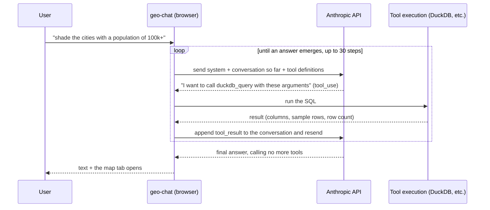

# 03. Witnessing the loop

> The core of this workshop. We take the agent's "magic" apart from both **about 100 lines of code** and
> **the raw HTTP round trips in DevTools**. Once this clicks, the rest is application.

## ① Concept — what the agent loop is

In chapter 01 we defined "agent = LLM + tools + loop + context." The substance of that **loop** is a
surprisingly simple round trip:



There are 2 key points:

1. **The API is called many times within a single turn** — a round trip happens each time a tool is called.
   It is not "1 question = 1 API call."
2. **The model is stateless** — every time, the system prompt, the entire conversation so far, and the tool
   definitions are **resent in full**. The agent's "memory" exists only because the app piles up the conversation
   history and resends it each time.

## ② Where to read the code — a close reading of `src/lib/ai/agent.ts`

`runAgent()` is about 100 lines. It is the workshop's "textbook file." We follow it top to bottom
(line numbers are approximate as of writing).

### Calling Anthropic directly from the browser (lines 40–43)

```ts
const anthropic = createAnthropic({
    apiKey: options.apiKey,
    headers: { 'anthropic-dangerous-direct-browser-access': 'true' },
});
```

Normally, Anthropic **blocks** direct calls from the browser (to prevent key leakage).
This header **explicitly opts in** to it. It is allowed here because this is a
**workshop app where the users enter their own keys themselves**
(a production multi-user app would keep the key on a server and proxy through it).

### streamText — declaring the loop (lines 45–56)

```ts
const result = streamText({
    model: anthropic(options.model),
    system: buildSystemPrompt(options.promptContext), // ← context (the ② prompt)
    messages: options.messages, // ← the entire conversation so far
    tools: options.tools, // ← the 7 tool definitions
    temperature: 0, // reproducibility-first (nearly the same decision every time)
    maxOutputTokens: 8000,
    stopWhen: stepCountIs(30), // ← the loop's stopping condition
    abortSignal: options.abortSignal,
});
```

The Vercel AI SDK's `streamText` takes on the loop itself. The crux is
**`stopWhen: stepCountIs(30)`**:

> **Repeat steps (tool call → result → model)** until the model answers without calling a tool,
> and safely cut off at 30 steps at most.

This one line is what "turning the loop" really is. All you write is the "stopping condition";
the SDK handles running the round trips. `temperature: 0` keeps the decisions nearly identical every time,
making debugging easier.

### fullStream — translating rich events into 5 kinds (lines 59–87)

```ts
for await (const part of result.fullStream) {
    switch (part.type) {
        case 'text-delta':
            /* characters streamed in */ break;
        case 'tool-call':
            /* wants to call a tool */ break;
        case 'tool-result':
            /* a tool result came out */ break;
        case 'tool-error':
            /* a tool errored */ break;
        case 'error':
            /* overall error */ break;
    }
}
```

`fullStream` carries **every kind of event** — fragments of text, tool calls, tool results, errors, and so on.
`runAgent` narrows those down to the **5 kinds of `AgentEvent`** the UI needs and notifies via `onEvent`
(see the type definitions at the top of the file). "Pass only what the UI needs, nothing extra" — a design that
keeps the boundary thin.

### Returning the conversation history (lines 89–91)

```ts
options.onEvent({ type: 'finish' });
const { messages } = await result.response;
return messages; // the messages generated in this turn (including tool calls)
```

It returns the messages produced in this turn (the assistant text + tool calls + results), and the caller
(`useAgentChat`) piles them onto `history.current`. **Because the next turn resends all of this in full,** the
model can "remember" its own past tool calls.

### Dissecting the system prompt — `src/lib/ai/systemPrompt.ts` (the ② prompt in the flesh)

The system prompt is made of a **static part + a dynamic part.**

- **The static part** `BASE_PROMPT` — the role ("a geospatial data assistant that runs inside the browser"),
  the environment (DuckDB spatial is available / there are Table, Map, and Chart tabs),
  the work procedure, how to use skills, and rules (MapLibre expressions use direct `["get","col"]` access,
  don't write `data`/`width`/`height` in Vega-Lite, reply in the user's language, etc.).
- **The dynamic part** `buildSystemPrompt()` — every turn, it appends the **current date** and
  **the tables and schema currently in the DB** to the end:

```ts
return `${BASE_PROMPT}\n\n## Context\nCurrent date: ${date}\n\nTables in the database:\n${tables}`;
```

This dynamic schema injection is exactly the implementation of "show the LLM the schema" touched on in chapter 02.
`buildPromptContext()` in `useAgentChat` calls `getTables()` / `getTableSchema()` every turn to gather the latest
list. **This is the first ② prompt in the flesh** (the tool descriptions in chapter 04 and the skill md in
chapter 06 are the second and third).

## ③ Break-it experiment #3 — peeking at the API round trips in DevTools

We confirm the loop we understood in code with the **actual flowing HTTP**. Less a break-it than an "expose-it" experiment.

1. Open the browser's **DevTools** and select the **Network** tab.
2. Type `api.anthropic.com` into the filter.
3. Send `人口 10 万人以上の市を地図で塗り分けて` to the chat.
4. **Multiple** requests to `messages` appear. **Count how many there are.**

### Reading a request

Open the **Payload (the sent JSON)** of the first request and you see these 3 things:

- `system` — the full text of the system prompt you just read (with the current tables' schema at the end).
- `messages` — the conversation so far (at first, just the user's single sentence).
- `tools` — the **name / description / input_schema** of the 7 tools.
  This is "the instruction manual for the tools shown to the model" (the star of chapter 04).

### Reading the response (SSE)

The response is an **SSE (Server-Sent Events) stream**. Inside it a `tool_use` block appears, and you can see
the model saying "I want to call `duckdb_query` with this `input`."

### Counting the round trips

Look at the `messages` of the second request onward and you see appended the
**`tool_use` (the model's request) and `tool_result` (the execution result)** that were not in the first.
This is "pile up the conversation and resend it each time" in the flesh.

> **The principle you can see**: The agent's substance is no more than a
> **`tool_use` → execution → `tool_result` HTTP round-trip loop.** Number of requests = number of loop iterations.
> The "magic," it turns out, was this humble accumulation of round trips.

## ④ Hands-on exercise

1. Ask "don't put it on the map, show me the top 5 cities by population **as a table**," and count the number of
   requests in Network. Explain how the count changes versus when you also asked for the map, and why.
2. Copy the full `system` text of the first request and point to the boundary between `BASE_PROMPT` (static) and the
   `Context` at the end (dynamic). Add one table and ask the same question again, then observe how the end of
   `system` changes.
3. Find the `description` of `duckdb_query` in the `tools` array and read it aloud.
   Get a head start on feeling the next chapter's claim that "this description is the model's only clue."

## ⑤ Development prompt example

A prompt example for when you want Claude Code or the like to summarize this chapter's understanding into your own notes:

```
Read src/lib/ai/agent.ts in this repository and explain, for a beginner in 5 lines,
how runAgent calls the Anthropic API multiple times in one turn, centering on the role of
stopWhen: stepCountIs(30). Also touch on the point that the conversation history is resent every time.
```

Next is [04. Anatomy of a tool](./04-building-tools.md). We take apart where each entry of the `tools` array we just
saw in Network comes from in the code — and **why the description is the lifeline** — and add a new tool ourselves.
