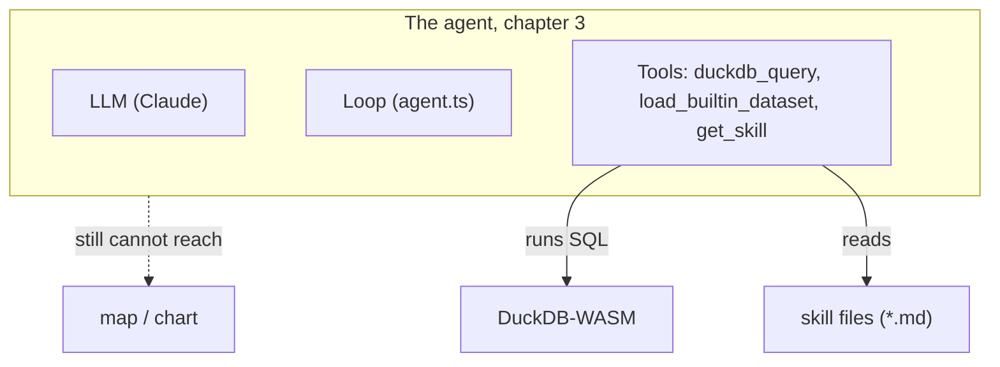

# 03. Knowledge on demand

> Chapter 2 ended with `duckdb_query` running every SQL statement asked of it — and still getting
> the geospatial ones wrong. Not because the tool refused anything, but because the model didn't
> reliably know which CRS to project into, or that `always_xy` even exists. Stapling that
> knowledge onto the system prompt permanently hits a wall fast: context is a finite resource, and
> piling on rules you don't need this turn buries the ones you do. This chapter hands the agent a
> third tool, `get_skill`, and a folder of markdown files it can fetch from **on demand** instead.

## ① The agent so far

Chapter 2's diagram had `duckdb_query` and `load_builtin_dataset` reaching DuckDB, with map and
chart still behind a dotted line. This chapter adds one more tool — and, for the first time, a
node that isn't the execution layer at all, but a **store of knowledge** the agent reads from.



`ENABLED_TOOLS` in `src/lib/ai/toolTiers.ts` goes from `[...TIER_1]` to
`[...TIER_1, ...TIER_2]`:

```ts
export const TIER_2 = ['get_skill'] as const;
```

The dotted arrow to `map / chart` is **still there, on purpose**. `get_skill` only ever _reads_
markdown files and hands their text back to the model — it cannot draw anything. Even once this
chapter's skill fixes the agent's SQL, the map and chart tabs remain exactly as unreachable as they
were at the end of chapter 2. Keep that in mind; it is the whole subject of ④.

## ② The new piece

### Chapter 2's failure, diagnosed

Chapter 2 closed on two prompts that broke the agent even though `duckdb_query` executed every
statement it was asked to, without complaint:

> `各都道府県の面積を km² で計算して` ("compute each prefecture's area in km²") — a model that
> calls `ST_Area` directly on raw WGS84 geometry hands back a column labeled `km²` that is actually
> **degrees², wrong by orders of magnitude.**

> `東京駅から 30km 以内の市を探して` ("cities within 30 km of Tokyo Station") — the same unit
> confusion, now compounded by having to recall Tokyo Station's coordinates from training data too.

Chapter 2's own principle-callout named the diagnosis precisely: **"`duckdb_query` never once
refused to run these queries, and it never will — a general-purpose tool has no opinion about
whether the SQL it executes is geospatially sound. Every failure was a knowledge gap … never a
capability gap."** The tool worked. The model just didn't reliably know, every time, which CRS to
project into, that `ST_Transform` needs `always_xy := true` for this app's coordinate order, or
that raw lon/lat units are degrees, not meters. Even the "it happened to get it right" case chapter
2 called out as a required fallback was still a pile of incidental knowledge recalled correctly
from memory, with nothing enforcing that it would be recalled correctly the _next_ time.

### The band-aid escalation — and why it's a dead end

The obvious first move is to fix this by growing the system prompt. Add one rule: _"before
computing area or distance, always project to a metric CRS with `ST_Transform`, and always pass
`always_xy := true`."_ That much would probably have fixed the km² prompt.

But it doesn't stop there. The next request needs the axis-order trap spelled out in its own right
(what `always_xy` actually protects against, and what it looks like when you forget it). The one
after that needs a note on `ST_DWithin` versus `ST_Distance_Sphere` for the 30 km prompt. Then a
paragraph on WKB-vs-GEOMETRY column types. Then — once chapter 4's map and chart tools exist —
the entire MapLibre paint-property convention, the entire Vega-Lite spec-shape convention, choropleth
color-ramp guidance, and so on. Each one, in isolation, is a reasonable rule to want the model to
follow reliably. Piled up together, permanently, in every single system prompt sent on every single
turn — including a turn that only ever runs `SELECT count(*)` — they stop being helpful:

> Context is a scarce resource. It is not the case that "the more you hand the model, the smarter
> it gets" — **piling on masses of irrelevant information actually buries the important
> instructions and lowers quality.**

That's the wall. You cannot fatten the system prompt rule by rule forever; you run out of the
context budget that quality depends on, long before you run out of geospatial conventions worth
writing down.

### The answer: progressive disclosure

The solution is to stop permanently inlining the knowledge at all:

> Keep the detailed knowledge outside, as **skills**, and have the model go fetch **only the ones
> relevant to the task, at the moment it's needed**, with the `get_skill` tool.

The system prompt says only "the detailed how-to lives in skills, fetch them if needed," and the
**catalog** — what skills exist, and when each one is needed — is embedded in the `description` of
`get_skill` itself, not in the system prompt. The model reads that catalog, judges for itself "this
task needs the spatial skill" (or the map skill, or neither), and fetches only that. This is the
knowledge-side counterpart to chapter 2's tool round-trip loop: instead of one round trip to _act_
on the world, it's one round trip to _learn_ something about the world, on demand, mid-turn.

### Where to read the code

**The skill file format.** Skills live under `src/lib/ai/skills/**/*.md` — markdown with
frontmatter. Here is the top of `src/lib/ai/skills/map/styling.md`:

```markdown
---
description: REQUIRED before styling the map — TableMapStyle shape, paint per geometry, ...
tasks: 地図, 地図スタイル, 色分け, スタイル, map, map style, choropleth, 塗り分け, ポイント, ...
---

## Styling the map with update_map_style

(the body starts below here: detailed conventions for using update_map_style)
```

The fields are parsed in `src/lib/ai/skills/registry.ts`:

- **`description`** — the one-line catalog text. Write it as **when it is needed**, e.g. "REQUIRED
  before …" — that phrasing is what lets the model self-select correctly.
- **`tasks`** — routing keywords, English and Japanese. Shown alongside the description in the
  catalog, they are the model's second clue for "does this task match this skill."
- **`deps`** (optional) — ids of prerequisite skills fetched alongside this one automatically. For
  example `map.geospatial` declares `deps: map.styling, duckdb.spatial`, and `duckdb.spatial`
  itself declares `deps: duckdb.basics`.
- **body** — everything below the frontmatter fence. This is the text handed to the model when it
  fetches the skill.

**The id comes from the file path**, generated automatically — no id is ever written by hand:

```ts
// './duckdb/spatial.md' → 'duckdb.spatial'
export function idFromPath(path: string): string {
    return path.replace(/^\.\//, '').replace(/\.md$/, '').replace(/\//g, '.');
}
```

The **first segment** of that id (the `duckdb` of `duckdb.spatial`) is the skill's **domain**. Right
now, at this tier, it is nothing more than a namespace prefix — chapter 4 is what gives it teeth,
turning "read the right conventions first" from a suggestion into something enforced structurally.
Don't worry about that yet; nothing at this tier depends on it.

All files are **bulk-loaded at build time** by
`import.meta.glob('./**/*.md', { eager: true, query: '?raw' })` in `registry.ts` — there is no
runtime file scan, no registration step, no build config to touch.

> **In other words: drop in one `<domain>/<name>.md` file and the agent gains a skill. No code
> change needed.** This is the heart of this workshop's "extend the agent with one markdown file."

**The catalog and fetching — `src/lib/ai/tools/getSkill.ts`.** The `description` of `get_skill` has
the entire catalog embedded in it, generated by `buildCatalog()`:

```ts
const description =
    'Fetch detailed, up-to-date instructions for one or more skills before you act. ' +
    'You MUST fetch the relevant skill before using update_map_style (map.* skills) or ' +
    'update_chart_spec (vega.* skills). Fetch DuckDB skills before non-trivial SQL. ' +
    'Dependencies are pulled in automatically.\n\nAvailable skills:\n' +
    buildCatalog();
```

Right now, in this repository, that catalog lists all seven skill files that exist —
`duckdb.basics`, `duckdb.file-import`, `duckdb.spatial`, `map.geospatial`, `map.styling`,
`vega.basics`, `vega.color` — each as one `- <id> — <description> [tasks]` line. Notice that the
`map.*` and `vega.*` entries are in there **even at this tier**, even though `update_map_style` and
`update_chart_spec` don't exist yet in `ENABLED_TOOLS` — the catalog is just every markdown file
under `skills/`, independent of which action tools happen to be enabled. Fetching `map.styling`
right now would succeed and cost you nothing, but there is no tool yet that would use it; that
mismatch is exactly ④'s subject.

When the model calls `get_skill(["duckdb.spatial"])`, `resolveWithDeps()` walks the `deps` graph
(dependencies first, then the requested id, deduplicated) and the tool returns every resolved body
at once:

```ts
// (simplified: the real execute also tracks not-found ids and unlocks
// something we meet in chapter 4 — this is the shape that matters here)
execute: async ({ skills }) => {
    const resolved = resolveWithDeps(skills); // deps first, e.g. ["duckdb.basics", "duckdb.spatial"]
    const instructions: Record<string, string> = {};
    for (const id of resolved) {
        const skill = getSkill(id);
        if (skill) instructions[id] = skill.body;
    }
    return { fetched: Object.keys(instructions), instructions };
};
```

### The `duckdb.spatial` skill — the knowledge chapter 2 was missing

Here is the exact section of `src/lib/ai/skills/duckdb/spatial.md` that chapter 2's failures were
missing, verbatim:

````markdown
### Buffers, area, distance — the projection caveat

`ST_Area`, `ST_Length`, `ST_Distance`, `ST_Buffer` and `ST_DWithin` operate in the
**geometry's own units**. For WGS84 lon/lat those units are **degrees**, not meters —
so `ST_Area` on raw lat/lon gives degrees², which is meaningless as land area.

For real metric measurements, transform to a projected CRS first, measure, and (if you
still need to draw it) transform back to 4326:

```sql
-- area in m² for Japan: project to JGD2011 / Japan Plane Rectangular or a UTM zone
SELECT ST_Area(ST_Transform(geometry, 'EPSG:4326', 'EPSG:6677', always_xy := true)) AS area_m2
FROM "areas";
```

**Axis-order trap:** `ST_Transform` defaults to the CRS's declared axis order, which
for EPSG:4326 is (lat, lon) — the _opposite_ of how we store data. Always pass
`always_xy := true` so it treats coordinates as (lon, lat). Forgetting this silently
swaps X and Y and sends geometry to the wrong hemisphere.

For quick approximate distances without projecting, `ST_Distance_Sphere(a, b)` returns
meters directly on lon/lat input.
````

Read it against chapter 2's two failing prompts and every piece falls into place: _project → EPSG
:6677 (or a UTM zone) → `always_xy := true` → measure → convert back if you still need to draw it._
That is the exact sequence a `km²` computation needed, and the axis-order paragraph is the exact
trap chapter 2's own callout demonstrated by running the same query without `always_xy` and
watching the centroid land somewhere absurd. None of this is new knowledge invented for this
chapter — it was sitting in the repository the whole time; chapter 2's agent simply had no way to
reach it.

## ③ Run it

Open `src/lib/ai/toolTiers.ts` and set, for real this time:

```ts
export const ENABLED_TOOLS: readonly ToolName[] = [...TIER_1, ...TIER_2];
```

Save — Vite hot-reloads — start a **fresh chat**, and type chapter 2's exact failing prompt again:

```
各都道府県の面積を km² で計算して
```

**Before — chapter 2 (`TIER_1` only, recap).** No `get_skill` tool exists yet. The model goes
straight to SQL, and (per chapter 2's ④) a model that reaches for `ST_Area` directly on the raw
`geom` column hands back a `km²`-labeled column that is actually degrees², wrong by orders of
magnitude. There is no tool card in the transcript except `duckdb_query` — nothing offered the
model a chance to check its assumption before acting on it.

**After — chapter 3 (`TIER_1` + `TIER_2`).** Expect a `get_skill` tool card to appear **first**,
before any `duckdb_query` call. Open it: `input.skills` is something like `["duckdb.spatial"]`, and
because `duckdb.spatial` declares `deps: duckdb.basics`, the tool card's skill-id badges show
**both** `duckdb.basics` and `duckdb.spatial` — `resolveWithDeps()` pulled the dependency in for
free. Only after that does a `duckdb_query` call follow, and its `input.sql` now projects before
measuring, roughly:

```sql
CREATE TABLE prefecture_areas AS
SELECT
    "N03_001" AS prefecture,
    ST_Area(ST_Transform("geom", 'EPSG:4326', 'EPSG:6677', always_xy := true)) / 1e6 AS area_km2
FROM "japan_prefectures";
```

Project to a metric CRS, pass `always_xy := true`, divide the m² result by `1e6` for km² — exactly
the recipe the skill body just handed it. Compare the two transcripts side by side: same prompt,
same underlying data, same model — the only thing that changed between chapter 2 and now is that
the agent had somewhere to go look up the one fact it was missing, and one extra tool that let it
go look.

> **The principle you can see**: the fix was never "make the model smarter." It was **making the
> right knowledge reachable, at the moment it mattered**, without permanently taxing every other
> turn with knowledge it doesn't need. That is the entire promise of progressive disclosure, proven
> on the exact prompt that broke without it.

## ④ Where this fails

Keep the same chat open — `prefecture_areas` now exists, with correct km² numbers in it — and ask
one more thing:

```
その結果を地図に表示して
```

(English: "show that result on the map.")

**This is a deterministic failure, not a probabilistic one.** `ENABLED_TOOLS` is still
`[...TIER_1, ...TIER_2]` — there is no `update_map_style` tool in the list at all. The model can
describe what a choropleth of `prefecture_areas` would look like, it can
even write out the MapLibre paint properties it _would_ use in prose, but it has no tool call
available that draws anything. Watch what actually happens: either an apology that it cannot show a
map, or the numbers printed back as a table in the chat — the one output format it does have. Open
the transcript and confirm there is no map-shaped tool card anywhere in it, and that the Map tab in
the app does not change.

Notice how this failure is the **mirror image** of chapter 2's. There, the tool existed
(`duckdb_query`) and the knowledge was missing. Here, the knowledge is now correct and complete —
`prefecture_areas.area_km2` is right — and the _tool_ is what's missing. `get_skill` only ever
reads markdown text back to the model; it cannot make a `map` tool materialize out of a skill file,
no matter how well that file is written. Knowledge and capability are different axes, and this
chapter only ever built the first one.

> **The principle you can see**: correct knowledge fixed the **what** — the agent now knows the
> right SQL. It did nothing for the **how** of acting on a domain (the map, the chart) with no
> hands built for it yet. [04. Specialized tools](./04-specialized-tools.md) adds exactly those
> hands — and, once you see how much can go wrong even with a good tool available, why they deserve
> more thought than a bare `execute` function.

## ⑤ Hands-on — write one skill of your own

Confirm with your own hands that **just adding one markdown file** makes the agent smarter. As an
example, we make a heatmap skill, `map/heatmap.md` (a standard procedure from your own work is fine
too).

### Template (save as `src/lib/ai/skills/map/heatmap.md`)

```markdown
---
description: Point-density heatmap representation — the paint for a heatmap layer and when to use it
tasks: heatmap, density, hotspot, ヒートマップ, 密度, ホットスポット
deps: map.styling
---

## Representing points as a heatmap

When you want to show the "density" of many points, use a heatmap rather than individual circles.
(This app's map layers are point→circle / line→line / polygon→fill by default, so the conventions for using
a heatmap are stated explicitly here. First confirm the target is points.)

- In zoom bands where you want to emphasize density, use the `heatmap-*` family of paint.
- To weight by value, use ["get", "<numeric column>"] for heatmap-weight.
- If you also want to show the raw points, consider a design that switches to circle display on zoom-in.

(Write here, concretely, the procedure / colors / threshold guidance you write every time in your own work.)
```

> Note: The template above is a minimal example for learning "how to write a skill." Actually
> drawing a heatmap requires the corresponding layer implementation, but the aim of this exercise is
> to **feel that "dropping in an md changes the catalog and the behavior."** The most instructive
> thing is to write one "analysis recipe you repeat in your own work" as `<domain>/<name>.md`.

### Applying and confirming

Since skills are loaded by a build-time glob, after adding a file **restart the dev server**
(`Ctrl+C` → `npm run dev`). Confirmation steps:

1. Start a New chat and type a request about density (e.g. "show me the hotspots of ◯◯").
2. Open the `get_skill` tool card and confirm that **your new skill id (e.g. `map.heatmap`) has been
   added to the catalog.**
3. Observe whether the model fetches that skill and behaves according to the conventions you wrote
   in the body. Confirm that the behavior changes before and after adding the skill.

## ⑥ Development prompts

A prompt example for having the AI draft a skill that you then finish yourself:

```
Modeling it on the existing skills in src/lib/ai/skills/ (map/styling.md, duckdb/spatial.md),
write a new skill <domain>/<name>.md.
- The frontmatter is description / tasks (English + Japanese keywords) / deps if needed.
- The body includes "when to use it," "concrete SQL / spec shapes," and "common mistakes and how to fix them."
- Target task: <a description of an analysis you repeat in your work>
Output it as one Markdown file. No code change needed (it's auto-registered by the glob).
```

More on skill templates is also in [appendix-prompts.md](./appendix-prompts.md).

Next is [04. Specialized tools](./04-specialized-tools.md). The agent now knows the right SQL for
spatial questions — it still has no hands for the map or the chart at all. We give it some, and see
just how much can go wrong even with the right tool in hand.
