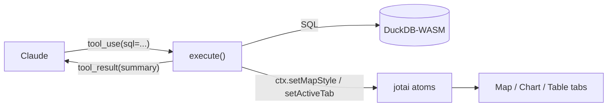

# 04. Anatomy of a tool

> The `tools` array we saw in Network in chapter 03. In code, each entry is made of
> **4 parts: name / description / inputSchema / execute.**
> This chapter takes that structure apart and **has the AI implement a new tool** called `buffer_analysis`.

## ① Concept — a tool is made of 4 parts

For the agent, a "tool" is an object with the following four:

| Part          | Role                                                                          | Who reads it  |
| ------------- | ----------------------------------------------------------------------------- | ------------- |
| `name`        | the tool's identifier (`duckdb_query`, etc.)                                  | model and app |
| `description` | a natural-language explanation of **what it does and when/how to use it**     | **the model** |
| `inputSchema` | the arguments' types (a zod schema). The shape of the JSON the model fills in | model and app |
| `execute`     | the TypeScript function that actually touches the world. Returns a result     | **the app**   |

Critically important: **the model never sees the contents of `execute`.**
What the model reads is only the `description` and the `inputSchema`. In other words:

> **Whether a tool gets used intelligently is decided by how you write the `description`.**
> API design (tool design) is, directly, prompt design (the ② layer).

`execute` is the "hand"; `description` is the "instruction manual for using the hand." If the manual is bad,
no matter how good the hand is, it won't get used. We confirm this in this chapter's break-it experiment.

## ② Where to read the code — dissecting `src/lib/ai/tools/duckdbQuery.ts`

### The 4 parts in the flesh

`createDuckdbQueryTool()` assembles the 4 parts with the AI SDK's `tool({...})`:

```ts
return tool({
    description:
        'Run a single SQL statement against the DuckDB-WASM database ... ' +
        'Use it to explore data before answering (always LIMIT exploratory SELECTs) ' +
        'and to CREATE TABLE for results worth visualizing. ' +
        'Returns column types, up to 5 sample rows, the row count, and whether the result has a geometry column.',
    inputSchema: z.object({
        sql: z.string().describe('One SQL statement (no trailing extra statements).'),
        purpose: z.enum(['explore', 'result']).optional().describe('...'),
    }),
    execute: async ({ sql }) => {
        /* actually run the SQL */
    },
});
```

The crux is that the description writes out the conventions of use — **"single statement only," "always LIMIT
exploratory SELECTs," "CREATE TABLE for results to visualize," "what comes back is column types, up to 5 rows,
the row count, and whether there is geometry."** This **redundantly reinforces** the conventions from the system
prompt read in chapter 03 (write the important things in more than one place).

### The result becomes the input of the next step

The object `execute` returns goes straight back to the model as the `tool_result` and becomes the
**material for deciding the next step**. Look at the return value of `duckdbQuery.ts`:

```ts
return { columns, rowCount, sampleRows, hasGeometry, createdTable: created, hint };
```

- To avoid overflowing the model, the sample rows returned are **at most 5**, and long strings are cut at
  200 characters (`MAX_SAMPLE_ROWS` / `sampleValue`). The full data for map/chart stays in the DuckDB table,
  and only a "summary" is handed to the model — **this is the standard technique for conserving context.**
- When a `CREATE TABLE` is detected (`createdTableName`), it refreshes the table list, and if there is a geometry
  column it puts a **sentence prompting the next move** — "you can draw it with `update_map_style`" — into `hint`
  and returns it. The tool's return value, too, is in fact part of the ② prompt.

### toolContext — the bridge connecting tools and UI state

Tools **import neither React nor jotai**. Instead they receive a thin window called `ToolContext` and touch the
app's state (jotai atoms) through it.

```ts
// src/lib/ai/toolContext.ts — definition (excerpt)
export interface ToolContext {
    refreshTables: () => Promise<void>;
    setSelectedTable: (table: string) => void;
    setActiveTab: (tab: WorkspaceTab) => void;
    getChartSpec / setChartSpec / getMapStyle / setMapStyle ...
}
```

`defaultToolContext()` implements this window on top of the global jotai store.
So when `duckdb_query` does a `CREATE TABLE`, the **same atoms the UI reads** get updated through
`ctx.setSelectedTable()` / `ctx.refreshTables()`, and it is reflected in the Map tab.
The tool stays a "pure function" while being able to connect to the UI — a clean separation.



### Registering the tool — `src/lib/ai/tools/index.ts`

`createTools()` gathers the 7 tools into a single object and hands it to the agent.
**A new tool only becomes visible to the model by adding one line here** (used in the chapter 04 exercise).
This file also has a thin wrapper `requireSkill`, a **prerequisite gate** that makes `update_map_style` /
`update_chart_spec` "not work until their skill is fetched" (details in chapter 06).

## ③ Break-it experiment #4 — emptying out the description

**Hypothesis: "the model picks tools relying on the `description` alone."**

Temporarily set the `description:` in `src/lib/ai/tools/duckdbQuery.ts` to an empty string.

```ts
// before (excerpt)
description:
    'Run a single SQL statement against the DuckDB-WASM database ... ',

// after
description: '',
```

Save, reload, and type the same question as in chapter 01:

```
人口 10 万人以上の市を地図で塗り分けて
```

**Observation** (how it shows up varies by model and luck, but as a tendency):

- The model **fails to call `duckdb_query` when it should**, or uses it incorrectly.
- It just says out loud "I want to run SQL but I don't know the tool," or jumps straight to the map tool without
  exploring and fails.

> **The principle you can see**: Even if the contents of `execute` are perfect, **without a description the hand does
> not get used.** The model's only clue is the `description`. This is why **tool design = ② prompt design.**

Once you've confirmed it, put the description back.

## ④ Hands-on exercise — have the AI implement the `buffer_analysis` tool

We add a new tool, **`buffer_analysis`**. It applies a buffer with `ST_Buffer` to a specified table's features and
creates a **new table**. Rather than hand-typing it, we use a **③ development prompt** to have Claude Code or the
like implement it (this is the workshop's means of implementation).

### The development prompt (the ③ layer — paste this to a coding AI)

```
Add a new AI tool called buffer_analysis to this repository.

■ Goal
Create a new table with ST_Buffer applied to the geometry column of a specified table, so it can be drawn on the map.

■ Match the existing structure
- Model it on src/lib/ai/tools/duckdbQuery.ts and updateMapStyle.ts, writing it in the same shape
  (a createXxxTool(ctx) function returning tool({ description, inputSchema(zod), execute })).
- Receive the ToolContext from src/lib/ai/toolContext.ts and reflect into the UI using
  refreshTables / setSelectedTable / setActiveTab.
- After implementing, register buffer_analysis in createTools in src/lib/ai/tools/index.ts.

■ Input schema (zod)
- table: string (target table)
- distanceMeters: number (buffer distance, meters)
- outputTable: string (name of the table to create)

■ Behavior
- Check with getTableSchema whether the target table has a geometry column; if not, return an error.
- Since ST_Buffer works in the units of the coordinate system, convert EPSG:4326 to a projected CRS
  (e.g. EPSG:6677, always_xy := true), buffer in meters there, then convert the result back to EPSG:4326
  and store it as a GEOMETRY column.
- Run CREATE TABLE "<outputTable>" AS SELECT ... via executeQuery.
- On success, call ctx.refreshTables / setSelectedTable(outputTable) / setActiveTab('map').
- Make the return value to the model a short summary ("created table name, row count," etc.); do not return all rows.

■ Write the description (the ② prompt) carefully
- State in 2–3 sentences when to use it (proximity analysis, service areas, etc.), that the distance unit is meters,
  and that the output is a new table.

After implementing, confirm that npm run typecheck passes.
```

### Review checklist for the generated code

You **must inspect the AI-written code yourself.** Confirm the following:

- [ ] Is the **inputSchema** clear (are the type, required/optional, and unit written in `.describe()`)?
- [ ] Is it **single-responsibility** (only buffer creation — it isn't greedily doing map styling too)?
- [ ] **Truncated results** — is it not returning all rows to the model (only a summary)?
- [ ] **Projection handling** — for a buffer in meters, does it project → buffer → convert back to 4326, and is `always_xy` present?
- [ ] **Registered in index.ts** — did you register it (if not, the model can't see it! it won't appear in the chapter-03 `tools` array)?
- [ ] Does the **description** state "when, what, and what gets returned" (= the quality of the ② prompt)?

### Verify

Once registered, in the chat:

```
japan_cities の中心 5 市に半径 2km のバッファを作って地図に出して
```

(English: "make a 2 km-radius buffer for the 5 central cities in japan_cities and show it on the map.")

If a `buffer_analysis` tool card appears and the new table is drawn in the Map tab, it worked.
This exercise is developed further in chapter 07's challenge (2), combined with `ST_Intersects`.

## ⑤ Development prompt example

The "development prompt" above is itself the concrete example for ⑤. The generic templates ("add a tool,"
"debug the agent") are collected in [appendix-prompts.md](./appendix-prompts.md). **Writing into the prompt
"which file to model it on," "where to register it," and "what to verify"** is the key to a good generation.

Next is [05. The declarative-spec boundary](./05-declarative-specs.md). Why the map and chart tools are designed to
"have the AI write a spec (data)" rather than "write JavaScript" — that reason is the central principle for
designing tools that pair well with AI.
