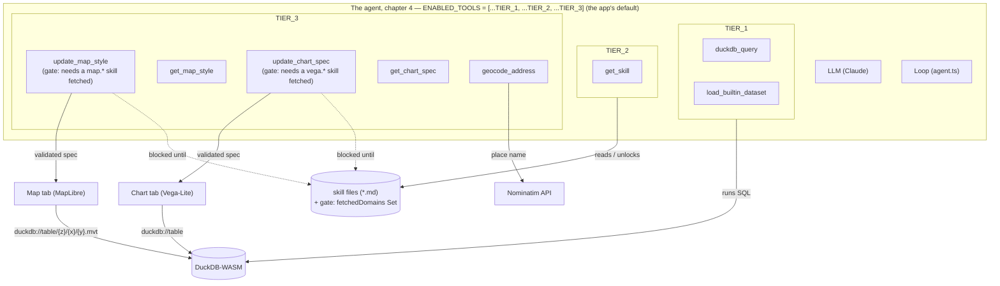
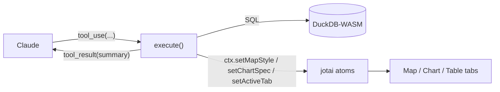
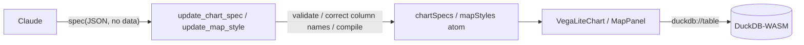

# 04. Specialized tools

> Chapter 3 ended mid-victory. `prefecture_areas.area_km2` was correct — the skill had closed the
> knowledge gap — and then a plain follow-up, "show that on the map," hit a wall that had nothing
> to do with knowledge at all. `ENABLED_TOOLS` was still `[...TIER_1, ...TIER_2]`; there was no
> tool in the list that could draw anything. This chapter hands the agent its last three tools —
> map, chart, and geocoding — and spends most of its time on why "just add an `execute` function"
> is nowhere near enough: how a tool's four parts fit together, why the map and chart tools are
> designed to have the model write _data_, not code, and the small gate that makes sure the right
> conventions get read before either one runs.

## ① The agent so far

Chapter 3's diagram had `get_skill` reaching a store of markdown, with `map / chart` still behind
a dotted line. This chapter closes every remaining gap at once — `TIER_3` brings in five tools,
and for the first time every node in the diagram is reachable.



```ts
export const TIER_3 = [
    'update_map_style',
    'get_map_style',
    'update_chart_spec',
    'get_chart_spec',
    'geocode_address',
] as const;
```

`ENABLED_TOOLS` becomes `[...TIER_1, ...TIER_2, ...TIER_3]` — every tool `createTools()` knows how
to build. This is not a workshop-only setting; it is the value the shipped app starts with. From
here on, the ladder isn't something you climb by editing one array — it's already fully assembled,
and the rest of this chapter is about what had to be built so that assembling it was safe.

Two things are new about this diagram that weren't true of chapters 1–3. First, `update_map_style`
and `update_chart_spec` carry a visible annotation — "gate: needs a `map.*`/`vega.*` skill fetched"
— because unlike every tool so far, these two can refuse to run even when their arguments are
well-formed. Second, the arrows out of `MapView` and `ChartView` loop back into `DuckDB` — the map
and chart tools never carry data themselves, only a `duckdb://<table>` reference the rendering
layer resolves at draw time. Both of those design choices are this chapter's subject.

## ② The new piece

### 1. Tool anatomy — four parts, one clue

For the agent, a "tool" is an object with four parts:

| Part          | Role                                                                          | Who reads it  |
| ------------- | ----------------------------------------------------------------------------- | ------------- |
| `name`        | the tool's identifier (`duckdb_query`, etc.)                                  | model and app |
| `description` | a natural-language explanation of **what it does and when/how to use it**     | **the model** |
| `inputSchema` | the arguments' types (a zod schema). The shape of the JSON the model fills in | model and app |
| `execute`     | the TypeScript function that actually touches the world. Returns a result     | **the app**   |

Critically important: **the model never sees the contents of `execute`.** What the model reads is
only the `description` and the `inputSchema`. In other words:

> **Whether a tool gets used intelligently is decided by how you write the `description`.**
> API design (tool design) is, directly, prompt design (the ② layer).

`execute` is the "hand"; `description` is the "instruction manual for using the hand." If the
manual is bad, no matter how good the hand is, it won't get used — the empty-description
experiment just below proves it.

#### The four parts in the flesh — `src/lib/ai/tools/duckdbQuery.ts`

`createDuckdbQueryTool()` assembles the four parts with the AI SDK's `tool({...})`:

```ts
export function createDuckdbQueryTool(ctx: ToolContext) {
    return tool({
        description:
            'Run a single SQL statement against the DuckDB-WASM database (main schema, spatial extension loaded). ' +
            'Use it to explore data before answering (always LIMIT exploratory SELECTs) and to CREATE TABLE for results worth visualizing. ' +
            'Returns column types, up to 5 sample rows, the row count, and whether the result has a geometry column.',
        inputSchema: z.object({
            sql: z.string().describe('One SQL statement (no trailing extra statements).'),
            purpose: z
                .enum(['explore', 'result'])
                .optional()
                .describe('"explore" for inspecting data, "result" when creating a table to visualize.'),
        }),
        execute: async ({ sql }) => {
            // (elided: single-statement guard, executeQuery, error-as-result — see below for the return shape)
        },
    });
}
```

The crux is that the description writes out the conventions of use — **"single statement only,"
"always LIMIT exploratory SELECTs," "CREATE TABLE for results to visualize," "what comes back is
column types, up to 5 rows, the row count, and whether there is geometry."** This **redundantly
reinforces** the conventions from the system prompt read in chapter 2 (write the important things
in more than one place).

#### The result becomes the input of the next step

The object `execute` returns goes straight back to the model as the `tool_result` and becomes the
**material for deciding the next step**. The real return value of `duckdbQuery.ts`:

```ts
return { columns, rowCount: result.rowCount, sampleRows, hasGeometry, createdTable: created, hint };
```

- To avoid overflowing the model, the sample rows returned are **at most 5** (`MAX_SAMPLE_ROWS`),
  and long strings are cut at 200 characters (`sampleValue`). The full data for map/chart stays in
  the DuckDB table, and only a "summary" is handed to the model — **this is the standard technique
  for conserving context**, the same discipline chapter 2 closed on.
- When a `CREATE TABLE` is detected (`createdTableName(sql)`), the tool refreshes the table list,
  and if the new table has a geometry column it writes a **sentence prompting the next move**
  straight into `hint`:

    ```ts
    hint = `Table "${created}" has a geometry column ("${geomCol.name}"); you can now style it with update_map_style.`;
    ```

    The tool's return value, too, is in fact part of the ② prompt — it is talking to the model, not
    just to a log file.

#### `toolContext` — the bridge connecting tools and UI state

Tools **import neither React nor jotai**. Instead they receive a thin window called `ToolContext`
and touch the app's state (jotai atoms) through it. Here is the entire real interface:

```ts
// src/lib/ai/toolContext.ts
export interface ToolContext {
    refreshTables: () => Promise<void>;
    setSelectedTable: (table: string) => void;
    setActiveTab: (tab: WorkspaceTab) => void;
    getChartSpec: (table: string) => object | undefined;
    setChartSpec: (table: string, spec: object) => void;
    getMapStyle: (table: string) => TableMapStyle | undefined;
    setMapStyle: (table: string, style: TableMapStyle) => void;
}
```

`defaultToolContext()` implements this window on top of the global jotai store (deliberately the
**default** store — there is no scoped `<Provider>` in `main.tsx`, so this non-React tool code and
the React UI share the exact same atoms). So when `update_map_style` calls `ctx.setMapStyle()`, the
**same atom the Map tab reads** updates, and the map redraws. The tool stays a "pure function"
while being able to reach the UI — a clean separation.



#### Registering the tool — `src/lib/ai/tools/index.ts`

`createTools()` gathers the 8 tools into a single object and hands the ones in `ENABLED_TOOLS` to
the agent loop:

```ts
/**
 * The tool registry handed to the agent loop. Each factory closes over the shared
 * ToolContext so tools can touch app state without importing React or jotai.
 * ENABLED_TOOLS in toolTiers.ts decides which of these the agent actually receives.
 *
 *   name                 | purpose
 *   ---------------------|----------------------------------------------------
 *   duckdb_query         | run one SQL statement; explore data / create tables
 *   load_builtin_dataset | load a bundled sample dataset (parquet) into a table
 *   get_skill            | fetch skill instructions; unlocks the gated tools below
 *   update_map_style  | set a table's MapLibre paint/layout (needs a map.* skill)
 *   get_map_style     | read a table's current (or default) map style
 *   update_chart_spec | set a table's Vega-Lite spec (needs a vega.* skill)
 *   get_chart_spec    | read a table's current chart spec
 *   geocode_address   | place name / address -> coordinates via Nominatim
 */
export function createTools(ctx: ToolContext, enabled: readonly ToolName[] = ENABLED_TOOLS) {
    const all = {
        duckdb_query: createDuckdbQueryTool(ctx),
        load_builtin_dataset: createLoadBuiltinDatasetTool(ctx),
        get_skill: createGetSkillTool(),
        update_map_style: requireSkill('map', 'map.styling', createUpdateMapStyleTool(ctx)),
        get_map_style: createGetMapStyleTool(ctx),
        update_chart_spec: requireSkill('vega', 'vega.basics', createUpdateChartSpecTool(ctx)),
        get_chart_spec: createGetChartSpecTool(ctx),
        geocode_address: createGeocodeTool(),
    };
    const entries = Object.entries(all).filter(([name]) => (enabled as readonly string[]).includes(name));
    return Object.fromEntries(entries) as typeof all;
}
```

**A new tool only becomes visible to the model by adding one line here** — the ⑤ hands-on exercise
below has you do exactly that. Notice the `requireSkill(...)` wrapping around the two map/chart
setters. That is the **prerequisite gate**, and it gets its own full treatment in ②-3 below; for
now, just register that two of the eight tools are not plain factories but factories wrapped in
something else.

#### Experiment: emptying out the description

**Hypothesis: "the model picks tools relying on the `description` alone."**

Temporarily set the `description:` in `src/lib/ai/tools/duckdbQuery.ts` to an empty string:

```ts
// before (excerpt)
description: 'Run a single SQL statement against the DuckDB-WASM database ... ',

// after
description: '',
```

Save, reload, and type a prompt that needs SQL, on a fresh chat:

```
自治体を都道府県ごとに色分けして地図に表示して
```

(English: "color the municipalities by prefecture and show them on the map" — the same prompt
chapter 1 opened with.)

**Observation** (how it shows up varies by model and luck, but as a tendency): the model **fails to
call `duckdb_query` when it should**, or calls it incorrectly. It may say out loud "I want to run
SQL but I don't know the tool," or jump straight to `update_map_style` without ever exploring the
data, and fail.

> **The principle you can see**: even if the contents of `execute` are perfect, **without a
> description the hand does not get used.** The model's only clue is the `description`. This is why
> **tool design = ② prompt design.**

Once you've confirmed it, put the description back.

### 2. The declarative-spec boundary

In section 1 we learned "a good tool comes from a good `description`." This section goes one level
deeper into what `update_map_style` and `update_chart_spec` specifically have the model write. The
answer: not imperative code, but a verifiable **declarative spec (data)** — the central design
principle connecting AI and GIS in this app.

#### Two ways to have an LLM draw a map

- **(A) Imperative code generation** — ask it to "write JavaScript that colors the map." What comes
  back is code, a set of execution steps.
- **(B) Declarative spec generation** — have it write **configuration data (JSON)** that says
  "color with this color rule," and the app does the drawing.

geo-chat thoroughly takes approach **(B)**. The reason is that a spec is **data, not code**, and
the advantage of being data connects directly to a generate → verify → repair loop:

| When a spec is data…    | What you can do                                                                   |
| ----------------------- | --------------------------------------------------------------------------------- |
| **validatable**         | reject a "broken spec" before applying it, via schema validation / compilation    |
| **diffable**            | read the current spec and return it with only part changed (don't rebuild it all) |
| **repairable**          | mechanically fix a wrong column name or an invalid expression so it passes        |
| **execution-separated** | "what to draw (spec)" and "how to draw (app)" are separated                       |

Doing this with imperative code is hard. Mechanically judging whether arbitrary JS is "safe /
correct" is generally impossible; you can only run it, and running carries side effects and danger.
**A declarative spec draws a boundary line where "correctness can be inspected without executing"**
— this is the decisive difference.

#### A mini-explainer — MapLibre style and Vega-Lite

- **MapLibre GL JS** — an OSS map-rendering library (a fork of Mapbox GL JS). A map's appearance is
  written declaratively as a **JSON style spec**. Even the **data-driven expressions** ("this color
  depending on this column's value" — `["interpolate", ...]`, `["match", ...]`, `["get", "col"]`)
  are all expressed as JSON arrays. **The AI fit**: because the style is data, not code, generated
  expressions can be mechanically validated, repaired, and diff-applied.
- **Vega-Lite** — a declarative visualization grammar. Write a chart as a **JSON spec** and the
  library converts it into a drawing. You only write `mark` (bar, line, point…) and `encoding`
  (which column maps to x/y/color). **The AI fit**: likewise, because the spec is data, you can do
  preflight validation via `compile()` and schema matching.

#### `update_chart_spec`'s three-stage validation

`src/lib/ai/tools/updateChartSpec.ts` receives `{ table, spec }` and applies **3 stages of
validation before applying it.**

1. **Forbidding injected keys** — `data` / `width` / `height` are **injected by the app at draw
   time**, so if the model wrote them, they are rejected.

    ```ts
    const INJECTED_KEYS = ['data', 'width', 'height'];
    // ...
    const present = INJECTED_KEYS.filter(k => k in parsed);
    if (present.length > 0) {
        return { error: `Remove [${present.join(', ')}] from the spec — they are injected automatically.` };
    }
    ```

2. **Column-name matching and auto-correction** — it checks each `field` in `encoding` (recursing
   into layered/concatenated sub-specs via `eachEncodingField`) against an actual column, and if
   the difference is only case or Unicode normalization (NFC), it **fixes it automatically** and
   records it in `corrected`. If the column does not exist, it errors, attaching the list of valid
   column names:

    ```ts
    eachEncodingField(parsed, channel => {
        const field = channel.field as string;
        const match = matchColumn(field, columnNames);
        if (!match.ok) invalid ??= field;
        else if (match.corrected) {
            channel.field = match.name;
            corrections.push(`"${field}" → "${match.name}"`);
        }
    });
    if (invalid) {
        return { error: `Column "${invalid}" does not exist in "${table}". Valid columns: ${columnNames.join(', ')}.` };
    }
    ```

3. **Compile preflight** — it runs Vega-Lite's `compile()` with dummy data so that a **broken spec
   fails here, before it reaches the UI**:

    ```ts
    try {
        compile({ ...parsed, data: { values: [] }, width: 300, height: 200 } as never);
    } catch (e) {
        return { error: `Vega-Lite compile failed: ${e instanceof Error ? e.message : String(e)}` };
    }
    ```

These 3 stages are exactly the loop "validate → repair → (if it fails) return the error to the
model to retry." The model can read the returned error and fix it itself — **a feat possible
because the spec is data.**

#### `update_map_style`'s paint-prefix and column auto-correction

`src/lib/ai/tools/updateMapStyle.ts` receives `{ table, geometryType, paint, layout? }` and
validates like this.

1. **Checking the geometry column exists** — if none, error "can't put it on the map."
2. **Validating the paint prefix** — it rejects paint keys other than the prefix corresponding to
   `geometryType`:

    ```ts
    const PAINT_PREFIX: Record<GeometryKind, string> = { point: 'circle-', line: 'line-', polygon: 'fill-' };
    // ...
    const badKeys = Object.keys(paint).filter(k => !k.startsWith(prefix));
    if (badKeys.length > 0) {
        return {
            error: `Paint properties [${badKeys.join(', ')}] are not valid for a ${layerType} layer. Use ${prefix}* properties for ${geometryType} geometry.`,
        };
    }
    ```

    A mistake like specifying `circle-color` for a polygon is rejected, with an explanation, before
    applying.

3. **Matching and auto-correcting `["get", column]`** — it collects every `["get", col]` reference
   in the paint/layout bags (`collectGetColumns`), checks each against real columns, and **rewrites**
   near-misses before applying (`rewriteGetColumns`). A nonexistent column errors instead:

    ```ts
    for (const ref of referenced) {
        const match = matchColumn(ref, columnNames);
        if (!match.ok) {
            return { error: `Column "${ref}" does not exist in "${table}". Valid columns: ${columnNames.join(', ')}.` };
        }
        if (match.corrected) {
            rename.set(ref, match.name);
            corrections.push(`"${ref}" → "${match.name}"`);
        }
    }
    ```

`collectGetColumns` / `rewriteGetColumns` / `matchColumn` live in
`src/lib/ai/tools/columnMatch.ts`. `matchColumn` is deliberately forgiving:

```ts
export function matchColumn(name: string, columns: string[]): ColumnMatch {
    if (columns.includes(name)) return { ok: true, name, corrected: false };
    const target = normalize(name); // NFC + lowercase
    const hit = columns.find(c => normalize(c) === target);
    if (hit) return { ok: true, name: hit, corrected: true };
    return { ok: false };
}
```

The point is that, **on the premise that "the LLM often makes near-misses" — especially with the
NFC-normalization and case wobble that Japanese column names invite — the design builds in room to
correct them mechanically** rather than simply rejecting on the first typo.

#### Separating spec from execution — the `duckdb://` scheme

"What to draw (spec)" and "the data itself" are separated. The spec **carries no data**; at draw
time a URL, **`duckdb://<table>`**, is injected, and the execution layer reads it out of DuckDB.
On the chart side, `src/components/chart/VegaLiteChart.tsx` installs a custom Vega loader that
intercepts exactly that URL:

```ts
load: async (uri: string, options?: unknown) => {
    if (uri.startsWith('duckdb://')) {
        const table = uri.slice('duckdb://'.length);
        const res = await executeQuery(`SELECT * FROM "${table}"`);
        return JSON.stringify(res.rows);
    }
    return base.load(uri, options as never);
},
```

`src/components/workspace/ChartPanel.tsx` is what **injects** `data: { url: 'duckdb://${table}' }`
plus `width`/`height: 'container'` at render time — which is exactly why stage 1 of
`update_chart_spec`'s validation forbids the model from writing those keys itself. The map side uses
the identical idea (`duckdb://<table>/{z}/{x}/{y}.mvt`) with a much bigger execution layer behind
it — MVT tile generation — covered in full in the "Under the map" sidebar (② section 4) below.



#### Experiment: "write JS" vs. "write a spec"

Ask the agent for the same map drawing in **2 ways** and compare their verifiability.

**(A) Ask for imperative code:**

```
japan_cities を人口で塗り分ける JavaScript のコードを書いて
```

(English: "write JavaScript code that shades japan_cities by population.")

→ The model returns plausible-looking JS **as text**. This app **does not run it** (the map does
not change). Even supposing it could run, there is no way to verify beforehand whether that JS is
correct or safe. It can't even notice if a column name is wrong — and, per chapter 2's ④, there is
no `population` column in `japan_cities` to begin with, so a "correct-looking" script would still
be answering the wrong question.

**(B) Ask for a spec (the proper route):**

```
japan_cities を都道府県ごとに塗り分けて地図に出して
```

(English: "shade japan_cities by prefecture and show it on the map.")

→ The model calls `update_map_style` and passes the `paint` JSON. Before applying, the app
validates the paint prefix and column names, corrects near-misses, and reflects it on the map. **If
a column name is wrong, an error is returned and the model fixes it itself.**

> **The principle you can see**: with imperative code, "you can't know it's correct until you run
> it." A declarative spec "can be validated, repaired, and diffed without running." Tools that have
> AI do work should be designed, as much as possible, on top of the **latter boundary line** — this
> is the central principle of GIS × LLM design.

#### Hands-on: break a spec in the Chart tab

For learning, geo-chat **exposes a spec editor in the Chart tab** (`src/components/workspace/ChartPanel.tsx`).
Break a spec by hand here and feel the validation directly, no model in the loop.

1. Select any table and open the Chart tab. A Vega-Lite spec skeleton appears in the editor on the
   left (only `mark` + `encoding`, generated by `skeletonSpec()` — never `data`/`width`/`height`).
2. Press **Apply** and confirm the chart appears.
3. Rewrite a `field` in `encoding` to a **nonexistent column name** and Apply. Nothing here runs
   `matchColumn` or `compile()` — this editor only does `JSON.parse`, so a bad field name silently
   renders an empty/blank chart rather than erroring.
4. Deliberately make **invalid JSON** (delete a closing brace) and Apply. Confirm that `catch (e)`
   in `apply()` surfaces a parse error below the editor.
5. Add a `data` key (e.g. `"data": {"url": "x"}`) and Apply — it is accepted here, because this
   editor writes straight to the `chartSpecsAtom` with none of `update_chart_spec`'s three stages.
   Now ask the agent, via chat, to do the same thing (add a `data` key to the chart) and compare:
   the **tool** refuses it outright.

> Hand-editing in the editor is "no validation at all — the app trusts you completely"; going via
> the chat is "the tool's (② prompt) three-stage validation." The same broken input is accepted in
> one path and rejected in the other — a concrete, hands-on view of which layer the validation
> actually lives in, and why letting an LLM write directly into unvalidated app state would be a
> different, much riskier design than routing it through a tool.

### 3. The gate — descriptions and system prompts _ask_; the gate _enforces_

Tool descriptions and skill catalogs are **persuasion**: they tell the model what it _should_ do.
Nothing so far has stopped the model from calling `update_map_style` with a guessed-at paint
property before ever reading `map.styling`. The **prerequisite gate** is the one piece of this
chapter that isn't persuasion — it is enforcement.

#### `gate.ts` — a Set, three functions

The entire gate is a module-level `Set`, small enough to read in full:

```ts
// src/lib/ai/skills/gate.ts
const fetchedDomains = new Set<string>();

/** Record that a skill domain (e.g. `map`, `vega`) has been fetched this session. */
export function markFetched(domain: string): void {
    fetchedDomains.add(domain);
}

/** Has any skill of this domain been fetched this session? */
export function hasFetched(domain: string): boolean {
    return fetchedDomains.has(domain);
}

/** Forget everything — call when the chat session resets. */
export function resetGate(): void {
    fetchedDomains.clear();
}
```

`get_skill`'s `execute` in `src/lib/ai/tools/getSkill.ts` calls `markFetched(domainOf(id))` for
every skill it successfully resolves:

```ts
// Unlock the gate for every fetched skill's domain.
const fetched = Object.keys(instructions);
for (const id of fetched) markFetched(domainOf(id));
```

Recall from chapter 3 that a skill id's **domain** is just its first path segment (`map.styling` →
domain `map`). The gate doesn't care which specific skill was fetched, only that _some_ skill of
the right domain was.

#### `requireSkill` — refusing with no side effects

`src/lib/ai/tools/index.ts` wraps the two gated tools in `requireSkill`:

```ts
function requireSkill<T extends Tool>(domain: string, suggestion: string, tool: T): T {
    const inner = tool.execute;
    if (!inner) return tool;
    return {
        ...tool,
        execute: (input: unknown, options: unknown) => {
            if (!hasFetched(domain)) {
                return {
                    error:
                        `Fetch the '${suggestion}' skill with get_skill before using this tool. ` +
                        `This loads the required ${domain} format documentation.`,
                };
            }
            return (inner as (i: unknown, o: unknown) => unknown)(input, options);
        },
    } as T;
}
```

and registers the two with their domain and a concrete suggestion:

```ts
update_map_style: requireSkill('map', 'map.styling', createUpdateMapStyleTool(ctx)),
update_chart_spec: requireSkill('vega', 'vega.basics', createUpdateChartSpecTool(ctx)),
```

Before the gate opens, `update_map_style`'s real `execute` **never runs at all** — no SQL, no
schema lookup, no partial state change. The refusal is itself a normal `tool_result`, so the model
reads it in the very next step of the same loop from chapter 2 and can act on it.

#### Per-session reset

The gate is scoped to one chat session, not to the app's lifetime. `useAgentChat.ts` calls
`resetGate()` inside its own `reset()`, which fires whenever the user presses **New chat**:

```ts
import { resetGate } from './skills/gate';
// ...
const reset = useCallback(
    () => {
        // ...
        resetGate();
    },
    [
        /* ... */
    ]
);
```

So "has `map.styling` been fetched" is a fact about _this conversation_, not about the app having
ever seen it before. Starting over means proving it again.

#### Experiment: a complex choropleth without the skill

See with your own eyes why the gate raises quality, rather than just reading conventions off a
description.

1. Press **New chat** (the gate resets; `map` is now in the not-yet-fetched state).
2. Immediately ask for something that needs the categorical-color convention `map.styling`
   documents — "color by category on **one** table with **one** `match` expression, never a
   separate layer per category":

    ```
    japan_cities を都道府県ごとに塗り分けて、色の凡例がひと目でわかるようにして
    ```

    (English: "shade japan_cities by prefecture, so the color legend is clear at a glance.")

3. **Observation**: after exploring, when the model calls `update_map_style`, the tool **returns an
   error and refuses** — "Fetch the `map.styling` skill with get_skill before using this tool." Open
   this `tool_result` in the tool card and read the refusal verbatim.
4. The model reads it and **calls `get_skill(["map.styling"])` itself** (a skill-id badge appears on
   the next tool card). Having read the conventions — the paint prefix table, direct `["get", …]`
   access, and the "one table, one `match` expression" rule for a shared legend — it **calls
   `update_map_style` again and succeeds.**

> **The principle you can see**: descriptions and system prompts _ask_ the model to read the
> conventions first; the gate is the one piece that _enforces_ it, mechanically, with no reliance
> on the model choosing to comply. Combined with the previous section's validation (rejecting
> mistakes that do slip through), **low-quality output becomes structurally less likely** — this is
> progressive disclosure with teeth, not just a catalog the model is free to skip.

### 4. Under the map — the `duckdb://` tile protocol (sidebar)

Section 2 established that the map spec never carries data, only a `duckdb://<table>` reference.
This sidebar is the execution layer that reference actually resolves to — the piece the spec
delegates to once `update_map_style` has done its job.

geo-chat does not send the table to a server to render it. It **generates vector tiles (MVT) with
the in-browser DuckDB spatial extension** and hands them to MapLibre, tile by tile, entirely inside
the browser. The center of this is `ST_AsMVT`.

- `generateVectorTileQuery()` in `src/lib/map/mvtQuery.ts` assembles the SQL for one tile:
  `ST_AsMVTGeom` transforms the geometry into tile coordinates (reprojecting 4326 → 3857 with
  `ST_Transform`'s axis-order argument set to treat coordinates as lon/lat — the same fix
  `always_xy := true` applies elsewhere, just passed positionally here — and simplifying more
  aggressively at low zoom via `calculateSimplifyTolerance()`), and `ST_AsMVT` encodes the result
  as MVT bytes. Non-geometry
  columns ride along as feature properties, capped at 30 and with types `ST_AsMVT` can't serialize
  (structs, lists, unsupported integer widths) cast to something it can.
- `src/lib/map/tileProtocol.ts` registers `duckdb://<table>/{z}/{x}/{y}.mvt` as a **custom MapLibre
  protocol**. Every time MapLibre needs a tile — on load, on pan, on zoom — it calls this protocol
  handler, which runs the SQL above via `getTileBytes()` and returns the raw bytes, cached per table
  and per `z/x/y` (`TileCache`) so panning back over the same area doesn't re-query DuckDB:

    ```ts
    maplibregl.addProtocol(TILE_PROTOCOL, async params => {
        const parsed = parseTileUrl(params.url);
        // ... look up cached bytes, or generate + cache them
        const sql = generateVectorTileQuery({ table, geometryColumn, columns, zxy: { z, x, y } });
        const bytes = (await getTileBytes(sql)) ?? new Uint8Array();
        cache.set(key, bytes);
        return { data: new Uint8Array(bytes) };
    });
    ```

- `invalidateTable(table)` drops both the cached schema info and the cached tiles whenever a
  table's underlying data changes, so a re-run of `update_map_style` (or a new `CREATE TABLE`)
  isn't stuck serving stale tiles.

In other words, on **every single pan and zoom**, DuckDB is quietly re-running a spatial query
behind the scenes — the same database, and the same `ST_*` functions, you touched by hand in
chapter 2's SQL tab. For both map and chart, the execution layer the specs above delegate to is
this one shared DuckDB instance — which is exactly why a broken spec can be caught before it ever
reaches this layer, and why a valid one needs no separate "publish" step to show up on screen.

## ③ Run it

Open `src/lib/ai/toolTiers.ts` and set, for real this time — this is also just leaving the array at
what the app ships with:

```ts
export const ENABLED_TOOLS: readonly ToolName[] = [...TIER_1, ...TIER_2, ...TIER_3];
```

Save — Vite hot-reloads — start a **fresh chat**, and type the prompt chapter 3 left dangling,
now asked as one sentence instead of two:

```
各都道府県の面積を km² で計算して、地図に塗り分けて
```

(English: "compute each prefecture's area in km², and shade the map with it.")

Follow the tool cards in order:

1. **`get_skill`** — expect a call fetching something that resolves, via `deps`, to at least
   `duckdb.spatial` (the projection recipe from chapter 3) and `map.styling` (paint prefixes,
   `interpolate` color ramps). If the model reaches for `map.geospatial` directly, `resolveWithDeps()`
   pulls in **both** `map.styling` and `duckdb.spatial` for free — its `deps` chain covers the whole
   choropleth workflow in one call. Either way, check the skill-id badges on the tool card: `map`
   and `duckdb` domains should both show as fetched before anything else happens.
2. **`duckdb_query`** — a `CREATE TABLE` projecting before measuring, the same recipe as chapter
   3's result. This time the prompt asks for the map in the same breath, so watch whether the
   model keeps `geom` in the `SELECT` list from the start (chapter 3's version, asked only to
   compute, dropped it — nothing there needed it yet):

    ```sql
    CREATE TABLE prefecture_areas AS
    SELECT
        "N03_001" AS prefecture,
        "geom",
        ST_Area(ST_Transform("geom", 'EPSG:4326', 'EPSG:6677', always_xy := true)) / 1e6 AS area_km2
    FROM "japan_prefectures";
    ```

    If it drops `geom` anyway, expect a **second** `duckdb_query` call joining `area_km2` back onto
    `japan_prefectures`'s geometry before the map tool can use it — `duckdb_query`'s own `hint` only
    fires "you can now style it with `update_map_style`" once the created table actually has a
    geometry column. Either path is fine; what matters is that the table eventually handed to the
    map tool carries both the geometry and the metric.

3. **`update_map_style`** — and this time it **does not refuse**. Because step 1 already fetched a
   `map.*` skill this session, the gate from ②-3 is open, and the call proceeds straight to
   validation: paint keys prefixed `fill-` for a polygon, an `interpolate` ramp reading
   `["get", "area_km2"]`, breaks that plausibly reflect `SUMMARIZE`'d percentiles rather than
   round guesses. The map tab opens showing a shaded choropleth of the 47 prefectures.

Compare this transcript to chapter 3's ending: the same second sentence — "show it on the map" —
that had **no tool call available at all** now runs to completion, gated correctly, validated
correctly, drawn correctly. Nothing about the model changed between chapters 3 and 4; every piece
that changed was a tool the app handed it.

> **The principle you can see**: closing chapter 3's gap didn't require a smarter model or a longer
> system prompt. It required exactly three things working together — a **tool** that could act
> (`update_map_style`), a **gate** making sure the right conventions were read first, and
> **validation** catching what the model still gets wrong. Capability, enforcement, and repair are
> three separate mechanisms, and this chapter is what it took to build all three.

## ④ Where this fails

Run the same class of prompt several times, across several fresh chats, varying the phrasing a
little: ask for a choropleth of a metric you just computed, ask to visualize a join result, ask for
a heatmap of something that is actually a polygon table. **This is a softer failure than any
previous chapter's, and it does not have one single reliable repro** — say that plainly rather than
manufacture a fake one. Some runs sail through exactly like ③. Others fumble in one of two
familiar-looking ways:

- **Wrong tool.** A request that is genuinely ambiguous between "chart" and "map" — e.g.
  「`japan_prefectures`の面積を可視化して」("visualize the area of japan_prefectures"), which
  doesn't say which visual you want — sometimes gets `update_chart_spec` (a bar chart of the 47
  prefectures) when you were picturing a map, or vice versa. Neither call is wrong on its own terms;
  the prompt simply didn't say. Watch for it especially when the sentence has no word that pins
  down "map" (地図) or "chart/graph" (グラフ) at all.
- **Wrong parameter.** The model occasionally reaches for a paint property or expression shape that
  the validator from ②-2 rejects — a `heatmap-*` key against a polygon table, or a `["get", …]`
  aimed at a column name it half-remembers rather than one it just read from `DESCRIBE`. When this
  happens you will see exactly the error text ②-2 quoted, verbatim, in the tool card:

    ```text
    Paint properties [heatmap-color, heatmap-weight] are not valid for a fill layer. Use fill-* properties for polygon geometry.
    ```

    or

    ```text
    Column "populaton" does not exist in "prefecture_areas". Valid columns: prefecture, geom, area_km2.
    ```

    Most of the time the model reads that error and self-corrects on the very next tool call, the
    same `tool_use → tool_result → model` loop chapter 2 first showed you handling a plain SQL typo.
    Occasionally it doesn't, and gives up or answers in prose instead.

Notice what these two failure modes have in common: neither one is a missing tool (③ proved the
tool exists and works), and neither one is missing knowledge (the skill was fetched, the gate was
open). The tool was available, the conventions were read, the validator did its job when it got the
chance — and the model still occasionally picked the wrong tool, or reached for the wrong parameter
before validation caught it. That is not a mechanism this workshop has built yet; every mechanism so
far (tools, skills, the gate, validation) is present and working exactly as designed in these runs.

> **The principle you can see**: mechanism and design are different problems. You can build every
> enforcement layer this chapter describes — a gate that cannot be skipped, validation that cannot
> be fooled — and still have an agent that occasionally reaches for the wrong hand, because
> "which hand" was never a mechanism question to begin with. Fixing _that_ is a question of how you
> curate, prioritize, and evolve the whole tool stack over time, not one more `if` statement to add
> to a validator. That is exactly the subject of [05. Curate your stack](./05-curate-your-stack.md).

## ⑤ Hands-on — have the AI implement the `buffer_analysis` tool

Chapter 2's ④ broke on getting real-world units right at all: `ST_Area` run straight on unprojected
WGS84 geometry (the km² prompt), and a meters-vs-degrees mismatch in a radius search (the 30 km
prompt). `duckdb_query` ran every statement it was asked to without complaint; nothing stopped the
model from measuring in degrees by mistake, and nothing packaged "project, then measure/buffer" into
one dependable step. `ST_Buffer` is one more operation from that exact same trap family — same
projection dance, same `always_xy` requirement — that chapter 2 never even tried. Now that you've
seen what a _specialized_ tool actually requires — a tight `description`, a validated shape, a
registered entry — bake the correct projection handling for this operation into a tool of your own,
with the AI writing the implementation from a **③ development prompt**.

We add a new tool, **`buffer_analysis`**. It applies a buffer with `ST_Buffer` to a specified
table's features and creates a **new table**. Rather than hand-typing it, paste this to Claude Code
or the like (this is the workshop's means of implementation).

### The development prompt (the ③ layer — paste this to a coding AI)

```
Add a new AI tool called buffer_analysis to this repository.

■ Goal
Create a new table with ST_Buffer applied to the geometry column of a specified table, so it can be drawn on the map.

■ Match the existing structure
- Model it on src/lib/ai/tools/duckdbQuery.ts and updateMapStyle.ts, writing it in the same shape
  (a createXxxTool(ctx) function returning tool({ description, inputSchema(zod), execute })).
- Receive the ToolContext from src/lib/ai/toolContext.ts and reflect into the UI using
  refreshTables / setSelectedTable / setActiveTab.
- After implementing, register buffer_analysis in createTools in src/lib/ai/tools/index.ts.

■ Input schema (zod)
- table: string (target table)
- distanceMeters: number (buffer distance, meters)
- outputTable: string (name of the table to create)

■ Behavior
- Check with getTableSchema whether the target table has a geometry column; if not, return an error.
- Since ST_Buffer works in the units of the coordinate system, convert EPSG:4326 to a projected CRS
  (e.g. EPSG:6677, always_xy := true), buffer in meters there, then convert the result back to EPSG:4326
  and store it as a GEOMETRY column.
- Run CREATE TABLE "<outputTable>" AS SELECT ... via executeQuery.
- On success, call ctx.refreshTables / setSelectedTable(outputTable) / setActiveTab('map').
- Make the return value to the model a short summary ("created table name, row count," etc.); do not return all rows.

■ Write the description (the ② prompt) carefully
- State in 2–3 sentences when to use it (proximity analysis, service areas, etc.), that the distance unit is meters,
  and that the output is a new table.

After implementing, confirm that npm run typecheck passes.
```

### Review checklist for the generated code

You **must inspect the AI-written code yourself.** Confirm the following:

- [ ] Is the **inputSchema** clear (are the type, required/optional, and unit written in `.describe()`)?
- [ ] Is it **single-responsibility** (only buffer creation — it isn't greedily doing map styling too)?
- [ ] **Truncated results** — is it not returning all rows to the model (only a summary)?
- [ ] **Projection handling** — for a buffer in meters, does it project → buffer → convert back to 4326, and is `always_xy` present?
- [ ] **Registered in index.ts** — did you register it (if not, the model can't see it! it won't appear in chapter 2's `tools` array)?
- [ ] Does the **description** state "when, what, and what gets returned" (= the quality of the ② prompt)?

### Verify

Once registered, in the chat:

```
japan_cities の中心 5 市に半径 2km のバッファを作って地図に出して
```

(English: "make a 2 km-radius buffer for the 5 central cities in japan_cities and show it on the
map.")

If a `buffer_analysis` tool card appears and the new table is drawn in the Map tab, it worked. Note
that this new tool draws a **map**, so if you gave it a geometry column, `update_map_style` fires
right after it — and, per ②-3, that call needs the `map` domain already unlocked this session, or
you'll see the exact same gate refusal ②-3 demonstrated, one tool call earlier than you might
expect.

This exercise is developed further in chapter 5's challenge, combined with `ST_Intersects` — the
same failure family that broke chapter 2 (real-world units, correctly projected) is now,
permanently, a specialized, validated tool of your own.

## ⑥ Development prompts

The `buffer_analysis` prompt above is itself the concrete example for this section. The generic
templates ("add a tool," "debug the agent") are collected in
[appendix-prompts.md](./appendix-prompts.md). **Writing into the prompt "which file to model it
on," "where to register it," and "what to verify"** is the key to a good generation.

A second example, for having the AI audit whether a tool you (or it) wrote actually follows the
declarative-spec principle from ②-2, rather than sliding back into "generate imperative code":

```
Read src/lib/ai/tools/updateMapStyle.ts and updateChartSpec.ts in this repository, and extract the design pattern
common to both: "have the LLM write a declarative spec, and validate / correct column names / compile it before
applying." Then review whether the <tool name> I added follows the same pattern (is there validation, is it not
having imperative code generated).
```

Next is [05. Curate your stack](./05-curate-your-stack.md). Every mechanism in the ladder — tools,
skills, the gate, validation — is now built and working. What's left isn't a missing piece; it's
the judgment of which pieces to add, in what order, for a problem this workshop never saw.
