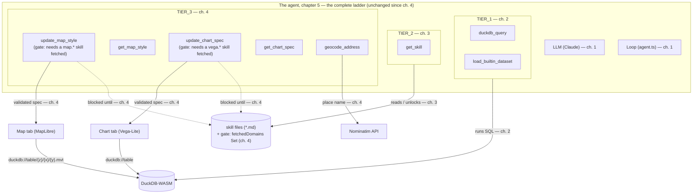
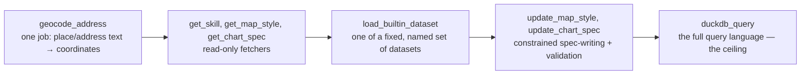

# 05. Curate your stack

> Chapter 4 closed on the softest failure of the whole ladder — not a missing tool, not missing
> knowledge, but the model occasionally reaching for the wrong hand even when every tool, skill,
> and gate was already working exactly as designed. Its own closing line named the diagnosis
> directly: **"which hand" was never a mechanism question to begin with.** Fixing that isn't one
> more `if` statement to add to a validator — it's a question of how you curate, prioritize, and
> evolve the whole tool stack over time. This chapter doesn't add a tier; `ENABLED_TOOLS` stays
> exactly what chapter 4 left it. Instead it hands you the design theory chapters 1–4 spent their
> whole arc building the evidence for, then turns you loose on your own data with a challenge menu.

## ① The agent so far

This is the ladder's last rung. Every tool this workshop ever hands the agent is already on the
board, exactly as [04. Specialized tools](./04-specialized-tools.md) left it — this chapter grows
no new arrow.



- **LLM + Loop** — chapter 1's skeleton: a brain and a round trip, no hands at all.
- **`duckdb_query`, `load_builtin_dataset` (`TIER_1`)** — chapter 2's one general-purpose tool
  (plus the loader it needed to keep the chapter-1 demo working end to end).
- **`get_skill` (`TIER_2`)** — chapter 3's on-demand knowledge, read from `*.md` files instead of
  permanently inlined in the system prompt.
- **`update_map_style`, `get_map_style`, `update_chart_spec`, `get_chart_spec`,
  `geocode_address` (`TIER_3`)**, plus the **prerequisite gate** wrapping the two setters —
  chapter 4's hands for the map and the chart, and the enforcement that makes sure the right
  conventions get read before either one runs.

```ts
export const ENABLED_TOOLS: readonly ToolName[] = [...TIER_1, ...TIER_2, ...TIER_3];
```

That line in `src/lib/ai/toolTiers.ts` is unchanged since chapter 4 — and it is also the value
the app **ships with by default**. This chapter doesn't grow the array; every exercise below runs
on exactly the 8 tools above. The ladder is complete. What's left isn't a missing piece — it's
judgment: which of these 8 tools to reach for, and when a problem of your own is worth a 9th.

**A note on the missing ④.** Every chapter so far closed on "Where this fails" — an organic break
that the next chapter existed to fix. This one doesn't, and that's not an oversight. Chapter 4's
own closing paragraph named the reason: the wrong-tool and wrong-parameter fumbles it ended on
are not a mechanism gap waiting for one more validator rule — they're a design question. ② below
is that design theory; ⑤ is where you go apply it. There is no chapter 6 waiting to fix anything
further.

## ② The new piece — a design theory

### 1. Specialized ↔ general-purpose

Every tool the agent has sits somewhere on one axis, from a narrow job with simple, hard-to-misuse
parameters, to a full query language with no opinion about what you ask of it:



| Tool                                           | Job                                                                | Floor — used correctly out of the box?                                                                                                                          | Ceiling — how much can it ultimately do?                                                                                                 |
| ---------------------------------------------- | ------------------------------------------------------------------ | --------------------------------------------------------------------------------------------------------------------------------------------------------------- | ---------------------------------------------------------------------------------------------------------------------------------------- |
| `geocode_address`                              | place name / address → coordinates                                 | Very low — one free-text string in, a ranked list of matches out. Hard to misuse.                                                                               | Low — it only ever geocodes.                                                                                                             |
| `get_skill`, `get_map_style`, `get_chart_spec` | read-only fetchers (skill text / the current spec)                 | Very low — a skill-id list or a bare table name; nothing to get wrong.                                                                                          | Low by design — they inform the model, they never act on the world.                                                                      |
| `update_map_style`, `update_chart_spec`        | write a constrained declarative spec (paint/layout, mark/encoding) | Medium — gated on a `map.*`/`vega.*` skill being fetched first (ch. 4 ②-3), and even then leaning on validation + auto-repair (ch. 4 ②-2) to catch near-misses. | Medium-high — a wide range of visualizations, bounded by the paint-prefix / mark+encoding schema.                                        |
| `load_builtin_dataset`                         | load one of a fixed, named set of bundled datasets                 | Very low — a closed enum (`z.enum(TABLE_NAMES)`); cannot be misused.                                                                                            | Low, on purpose — "a loader, not a second general-purpose hand" (ch. 2).                                                                 |
| `duckdb_query`                                 | run any single SQL statement                                       | High — a free-text `sql` string; getting it right depends on knowing the right CRS, axis order, and join key, exactly what chapters 2 and 3 showed going wrong. | Highest — the ceiling: anything expressible in SQL + the spatial extension, including the question this workshop never wrote a tool for. |

Floor and ceiling are two different axes, not one continuum. A **low floor** means the model gets
it right the first time, every time, with nothing extra to learn — `geocode_address`,
`load_builtin_dataset`, and the read-only fetchers all sit there. A **high ceiling** means the tool
can answer a question nobody anticipated — `duckdb_query`, the only tool in the registry whose
input space is "anything expressible in SQL," sits alone at that end.

**A good agent needs both.** An agent built only from low-floor, narrow tools can never answer a
question its designer didn't foresee — there is no `geocode_address`-shaped tool for "how many
municipalities are within 30km of this address." An agent built only from `duckdb_query` has to
get the CRS, the axis order, and the join key right from memory on every single query — which is
exactly the failure chapters 2 and 3 spent their whole arc diagnosing and fixing. `update_map_style`
and `update_chart_spec` sit deliberately in the middle for the same reason: constrained enough to
validate and auto-repair (ch. 4 ②-2), general enough to express a paint rule or an encoding nobody
wrote in advance. Curating a stack is choosing, deliberately, how much of each end you need.

### 2. Failure modes → mechanisms

Every failure this workshop hit was real — none of them staged. Here is the whole ladder in one
table: what broke, where you watched it break, and which mechanism closed the gap.

| Failure you experienced                                                                                                                                                                                                                                                 | Chapter it broke in                                                              | What fixed it                                                                                                                                                            | Chapter it arrived   |
| ----------------------------------------------------------------------------------------------------------------------------------------------------------------------------------------------------------------------------------------------------------------------- | -------------------------------------------------------------------------------- | ------------------------------------------------------------------------------------------------------------------------------------------------------------------------ | -------------------- |
| **No hands at all** — the agent could describe the SQL it would run but couldn't touch data.                                                                                                                                                                            | ch. 1 ④                                                                          | **Tools** — `duckdb_query` and `load_builtin_dataset`, hands the model can actually call.                                                                                | ch. 2                |
| **Missing knowledge** — `duckdb_query` ran every statement without complaint, but `ST_Area` on raw WGS84 and a meters/degrees mismatch showed the model didn't reliably know which CRS, which flag, or which units. A capability gap it wasn't; a knowledge gap it was. | ch. 2 ④                                                                          | **Skills, fetched on demand** (progressive disclosure) — `get_skill` and `duckdb.spatial`, instead of permanently fattening the system prompt.                           | ch. 3                |
| **Unreliable conventions** — nothing stopped the model from calling `update_map_style` / `update_chart_spec` with a guessed-at paint property before ever reading `map.styling` / `vega.basics`.                                                                        | named in ch. 4 ②-3                                                               | **The gate** — `requireSkill` refuses to run until a skill of the right domain has been fetched this session, no reliance on the model choosing to comply.               | ch. 4                |
| **Near-miss parameters** — an NFC/case-wobbled column name, a paint prefix that doesn't match the geometry kind, a Vega-Lite spec that doesn't compile.                                                                                                                 | demonstrated live in ch. 4 ④'s "wrong parameter" bullet (mechanism built in ②-2) | **Validation + auto-repair** — `matchColumn` fixes near-misses, the paint-prefix check rejects the rest, `compile()` catches a broken spec before it reaches the UI.     | ch. 4                |
| **Wrong tool choice** — an ambiguous prompt ("visualize the area of…") sometimes got a chart when you pictured a map, or vice versa, even though every tool, skill, and gate was working exactly as designed.                                                           | ch. 4 ④'s "wrong tool" bullet                                                    | **Sharper descriptions and their trigger conditions** — not a mechanism this workshop built for you; the design judgment this chapter is teaching you to apply yourself. | ch. 4 → **you, now** |

Read down the "chapter it broke in" column and the "chapter it arrived" column side by side and a
pattern jumps out: every fix except the last one landed in the very next chapter, as a new
mechanism the app ships with. The last row is different on purpose — there is no chapter 6 to hand
you a "trigger-condition" tool. Writing a better `description`, narrowing what a tool claims to do,
and splitting one overloaded tool into two single-responsibility ones are all the same kind of
fix, and they're yours to make, on your own tools, from here on.

### 3. Evolving your own stack

The 8 tools above didn't arrive from a spec someone wrote in one sitting. Each one exists because a
general-purpose tool kept fumbling on the same shape of question, chapter after chapter — the
table above is one long worked example of exactly that process. The same process is yours to
repeat on your own data:

1. **Start general.** Point `duckdb_query` — plus whatever skills you write (ch. 3) — at your own
   dataset first. It carries almost everything that isn't drawing on the map or the chart, and the
   app already ships with `TIER_3` enabled for those too (see ①).
2. **Log what the agent actually does.** Open the tool cards. Count tool calls per question — the
   same habit the DevTools archaeology (ch. 2) and the audits in ch. 4 ④ trained into you. A single
   wrong call that self-corrects on the very next step (ch. 2's `pref`-typo, ch. 4's near-miss
   column) is the loop working exactly as designed — that is not the signal to act on.
3. **Watch for a repeated shape, not a single mistake.** If every proximity question takes four or
   five `duckdb_query` round trips, and one of them keeps landing on the wrong projection before
   self-correcting, that's not "the model is bad at SQL" — it's the same failure family chapter 2
   named (`ST_Buffer` / `ST_DWithin` in the wrong units) recurring on a task shape common enough in
   your own work to deserve a name.
4. **Decide skill or tool.** If what's missing is a fact or a convention — a projection recipe, a
   color-ramp rule — write a skill (ch. 3: one markdown file, no code change). If what's missing is
   a repeated multi-step operation with its own validated shape and its own single job, carve out a
   tool (ch. 4's `buffer_analysis` is the worked example: the same projection trap chapter 2 never
   even tried, baked once into a validated `execute` instead of re-derived from memory every time).
5. **The rule of thumb: too many tool calls per question is the smell.** Every extra `duckdb_query`
   round trip on the same task shape is one more chance to get the projection, the join key, or the
   units wrong — exactly the trap `buffer_analysis` folded into one validated call in chapter 4. If
   the call count keeps climbing on the same kind of question across fresh chats, that is the tool
   being too hard for the model, not the model being bad at the tool.

This is the loop the entire ladder has been demonstrating, one chapter at a time: build (or borrow)
the general-purpose tool, watch it fail on real data, add exactly the piece — skill or tool — that
the failure calls for. Chapters 1 through 4 did it for geo-chat's own sample datasets. From here,
it's yours to run on your own.

## ③ Run it

There's no new tool to try this chapter — `ENABLED_TOOLS` is already at the value chapter 4 left
it, the app's shipping default. "Running it" this time means pointing that complete stack at
**your own** data instead of the workshop's sample datasets. That's the challenge menu below.

## ⑤ Hands-on — the challenge menu

> By now you've taken apart agent = LLM + tools + loop + context, and you can build tools (ch. 4)
> and skills (ch. 3) yourself. Finally, we apply it to **your own data and work problems.** From
> the menu below, ordered by difficulty, pick whatever interests you. You don't need to do all of
> them. **Seeing one through to the end** teaches you more deeply.

Each challenge is written in 3 points: **Goal / Hints / What you'll learn.** If you get stuck, lean
on [appendix-troubleshooting.md](./appendix-troubleshooting.md) and the body text of each skill md.

---

### (1) Choropleth your own CSV onto the prefectures ★

**Goal**: Load a CSV of your own (some per-prefecture metric), join it to `japan_prefectures`, and make a choropleth
(shaded) map by the metric.

**Hints**:

- From the SQL tab or the chat, "load the CSV at this URL." CSV is `read_csv_auto`.
- The join key is the prefecture name or code. `DESCRIBE` both tables and align the names and types
  (watch out for full-width/half-width and NFC wobble. See the `duckdb.basics` skill).
- Since `japan_prefectures` is a GeoParquet, `geom` is `GEOMETRY` from load (no conversion). If you use your own
  spatial data, first check the type with `DESCRIBE`, and if it's a `BLOB` (WKB) or a WKT string, convert to
  `GEOMETRY` with `ST_GeomFromWKB` / `ST_GeomFromText`.
- `CREATE TABLE` the join result, look at the metric's actual range with `SUMMARIZE`, and use it for the breaks of
  the `interpolate` in `update_map_style`.
- **An even easier extension**: for data you use often, add one line to `src/lib/ai/builtinDatasets.ts` to make it a
  **built-in dataset** — after that, just naming it in the chat has the agent load it itself (the mechanism from
  chapter 00; the ② layer that teaches the model through the system prompt).

**What you'll learn**: The spatial join of an attribute table and geometry, `SUMMARIZE`-driven color design, and the
shortest flow to get your own data into the agent.

---

### (2) A proximity-analysis tool with `ST_Buffer` + `ST_Intersects` ★★

**Goal**: Develop the `buffer_analysis` you built in chapter 4 into a **proximity-analysis tool** that extracts
"features of another table that fall within N meters of a given feature" (a staple of service areas / zones of
influence).

**Hints**:

- Modeling it on the chapter-4 tool, make a buffer with `ST_Buffer` (project → meters → back to 4326) and combine it
  into a single `CREATE TABLE` that does an intersection test against the other table with `ST_Intersects` /
  `ST_DWithin`.
- `ST_DWithin(a, b, distance)` has its distance in the units of the coordinate system. In raw lat/lon it's "degrees,"
  so either project first, or use `ST_Distance_Sphere` (see the `duckdb.spatial` skill).
- In the description (the ② prompt), state clearly "2 input tables, the unit of distance, output is the intersecting
  features."
- **Don't forget to register it** in `src/lib/ai/tools/index.ts`.

**What you'll learn**: Designing a spatial tool that spans multiple tables, handling projection and distance units, and
the design judgment of "combining single-responsibility tools."

---

### (3) Turn a repeated work task into a skill ★★

**Goal**: Turn the analysis / preprocessing / visualization procedure you do every time at work into one skill md.

**Hints**:

- Use the chapter-3 template and place it in `src/lib/ai/skills/` as `<domain>/<name>.md`.
- In the body write "when to use it," "concrete SQL / spec shapes," and "common mistakes and how to fix them" —
  the granularity of the existing `duckdb/spatial.md` and `map/geospatial.md` is a good model.
- Putting Japanese keywords in `tasks` makes it easier to pull from Japanese prompts.
- After adding it, **restart the dev server** and confirm it appears in the `get_skill` catalog.

**What you'll learn**: The ability to articulate tacit knowledge into "conventions the agent can read." This is the most
practical transfer that pays off in your own work from next week.

---

### (4) Fetch PLATEAU 3D city-model attributes via API and turn them into a table ★★★

**Goal**: Fetch attribute data of PLATEAU (Japan's MLIT 3D city models) from its distribution API, load it into a
DuckDB table, and analyze and visualize it.

**Hints**:

- The PLATEAU distribution service (`api.plateauview.mlit.go.jp`) offers REST / GraphQL APIs to fetch the data catalog,
  distribution URLs, and attribute information. For details, see PLATEAU's
  [distribution-service documentation](https://www.mlit.go.jp/plateau/) and the API spec.
- Load the API's response (JSON) into DuckDB with `read_json_auto`, or read the fetched GeoJSON / MVT with `ST_Read`.
- Once you can get per-building attributes (use, number of floors, height, etc.), shade by use with `match` / `step`
  in `update_map_style`. There are many attributes, so grasp the structure carefully with `DESCRIBE`.

**What you'll learn**: Connecting an external GIS API to the agent, turning JSON attributes into SQL, and designing
tools that cope with the "messiness" of real data (type wobble, missing values).

---

### (5) Read Overture Maps Parquet directly in DuckDB ★★★

**Goal**: Query Overture Maps' huge GeoParquet directly from DuckDB without downloading it, and extract and visualize
only your area of interest.

**Hints**:

- With DuckDB's `spatial` / `httpfs`, read a remote Parquet from `read_parquet('s3://...')` or `https://...`.
  Pushing down by bbox to take only the range you need keeps it light.
- In the in-browser DuckDB-WASM, watch the memory ceiling (4GB). Narrow first with `LIMIT` and `WHERE bbox...`.
  Reading a GeoParquet with `spatial` LOADed usually gives `geom` as `GEOMETRY`, but **if the geometry column is still
  a `BLOB` (WKB)**, convert with `ST_GeomFromWKB` (check with `DESCRIBE`).
- `CREATE TABLE` the extraction result and draw it with the usual `update_map_style`.

**What you'll learn**: The strength of DuckDB in handling large cloud GeoParquet "in place," the constraints of
in-browser execution (memory, CORS), and query design that accounts for them.

---

### (6) Free: design "1 tool + 1 skill" for your own data ★★★

**Goal**: Pick one of your own work datasets and design and implement **one tool** and **one skill** for it, making
them usable from the agent.

**Hints**:

- Tool = "the processing the app actually runs"; skill = "the conventions for using that processing correctly."
  Split them along this division of roles (ch. 4 / ch. 3).
- The development-prompt templates are in [appendix-prompts.md](./appendix-prompts.md).
- Keep to "1 tool = 1 responsibility," "write when-to-use into the description," and "register in index.ts."

**What you'll learn**: The transfer goal itself — a state where you can design tools and skills for your own problem
and explain their behavior at the API level.

---

### Closing — put it into your own words

The end is not an explanation but a **question.** Stop your hands and write the next sentence.

> **For your own work data, what is the first tool you'd give the agent?
> Write its `description` in one sentence.**

Once you've written it, try **exchanging** with the participant next to you. Read their one sentence and talk about
whether you can imagine "when that tool should be called," "what its arguments are," and "what it should return."

If you can write the `description`, you can design the tool.
If you can design the tool, you can build the agent.
— That is the proof that you've reached this workshop's transfer goal.

Well done. There is no wall left that you can't get over.

## ⑥ Development prompts

Every development-prompt template this workshop used — the one that built `buffer_analysis` in
chapter 4, the one that drafted a skill md in chapter 3, and the generic "add a tool" / "add a
skill" / "debug the agent" templates — are collected in
[appendix-prompts.md](./appendix-prompts.md). Whichever challenge above you pick, the same 3
principles apply: name the model files, state the constraints explicitly (input schema, single
responsibility, result truncation, where to register), and demand verification (`npm run
typecheck`, "is it registered in `index.ts`," "does the description say when to use it"). Write
your closing-question `description` from ⑤ into the "add a tool" template and hand it to Claude
Code or the like — that one sentence is most of the prompt already.

---

Previous chapter: [04. Specialized tools](./04-specialized-tools.md). Back to
[the course outline and appendices](./README.md).
