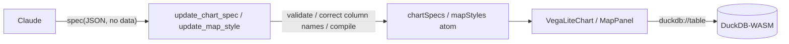

# 05. The declarative-spec boundary

> In chapter 04 we learned "a good tool comes from a good `description`." This chapter goes one level deeper and
> deals with **what a tool should have the LLM write.** The answer: "not imperative code, but a verifiable
> **declarative spec (data)**." This is the central principle of the design that connects AI and GIS.

## ① Concept — why spec-driven is strong for AI

There are 2 ways to have an LLM build "the processing to color a map":

- **(A) Imperative code generation** — ask it to "write JavaScript that colors the map."
  What comes back is code, a set of execution steps.
- **(B) Declarative spec generation** — have it write **configuration data (JSON)** that says "color with this color
  rule," and the app does the drawing.

geo-chat thoroughly takes approach **(B)**. The reason is that a spec is **data, not code.**
The advantage of being data connects directly to "you can turn a generate → verify → repair loop":

| When a spec is data…    | What you can do                                                                   |
| ----------------------- | --------------------------------------------------------------------------------- |
| **validatable**         | reject a "broken spec" before applying it, via schema validation / compilation    |
| **diffable**            | read the current spec and return it with only part changed (don't rebuild it all) |
| **repairable**          | mechanically fix a wrong column name or an invalid expression so it passes        |
| **execution-separated** | "what to draw (spec)" and "how to draw (app)" are separated                       |

Doing this with imperative code is hard. Mechanically judging whether arbitrary JS is "safe / correct" is generally
impossible; you can only run it, and running carries side effects and danger. **A declarative spec draws a boundary
line where "correctness can be inspected without executing"** — this is the decisive difference.

This structure (a spec is data, so it can be validated and repaired) is common to the 3 foundation technologies
touched on in chapter 02. In this chapter we look at it concretely in two of them: maps (MapLibre style) and charts
(Vega-Lite).

## ①-b A mini-explainer — MapLibre style and Vega-Lite

- **MapLibre GL JS** — an OSS map-rendering library (a fork of Mapbox GL JS).
  A map's appearance is written declaratively as a **JSON style spec**. Even the **data-driven expressions**
  ("this color depending on this column's value" — `["interpolate", ...]`, `["match", ...]`, `["get", "col"]`) are
  all expressed as JSON arrays. **The AI fit**: because the style is data, not code, generated expressions can be
  mechanically validated, repaired, and diff-applied.
- **Vega-Lite** — a declarative visualization grammar. Write a chart as a **JSON spec** and the library converts it
  into a drawing. You only write `mark` (bar, line, point…) and `encoding` (which column maps to x/y/color).
  **The AI fit**: likewise, because the spec is data, you can do preflight validation via `compile()` and
  schema matching.

## ② Where to read the code — 2 tools with validation and repair built in

### The chart tool — `src/lib/ai/tools/updateChartSpec.ts`

`update_chart_spec` receives `{ table, spec }` and applies **3 stages of validation before applying it.**

1. **Forbidding injected keys** — `data` / `width` / `height` are **injected by the app at draw time**, so if the
   model wrote them, they are rejected.

    ```ts
    const INJECTED_KEYS = ['data', 'width', 'height'];
    const present = INJECTED_KEYS.filter(k => k in parsed);
    if (present.length > 0) return { error: `Remove [${present.join(', ')}] ...` };
    ```

2. **Column-name matching and auto-correction** — it checks each `field` in `encoding` against an actual column,
   and if the difference is only case or Unicode normalization (NFC), it **fixes it automatically** and records it
   in `corrected` (`eachEncodingField` + `matchColumn`). If the column does not exist, it errors, attaching a list
   of valid column names.

3. **Compile preflight** — it runs `compile()` with dummy data so that a **broken spec fails here, before it reaches
   the UI.** The error is returned to the model as-is.

    ```ts
    compile({ ...parsed, data: { values: [] }, width: 300, height: 200 } as never);
    ```

These 3 stages are exactly the loop "validate → repair → (if it fails) return the error to the model to retry."
The model can read the returned error and fix it itself — **a feat possible because the spec is data.**

### The map tool — `src/lib/ai/tools/updateMapStyle.ts`

`update_map_style` receives `{ table, geometryType, paint, layout? }` and validates like this.

1. **Checking the geometry column exists** — if none, error "can't put it on the map."
2. **Validating the paint prefix** — it rejects paint keys other than the prefix corresponding to `geometryType`.

    ```ts
    const PAINT_PREFIX = { point: 'circle-', line: 'line-', polygon: 'fill-' };
    const badKeys = Object.keys(paint).filter(k => !k.startsWith(prefix));
    if (badKeys.length > 0) return { error: `Paint properties [...] are not valid ...` };
    ```

    (A mistake like specifying `circle-color` for a polygon is rejected, with an explanation, before applying.)

3. **Matching and auto-correcting `["get", column]`** — it collects every `["get", col]` in the expression
   (`collectGetColumns`), checks them against actual columns, and **rewrites** close mistakes before applying
   (`rewriteGetColumns`). `matchColumn` absorbs the **NFC normalization and case wobble** that occurs often with
   Japanese column names. A nonexistent column errors.

`collectGetColumns` / `rewriteGetColumns` / `matchColumn` are in
`src/lib/ai/tools/columnMatch.ts`. The point is that, **on the premise that "the LLM often makes near-misses," the
design builds in room to correct them mechanically.**

### Separating spec from execution — the `duckdb://` scheme (both sides)

"What to draw (spec)" and "the data itself" are separated. The spec **carries no data**; at draw time a URL,
**`duckdb://<table>`**, is injected, and the execution layer reads it out of DuckDB.

- **The chart side** `src/components/chart/VegaLiteChart.tsx` — a custom Vega loader intercepts
  `duckdb://<table>`, runs `SELECT * FROM "<table>"`, and returns the rows.
  At draw time, `src/components/workspace/ChartPanel.tsx` **injects** `data: { url: "duckdb://<table>" }` and
  `width/height: 'container'` (which is why you must not write them in the spec).
- **The map side** `src/lib/map/tileProtocol.ts` — it registers a `duckdb://<table>/{z}/{x}/{y}.mvt` protocol with
  MapLibre and, on every tile request, generates the MVT in DuckDB and returns it (chapter 02's deep dive).

The same `duckdb://` idea is present on both the map and chart sides, giving a unified structure where
**the spec is the "blueprint" and the data is supplied from DuckDB at runtime.**



## ③ Break-it experiment #5 — "write JS" vs "write a spec"

Ask the agent for the same map drawing in **2 ways** and compare their verifiability.

**(A) Ask for imperative code:**

```
japan_cities を人口で塗り分ける JavaScript のコードを書いて
```

(English: "write JavaScript code that shades japan_cities by population.")

→ The model returns plausible-looking JS **as text.** But this app **does not run it** (the map does not change).
Even supposing it could run, there is no way to verify beforehand whether that JS is correct or safe. It can't even
notice if a column name is wrong.

**(B) Ask for a spec (the proper route):**

```
japan_cities を人口で塗り分けて地図に出して
```

(English: "shade japan_cities by population and show it on the map.")

→ The model calls `update_map_style` and passes the `paint` JSON. Before applying, the app validates the paint
prefix and column names, corrects near-misses, and reflects it on the map. **If a column name is wrong, an error is
returned and the model fixes it itself.**

> **The principle you can see**: With imperative code, "you can't know it's correct until you run it."
> A declarative spec "can be validated, repaired, and diffed without running." Tools that have AI do work should be
> designed, as much as possible, on top of the **latter boundary line** — this is the central principle of GIS × LLM design.

## ④ Hands-on exercise — break a spec in the Chart tab

For learning, geo-chat **exposes a spec editor in the Chart tab** (`src/components/workspace/ChartPanel.tsx`).
Break a spec by hand here and feel the validation.

1. Select any table and open the Chart tab. A Vega-Lite spec skeleton appears in the editor on the left
   (only `mark` + `encoding`, not containing `data`/`width`/`height`).
2. Press **Apply** and confirm the chart appears.
3. Rewrite a `field` in `encoding` to a **nonexistent column name** and Apply. Observe what happens.
4. Deliberately make **invalid JSON** (delete a closing brace) and Apply. Confirm that a parse error appears below
   the editor.
5. Add a `data` key (e.g. `"data": {"url": "x"}`) and Apply, or pass the same spec to the agent via the chat, and
   compare with the behavior where **the tool forbids `data`.**

> Hand-editing in the editor is "the app's local validation"; going via the chat is "the tool's (② prompt) validation."
> For the same kind of break, comparing where and with what message it gets rejected gives you a three-dimensional
> view of which layer the validation lives in.

## ⑤ Development prompt example

An example of having the AI review whether your own tool is designed as a "declarative spec" rather than "imperative":

```
Read src/lib/ai/tools/updateMapStyle.ts and updateChartSpec.ts in this repository, and extract the design pattern
common to both: "have the LLM write a declarative spec, and validate / correct column names / compile it before
applying." Then review whether the <tool name> I added follows the same pattern (is there validation, is it not
having imperative code generated).
```

Next is [06. A skill = one md file](./06-skill-system.md). By now we've learned that "there are conventions to the
map and chart specs." We take apart the mechanism that injects those conventions into the model **only when needed** —
the skill system — and write one skill ourselves.
