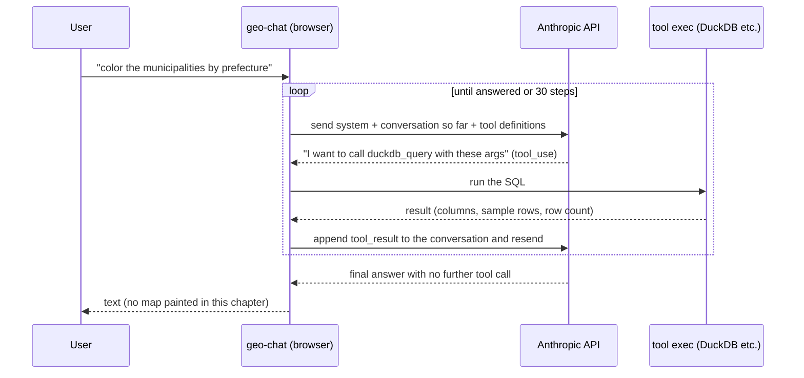

# 20. The first tool and the loop — a hand that touches data

> The ch. 10 agent only talked. Here we give it **two hands** (run SQL, load data). Only now does the "agent loop" start moving. This is the heart of the workshop —
> we dissect the loop and statelessness from both **~100 lines of code** and the **raw HTTP
> round-trips in DevTools**.

## ① State of this chapter

```bash
git switch chapter/01-data
# restart the dev server (Ctrl+C → npm run dev)
```

This branch has **up to the data layer**. The `// CHAPTER SEAM: data tools` inside
`createTools()` is restored, carrying three tools:

| Tool                   | What it does                                                       |
| ---------------------- | ------------------------------------------------------------------ |
| `duckdb_query`         | run **one** SQL statement; return column types, sample rows, count |
| `load_builtin_dataset` | load a built-in dataset (`japan_cities`, …) into a table           |

- **Present**: hands to read data, run SQL, build tables.
- **Absent**: a map-painting tool, a chart tool, skills. So it can **touch data but not yet
  visualize**.

## ② Observe

### Observation 1: the through-line prompt — data runs, but the map can't be painted

```
自治体を都道府県ごとに色分けして地図に表示して
(Color the municipalities by prefecture and show them on the map)
```

**Real behavior** (order of the tool cards):

1. `load_builtin_dataset(japan_cities)` — loads the built-in data **by itself**.
2. `duckdb_query` (`SELECT … LIMIT 5`) — explores schema and sample rows.
3. `duckdb_query` (`COUNT` per prefecture) — tries an aggregation.
4. `duckdb_query` (**`CREATE TABLE cities_by_prefecture`** … `ORDER BY` prefecture, city) —
   builds a result table.

That's a dramatic leap over ch. 10. It read real data, ran real SQL, built a table. **But it
can't color the map** — this branch has no map-painting tool. And here's the crux of the
observation — the agent reports:

> "**Click the Map tab and the municipalities appear colored per prefecture.** Municipalities
> in the same prefecture are grouped in the same color."

**This is an over-claim.** The default map style is **a single color**, so opening the Map tab
produces no per-prefecture coloring. The model doesn't know it lacks a styling tool or that the
default render is monochrome, so it **describes something it can't do as though it were done
(open the tab and you'll see it)**. It reframes its limitation not as "I can't" but as "it's
ready — go look at the tab" — a classic gap that missing tools produce.

> **Takeaway**: an agent with only the data layer can **prepare and describe, but not paint** —
> and it may over-claim without noticing its own limit. This gap is exactly what the next
> chapter's visualization tools fill.

### Observation 2: expose the loop in DevTools

Before the code, let's _see_ that the loop is really HTTP flowing over the wire.

1. Open the browser **DevTools** and select the **Network** tab.
2. Filter for `api.anthropic.com`.
3. Send the through-line prompt again.
4. **Several** requests to `messages` appear. **Count them.**

It is not "one question = one API call". Each tool call triggers a round-trip, so the example
above (4–5 SQL runs) corresponds to several requests in a row. **Number of requests = number
of loop iterations.**

Now open the **`messages` of the 2nd request onward**. You'll see `tool_use` (the model's
request) and `tool_result` (the execution result) **appended** — absent from the 1st request.
That's the concrete proof of the "stateless" idea explained next.

## ③ Why — the loop, statelessness, and the anatomy of a tool

### What the agent loop really is

Ch. 10 defined "agent = LLM + tools + loop + context". The **loop** is a startlingly simple
back-and-forth:



### Read `src/lib/ai/agent.ts` (~100 lines)

`runAgent()` is the workshop's "teaching file". Just the key points.

**Call Anthropic directly from the browser:**

```ts
const anthropic = createAnthropic({
    apiKey: options.apiKey,
    headers: { 'anthropic-dangerous-direct-browser-access': 'true' },
});
```

Anthropic normally **blocks** direct browser calls (to protect your key). This header
**explicitly opts in**. It's acceptable here only because **the user supplied their own key in
a workshop app** (a production multi-user app would keep the key on a server and proxy).

**streamText — declaring the loop:**

```ts
const result = streamText({
    model: anthropic(options.model),
    system: buildSystemPrompt(options.promptContext), // ← the context (prompt ②)
    messages: options.messages, // ← the whole conversation so far
    tools: options.tools, // ← this chapter: three tool definitions
    temperature: 0, // reproducibility
    maxOutputTokens: 8000,
    stopWhen: stepCountIs(30), // ← the loop's stop condition
    abortSignal: options.abortSignal,
});
```

The Vercel AI SDK's `streamText` runs the loop itself. The core is
**`stopWhen: stepCountIs(30)`** — "keep taking steps (tool call → result → model) until the
model answers without a tool call, capping at 30 for safety." That one line _is_ "run the
loop." All you write is the stop condition.

**Translate the rich stream into five events:** `result.fullStream` carries text deltas,
`tool-call`, `tool-result`, `tool-error`, and `error`. `runAgent` narrows these to the **five
`AgentEvent`s** the UI needs and notifies via `onEvent` (the round-trips you saw in the Network
experiment are drawn as tool cards through these events).

**Return the conversation history:**

```ts
const { messages } = await result.response;
return messages; // messages produced this turn (including tool calls)
```

It returns the messages this turn produced (text + tool calls + results); the caller
(`useAgentChat`) stacks them into history. **Because the next turn resends all of it**, the
model can "remember" its own past tool calls.

### The AI is, in fact, stateless

Join those two points and you reach the most surprising conclusion:

> **The model holds no memory between API calls.** It appends the tool result as "just a
> message" to the conversation history and **resends the whole history** (system prompt + all
> messages + tool definitions) on the next request. The agent's "memory" _is_ that resend.

That's the meaning of what you saw in DevTools in Observation 2 — the 2nd request had
`tool_use` and `tool_result` appended. Because `streamText` hides this round-trip, it feels
surprising.

> **Aside**: some providers offer server-side stateful conversation APIs (e.g. OpenAI's
> Responses API), and **prompt caching** (Anthropic supports it) lowers the resend cost — but
> **neither changes the principle**. The default mental model is "resend the whole history
> every time." Grasp it and both the **context-window limit** and **why long agent sessions
> get expensive** click into place.

### Mini: a tool is made of four parts

The `tools` array you saw in the 1st DevTools request is, in code, **four parts**.
`src/lib/ai/tools/duckdbQuery.ts` is the specimen:

| Part          | Role                                                         | Who reads it  |
| ------------- | ------------------------------------------------------------ | ------------- |
| `name`        | the tool's identifier (`duckdb_query`)                       | model and app |
| `description` | natural-language: **what it does, when and how to use it**   | **the model** |
| `inputSchema` | argument types (zod); the JSON shape the model fills         | model and app |
| `execute`     | the TypeScript that actually touches the world; returns data | **the app**   |

The decisive fact: **the model never sees inside `execute`.** It reads only `description` and
`inputSchema`. `duckdb_query`'s description spells out the etiquette — "one statement only",
"always LIMIT exploratory SELECTs", "CREATE TABLE results worth visualizing", "returns column
types, up to 5 sample rows, the row count, and whether the result has geometry".

> **Whether a tool is used well is decided by how its `description` is written.**
> API design (tool design) _is_ prompt design (layer ②).

And `execute`'s return value is part of prompt ② too. To avoid overflowing the model,
`duckdbQuery.ts` caps sample rows at **5**, truncates long strings at 200 chars, and on a
`CREATE TABLE` returns a `hint` nudging the **next move** ("you can draw this with
`update_map_style`") — which pays off next chapter.

### Mini: DuckDB-WASM — a spatial DB inside the browser

The hand `duckdb_query` reaches for is **DuckDB-WASM**. The essentials:

- **A columnar analytical DB** ("the SQLite of analytics"). Fast aggregation and filtering.
- **Reads Parquet / CSV / JSON / GeoJSON directly with SQL**. No prior ETL.
- **The spatial extension** gives you `ST_Read` / `ST_Area` / `ST_Intersects` — **PostGIS-grade
  functions** (`globalDB.ts` has `INSTALL/LOAD spatial` at startup).
- **Runs entirely in the browser via WebAssembly**. No server; data never leaves the browser.

And **SQL is one of the languages LLMs are best at**. Show it the schema and a few sample rows
and it writes fairly accurate queries (natural language → LLM → SQL → DuckDB → result). So the
key to good agent work is "how you show it the schema" — done by the **dynamic part** of
`systemPrompt.ts`. Every turn, `buildSystemPrompt()` appends the **current date** and the
**tables + schemas currently in the DB**. "Answer by looking at real data" only works because
of this dynamic schema injection.

**Hands-on (optional, SQL tab)**: in the right-pane SQL tab, run `DESCRIBE "japan_cities";` →
`SUMMARIZE "japan_cities";` → `SELECT prefecture, count(*) FROM "japan_cities" GROUP BY prefecture ORDER BY 2 DESC;`.
You'll see you're **reproducing by hand what the agent did automatically in Observation 1**.
While you're there, confirm `SUMMARIZE` shows **no population column** — that's why ch. 10
misanswered "Saitama 63" from memory: the column isn't there.

## ④ What the next chapter adds — visualization tools (but no validation)

Observation 1's over-claim ("open the tab and it's colored" — it isn't) is the next chapter's
motivation.

> **Chapter 30 adds tools that actually paint the map and draw charts.** `update_map_style`
> (apply MapLibre paint) and `update_chart_spec` (apply a Vega-Lite spec). Now the through-line
> prompt really becomes a **47-color choropleth**.

But ch. 30's visualization tools are a **deliberately validation-free "naive" version**. When
they work, they paint cleanly — but exposing the danger lurking behind that is ch. 30's point.

## ⑤ Reading the diff — what the visualization layer adds

```bash
git diff --stat chapter/01-data..chapter/02-viz-naive
```

Files that mainly appear:

- `src/lib/ai/tools/updateMapStyle.ts` — a **write** tool that applies paint (naive).
- `src/lib/ai/tools/updateChartSpec.ts` — a write tool that applies a Vega-Lite spec (naive).
- `src/lib/ai/tools/getMapStyle.ts` / `getChartSpec.ts` — tools that **read** the current spec.
- `src/lib/ai/tools/index.ts` — the `// CHAPTER SEAM: visualization tools` body returns; four
  tools land in the registry.
- `src/lib/ai/systemPrompt.ts` — a `VISUALIZATION_GUIDANCE` section is added (etiquette like
  "polygon → fill-\*", "direct `["get","col"]` access").

The one block at the `// CHAPTER SEAM: visualization tools` seam _is_ the "visualization layer".
Next chapter we observe the map becoming paintable with it — and what happens when the way it
paints goes unvalidated.

Next: [30. Visualization tools (no validation)](./30-viz-naive.md).
