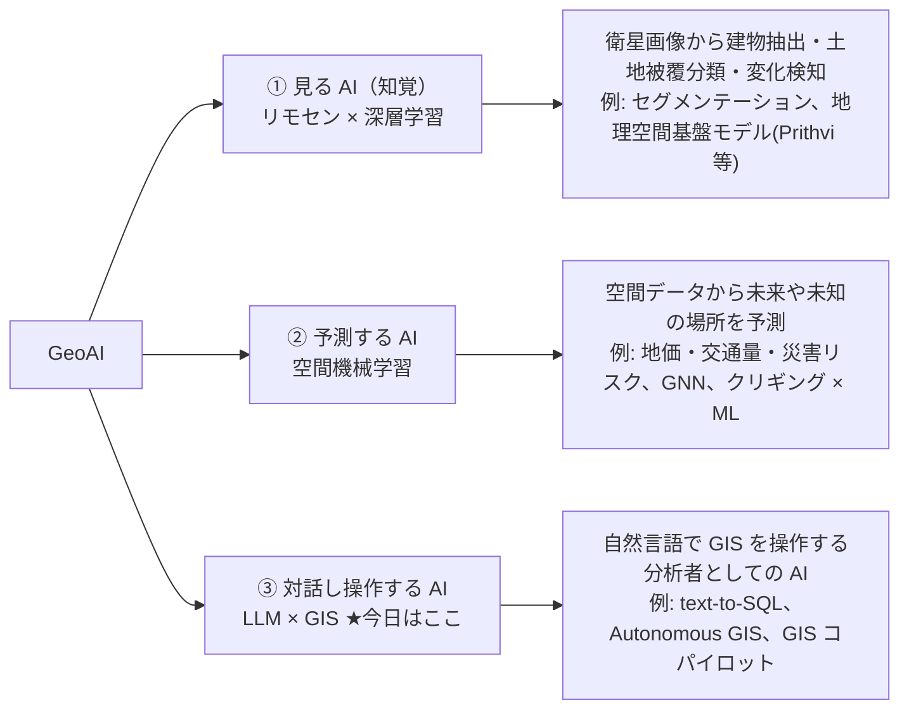

# 00. セットアップ

ワークショップを始める前に、geo-chat をローカルで起動し、Anthropic API キーを入れて、
サンプルデータで最初のデモが動くところまで確認します。さらに、このワークショップ特有の
**「章ブランチを切り替えながら観察する」進め方** を練習しておきます。

所要時間は 10〜15 分。うまくいかないときは
[appendix-troubleshooting.md](./appendix-troubleshooting.md) を参照してください。

## 1. 必要なもの

- **Node.js 20 以上**（`node -v` で確認。20 未満なら [nodejs.org](https://nodejs.org) か
  `nvm` / `volta` などで更新）
- **モダンブラウザ**: Chrome / Edge / Firefox の最新版。
  geo-chat は **WebAssembly と Web Worker** を使うため、
  古いブラウザや一部の埋め込み環境では動きません（DuckDB-WASM の詳細は 20 章で触れます）。
- **Git**: 特に `git switch`（ブランチ切り替え）と `git diff`（差分表示）を使います。
- **Anthropic API キー**（ステップ 3 で取得）

## 2. クローンして起動

```bash
git clone <このリポジトリの URL>
cd geo-chat
npm install       # 依存関係のインストール（DuckDB-WASM や maplibre-gl は大きめ）
npm run dev       # 開発サーバ起動（vite）
```

`npm run dev` を実行すると、ローカル URL（既定は `http://localhost:5173/geo-chat/`）が
表示されます。ブラウザで開くと、左にチャットパネル、右に **Table / Chart / Map / SQL** の
4 タブが並ぶ画面が出ます。

> **メモ**: URL のパスに `/geo-chat/` が付くのは、GitHub Pages 配信用に
> `vite.config.ts` で `base: '/geo-chat/'` を設定しているためです。
> サンプルデータの URL にもこの接頭辞が付きます（後述）。

初回はブラウザ内で DuckDB-WASM が初期化されます。SQL タブに
「Initializing DuckDB…」と出たら、数秒待つと `SELECT 1 AS hello;` が実行できるようになります。

## 3. Anthropic API キーを取得する

チャット（AI エージェント）を動かすには、自分の Anthropic API キーが必要です。
geo-chat はバックエンドを持たず、**ブラウザから直接 Anthropic API を呼びます**
（この仕組み自体を 20 章で分解します）。

1. [console.anthropic.com](https://console.anthropic.com) でアカウントを作成 / ログイン。
2. **Billing** で少額の **プリペイドクレジット**（例: 5 ドル）をチャージします。
   ワークショップ 1 回分なら 1〜2 ドルもあれば十分です。
   クレジット残高が 0 だと、正しいキーでも `400 / credit balance` エラーになります。
3. **API Keys** で新しいキーを発行し、`sk-ant-…` で始まる文字列をコピーします。
   キーは発行時にしか全体表示されないので、その場でコピーしてください。

> **当日運用**: 主催者がキーを配布する回もあります。その場合は配布されたキーを使ってください。

## 4. キーを Settings に入力する

1. 画面右上（またはチャット未設定時の中央）の **Settings** を開きます。
2. **Anthropic API key** に `sk-ant-…` を貼り付けます。
3. **Model** は既定の **Claude Sonnet 4.5** のままで構いません
   （`src/store/settings.ts` の `MODEL_OPTIONS` で定義）。

> **⚠️ localStorage の注意**: 入力したキーは、このブラウザの **localStorage に平文（暗号化なし）** で
> 保存され、そのままブラウザから Anthropic API に送られます。バックエンドを持たない
> ワークショップ用アプリだからこその割り切りです。**個人のキーを使い、ワークショップ後は
> 削除してください**（Settings で消すか、ブラウザの localStorage をクリア）。
> ——なお **localStorage はブランチを切り替えても消えません**。一度入れたキーは、
> `git switch` で章を移動しても入れ直し不要です（この点は後述のブランチ運用で効いてきます）。

## 5. 完成形デモで動作確認（`main` ブランチ）

まずは全部入りの完成形を体験します。**`main` ブランチにいることを確認** してください
（`git branch` で `* main`）。チャットが空のとき、入力欄の上に **サンプルのプロンプトチップ** が
表示されます（`src/components/chat/ChatPanel.tsx` の `EXAMPLE_PROMPTS`）。まずこれで確認します。

```
日本の自治体を地図に表示して
```

このチップを押すと入力欄に文が入るので、送信します。うまくいくと:

1. チャットに `load_builtin_dataset` や `duckdb_query` などの **ツールカード** が順に現れます
   （クリックで入力/出力を展開できる）。エージェントは組み込みデータセット `japan_cities` を
   **自分で読み込みます**——URL を手で入力する必要はありません。
2. Map タブが自動で開き、日本の市区町村が地図に描かれます。

これが今日ゴールとして目指す「解けている状態」です。本編ではここから **わざと全機能を剥がして**、
1 層ずつ足し直します。続く章の through-line プロンプトはこちらです:

```
自治体を都道府県ごとに色分けして地図に表示して
```

## 6. このワークショップの進め方 — 章ブランチを切り替える

このワークショップの主役は「観察」です。`main` から機能を 1 層ずつ引き算したブランチが
用意されているので、それを切り替えながら **同じ課題の解け具合が変わる** のを見ます。

```bash
git switch chapter/00-chat-only   # 10 章: ツールが 1 つも無い状態
git switch chapter/01-data        # 20 章: データツールだけ
git switch chapter/02-viz-naive   # 30 章: ＋可視化（検証なし）
git switch chapter/03-validation  # 40 章: ＋検証層
git switch chapter/04-skills      # 50 章: ＋スキル＋ゲート
git switch main                   # 60 章: ＋ evals（全部入り）
```

**ブランチを切り替えたら、開発サーバをやり直します。**
`npm run dev` は起動中でも自動で新しいコードを読み直しますが、章によっては
モジュール構成が変わるので、確実を期すなら `Ctrl+C` → `npm run dev` で **再起動** してください
（特に 50 章のスキルは **ビルド時に一括読み込み** されるため再起動が要ります）。

> **キーは消えません**: ブランチを切り替えても localStorage の API キーは残るので、
> 章を移動するたびに入れ直す必要はありません（ステップ 4 の注意を参照）。

### 差分を「層」として読む

各章の主眼は、**次の層が何を足すのか** を `git diff` で確かめることです。まずファイル単位で:

```bash
# 例: データ層から可視化層に移ると、何のファイルが増えるか
git diff --stat chapter/01-data..chapter/02-viz-naive
```

ブランチは **`main` からの引き算** で作られているので、
`git diff chapter/A..chapter/B`（A が前・B が次）は **B が A に足す差分＝その層** を
きれいに見せてくれます。GitHub 上でも `compare/chapter/A...chapter/B` の URL で同じ差分を
色付きで読めます。コード中の **`// CHAPTER SEAM: <層名>`** コメントが、
ちょうど層の切れ目（＝ブランチが丸ごと落とす部分）を示しています。各章の
「⑤ diff の読みどころ」で、この読み方を練習します。

## 7. GeoAI の中での「今日の位置」

本編に入る前に、期待値を合わせます。「GeoAI」は多義的な言葉なので、全体地図の中で
今日の話がどこにいるのかを確認します。



- **①②** は AI が「目」や「予測器」になる話です——モデル自身が空間データを食べて **学習** します。
- **③** は AI が「分析者」になる話です——**学習は一切せず**、既存の LLM に既存の GIS の道具
  （SQL・地図・グラフ）を持たせます。

> **だから今日はモデルを 1 個も訓練しません。「道具の持たせ方」を学びます。**

さらに③の中でも、既製のコパイロットを「使う」のではなく、自分のアプリに
**「組み込む」側に回る** のが今日の特徴です。「AI を自分の GIS 業務と繋げたい」という
モヤモヤに、ここで正面から接続します。

## 8. うまくいかないとき

- **チャットが「Set your API key in Settings…」のまま** → Settings でキー未入力。
- **`401` / `unauthorized`** → キーが誤り。Settings を再確認。
- **`credit balance is too low`** → コンソールでクレジットをチャージ（ステップ 3-2）。
- **地図に何も出ない / URL 読み込みが CORS で失敗** → CORS の説明を含め
  [appendix-troubleshooting.md](./appendix-troubleshooting.md) を参照。
- **ブランチを切り替えたのに挙動が変わらない** → 開発サーバを再起動（ステップ 6）。
- **DuckDB が初期化されない / 真っ白** → 対応ブラウザ（Chrome / Edge / Firefox の最新版）か確認。

準備ができたら [10. 口だけの AI](./10-chat-only.md) へ進みます。まずは全機能を剥がした
`chapter/00-chat-only` に切り替えるところからです。
