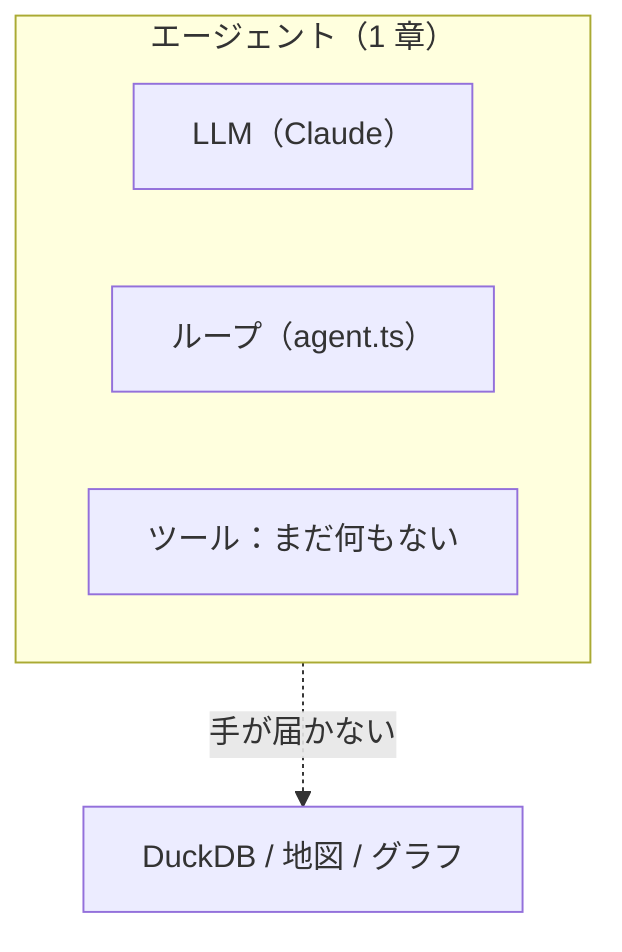
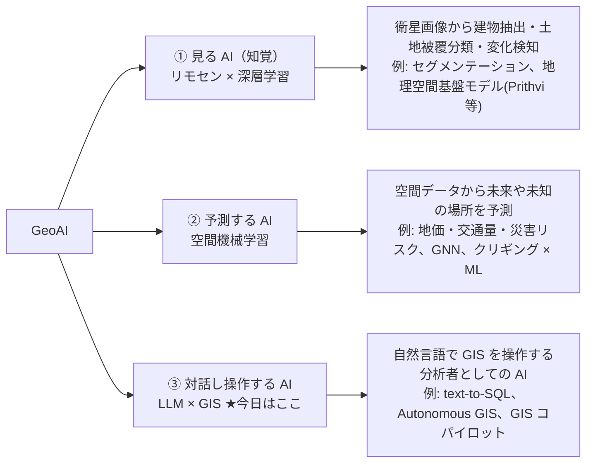
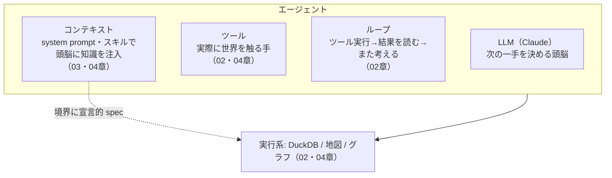

# 01. 裸のモデル

> このワークショップの最初の 30 分。まず完成形の「魔法」を見せてから、エージェントを丸裸の
> 最小構成——ループの中の LLM だけで、ツールは一切なし——まで巻き戻し、正直に失敗する様子を
> 見届けます。その失敗から、「AI エージェント」の骨組みを取り出します。

## ① これまでのエージェント

これがラダーの最下段です：ループの中に LLM があるだけで、他には何もありません。`Tools` の箱が
わざと空になっています。この図はシリーズ全体のテンプレートで、以降の章はすべてこの図にノードを
1 つずつ足していきます。



点線の矢印がこの章のすべてです：エージェントは DuckDB にも地図にもグラフにも手が届きません
——Claude が非力だからではなく、まだ手（ツール）を持たされていないだけです。

## ② 新しいピース

### まず、魔法を見る

geo-chat のチャット欄に、こう打ってみてください（データ未読込でも OK。組み込みデータを
エージェントが自分で読み込みます）:

```
自治体を都道府県ごとに色分けして地図に表示して
```

すると SQL が流れ、テーブルが作られ、地図が塗り分けられます。**これが 3 時間目のプレビューです
——あなたがこれから再び組み上げていく、全段階そろった完成形のアプリです。ここからいったん、
ゼロまで巻き戻します。** その前に、一つ問いを立てます。

> **ChatGPT に同じことを頼んでも、地図は出ません。このアプリは同じ Claude を使っていて、
> 追加学習もファインチューニングもしていない。——じゃあ、何が違うのでしょう？**

「答えたいのに、今の知識では答えられない」——この宙づりの状態が、これから 3 時間の燃料です。
答えを先に言ってしまうと、違いは **モデルではなく、モデルの周りにある「道具」と「ループ」** です。
本章はその骨組みを取り出すところまでを扱います——最後には、アプリをツールがゼロの状態まで
巻き戻し、それが失敗するところを見届けます。

### GeoAI の地図の中での「今日の位置」

「GeoAI」は多義的な言葉です。まず期待値を合わせるために、全体地図の中で今日の話が
どこにいるのかを確認します。



- **①②** は AI が「目」や「予測器」になる話です——モデル自身が空間データを食べて **学習** します。
- **③** は AI が「分析者」になる話です——**学習は一切せず**、既存の LLM に既存の GIS の道具
  （SQL・地図・グラフ）を持たせます。

> **だから今日はモデルを 1 個も訓練しません。「道具の持たせ方」を学びます。**

さらに③の中でも、既製のコパイロットを「使う」のではなく、自分のアプリに
**「組み込む」側に回る** のが今日の特徴です。「AI を自分の GIS 業務と繋げたい」という
モヤモヤに、ここで正面から接続します。

### エージェント = LLM + ツール + ループ + コンテキスト

「AI エージェント」を、魔法を排した最小の骨組みで定義するとこうなります。
このコンセプトマップは、章が進むごとに中身が埋まっていく「進捗バー」です。



- **LLM** 単体は「次に何をすべきか」を提案できますが、**実際には何もできません**
  （SQL を実行できない、地図を塗れない）。これを次のセクションで実験で確かめます。
- **ツール** が「手」です。LLM が「このツールをこの引数で呼びたい」と言うと、
  アプリ側が実行して結果を返します。
- **ループ** が、ツール結果を見て次の一手を決める往復を、答えが出るまで繰り返します。
- **コンテキスト** が、頭脳に「今どんなテーブルがあるか」「地図の塗り方の作法」といった
  知識を、必要なときに注入します。

### ツール呼び出しは「トークン予測」の延長にすぎない

「ツール」と聞くと、LLM の外側に付いた特別な機能のように感じるかもしれません。でも実は、
ツール呼び出しも **LLM のたった一つの動作原理の上に乗っているだけ** です。

LLM がやっていることは、突き詰めれば **トークン列を入力し、次のトークンを予測して出力する**、
これだけです。チャットも、コード生成も、そして **ツール呼び出しも、全部この同じ仕組みの上** に
あります。

初期の Function Calling は、文字どおりそれでした。LLM に特定形式のマークアップ——たとえば

```text
<tool_name>duckdb_query</tool_name>
<param name="sql">SELECT ...</param>
```

——のようなトークン列を出力させ、**アプリ側がそれを機械的にパースして** 関数を呼び、
結果を次の入力に足し戻していました。ツール呼び出しの正体は「学習した出力形式」だったのです。

今は Anthropic Messages API の `tools` / `tool_use` ブロックが標準機能としてこれを提供するので、
自前パースは要りません。ただし内部的には、モデルは相変わらず **特別な形式のトークン列を出力し、
API 側がそれを構造化ブロックに変換している** と考えられます。仕組みが消えたのではなく、
**API の下に隠れただけ** です。

その証拠は 2 つ観察できます。

- **この教材の中で**: 後述の③ **動かしてみる**（下記）でツールを全部外すと、エージェントが
  ツール呼び出しっぽい XML 構文を **「地の文」としてそのまま出力する** ことがあります
  （実機で観察済みの挙動）。ツール呼び出しの正体が「学習した出力形式」だと露出する瞬間です。
- **実世界で**: 2026 年に報告された Opus 4.8 の「court 問題」。長いセッションで、
  ツール呼び出しが構造化された `tool_use` ブロックとして出力されず、**壊れた生の XML テキストと
  「court」という迷いトークンがチャットに漏れて実行されない**、というモデル側の不具合です[^court]。
  普段は API の下に隠れている「ツール呼び出し＝トークン列」が、表に出てしまった事例です。

この見方が身につくと、いろいろな議論が整理できます。「MCP か CLI か」といった道具論争も、**モデルから見れば
最終的に全部ただのツール**（＝モデルが出力できる語彙と、その実行係）にすぎません。MCP は
ツールを配布・接続するための **規格**、CLI 連携はツールの **一形態** です。「結局ぜんぶツール」——
これを知っているだけで、エージェントをめぐる議論がグッとシンプルになります。

[^court]: 参考: <https://github.com/anthropics/claude-code/issues/69237> ／ <https://github.com/anthropics/claude-code/issues/65248>

### 「プロンプト」の 3 層（再掲）

このワークショップの「プロンプト」は 3 層です。今この瞬間、あなたがチャット欄に打ったのは
**①利用プロンプト** です。本命は **②エージェント内プロンプト**（system prompt・ツールの
description・スキル md）で、それをこの先の章で読み・書きます。

| 層                         | 何に入れる文字列か                              | 例                                       | 扱う章                                  |
| -------------------------- | ----------------------------------------------- | ---------------------------------------- | --------------------------------------- |
| ① 利用プロンプト           | geo-chat の **チャット欄**                      | 「自治体を都道府県ごとに色分けして」     | 本章で体験                              |
| ② エージェント内プロンプト | system prompt / ツール description / スキル md  | 「このツールは SQL を 1 文だけ実行する」 | **本命。** 02〜03 で読み、03〜04 で書く |
| ③ 開発プロンプト           | Claude Code 等 **コーディング AI** への実装指示 | 「◯◯ツールを追加して」                   | 04 以降（付録に収録）                   |

### コードの読みどころ

エージェントの心臓は、たった約 100 行の `src/lib/ai/agent.ts` です（精読は 02 章）。
今は「どこに何があるか」だけ掴んでください。

- `src/lib/ai/agent.ts` — `runAgent()`。LLM を呼び、ツール呼び出しと結果の往復を回す **ループ本体**。
- `src/lib/ai/tools/index.ts` — `createTools()`。エージェントに渡す **8 つのツール** を組み立てる。
- `src/lib/ai/systemPrompt.ts` — **コンテキストの静的部分**（役割・環境・作法）と、
  毎ターン差し込まれる動的部分（現在日付・今あるテーブルのスキーマ）。
  **組み込みデータセット**（`japan_cities` 等。実体は `src/lib/ai/builtinDatasets.ts`）の
  存在も、ここ経由でモデルに伝わります——だから「日本の自治体を…」の一言で、エージェントが
  自分でそのデータを読み込めるのです。これは **②の層が知識を運ぶ** 具体例で、今日の魔法の一部です。
- `src/lib/ai/useAgentChat.ts` — React 側。チャット状態を持ち、`runAgent` を呼び、
  ツールとコンテキストを渡す **配線**。

`useAgentChat.ts` の `sendMessage` の中で、これらが 1 か所に集まっています:

```ts
const newMessages = await runAgent({
    apiKey,
    model,
    messages: history.current,
    tools: createTools(defaultToolContext()), // ← ここでツール(手)を渡している
    promptContext, // ← ここでコンテキストを渡している
    onEvent,
    abortSignal: abort.signal,
});
```

「LLM + ツール + ループ + コンテキスト」が、この 1 呼び出しに全部そろっています。

最後の行、`createTools(defaultToolContext())` は自前のツールリストを持っているわけではなく、
**5 つ目のファイル** に委ねています。そしてそのファイルこそ、この章であなたが実際に編集する
ファイルです：

- `src/lib/ai/toolTiers.ts` — **このワークショップのスロットル。** `ENABLED_TOOLS` という
  1 つの配列が、`tools/index.ts` で宣言されている 8 個のツールのうち、エージェントが実際に
  受け取るものを決めます。このワークショップの残り全ての章は、この 1 行を編集することで
  段階を進めます。

```ts
export const TIER_1 = ['duckdb_query', 'load_builtin_dataset'] as const;
export const TIER_2 = ['get_skill'] as const;
export const TIER_3 = [
    'update_map_style',
    'get_map_style',
    'update_chart_spec',
    'get_chart_spec',
    'geocode_address',
] as const;

export type ToolName = (typeof TIER_1)[number] | (typeof TIER_2)[number] | (typeof TIER_3)[number];

// Workshop participants edit this line — one tier per chapter.
export const ENABLED_TOOLS: readonly ToolName[] = [...TIER_1, ...TIER_2, ...TIER_3];
```

`tools/index.ts` の `createTools(ctx, enabled = ENABLED_TOOLS)` はレジストリを `enabled` に
絞り込み、`systemPrompt.ts` の `buildSystemPrompt(context, enabled = ENABLED_TOOLS)` も同じ
リストを読みます——だからエージェントの手と、エージェント自身がその手をどう説明するかが、
食い違うことは決してありません。今、1 章では、この配列を `[]` にしようとしています。

## ③ 動かしてみる

`src/lib/ai/toolTiers.ts` を開き、このワークショップの各章が編集する、まさにその 1 行を
書き換えます:

```ts
// 変更前（アプリの通常のデフォルト——すべての階層が有効）
export const ENABLED_TOOLS: readonly ToolName[] = [...TIER_1, ...TIER_2, ...TIER_3];

// 変更後（1 章：エージェントに何も渡さない）
export const ENABLED_TOOLS: readonly ToolName[] = [];
```

保存すると Vite が自動リロードします。本章の冒頭と同じプロンプトを打ってください:

```
自治体を都道府県ごとに色分けして地図に表示して
```

**観察**: エージェントは「まず DuckDB でこういう SQL を実行して…」と **手順を説明できます**。
しかし **実際には SQL を実行できず、地図も塗れません**。テーブルは増えず、Map タブは変わりません。
チャットにツールカード（`duckdb_query` など）が 1 つも出ないことも確認してください。時には——
これが②で見た「トークン予測」の証拠が目に見える形で現れる瞬間です——きれいなツール呼び出しの
代わりに、ツール呼び出しっぽい生の XML が地の文に漏れ出すことがあります。

## ④ ここで壊れる

この章の失敗は、わざわざ探しに行ったバグではありません——これこそが **この章そのもの** です。
`ENABLED_TOOLS` が空の状態では、エージェントには頭脳とループがあるだけで、行動する手段が
何もありません。

> **見える原理**: ツールを持たないモデルは「賢い提案者」に過ぎず、**エージェントではありません**。
> 世界に働きかける能力は、まるごとモデルの外側から手渡される **ツール** の中にあります——
> 同じ Claude を動かしていても、ChatGPT との違いはまさにここにありました。

2 章では、エージェントにちょうど 1 つのツールを手渡します——そして、良い汎用ツールが 1 つ
あれば驚くほど遠くまで行けることがわかります。

## ⑤ 手を動かす課題

1. `ENABLED_TOOLS` を `[]` のままにして「東京都の市区町村数を数えて」と頼み、返答を読む。
   モデルは何を **できて**、何が **できない** かを、自分の言葉で 1 文にまとめてください。
2. 一時的に第 1 階層だけ戻します——`export const ENABLED_TOOLS: readonly ToolName[] = [...TIER_1];`
   ——同じ質問をし、チャットに現れるツールカードを 1 つ開いて、`input`（LLM が決めた引数）と
   `output`（実行結果）を見てください。「LLM が決めた」部分と「アプリが実行した」部分の境目を
   指させるか確認します。終わったら `ENABLED_TOOLS` を `[]` に戻してください——2 章で改めて
   `[...TIER_1]` に戻すことになります、今度は本当に。
3. ②のコンセプトマップを紙に描き、今わかっている「ツール」の枠だけ自分の言葉で埋めてください。
   このマップは章が進むごとに埋めていきます。

## ⑥ 開発プロンプト例

本章ではまだ実装はしません。次章以降で、②のプロンプト（system prompt・description・
スキル md）を **自分で書き**、③の開発プロンプトで **新しいツールを AI に実装させて**
いきます。開発プロンプトのテンプレートは
[appendix-prompts.md](./appendix-prompts.md) に集約しています。

次は [02. 汎用ツール1つ](./02-general-purpose-tool.md) で、上の裸のモデルにちょうど 1 組の
手を持たせ、それだけでどこまで行けるかを見ます。
