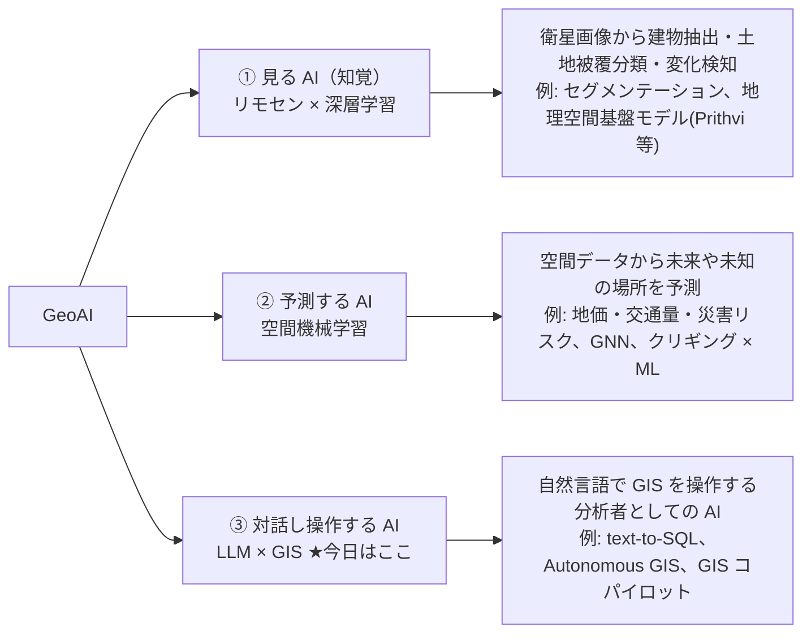
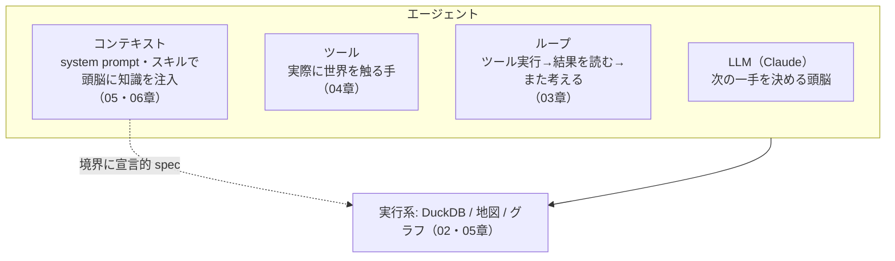

# 01. AI エージェントとは何か

> このワークショップの最初の 30 分。まず「魔法」を見て、次にそれをわざと壊して、
> 「AI エージェント」の骨組みを取り出します。

## ① 概念解説

### まず、魔法を見る

geo-chat のチャット欄に、こう打ってみてください（サンプルデータ読み込み後）:

```
人口 10 万人以上の市を地図で塗り分けて
```

すると SQL が流れ、テーブルが作られ、地図が塗り分けられます。ここで一つ問いを立てます。

> **ChatGPT に同じことを頼んでも、地図は出ません。このアプリは同じ Claude を使っていて、
> 追加学習もファインチューニングもしていない。——じゃあ、何が違うのでしょう？**

「答えたいのに、今の知識では答えられない」——この宙づりの状態が、これから 4 時間の燃料です。
答えを先に言ってしまうと、違いは **モデルではなく、モデルの周りにある「道具」と「ループ」** です。
本章はその骨組みを取り出すところまでを扱います。

### GeoAI の地図の中での「今日の位置」

「GeoAI」は多義的な言葉です。まず期待値を合わせるために、全体地図の中で今日の話が
どこにいるのかを確認します。



- **①②** は AI が「目」や「予測器」になる話です——モデル自身が空間データを食べて **学習** します。
- **③** は AI が「分析者」になる話です——**学習は一切せず**、既存の LLM に既存の GIS の道具
  （SQL・地図・グラフ）を持たせます。

> **だから今日はモデルを 1 個も訓練しません。「道具の持たせ方」を学びます。**

さらに③の中でも、既製のコパイロットを「使う」のではなく、自分のアプリに
**「組み込む」側に回る** のが今日の特徴です。「AI を自分の GIS 業務と繋げたい」という
モヤモヤに、ここで正面から接続します。

### エージェント = LLM + ツール + ループ + コンテキスト

「AI エージェント」を、魔法を排した最小の骨組みで定義するとこうなります。
このコンセプトマップは、章が進むごとに中身が埋まっていく「進捗バー」です。



- **LLM** 単体は「次に何をすべきか」を提案できますが、**実際には何もできません**
  （SQL を実行できない、地図を塗れない）。これを次のセクションで実験で確かめます。
- **ツール** が「手」です。LLM が「このツールをこの引数で呼びたい」と言うと、
  アプリ側が実行して結果を返します。
- **ループ** が、ツール結果を見て次の一手を決める往復を、答えが出るまで繰り返します。
- **コンテキスト** が、頭脳に「今どんなテーブルがあるか」「地図の塗り方の作法」といった
  知識を、必要なときに注入します。

### 「プロンプト」の 3 層（再掲）

このワークショップの「プロンプト」は 3 層です。今この瞬間、あなたがチャット欄に打ったのは
**①利用プロンプト** です。本命は **②エージェント内プロンプト**（system prompt・ツールの
description・スキル md）で、それを 03〜06 章で読み・書きます。

| 層                         | 何に入れる文字列か                              | 例                                       | 扱う章                              |
| -------------------------- | ----------------------------------------------- | ---------------------------------------- | ----------------------------------- |
| ① 利用プロンプト           | geo-chat の **チャット欄**                      | 「人口 10 万人以上の市を塗り分けて」     | 本章で体験                          |
| ② エージェント内プロンプト | system prompt / ツール description / スキル md  | 「このツールは SQL を 1 文だけ実行する」 | **本命。** 03 で読み、04・06 で書く |
| ③ 開発プロンプト           | Claude Code 等 **コーディング AI** への実装指示 | 「◯◯ツールを追加して」                   | 04 以降（付録に収録）               |

## ② コードの読みどころ

エージェントの心臓は、たった約 100 行の `src/lib/ai/agent.ts` です（精読は 03 章）。
今は「どこに何があるか」だけ掴んでください。

- `src/lib/ai/agent.ts` — `runAgent()`。LLM を呼び、ツール呼び出しと結果の往復を回す **ループ本体**。
- `src/lib/ai/tools/index.ts` — `createTools()`。エージェントに渡す **7 つのツール** を組み立てる。
- `src/lib/ai/systemPrompt.ts` — **コンテキストの静的部分**（役割・環境・作法）と、
  毎ターン差し込まれる動的部分（現在日付・今あるテーブルのスキーマ）。
- `src/lib/ai/useAgentChat.ts` — React 側。チャット状態を持ち、`runAgent` を呼び、
  ツールとコンテキストを渡す **配線**。

`useAgentChat.ts` の `sendMessage` の中で、これらが 1 か所に集まっています:

```ts
const newMessages = await runAgent({
    apiKey,
    model,
    messages: history.current,
    tools: createTools(defaultToolContext()), // ← ここでツール(手)を渡している
    promptContext, // ← ここでコンテキストを渡している
    onEvent,
    abortSignal: abort.signal,
});
```

「LLM + ツール + ループ + コンテキスト」が、この 1 呼び出しに全部そろっています。

## ③ 壊す実験 #1 — ツールを全部外す

**仮説を体で確かめます: 「ツールを外したら、LLM は口だけになる」**。

`src/lib/ai/useAgentChat.ts` の `sendMessage` の中、`runAgent(...)` に渡している
`tools:` の行を、次のように **空オブジェクト** に書き換えます。

```ts
// 変更前
tools: createTools(defaultToolContext()),

// 変更後（ツールを一切渡さない）
tools: {},
```

保存すると Vite が自動リロードします。同じ質問をもう一度打ってください:

```
人口 10 万人以上の市を地図で塗り分けて
```

**観察**: エージェントは「まず DuckDB でこういう SQL を実行して…」と **手順を説明できます**。
しかし **実際には SQL を実行できず、地図も塗れません**。テーブルは増えず、Map タブは変わりません。
チャットにツールカード（`duckdb_query` など）が 1 つも出ないことも確認してください。

> **見える原理**: LLM 単体は「賢い提案者」に過ぎません。世界に働きかける能力（＝正体）は、
> モデルの外側の **ツール** にあります。ChatGPT との違いはここでした——同じ Claude でも、
> 手（ツール）を持たせているかどうか。

確認できたら、必ず元に戻します:

```ts
tools: createTools(defaultToolContext()),
```

## ④ 手を動かす課題

1. ツールを空にしたまま、「東京都の市区町村を数えて」と頼み、返答を読む。
   モデルは何を **できて**、何が **できない** かを、自分の言葉で 1 文にまとめる。
2. ツールを戻して同じ質問をし、チャットに現れるツールカードを 1 つ開いて、
   `input`（LLM が決めた引数）と `output`（実行結果）を見る。
   「LLM が決めた」部分と「アプリが実行した」部分の境目を指させるか確認する。
3. 上のコンセプトマップを紙に描き、今わかっている「ツール」の枠だけ自分の言葉で埋める。
   このマップは章が進むごとに埋めていきます。

## ⑤ 開発プロンプト例

本章ではまだ実装はしません。次章以降で、②のプロンプト（system prompt・description・
スキル md）を **自分で書き**、③の開発プロンプトで **新しいツールを AI に実装させて**
いきます。開発プロンプトのテンプレートは
[appendix-prompts.md](./appendix-prompts.md) に集約しています。

次は [02. ブラウザの中の GIS 基盤](./02-duckdb-wasm.md) で、エージェントが手に持つ
いちばん重要な道具——ブラウザ内で動く空間データベース DuckDB-WASM——を素手で触ります。
