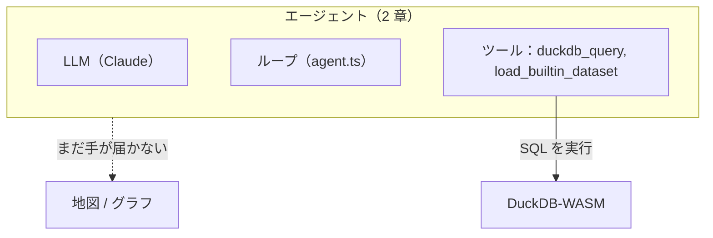
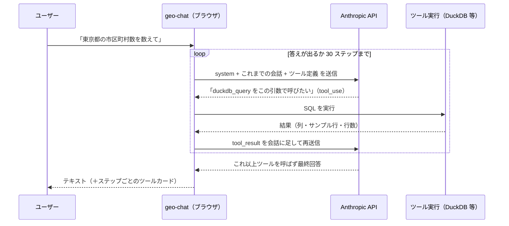

# 02. 汎用ツール1つ

> 1 章は、SQL を語れても実行できないエージェントで終わりました。ここで 1 つのツール——`duckdb_query`——を手渡し、生まれる「魔法」を HTTP リクエストのレベルまで分解します。まず SQL タブで自分の素手で触り、次にエージェントのコードを読み、最後に DevTools で同じ SQL をエージェント自身に走らせて確かめます。

## ① これまでのエージェント

1 章の図は、空の `Tools` 箱からすべてに点線が伸びているだけでした。本章は、その一角を実線で埋めます。



`src/lib/ai/toolTiers.ts` の `ENABLED_TOOLS` が `[]` から `[...TIER_1]` に変わります。実線の矢印は新登場です——エージェントがついに何かに触れるようになりました。点線の矢印はまだ意図的に残っています：テーブルは作成・照会できるようになりますが、地図の塗り方やグラフの形をエージェントに教えるものはまだ何もありません。そのギャップが 3 章と 4 章の主題です。

**正直に一言**: 1 章では「ちょうど 1 つのツール」と約束しましたが、`TIER_1` には実際には 2 つ並んでいます。これは約束を破ったわけではなく——どちらが本当の仕事をしているのかを、はっきりさせておく価値があるということです。

```ts
export const TIER_1 = ['duckdb_query', 'load_builtin_dataset'] as const;
```

- **`duckdb_query`** が、本章が本当に主題にしている汎用ツールです。モデルに実際の分析データベースへ任意の SQL を実行する力を渡せば、探索も、集計も、結合も、新しいテーブルの作成もできる——1 つのツールから、際限のない能力が引き出せます。
- **`load_builtin_dataset`** は 2 行の便宜機能であって、2 つ目の能力ではありません。DuckDB-WASM には `httpfs` が無いため、SQL 文の中で素の `read_parquet('<url>')` を書いても URL を自力では取得できません（`src/lib/ai/tools/loadBuiltinDataset.ts` 冒頭のコメント参照）。SQL がそれを見られるようにする前に、どこかのコードがバイト列を取得して仮想ファイルとして登録してやる必要があります。ワークショップ参加者全員に、エージェントが何かする前に SQL タブへ URL を貼らせるのではなく、`load_builtin_dataset` を `TIER_1` に同乗させることで、1 章のデモプロンプトがそのまま最後まで動くようにしています。これはローダーであって、2 つ目の汎用の手ではありません。

だから本章は、意味のある方の「1 つ」のツールについての話です——エージェントに際限なくデータへ触れさせる、たった 1 つのツール。それがどこまで連れて行ってくれるか、見ていきましょう。

## ② 新しいピース

### 基盤: ブラウザの中の DuckDB

**DuckDB** は、組み込み型の **列指向（columnar）** 分析データベースです。しばしば「分析界の SQLite」と呼ばれます。ここで押さえておきたいのは 4 点です:

- **列指向** — 行ではなく列単位でデータを持つため、集計・フィルタ・分析が速い。「人口の平均」「都道府県ごとの件数」のような集計が得意（トランザクション処理は苦手だが、分析用途では逆に強み）。
- **組み込み型** — サーバを立てず、ライブラリとしてプロセス内で動く。接続設定は要らない。
- **ファイルを直接読む** — **Parquet / CSV / JSON / GeoJSON を SQL からそのまま読める**。事前の ETL や専用のインポートツールは要らない。
- **spatial 拡張** — `ST_Read`, `ST_Point`, `ST_Area`, `ST_Distance`, `ST_Intersects` などが揃い、**PostGIS 相当の空間関数** が使える。アプリ起動時点ですでに `INSTALL` 済み・`LOAD` 済みなので、SQL タブを開いた瞬間からそのまま使える。

geo-chat が使うのは **DuckDB-WASM** — DuckDB を WebAssembly にコンパイルしたもので、**ブラウザ内で完結** します。サーバは要らず、データは手元のブラウザから外に出ません。FOSS4G 的に言えば「配信も認証もいらない、その場で回る PostGIS」に近い体験です。

> **なぜ LLM と相性が良いのか**: **SQL は、LLM が最も得意とする言語の一つ** です。モデルに「スキーマ（列名と型）」と「サンプル数行」を見せるだけで、かなり正確なクエリを書きます。自然言語 →（LLM）→ SQL →（DuckDB）→ 結果、という **text-to-SQL** の流れが、本章のすべての土台になるエンジンです。その裏返しとして——このあとの system prompt の解剖が具体的に示すとおり——このエージェントを作るうえで本当に効いてくる腕前は、**どうスキーマとサンプルを見せるか** であって、SQL そのものではありません。

DuckDB-WASM は実質シングルスレッドなので、geo-chat は全ステートメントを **1 本の共有コネクション** に、投入順で **直列** に流します:

```ts
// src/lib/duckdb/db.ts より（コメント要約）
// One shared connection for the whole app. DuckDB-WASM is effectively
// single-threaded, so we serialize all statements through a promise chain:
// concurrent callers simply await their turn in submission order.
let tail: Promise<unknown> = Promise.resolve();

function enqueue<T>(task: () => Promise<T>): Promise<T> {
    const run = tail.then(task, task); // 必ず前のタスクの後に実行される
    tail = run.then(
        () => undefined,
        () => undefined
    );
    return run;
}
```

`executeQuery()` はこの `enqueue` を通ります。この先エージェントループが 1 ターンの中で複数の `duckdb_query` 呼び出しを立て続けに発行するようになっても（このあと本章で実際に起きます）、順番どおりに処理されて衝突しません。この仕組みを頭の片隅に置いておいてください。

### ループ、目撃する

1 章で「エージェント = LLM + ツール + ループ + コンテキスト」と定義しました。本物のツールが 1 つ手に入った今、**ループ** はもう抽象的な概念ではなく、具体的に繰り返される往復になります:



ポイントは 2 つ:

1. **1 ターンの中で API を何度も呼ぶ** ——ツールを呼ぶたびに往復が発生します。「1 質問 = 1 API 呼び出し」ではありません。
2. **モデルは状態を持たない** ——毎回、system prompt・これまでの全会話・ツール定義を **まるごと送り直します**。エージェントの「記憶」は、アプリ側が会話履歴を積み上げて毎回送っていることで成り立っています。

#### 驚き: モデルは呼び出しの間、記憶を一切持たない

この 2 点目が、LLM に馴染みのない人にとって、いちばん意外なところです。仕組みを平たく言うと:

**モデルは API 呼び出しの間に、記憶を一切持ちません。** モデルの応答にツール呼び出しが含まれていたら、アプリはそのツールを実行し、**結果を「ただのメッセージ」として会話履歴に追記** し、次のリクエストで **履歴まるごと**（system prompt ＋ これまでの全メッセージ ＋ ツール定義）を **再送信** します。エージェントループの正体はこれだけ——ほかに魔法はありません。AI SDK の `streamText` がこの往復を隠してくれるので、かえって意外に映るのです。

これは後述の DevTools 探訪で **自分の目で確認できます**。2 本目のリクエストの `messages` に、1 本目の応答（`tool_use`）とツール結果（`tool_result`）が追記されているのが見えます——「AI はステートレス」の実物証拠です。

> **補足**: 実際には、サーバ側で状態を持つ会話型 API を提供するプロバイダもあります（例: OpenAI の Responses / Conversations API）。また **プロンプトキャッシュ**（Anthropic も対応）を使えば、長い履歴を毎回送り直すコストを大幅に下げられます。ただし、どちらも **これから観察する原理そのもの** は変えません。既定のメンタルモデルは「毎回、履歴を丸ごと再送する」——これを理解しておくと、**コンテキストウィンドウの上限** や、**長いエージェントセッションがなぜ高くつくのか** が腑に落ちます。

### コードの読みどころ — `src/lib/ai/agent.ts` を精読する

`runAgent()` は約 100 行。ワークショップの「教材ファイル」です。上から追います（行番号は執筆時点の目安）。

**ブラウザから直接 Anthropic を呼ぶ（40–43 行）**

```ts
const anthropic = createAnthropic({
    apiKey: options.apiKey,
    headers: { 'anthropic-dangerous-direct-browser-access': 'true' },
});
```

通常、Anthropic はブラウザからの直接呼び出しを **ブロック** します（キー漏洩を防ぐため）。このヘッダはそれを **明示的にオプトイン** します。ここで許されるのは、**ユーザー自身が自分のキーを入れるワークショップ用アプリ** だからです（本番のマルチユーザーアプリでは、キーをサーバに置いてプロキシします）。

**`streamText` — ループの宣言（45–56 行）**

```ts
const result = streamText({
    model: anthropic(options.model),
    system: buildSystemPrompt(options.promptContext), // ← コンテキスト（②プロンプト）
    messages: options.messages, // ← これまでの全会話
    tools: options.tools, // ← 有効なツール定義（TIER_1 で 2 つ）
    temperature: 0, // 再現性重視（毎回ほぼ同じ判断）
    maxOutputTokens: 8000,
    stopWhen: stepCountIs(30), // ← ループの停止条件
    abortSignal: options.abortSignal,
});
```

Vercel AI SDK の `streamText` が、ループそのものを引き受けています。核心は **`stopWhen: stepCountIs(30)`**:

> モデルがツールを呼ばずに回答するまで **ステップ（ツール呼び出し→結果→モデル）を繰り返し**、最大 30 ステップで安全に打ち切る。

この 1 行が「ループを回す」の正体です。あなたが書くのは「停止条件」だけで、往復の実行は SDK が担当します。`temperature: 0` は、判断を毎回ほぼ同じにしてデバッグしやすくするためです。`tools: options.tools` が常に運んでいるのは **`ENABLED_TOOLS` が生成したツール群そのもの** であることに注意してください——今はちょうど `TIER_1` の 2 つです。

**`fullStream` — 豊かなイベントを 5 種類に翻訳する（59–87 行）**

```ts
for await (const part of result.fullStream) {
    switch (part.type) {
        case 'text-delta':
            /* 文字が流れてきた */ break;
        case 'tool-call':
            /* ツールを呼びたい */ break;
        case 'tool-result':
            /* ツール結果が出た */ break;
        case 'tool-error':
            /* ツールがエラー */ break;
        case 'error':
            /* 全体エラー */ break;
    }
}
```

`fullStream` には、テキストの断片・ツール呼び出し・ツール結果・エラーなど **あらゆるイベント** が流れてきます。`runAgent` はそれを、UI に必要な **5 種類の `AgentEvent`** に絞って `onEvent` で通知します。「UI に必要なものだけ、余計なものは渡さない」——境界を薄く保つ設計です。

**会話履歴を返す（89–91 行）**

```ts
options.onEvent({ type: 'finish' });
const { messages } = await result.response;
return messages; // このターンで生成されたメッセージ（ツール呼び出し含む）
```

このターンで生じたメッセージ（アシスタントのテキスト＋ツール呼び出し＋結果）を返し、呼び出し側（`useAgentChat`）が `history.current` に積みます。**次のターンでこれを丸ごと送り直す** から、モデルは自分の過去のツール呼び出しを「覚えて」いられるのです。

### system prompt の解剖 — tier-1 のプロンプトに欠けているもの

`src/lib/ai/systemPrompt.ts` が、「LLM + ツール + ループ + コンテキスト」の「コンテキスト」の 4 分の 1 を組み立てています。以前は静的なテキストのかたまり 1 つに日付・スキーマの接尾辞を足すだけでしたが、今は **そのツールが実際に有効なときだけ、対応するセクションが現れる** ように書き直されています:

```ts
export function buildSystemPrompt(context: PromptContext, enabled: readonly ToolName[] = ENABLED_TOOLS): string {
    const has = (t: ToolName) => enabled.includes(t);

    const sections = [
        ROLE_AND_ENV,
        howToWorkSection(has),
        builtinDatasetsSection(has),
        skillsSection(has),
        rulesSection(has),
    ].filter((s): s is string => s !== null);

    // ...current date + live table schemas appended as "## Context"
}
```

それぞれの `...Section(has)` 関数は、ツールレジストリと同じ `has(t)` クロージャを調べて、プロンプトの断片か `null` を返します。`enabled = [...TIER_1]`（`duckdb_query`, `load_builtin_dataset`）で、まだテーブルが 1 つも無い状態だと、モデルが実際に受け取るプロンプトは **これで全部** です——違うのは、あなたの環境での日付だけです:

```text
You are a geospatial data assistant running entirely in the user's web browser.

## Environment
- Data lives in a DuckDB-WASM database (schema `main`) with the spatial extension loaded, so PostGIS-style functions (ST_Read, ST_Point, ST_GeometryType, ST_Area, ST_Distance, …) are available.
- You have no filesystem or network access except through your tools. The user sees three visual tabs — Table, Map, and Chart — that render whatever table is selected.
- Tables with a GEOMETRY column can be drawn on the map; any table can be charted.

## How to work
1. Explore before you answer. Use `duckdb_query` to inspect schemas and sample rows. Always add a LIMIT to exploratory SELECTs.
2. When a result is worth visualizing, CREATE TABLE it (a stable, named table the visual tabs can read) rather than returning a huge SELECT.

## Built-in datasets
These bundled sample datasets can be loaded on demand. When the user asks about data matching one of these and its table is not yet listed in the Context below, load it yourself by calling `load_builtin_dataset` with the table name, then continue with the task.
- japan_cities (/data/japan_cities.parquet): Japanese municipalities (市区町村) polygons, GeoParquet. Columns: city (VARCHAR, city/county name), ward (VARCHAR, ward or subdivision), code (VARCHAR, JIS municipality code), prefecture (VARCHAR, prefecture name), geom (GEOMETRY, WGS84).
- japan_prefectures (/data/japan_prefectures.parquet): Japanese prefectures (都道府県) polygons, GeoParquet. Columns: fid (INTEGER, feature id), N03_001 (VARCHAR, prefecture name), geom (GEOMETRY, WGS84).

## Rules
- Keep answers concise and reply in the same language the user writes in.

## Context
Current date: <today's date>

Tables in the database:
No tables yet. Load data first (e.g. read a Parquet/CSV/GeoJSON file with duckdb_query).
```

さて、**そこに無いもの** に注目してください。`## Skills` という見出しはまるごと存在しません——`get_skill` が `enabled` に含まれない瞬間、`skillsSection(has)` は `null` を返すので、モデルはスキルという存在すら教えられず、ましてやその取得方法も知りません。`## Rules` も、汎用的な 1 行だけに縮んでいます——MapLibre の「必ず直接 `["get", "column"]` でアクセスする」というルールも、Vega-Lite の「`data`/`width`/`height` を書くな」というルールも、ソースファイルの中にはちゃんと存在していますが、`rulesSection(has)` は `update_map_style` / `update_chart_spec` が有効になって初めてそれらを足します。モデルは同じ指示書の劣化版を渡されたのではなく、**今持っている手にちょうど関係のある指示だけ** を渡されているのです。これは 1 章が締めくくった規律と同じものです——`tools/index.ts` の `createTools(ctx, enabled)` がツールレジストリを `enabled` に絞り込み、`buildSystemPrompt(context, enabled)` も同じリストを読む——だからエージェントの手と、その手についてのエージェント自身の説明が、食い違うことは決してありません。

**動的な半分**——現在日付と、今存在するテーブルの生きたスキーマ——は、tier に関係なく毎ターン `## Context` として末尾に足されます。`useAgentChat` の `buildPromptContext()` が毎ターン `getTables()` / `getTableSchema()` を呼んで、これを組み立てます。これが「LLM にスキーマを見せる」の具体形です——`japan_cities` を読み込めば、次のターンの `## Context` にそのテーブルの列がそのまま現れます。コード変更も、教え直しも要りません。

### DevTools 考古学: 往復が起きる様子を見る

ループとプロンプトの姿を、コードの中で読みました。次はそれを、実際に配線を流れる **本物の HTTP** で確かめます。これが面白くなるのは _今、この章から_ です——1 章はツールがゼロだったので、1 ターンにつきリクエストは常に 1 本しかありませんでした。

1. `src/lib/ai/toolTiers.ts` を開き、今度は本当に `export const ENABLED_TOOLS: readonly ToolName[] = [...TIER_1];` にします。保存すると Vite が自動リロードします。
2. ブラウザの **DevTools** を開き、**Network** タブを選び、`api.anthropic.com` でフィルタします。
3. データが要るプロンプトを送ります。例: `東京都の市区町村数を数えて`。
4. `messages` へのリクエストが **複数** 現れます。**その本数を数えてください。**

**リクエストを読む** —— 1 本目の **Payload** を開くと、次の 3 つが見えます:

- `system` —— さっき自分で導いた、まさにそのテキスト。末尾に今のテーブルスキーマが付きます。
- `messages` —— これまでの会話（最初はユーザーの 1 文だけ）。
- `tools` —— 今有効なツールの **name / description / input_schema**——今は `duckdb_query` と `load_builtin_dataset` の 2 つだけです。`duckdb_query` の `description` を探して読んでみてください:

    > "Run a single SQL statement against the DuckDB-WASM database (main schema, spatial extension loaded). Use it to explore data before answering (always LIMIT exploratory SELECTs) and to CREATE TABLE for results worth visualizing. Returns column types, up to 5 sample rows, the row count, and whether the result has a geometry column."

    これが、モデルがこのツールについて持っている「説明書」の全部です——他のドキュメントはモデルには届きません。この一文を覚えておいてください。4 章で、あなた自身がこれを 1 つ書くことになります。

**レスポンス（SSE）を読む** —— レスポンスは **Server-Sent Events** ストリームです。その中のどこかに `tool_use` ブロックが現れます。モデルが「この `input` で `duckdb_query` を呼びたい」と言っている箇所です。このブロックもつまるところ、モデルが出力したトークン列を API が構造化してくれたものにすぎません——[1 章「ツール呼び出しは『トークン予測』の延長にすぎない」](./01-bare-model.md) 参照。

**往復を数える** —— **2 本目** のリクエストの `messages` 配列を見ると、1 本目には無かった **`tool_use`**（モデルの要求）と **`tool_result`**（実行結果）が追記されているのが見えます。これが「会話を積んで毎回送り直す」の実物です——そして同時に「AI はステートレス」の具体的な証拠でもあります。あなたが再送信している、この際限なく伸びていく `messages` 配列の外には、どこにも何も記憶されていません。

> **見える原理**: エージェントの実体は、**`tool_use` → 実行 → `tool_result` の HTTP 往復ループ** に過ぎません。リクエスト本数 = ループが回った回数。「魔法」の正体は、この地味な往復の積み重ねでした。

### 集計はツールの中でやる

見落としやすい設計判断が一つあります: `duckdb_query` は、モデルに生の行を大量に読ませて処理させることを、決してしません。`execute` はサンプル行数を上限で切り、代わりに件数を報告します:

```ts
const MAX_SAMPLE_ROWS = 5;
// ...
const sampleRows = result.rows.slice(0, MAX_SAMPLE_ROWS).map(/* ... */);
return { columns, rowCount: result.rowCount, sampleRows, hasGeometry, createdTable, hint };
```

「東京都に市区町村はいくつあるか」と聞かれたとき、エージェントには 2 通りの答え方があります: `prefecture = 'Tokyo'` の行を全部取ってきて自分で数えるか、`SELECT COUNT(*) FROM japan_cities WHERE prefecture = 'Tokyo'` を実行して DuckDB に単一の数値を返させるか。system prompt の「How to work」のステップ 1 は後者へ背中を押しますし、モデルが素の `SELECT` に手を伸ばしたとしても、ツール自身の `rowCount` フィールドがあるおかげで前者はほぼ不要になります。どちらの SQL を書いたとしても、モデルはデータの形と本当の件数を知るのに 5 行分のサンプル以上を見る必要はありません。

これがより効いてくるのは「**都道府県ごとに** 市区町村がいくつあるか」という質問です——`GROUP BY` は 47 行を返し、5 行のサンプル上限を軽く超えます。モデルは本当の `rowCount`（47）と 5 行分の列の雰囲気は受け取りますが、47 件全部の値をツールの結果そのものの中には受け取りません。だからこそ「How to work」のステップ 2 は、巨大な `SELECT` を返す代わりに、可視化する価値のある結果を `CREATE TABLE` しろと言っているのです: 作成されたテーブルは 5 行の上限をまったく通らず、DuckDB に書き込まれて Table / Chart / Map タブが直接それを読みます。**コンテキストの節約は偶然ではなく設計判断です**——答えが数値ならそれは SQL の中で集計し、答えが大量の行の形そのものならテーブルとして実体化する。どちらの仕事も、モデル自身のコンテキストウィンドウにやらせてはいけません。

## ③ 動かしてみる

上の DevTools の探訪で `ENABLED_TOOLS` はすでに `[...TIER_1]` になっているはずです（ここから読み始めた場合は、今設定してください）。ツールをきちんと使い倒してみましょう。

### まず SQL を手で書く

**SQL** タブを開きます。`japan_cities` がまだ読み込まれていなければ、「Import from URL」の下にある組み込みサンプルのリンクをクリックしてください（チャットに読み込ませても構いませんが、次のステップに意味を持たせるため、一度は自分の手でやっておきましょう）。それから、次を 1 つずつ自分で打ち込みます（Cmd/Ctrl+Enter で実行）:

```sql
DESCRIBE "japan_cities";
```

ジオメトリ列に注目してください: このサンプルは **GeoParquet** で、spatial 拡張が読み込み時にそのメタデータを認識するため、`geom` は最初から **`GEOMETRY` 型** です——変換ステップなしで、そのまま地図に出せます。列名は必ず `DESCRIBE` の表示どおりに使ってください。

```sql
SUMMARIZE "japan_cities";
```

1 発で各列の min/max/avg/null 率が分かります——あとで地図の色の区切りを決めるときに役立ちます。ついでに、人口の列が **存在しない** ことも確認しておきましょう: だからこそ「人口で塗って」と頼まれたエージェントは、データを作り出すのではなく正直に「データが無い」と答えるべきなのです。

```sql
SELECT ST_AsText(ST_Centroid("geom")) AS centroid,
       ST_Area(ST_Transform("geom", 'EPSG:4326', 'EPSG:6677', always_xy := true)) AS area_m2
FROM "japan_cities"
ORDER BY area_m2 DESC
LIMIT 5;
```

> **軸順の罠**: `ST_Transform` は CRS の宣言どおりの軸順で解釈します。EPSG:4326 は宣言上 (lat, lon) なので、`always_xy := true` を渡して (lon, lat) として扱わせないと、X と Y が入れ替わってジオメトリが地球の裏側へ飛びます。同じクエリを `always_xy` **無しで** 実行してみて、重心がとんでもない場所に着地するのを見てください——10 秒でできる、安上がりで説得力のある実演です。詳しくは 3 章で出会う `duckdb.spatial` スキルで扱います。

`ST_Area` は、ジオメトリが属する座標系の単位で計算されることを覚えておいてください——生の WGS84 の緯度経度のまま実行すると「度²」になり、物理的な意味を持たない数値になります。（上のように）先に `EPSG:6677` へ投影することで、初めて `area_m2` が本当に平方メートルを意味するようになります。この罠をそのまま覚えておいてください——④ はまさにこの罠から「壊す」プロンプトを組み立てます。

### 同じ質問を委任してみる — そして SQL を見比べる

チャットに、自然言語で、たった今手で打ち込んだのとまったく同じことを頼んでみます: `japan_cities の一番面積が大きい市区町村と、その重心の座標を教えて`。出てきたツールカードを開き、その `input.sql` を上で手書きしたクエリと見比べてください: エージェントも面積を計算する前に投影していますか？ `always_xy` に相当するものを渡していますか、それとも（それでも正しい）別の投影 CRS をまるごと選んでいますか？ この比較のポイントは「正解したかどうか」ではありません（②で見た text-to-SQL の得意分野そのものなので、ほぼ確実に正解します）——**境界線を見ること** です: `input` はモデルが書くと決めた内容、`output` は DuckDB が実際に返した内容。この結果を覚えておいてください——④では同じ種類の、もっと広い問いを投げます。そこでは投影を正しくできるかどうかが、ずっと怪しくなります。

### わざとタイプミスをする — 自己修正を見る

次はこう打ちます: `"pref" 列でグループ化して市区町村数を数えて`（`pref` は実在しない列名で、本当の列名は `prefecture` です）。ツールカードを見てください: 最初の `duckdb_query` 呼び出しはほぼ確実にエラーになります（DuckDB の「列が見つからない」といったメッセージ）。そして——ツールの `execute` が例外を投げるのではなく `{ error: "..." }` を返し、そのエラーが普通の `tool_result` として会話に戻されるため——モデルは②と同じループの中で 2 回目のターンを得て、たいていは `prefecture` に直した呼び出しをやり直します。2 つのツールカードを並べて開いてください: 1 つ目が間違い、2 つ目はモデルがエラーを読んで、あなたへの 1 つの回答の中でその場で自己修正した結果です。これはタイプミス用に特別扱いされているわけではありません——②の `tool_use → tool_result → モデル` というループが、良い結果を扱うのとまったく同じやり方でエラーを扱っているだけです。

## ④ ここで壊れる

`duckdb_query` は本当に汎用ツールです——③では手書きの SQL とエージェントが書いた SQL が同じ仕事をしました。では天井はどこにあるのでしょうか。エージェントが「実行できる」ことではなく、「何を求めればいいか分かっているか」にあります。次を **新しいチャット** で（それまでの修正が紛れ込まないように）、この順番で実行してください。

**1.** `各都道府県の面積を km² で計算して`

エージェントには必要なものが全部揃っています: `japan_prefectures` 用の `load_builtin_dataset`、`ST_Area`、`ST_Transform`。実際に何をするか観察してください。生の WGS84 ジオメトリに直接 `ST_Area` を使うモデル——まさに③のコールアウトが名指ししたその罠——は、`km²` というラベルの付いた列を返しますが、それは実は **度²であり、桁違いに間違っています**（スケーリングの仕方次第で、途方もなく小さいか、途方もなく大きいかのどちらかですが、実際の都道府県の面積に近い値にはなりません）。

**2.** `東京駅から 30km 以内の市を探して`

これは 2 つの問題が重なっています: エージェントはまだ `geocode_address` ツールを持っていないので（それは `TIER_3` です）、東京駅の座標を調べるのではなく、自分の学習知識から作り出さなければなりません。**そのうえ**、度で保存されたジオメトリに対して、メートルで考えなければなりません。距離の比較を度の単位のまま行っている様子に注目してください——`30000`（頭の中ではメートルのつもり）のような値を、投影されていない座標系上の関数へそのまま渡してしまう、というものです。**失敗の形に注目してください**: 東京都心を中心とする半径 30km に含まれるべき数に対して、途方もなく多いか少ないかのどちらかの結果になるか、あるいは **0 件** になるかのどちらかです。

> **0 件は正しい答えか、それとも失敗か？** `rowCount: 0` という `duckdb_query` の結果は、それ自体では間違いではありません——「30km 以内に市は無い」は、それが本当なら立派な答えです。問題は _なぜ_ ここで 0 件になっているかです: 度でスケールされたしきい値（`30000` など）は、度の空間では地球何個分もの半径を表してしまいますし、（逆にそのしきい値がすでに度だと解釈された場合は）実世界では小さすぎてすべてを除外してしまう半径になります。0 件という結果だけでは、どちらが起きたのか何も分かりません——自分で SQL を開いて単位を確認するしかありません。もっともらしく見える静かな 0 件は、明らかに荒唐無稽な数値よりも危険な失敗です。ツールカードのどこにも「これは間違っている」というフラグが立たないからです。

**必須のフォールバック——もしモデルがうまくやってのけたら**: モデルによって、日によっては、教えられてもいないのに 1 回目から正しく投影することがあります。もしそうなったら、「見るものは無かった」と片付けないでください——トランスクリプトを開き、正しいクエリに辿り着くために **すでに知っていなければならなかったこと全部** を棚卸ししてください: WGS84 は面積や距離が現実世界の単位で意味を持つ前に投影された CRS が要ること、どの CRS に頼ればいいか、`ST_Transform` にはこのアプリの座標順のために `always_xy := true` が要ること、そして東京駅のおおよその座標。これは、1 回のクエリが記憶から毎回正しく思い出せることに賭けている、しかもそれが崩れても何も強制しない、大量の偶発的な知識です。3 章はまさに、その「たまたま知っていた」の山を「毎回確実に教えられている」に変える話です——モデルが記憶に賭ける代わりに、必要なときに取りに行くスキルファイルとして。

> **見える原理**: `duckdb_query` はこれらのクエリを一度も拒否しませんでしたし、これからも拒否しません——汎用ツールは、自分が実行する SQL が空間的に健全かどうかについて何の意見も持ちません。上のどの失敗も **知識** のギャップであって、**能力** のギャップでは一度もありませんでした（どの CRS か、どのフラグか、どの座標か）。能力と知識は別の軸であり、本章が組み立ててきたのはその 1 つ目だけでした。

そのギャップ——能力ではなく知識——を埋めるのが、まさに [03. 知識をオンデマンドに](./03-skills.md) です。

## ⑤ 手を動かす課題

**SQL を、手で:**

1. `japan_prefectures.parquet` を `japan_prefectures` として読み込み、`DESCRIBE` と `SUMMARIZE` をかけます。`japan_cities` と共通で使えそうな結合キーを探してください——共通の数値コードは無く、名前の列（`N03_001` と `japan_cities.prefecture`）でしか結合できないことに気づくはずです。この食い違いそのものが、GIS のデータ整形でよくある、現実的な教訓です。
2. `japan_cities` の `SUMMARIZE` から `prefecture` 列を確認し、都道府県ごとの自治体数を `SELECT prefecture, count(*) … GROUP BY prefecture` で数えます。これは 1 章のデモ（都道府県ごとの色分け）を **手で** 再現していることに気づいてください。
3. `japan_cities` で、面積が最大の市区町村を 1 つ選び、`ST_AsText(ST_Centroid(...))` で重心座標を出します。整数列同士の割り算は切り捨てになる罠（`491/2 = 245`）に注意してください——率を出すなら先に `* 1.0` を掛けます。

**ループを、DevTools で:**

4. まだ読み込んでいないデータが要る質問をして（例: 新しいチャットでいきなり「都道府県はいくつありますか」）、Network に現れる `messages` リクエストの本数を数えます。次に、すでに読み込み済みのテーブルについて同じ種類の質問をします。最初のケースの方が 2 番目より往復が 1 回多い理由を、自分の言葉で説明してください——`load_builtin_dataset` が `duckdb_query` とは別のツール呼び出しであり、両方とも②で見た同じループの中にある、という点に結び付けてください。
5. あるリクエストの `system` 全文をコピーし、そのコピーの中に `ROLE_AND_ENV` / `## How to work` / `## Built-in datasets` / `## Rules`（tier ごとに静的）と、末尾の `## Context`（毎ターン動的）の境目に印を付けます。テーブルをもう 1 つ読み込んで同じ質問をもう一度し、末尾だけが変わる様子を観察します。
6. `tools` 配列の中から `duckdb_query`（と `load_builtin_dataset`）の `description` を見つけ、声に出して読んでください。これが、ツールの description が実際に仕事をしている様子を初めてじっくり見る機会です——4 章では、専用ツールを作るときに自分でこれを 1 つ書くことになります。この description が、いつ・どうそのツールを使うかについてモデルが持つ **唯一の** 手がかりであることを、覚えておいてください。

## ⑥ 開発プロンプト例

この章の理解を、Claude Code などに要約させて自分のメモにしたいときのプロンプト例:

```
このリポジトリの src/lib/ai/agent.ts を読んで、runAgent が 1 ターンで
Anthropic API を複数回呼ぶ仕組みを、stopWhen: stepCountIs(30) の役割を中心に
初学者向けに 5 行で説明して。会話履歴が毎回送り直される点にも触れて。
```

次は [03. 知識をオンデマンドに](./03-skills.md)。エージェントはまだ、「測る前に投影しろ」とか「良い地図の spec の正確な形はこれだ」と教えてもらう手段を持っていません——それを 1 つ手渡します。
