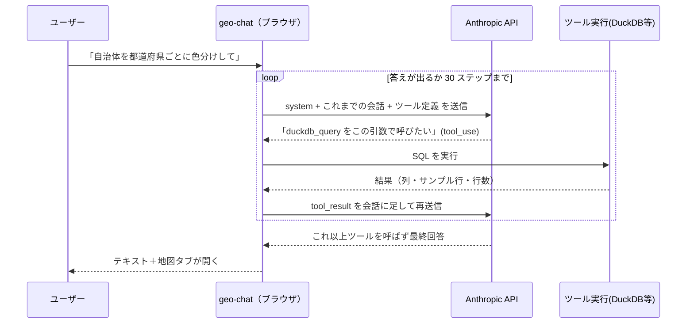

# 03. ループを目撃する

> このワークショップの中核。エージェントの「魔法」を、**約 100 行のコード** と
> **DevTools の生の HTTP 往復** の両方から分解します。ここが腑に落ちれば、あとは応用です。

## ① 概念解説 — エージェントループとは

01 章で「エージェント = LLM + ツール + ループ + コンテキスト」と定義しました。
その **ループ** の実体は、驚くほど単純な往復です:



ポイントは 2 つ:

1. **1 ターンの中で API を何度も呼ぶ** ——ツールを呼ぶたびに往復が発生します。
   「1 質問 = 1 API 呼び出し」ではありません。
2. **モデルは状態を持たない** ——毎回、system prompt・これまでの全会話・ツール定義を
   **まるごと送り直します**。エージェントの「記憶」は、アプリ側が会話履歴を積み上げて
   毎回送っていることで成り立っています。**（これが今日いちばん意外な点。次項で詳説）**

### 実は、AI はステートレス

この 2 点目が、LLM に馴染みのない人にとって、いちばん意外なところです。仕組みを平たく言うと:

**モデルは API 呼び出しの間に、記憶を一切持ちません。** モデルの応答にツール呼び出しが
含まれていたら、アプリはそのツールを実行し、**結果を「ただのメッセージ」として会話履歴に
追記** し、次のリクエストで **履歴まるごと**（system prompt ＋ これまでの全メッセージ ＋
ツール定義）を **再送信** します。エージェントループの正体はこれだけ——ほかに魔法はありません。
AI SDK の `streamText` がこの往復を隠してくれるので、かえって意外に映るのです。

これは §③ のネットワーク実験で **自分の目で確認できます**。DevTools を開くと、2 本目の
リクエストの `messages` に、1 本目の応答（`tool_use`）とツール結果（`tool_result`）が
追記されているのが見えます——「AI はステートレス」の実物証拠です。

> **補足**: 実際には、サーバ側で状態を持つ会話型 API を提供するプロバイダもあります
> （例: OpenAI の Responses / Conversations API）。また **プロンプトキャッシュ**（Anthropic も
> 対応）を使えば、長い履歴を毎回送り直すコストを大幅に下げられます。ただし、どちらも
> いま観察した **原理そのものは変えません**。既定のメンタルモデルは「毎回、履歴を丸ごと再送する」
> ——これを理解しておくと、**コンテキストウィンドウの上限** や、**長いエージェントセッションが
> なぜ高くつくのか** が腑に落ちます。

## ② コードの読みどころ — `src/lib/ai/agent.ts` を精読する

`runAgent()` は約 100 行。ワークショップの「教材ファイル」です。上から追います
（行番号は執筆時点の目安）。

### ブラウザから直接 Anthropic を呼ぶ（40–43 行）

```ts
const anthropic = createAnthropic({
    apiKey: options.apiKey,
    headers: { 'anthropic-dangerous-direct-browser-access': 'true' },
});
```

通常、Anthropic はブラウザからの直接呼び出しを **ブロック** します（キー漏洩を防ぐため）。
このヘッダはそれを **明示的にオプトイン** します。ここで許されるのは、
**ユーザー自身が自分のキーを入れているワークショップ用アプリ** だからです
（本番のマルチユーザーアプリでは、キーをサーバに置きプロキシします）。

### streamText — ループの宣言（45–56 行）

```ts
const result = streamText({
    model: anthropic(options.model),
    system: buildSystemPrompt(options.promptContext), // ← コンテキスト（②プロンプト）
    messages: options.messages, // ← これまでの全会話
    tools: options.tools, // ← 8つのツール定義
    temperature: 0, // 再現性重視（毎回ほぼ同じ判断）
    maxOutputTokens: 8000,
    stopWhen: stepCountIs(30), // ← ループの停止条件
    abortSignal: options.abortSignal,
});
```

Vercel AI SDK の `streamText` が、ループそのものを引き受けています。核心は
**`stopWhen: stepCountIs(30)`**:

> モデルがツールを呼ばずに回答するまで **ステップ（ツール呼び出し→結果→モデル）を
> 繰り返し**、最大 30 ステップで安全に打ち切る。

この 1 行が「ループを回す」の正体です。あなたが書くのは「停止条件」だけで、
往復の実行は SDK が担当します。`temperature: 0` は、判断を毎回ほぼ同じにして
デバッグしやすくするためです。

### fullStream — 豊かなイベントを 5 種類に翻訳する（59–87 行）

```ts
for await (const part of result.fullStream) {
    switch (part.type) {
        case 'text-delta':
            /* 文字が流れてきた   */ break;
        case 'tool-call':
            /* ツールを呼びたい   */ break;
        case 'tool-result':
            /* ツール結果が出た   */ break;
        case 'tool-error':
            /* ツールがエラー     */ break;
        case 'error':
            /* 全体エラー         */ break;
    }
}
```

`fullStream` には、テキストの断片・ツール呼び出し・ツール結果・エラーなど
**あらゆるイベント** が流れてきます。`runAgent` はそれを、UI に必要な
**5 種類の `AgentEvent`** に絞って `onEvent` で通知します（ファイル冒頭の型定義参照）。
「UI に必要なものだけ、余計なものは渡さない」——境界を薄く保つ設計です。

### 会話履歴を返す（89–91 行）

```ts
options.onEvent({ type: 'finish' });
const { messages } = await result.response;
return messages; // このターンで生成されたメッセージ（ツール呼び出し含む）
```

このターンで生じたメッセージ（アシスタントのテキスト＋ツール呼び出し＋結果）を返し、
呼び出し側（`useAgentChat`）が `history.current` に積みます。**次のターンでこれを丸ごと
送り直す** から、モデルは自分の過去のツール呼び出しを「覚えて」いられるのです。

### system prompt の解剖 — `src/lib/ai/systemPrompt.ts`（②プロンプトの実物）

system prompt は **静的部分＋動的部分** でできています。

- **静的部分** `BASE_PROMPT` — 役割（「ブラウザ内で動く地理空間データアシスタント」）、
  環境（DuckDB spatial が使える／Table・Map・Chart の 3 タブがある）、
  作業手順、スキルの使い方、ルール（MapLibre 式は `["get","col"]` 直接アクセス、
  Vega-Lite に `data`/`width`/`height` を書くな、ユーザーの言語で返せ 等）。
- **動的部分** `buildSystemPrompt()` — 毎ターン、**現在日付** と
  **今 DB にあるテーブルとスキーマ** を末尾に差し込みます:

```ts
return `${BASE_PROMPT}\n\n## Context\nCurrent date: ${date}\n\nTables in the database:\n${tables}`;
```

この動的スキーマ注入こそ、02 章で触れた「LLM にスキーマを見せる」の実装です。
`useAgentChat` の `buildPromptContext()` が毎ターン `getTables()` /
`getTableSchema()` を呼んで最新の一覧を集めています。**これが②プロンプトの一つ目の実物** です
（04 章のツール description、06 章のスキル md が二つ目・三つ目）。

## ③ 壊す実験 #3 — DevTools で API 往復を覗く

コードで理解したループを、**実際に流れる HTTP** で確かめます。壊すというより「暴く」実験です。

1. ブラウザの **DevTools** を開き、**Network** タブを選びます。
2. フィルタに `api.anthropic.com` と入力します。
3. チャットに `自治体を都道府県ごとに色分けして地図に表示して` を送信します。
4. `messages` へのリクエストが **複数** 現れます。**この本数を数えてください。**

### リクエストを読む

1 本目のリクエストの **Payload（送信 JSON）** を開くと、次の 3 つが見えます:

- `system` — さっき読んだ system prompt の全文（末尾に今あるテーブルのスキーマ）。
- `messages` — これまでの会話（最初はユーザーの 1 文だけ）。
- `tools` — 8 つのツールの **name / description / input_schema**。
  これが「モデルに見せているツールの説明書」です（04 章の主役）。

### レスポンス（SSE）を読む

レスポンスは **SSE（Server-Sent Events）ストリーム** です。中に `tool_use` ブロックが
現れ、モデルが「`duckdb_query` をこの `input` で呼びたい」と言っているのが見えます。
この `tool_use` ブロックも、結局はモデルが出力したトークン列を API が構造化してくれたものです
（[01 章「ツール呼び出しは『トークン予測』の延長にすぎない」](./01-what-is-an-agent.md) 参照）。

### 往復を数える

2 本目以降のリクエストの `messages` を見ると、1 本目には無かった
**`tool_use`（モデルの要求）と `tool_result`（実行結果）** が追記されています。
これが「会話を積んで毎回送り直す」の実物です——そして **「AI はステートレス」の実物証拠**
（§① 参照）でもあります。

> **見える原理**: エージェントの実体は、**`tool_use` → 実行 → `tool_result` の
> HTTP 往復ループ** に過ぎません。リクエスト本数 = ループが回った回数。
> 「魔法」の正体は、この地味な往復の積み重ねでした。

## ④ 手を動かす課題

1. 「地図に出さず、東京都の自治体を **表で** 見せて」と頼み、Network のリクエスト本数を数える。
   地図まで頼んだ場合と本数がどう変わるか、なぜ変わるかを説明する。
2. 1 本目のリクエストの `system` 全文をコピーし、`BASE_PROMPT`（静的）と
   末尾の `Context`（動的）の境目を指させる。テーブルを 1 つ追加してから同じ質問をすると、
   `system` の末尾がどう変わるか観察する。
3. `tools` 配列の中から `duckdb_query` の `description` を探し、声に出して読む。
   「この説明文がモデルの唯一の手がかり」という次章の主張を、先取りで体感する。

## ⑤ 開発プロンプト例

この章の理解を、Claude Code などに要約させて自分のメモにしたいときのプロンプト例:

```
このリポジトリの src/lib/ai/agent.ts を読んで、runAgent が 1 ターンで
Anthropic API を複数回呼ぶ仕組みを、stopWhen: stepCountIs(30) の役割を中心に
初学者向けに 5 行で説明して。会話履歴が毎回送り直される点にも触れて。
```

次は [04. ツールの解剖学](./04-building-tools.md)。今 Network で見た `tools` 配列の
一つひとつが、コードのどこから来ているのか——そして **description がなぜ命綱なのか** を
分解し、自分で新しいツールを追加します。
