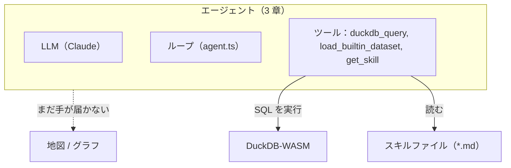

# 03. 知識をオンデマンドに

> 2 章は、`duckdb_query` が頼まれた SQL を全部実行しながらも、空間系のクエリは相変わらず間違えるところで終わりました。ツールが何かを拒否したからではなく、モデルがどの CRS に投影すればいいか、`always_xy` というものが存在することすら、確実には知らなかったからです。その知識を system prompt に恒久的に貼り付けるやり方は、すぐに壁にぶつかります: コンテキストは有限の資源であり、今のターンには要らないルールを積み上げると、本当に要るルールが埋もれてしまいます。本章はエージェントに 3 つ目のツール `get_skill` と、代わりに **必要なときだけ** 取りに行ける markdown ファイルのフォルダを手渡します。

## ① これまでのエージェント

2 章の図は、`duckdb_query` と `load_builtin_dataset` が DuckDB に届いていて、地図とグラフはまだ点線の向こうにありました。本章はもう 1 つツールを加えます——そして初めて、実行系ではまったくない、エージェントが読みに行く **知識の保管庫** というノードが登場します。



`src/lib/ai/toolTiers.ts` の `ENABLED_TOOLS` が `[...TIER_1]` から `[...TIER_1, ...TIER_2]` に変わります:

```ts
export const TIER_2 = ['get_skill'] as const;
```

`地図 / グラフ` への点線の矢印は **まだ、意図的に残っています**。`get_skill` は markdown ファイルを _読んで_ その本文をモデルに返すだけで、何かを描くことは一切できません。本章のスキルがエージェントの SQL を直しても、地図タブとグラフタブは 2 章の終わりとまったく同じように手が届かないままです。これを覚えておいてください——それがまるごと④の主題です。

## ② 新しいピース

### 2 章の失敗を診断する

2 章は、`duckdb_query` が頼まれた文をすべて文句も言わず実行したにもかかわらず、エージェントを壊す 2 つのプロンプトで終わりました:

> `各都道府県の面積を km² で計算して` —— 生の WGS84 ジオメトリに直接 `ST_Area` を呼ぶモデルは、`km²` というラベルの付いた列を返しますが、それは実際には **度²であり、桁違いに間違っています。**

> `東京駅から 30km 以内の市を探して` —— 同じ単位の取り違えに加えて、今度は東京駅の座標まで学習データから思い出さなければならない分、輪をかけています。

2 章自身の「見える原理」が、この診断をまさに言い当てていました: **「`duckdb_query` はこれらのクエリを一度も拒否しませんでしたし、これからも拒否しません——汎用ツールは、自分が実行する SQL が空間的に健全かどうかについて何の意見も持ちません。上のどの失敗も知識のギャップであって……能力のギャップでは一度もありませんでした。」** ツールはちゃんと動いていました。モデルはただ、どの CRS に投影すればいいか、このアプリの座標順のために `ST_Transform` に `always_xy := true` が要ることを、あるいは生の経度緯度の単位がメートルではなく度であることを、毎回確実には知らなかっただけです。2 章が「必須のフォールバック」として名指しした、「たまたまうまくやった」ケースでさえ、記憶から正しく思い出せた偶発的な知識の山にすぎず、_次回_ も正しく思い出せる保証は何もありませんでした。

### 場当たり的なパッチのエスカレーション — そしてそれが行き止まりである理由

一番自然な最初の一手は、system prompt を太らせて直すことです。ルールを 1 つ足します: _「面積や距離を計算する前は、必ず `ST_Transform` でメートル法の CRS に投影し、必ず `always_xy := true` を渡すこと」_。これだけで、おそらく km² のプロンプトは直ったでしょう。

でも、そこでは止まりません。次のリクエストには、軸順の罠をそれ自体として書き下す必要が出てきます（`always_xy` が実際に何を守っているのか、忘れるとどうなるのか）。その次には、30km のプロンプトのために `ST_DWithin` と `ST_Distance_Sphere` の使い分けの注記が要ります。それから WKB と GEOMETRY 列型の違いの段落。それから——4 章の地図・グラフツールができた暁には——MapLibre の paint プロパティの作法まるごと、Vega-Lite の spec の形の作法まるごと、コロプレスの色ランプの指針、等々。どれも単独で見れば、モデルに確実に守ってほしい、まっとうなルールです。積み上げていくと、`SELECT count(*)` しか実行しないターンも含めて、**すべての** system prompt に **恒久的に** 乗ったまま毎回送られ、やがて役に立たなくなります:

> コンテキストは希少な資源です。「モデルに渡せば渡すほど賢くなる」わけではありません——**関係ない情報を大量に積むと、むしろ大事な指示が埋もれて質が落ちます。**

それが壁です。system prompt をルールごとにいつまでも太らせ続けることはできません——書き留める価値のある空間系の作法が尽きるよりずっと前に、品質を支えるコンテキスト予算のほうが尽きてしまいます。

### 答え: progressive disclosure（段階的開示）

解決策は、知識を恒久的にインラインで埋め込むこと自体をやめることです:

> 詳細な知識は **スキル** として外に出しておき、モデル自身に **タスクに関係あるものだけを、必要な瞬間に** `get_skill` ツールで取りに行かせる。

system prompt には「詳しいやり方はスキルにある。必要なら取れ」とだけ書き、**カタログ**——どんなスキルがあり、それぞれがいつ必要かの一覧——は system prompt にではなく、`get_skill` 自身の `description` に埋め込みます。モデルはそのカタログを読んで、「このタスクには spatial スキルが要る」（あるいは map スキル、あるいはどちらも要らない）と自分で判断し、必要なものだけを取得します。これは 2 章のツール往復ループの、知識版にあたります: 世界に **働きかける** ための 1 回の往復の代わりに、ターンの途中で必要になったときに世界について何かを **学ぶ** ための 1 回の往復、というわけです。

### コードの読みどころ

**スキルファイルの形式。** スキルは `src/lib/ai/skills/**/*.md` の下に置かれた、frontmatter 付きの markdown です。`src/lib/ai/skills/map/styling.md` の冒頭はこうなっています:

```markdown
---
description: REQUIRED before styling the map — TableMapStyle shape, paint per geometry, ...
tasks: 地図, 地図スタイル, 色分け, スタイル, map, map style, choropleth, 塗り分け, ポイント, ...
---

## Styling the map with update_map_style

(the body starts below here: detailed conventions for using update_map_style)
```

このフィールドは `src/lib/ai/skills/registry.ts` でパースされます:

- **`description`** —— カタログに出る 1 行の説明文。「REQUIRED before …」のように **いつ必要か** を書くのがコツです——この言い回しが、モデルに正しく自己選択させる鍵になります。
- **`tasks`** —— ルーティング用キーワード、英語と日本語の両方。カタログに description と並んで表示され、「このタスクはこのスキルに合っているか」を判断するモデルの 2 つ目の手がかりになります。
- **`deps`**（任意）—— このスキルと一緒に自動で取得される、前提スキルの id。例えば `map.geospatial` は `deps: map.styling, duckdb.spatial` を宣言し、`duckdb.spatial` 自身は `deps: duckdb.basics` を宣言しています。
- **本文（body）** —— frontmatter のフェンスより下のすべて。これが、スキルを取得したときにモデルへ渡されるテキストです。

**id はファイルパスから** 自動生成され、手で書かれることは決してありません:

```ts
// './duckdb/spatial.md' → 'duckdb.spatial'
export function idFromPath(path: string): string {
    return path.replace(/^\.\//, '').replace(/\.md$/, '').replace(/\//g, '.');
}
```

その id の **最初のセグメント**（`duckdb.spatial` の `duckdb`）が、そのスキルの **domain** です。今、この tier の時点では、これは単なる名前空間の接頭辞でしかありません——4 章がこれに牙を与え、「まず正しい作法を読む」を提案から構造的に強制されるものへと変えます。今はまだ気にしなくて大丈夫です——この tier では何もそれに依存していません。

すべてのファイルは、`registry.ts` の `import.meta.glob('./**/*.md', { eager: true, query: '?raw' })` によって **ビルド時に一括読み込み** されます——実行時のファイルスキャンも、登録ステップも、触るべきビルド設定もありません。

> **つまり: `<domain>/<name>.md` を 1 枚置くだけでエージェントがスキルを獲得する。コード変更は不要です。** これが本ワークショップの「md 1 枚でエージェントを拡張する」の核心です。

**カタログと取得 — `src/lib/ai/tools/getSkill.ts`。** `get_skill` の `description` には、`buildCatalog()` が生成するカタログ全体が埋め込まれています:

```ts
const description =
    'Fetch detailed, up-to-date instructions for one or more skills before you act. ' +
    'You MUST fetch the relevant skill before using update_map_style (map.* skills) or ' +
    'update_chart_spec (vega.* skills). Fetch DuckDB skills before non-trivial SQL. ' +
    'Dependencies are pulled in automatically.\n\nAvailable skills:\n' +
    buildCatalog();
```

今、このリポジトリでは、このカタログには存在する 7 つのスキルファイルすべて——`duckdb.basics`, `duckdb.file-import`, `duckdb.spatial`, `map.geospatial`, `map.styling`, `vega.basics`, `vega.color`——が、それぞれ `- <id> — <description> [tasks]` の 1 行として並びます。`map.*` と `vega.*` のエントリが、`update_map_style` と `update_chart_spec` がまだ `ENABLED_TOOLS` に存在しない **この tier ですら** そこに載っていることに注目してください——カタログは単に `skills/` 以下の markdown ファイル全部であり、どのアクションツールが有効かとは無関係です。今 `map.styling` を取得すれば成功しますし、コストもかかりませんが、それを使うツールはまだ存在しません。そのちぐはぐさこそ、まさに④の主題です。

モデルが `get_skill(["duckdb.spatial"])` を呼ぶと、`resolveWithDeps()` が `deps` のグラフを辿り（依存を先に、それから要求された id を、重複無く）、ツールは解決されたすべての本文を一度に返します:

```ts
// (簡略化: 実際の execute は見つからなかった id も追跡していて、4 章で出会うことになる仕組みを解禁します——ここで大事なのはこの形です)
execute: async ({ skills }) => {
    const resolved = resolveWithDeps(skills); // deps first, e.g. ["duckdb.basics", "duckdb.spatial"]
    const instructions: Record<string, string> = {};
    for (const id of resolved) {
        const skill = getSkill(id);
        if (skill) instructions[id] = skill.body;
    }
    return { fetched: Object.keys(instructions), instructions };
};
```

### `duckdb.spatial` スキル — 2 章に欠けていた知識

2 章の失敗に欠けていた、`src/lib/ai/skills/duckdb/spatial.md` のちょうどその節を、そのまま引用します:

````markdown
### Buffers, area, distance — the projection caveat

`ST_Area`, `ST_Length`, `ST_Distance`, `ST_Buffer` and `ST_DWithin` operate in the
**geometry's own units**. For WGS84 lon/lat those units are **degrees**, not meters —
so `ST_Area` on raw lat/lon gives degrees², which is meaningless as land area.

For real metric measurements, transform to a projected CRS first, measure, and (if you
still need to draw it) transform back to 4326:

```sql
-- area in m² for Japan: project to JGD2011 / Japan Plane Rectangular or a UTM zone
SELECT ST_Area(ST_Transform(geometry, 'EPSG:4326', 'EPSG:6677', always_xy := true)) AS area_m2
FROM "areas";
```

**Axis-order trap:** `ST_Transform` defaults to the CRS's declared axis order, which
for EPSG:4326 is (lat, lon) — the _opposite_ of how we store data. Always pass
`always_xy := true` so it treats coordinates as (lon, lat). Forgetting this silently
swaps X and Y and sends geometry to the wrong hemisphere.

For quick approximate distances without projecting, `ST_Distance_Sphere(a, b)` returns
meters directly on lon/lat input.
````

これを 2 章の 2 つの失敗プロンプトに照らして読むと、すべてのピースがはまります: _投影する → EPSG:6677（または UTM ゾーン）→ `always_xy := true` → 測る → まだ描く必要があるなら 4326 に戻す。_ これはまさに `km²` の計算が必要としていた手順そのものであり、軸順の段落はまさに、2 章自身のコールアウトが `always_xy` 無しで同じクエリを実行して重心がとんでもない場所に着地するのを見せた、あの罠そのものです。これは本章のために発明された新しい知識ではありません——最初からリポジトリの中に置かれていたのです。2 章のエージェントには、単にそこへ辿り着く手段が無かっただけです。

## ③ 動かしてみる

`src/lib/ai/toolTiers.ts` を開き、今度は本当にこう設定します:

```ts
export const ENABLED_TOOLS: readonly ToolName[] = [...TIER_1, ...TIER_2];
```

保存すると Vite が自動リロードします——**新しいチャット** を開始し、2 章でまさに失敗したプロンプトをもう一度打ちます:

```
各都道府県の面積を km² で計算して
```

**Before —— 2 章（`TIER_1` のみ、復習）。** `get_skill` ツールはまだ存在しません。モデルはいきなり SQL に向かい、（2 章の④どおり）生の `geom` 列に直接 `ST_Area` を使うモデルは、`km²` というラベルの付いた列を返しますが、実際には度²であり桁違いに間違っています。トランスクリプトには `duckdb_query` 以外のツールカードは 1 つも無く——モデルが行動する前に自分の前提を確認する機会は、何も用意されていませんでした。

**After —— 3 章（`TIER_1` + `TIER_2`）。** `duckdb_query` の呼び出しより **先に**、`get_skill` のツールカードが現れるはずです。開いてみてください: `input.skills` はおおよそ `["duckdb.spatial"]` で、`duckdb.spatial` が `deps: duckdb.basics` を宣言しているため、ツールカードのスキル id バッジには `duckdb.basics` と `duckdb.spatial` の **両方** が表示されます——`resolveWithDeps()` が依存関係をただで引き込んでくれたのです。そのあとで初めて `duckdb_query` の呼び出しが続き、その `input.sql` は今度は測る前に投影するようになっています。おおよそ次のようになります:

```sql
CREATE TABLE prefecture_areas AS
SELECT
    "N03_001" AS prefecture,
    ST_Area(ST_Transform("geom", 'EPSG:4326', 'EPSG:6677', always_xy := true)) / 1e6 AS area_km2
FROM "japan_prefectures";
```

メートル法の CRS に投影し、`always_xy := true` を渡し、m² の結果を `1e6` で割って km² にする——まさにスキルの本文がたった今手渡したレシピそのものです。2 つのトランスクリプトを並べて見比べてください: 同じプロンプト、同じ元データ、同じモデル——2 章と今とで変わったのはただ 1 つ、エージェントが欠けていたその 1 つの事実を調べに行ける場所を持ち、それを取りに行かせる追加のツールを 1 つ持っていたことだけです。

> **見える原理**: 修正の正体は「モデルを賢くする」ことでは一度もありませんでした。**正しい知識を、それが本当に必要な瞬間に手の届く場所に置く** こと——それでいて、他のすべてのターンに、要りもしない知識で恒久的な負担をかけない。それが progressive disclosure の約束のすべてです。それが無ければ壊れていた、まさにそのプロンプトの上で証明されました。

## ④ ここで壊れる

同じチャットを開いたままにしてください——`prefecture_areas` は今や存在し、中身の km² の数値は正しいはずです——そしてもう 1 つ頼んでみます:

```
その結果を地図に表示して
```

**これは確率的な失敗ではなく、決定論的な失敗です。** `ENABLED_TOOLS` はまだ `[...TIER_1, ...TIER_2]` のままで——`update_map_style` というツールはリストの中に一切ありません。モデルは `prefecture_areas` のコロプレスがどんな見た目になるかを説明することはできますし、実際に使う **であろう** MapLibre の paint プロパティを文章で書き出すことすらできますが、何かを描くツール呼び出しは一切持っていません。実際に何が起きるか観察してください: 地図を表示できないという謝罪か、あるいはチャットの中に数値が表として印字されるか——モデルが持っている唯一の出力形式です。トランスクリプトを開き、地図らしきツールカードがどこにも無いこと、そしてアプリの Map タブが変わらないことを確認してください。

この失敗は 2 章の **鏡像** であることに注目してください。2 章では、ツール（`duckdb_query`）は存在し、知識が欠けていました。ここでは、知識は今や正しく揃っています——`prefecture_areas.area_km2` は正しい——そして欠けているのは **ツール** の方です。`get_skill` はどこまでいっても markdown のテキストをモデルに読み返すだけで、スキルファイルがどれだけよく書かれていても、`map` ツールを出現させることはできません。知識と能力は別の軸であり、本章が組み立てたのはその 1 つ目だけでした。

> **見える原理**: 正しい知識は **何を**（what）——エージェントは今や正しい SQL を知っています——を直しました。それはまだ手が無い領域（地図、グラフ）に働きかける **どうやって**（how）については、何もしていません。[04. 専用ツール](./04-specialized-tools.md) が、まさにその手を加えます——そして、良いツールが手元にあってさえ、どれだけのことが間違いうるかを見たあとで、なぜそれが見た目以上の配慮に値するのかも。

## ⑤ 手を動かす課題 — 自分のスキルを 1 枚書く

**md ファイルを 1 枚足すだけ** でエージェントが賢くなることを、自分の手で確かめます。例として、ヒートマップ用スキル `map/heatmap.md` を作ります（業務の定番手順でも構いません）。

### テンプレート（`src/lib/ai/skills/map/heatmap.md` として保存）

```markdown
---
description: ポイント密度のヒートマップ表現 — heatmap レイヤの paint と使いどころ
tasks: ヒートマップ, 密度, heatmap, ポイント密度, heat, ホットスポット
deps: map.styling
---

## ポイントをヒートマップで表現する

多数のポイントの「密度」を見せたいときは、個々の円ではなくヒートマップにする。
（このアプリの地図レイヤは point→circle / line→line / polygon→fill を基本とするため、
heatmap を使う場合の作法をここに明記しておく。まず対象がポイントであることを確認する。）

- 密度を強調したいズーム帯では `heatmap-*` 系の paint を使う。
- 値で重み付けするなら heatmap-weight に ["get", "<数値列>"] を使う。
- 生の点も見せたいときは、ズームインで circle 表示に切り替える設計を検討する。

（ここに、あなたの業務で毎回書く手順・色・しきい値の目安を具体的に書く）
```

> 注: 上のテンプレートは「スキルの書き方」を学ぶための最小例です。実際に heatmap を描くには対応するレイヤ実装が要りますが、本課題の狙いは **「md を置くとカタログと挙動が変わる」ことの体感** です。まずは「自分の業務で繰り返す分析レシピ」を 1 つ、`<domain>/<name>.md` として書くのが最も学びになります。

### 反映と確認

スキルはビルド時 glob で読み込むため、ファイルを足したら **開発サーバを再起動** します（`Ctrl+C` → `npm run dev`）。確認手順:

1. New chat して、密度に関する依頼（例「◯◯のホットスポットを見せて」）を打つ。
2. `get_skill` のツールカードを開き、**カタログにあなたの新スキル id（例 `map.heatmap`）が増えている** ことを確認する。
3. モデルがそのスキルを取得し、本文に書いた作法に沿って振る舞うか観察する。スキル追加の前後で挙動が変わることを確かめる。

## ⑥ 開発プロンプト例

スキルの下書きを AI に作らせ、自分で仕上げるためのプロンプト例:

```
このリポジトリの src/lib/ai/skills/ の既存スキル（map/styling.md, duckdb/spatial.md）を
お手本に、新しいスキル <domain>/<name>.md を書いてください。
- frontmatter は description / tasks（英語+日本語キーワード） / 必要なら deps。
- 本文は「いつ使うか」「具体的な SQL / spec の型」「よくある間違いと直し方」を含める。
- 対象タスク: <あなたが業務で繰り返す分析の説明>
出力は Markdown 1 ファイルとして。コード変更は不要（glob で自動登録される）。
```

スキルテンプレートの詳細は [appendix-prompts.md](./appendix-prompts.md) にもあります。

次は [04. 専用ツール](./04-specialized-tools.md)。エージェントは今や空間系の質問に正しい SQL を書けるようになりましたが、地図やグラフに対する手はまだ一切持っていません。それをいくつか手渡し、正しいツールが手元にあってさえ、どれだけのことが間違いうるかを見ていきます。
