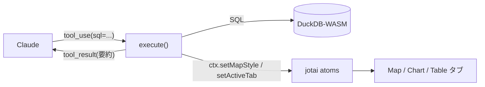

# 04. ツールの解剖学

> 03 章で Network に見えた `tools` 配列。その一つひとつは、コードでは
> **name / description / inputSchema / execute** の 4 部品でできています。
> 本章でその構造を分解し、`buffer_analysis` という **新しいツールを AI に実装させます**。

## ① 概念解説 — ツールは 4 つの部品でできている

エージェントにとっての「ツール」とは、次の 4 つを持つオブジェクトです:

| 部品          | 役割                                                  | 誰が読むか     |
| ------------- | ----------------------------------------------------- | -------------- |
| `name`        | ツールの識別子（`duckdb_query` など）                 | モデルとアプリ |
| `description` | **何をするツールで、いつ・どう使うか** の自然言語説明 | **モデル**     |
| `inputSchema` | 引数の型（zod スキーマ）。モデルが埋める JSON の形    | モデルとアプリ |
| `execute`     | 実際に世界を触る TypeScript 関数。結果を返す          | **アプリ**     |

決定的に重要なのは、**モデルが `execute` の中身を一切見ない** ことです。
モデルが読むのは `description` と `inputSchema` だけ。つまり:

> **ツールが賢く使われるかどうかは、`description` の書き方で決まる。**
> API 設計（ツール設計）は、そのままプロンプト設計（②の層）である。

`execute` は「手」、`description` は「手の使い方の説明書」。説明書が下手なら、
どんなに良い手も使われません。これを本章の壊す実験で確かめます。

## ② コードの読みどころ — `src/lib/ai/tools/duckdbQuery.ts` を検体に

### 4 部品の実物

`createDuckdbQueryTool()` は、AI SDK の `tool({...})` で 4 部品を組み立てています:

```ts
return tool({
    description:
        'Run a single SQL statement against the DuckDB-WASM database ... ' +
        'Use it to explore data before answering (always LIMIT exploratory SELECTs) ' +
        'and to CREATE TABLE for results worth visualizing. ' +
        'Returns column types, up to 5 sample rows, the row count, and whether the result has a geometry column.',
    inputSchema: z.object({
        sql: z.string().describe('One SQL statement (no trailing extra statements).'),
        purpose: z.enum(['explore', 'result']).optional().describe('...'),
    }),
    execute: async ({ sql }) => {
        /* 実際に SQL を実行 */
    },
});
```

description が **「単文だけ」「探索 SELECT には必ず LIMIT」「可視化する結果は CREATE TABLE」
「返るのは列型・最大 5 行・行数・ジオメトリ有無」** と、使い方の作法まで書いているのが肝です。
これは 03 章で読んだ system prompt の作法と **重複して念押し** しています
（大事なことは複数箇所に書く）。

### 結果が次のステップの入力になる

`execute` が返すオブジェクトが、そのまま `tool_result` としてモデルに戻り、
**次のステップの判断材料** になります。`duckdbQuery.ts` の戻り値を見てください:

```ts
return { columns, rowCount, sampleRows, hasGeometry, createdTable: created, hint };
```

- モデルを溢れさせないため、返すサンプル行は **最大 5 行**、長い文字列は 200 文字で切ります
  （`MAX_SAMPLE_ROWS` / `sampleValue`）。地図・グラフ用の全データは DuckDB のテーブルに
  置いたまま、モデルには「要約」だけ渡す——**これがコンテキストを節約する定石** です。
- `CREATE TABLE` を検知したら（`createdTableName`）、テーブル一覧を更新し、
  ジオメトリ列があれば `hint` に「`update_map_style` で描けるよ」と **次の一手を促す文** を
  入れて返します。ツールの戻り値も、実は②プロンプトの一部なのです。

### toolContext — ツールと UI 状態をつなぐ橋

ツールは **React も jotai も import しません**。代わりに `ToolContext` という細い窓を受け取り、
それ経由でアプリの状態（jotai atom）に触れます。

```ts
// src/lib/ai/toolContext.ts — 定義（抜粋）
export interface ToolContext {
    refreshTables: () => Promise<void>;
    setSelectedTable: (table: string) => void;
    setActiveTab: (tab: WorkspaceTab) => void;
    getChartSpec / setChartSpec / getMapStyle / setMapStyle ...
}
```

`defaultToolContext()` が、この窓をグローバル jotai ストアの上に実装します。
だから `duckdb_query` が `CREATE TABLE` すると、`ctx.setSelectedTable()` /
`ctx.refreshTables()` を通じて **UI が読むのと同じ atom** が更新され、
Map タブに反映されます。ツールは「純粋な関数」に保ちつつ、UI と繋がれる——きれいな分離です。



### ツールの登録 — `src/lib/ai/tools/index.ts`

`createTools()` が 7 つのツールを 1 つのオブジェクトにまとめ、エージェントに渡します。
**新しいツールはここに 1 行足すことで初めてモデルに見えます**（04 章課題で使います）。
このファイルにはもう一つ、`update_map_style` / `update_chart_spec` を
「スキル取得前は動かない」ようにする **前提ゲート** の薄いラッパ `requireSkill` があります
（詳細は 06 章）。

## ③ 壊す実験 #4 — description を空にする

**仮説: 「モデルはツールを `description` だけを頼りに選ぶ」**。

`src/lib/ai/tools/duckdbQuery.ts` の `description:` を、一時的に空文字にします。

```ts
// 変更前（抜粋）
description:
    'Run a single SQL statement against the DuckDB-WASM database ... ',

// 変更後
description: '',
```

保存してリロードし、01 章と同じ質問を打ちます:

```
人口 10 万人以上の市を地図で塗り分けて
```

**観察**（モデルや運によって現れ方は変わりますが、傾向として）:

- モデルが `duckdb_query` を **呼ぶべき場面で呼ばない**、あるいは誤った使い方をする。
- 「SQL を実行したいがツールが分からない」と口で言うだけになったり、
  探索なしにいきなり地図ツールへ飛んで失敗したりする。

> **見える原理**: `execute` の中身は完璧でも、**説明文が無ければ手は使われません**。
> モデルの唯一の手がかりは `description`。だから **ツール設計 = ②プロンプト設計** なのです。

確認したら、description を元に戻します。

## ④ 手を動かす課題 — `buffer_analysis` ツールを AI に実装させる

新しいツール **`buffer_analysis`** を追加します。指定テーブルのフィーチャに
`ST_Buffer` でバッファを掛け、**新しいテーブル** を作るツールです。手打ちではなく、
**③の開発プロンプト** で Claude Code などに実装させます（これがワークショップの実装手段）。

### 開発プロンプト（③の層 — これをコーディング AI に貼る）

```
このリポジトリに新しい AI ツール buffer_analysis を追加してください。

■ 目的
指定テーブルのジオメトリ列に ST_Buffer を掛けた新しいテーブルを作り、地図で描けるようにする。

■ 既存構造に合わせる
- src/lib/ai/tools/duckdbQuery.ts と updateMapStyle.ts をお手本に、同じ形で書く
  （tool({ description, inputSchema(zod), execute }) を返す createXxxTool(ctx) 関数）。
- src/lib/ai/toolContext.ts の ToolContext を受け取り、refreshTables / setSelectedTable /
  setActiveTab を使って UI に反映する。
- 実装後、src/lib/ai/tools/index.ts の createTools に buffer_analysis を登録する。

■ 入力スキーマ（zod）
- table: string（対象テーブル）
- distanceMeters: number（バッファ距離・メートル）
- outputTable: string（作成するテーブル名）

■ 挙動
- 対象テーブルにジオメトリ列があるか getTableSchema で確認し、無ければ error を返す。
- ST_Buffer は座標系の単位で効くため、EPSG:4326 を投影 CRS（例 EPSG:6677、always_xy := true）へ
  変換してからメートルでバッファし、結果は EPSG:4326 に戻して GEOMETRY 列として保存する。
- CREATE TABLE "<outputTable>" AS SELECT ... を executeQuery で実行する。
- 成功したら ctx.refreshTables / setSelectedTable(outputTable) / setActiveTab('map') を呼ぶ。
- モデルへの戻り値は「作成テーブル名・行数」など短い要約にする（全行は返さない）。

■ description（②プロンプト）を丁寧に書く
- いつ使うか（近接分析・到達圏など）、距離の単位がメートルであること、
  出力が新テーブルになることを 2〜3 文で明記する。

実装後、npm run typecheck が通ることを確認してください。
```

### 生成コードのレビュー観点（チェックリスト）

AI が書いたコードを **必ず自分で検分** します。次を確認してください:

- [ ] **inputSchema** は明確か（型・必須/任意・単位が `.describe()` に書かれているか）
- [ ] **単一責務** か（バッファ作成だけ。地図スタイルまで欲張っていないか）
- [ ] **結果の切り詰め** — モデルへ全行を返していないか（要約のみか）
- [ ] **投影の扱い** — メートルのバッファのため投影 → 4326 戻しをしているか、`always_xy` があるか
- [ ] **index.ts に登録** したか（登録しないとモデルから見えない！ 03 章の `tools` 配列に出ない）
- [ ] **description** は「いつ・何を・何が返るか」を書けているか（＝②プロンプトの品質）

### 動作確認

登録できたら、チャットで:

```
japan_cities の中心 5 市に半径 2km のバッファを作って地図に出して
```

`buffer_analysis` のツールカードが現れ、新テーブルが Map タブに描かれれば成功です。
この課題は 07 章のチャレンジ（2）でさらに `ST_Intersects` と組み合わせて発展させます。

## ⑤ 開発プロンプト例

上の「開発プロンプト」がそのまま⑤の実例です。汎用テンプレート（「ツールを追加する」
「エージェントをデバッグする」）は [appendix-prompts.md](./appendix-prompts.md) に
まとめてあります。**プロンプトに『どのファイルをお手本にするか』『どこに登録するか』
『何を検証するか』を書く** ことが、良い生成の鍵です。

次は [05. 宣言的 spec という境界線](./05-declarative-specs.md)。地図とグラフのツールが
なぜ「JavaScript を書かせる」のではなく「spec（データ）を書かせる」設計なのか——
その理由が、AI と相性の良いツールを設計する上での中心原理です。
