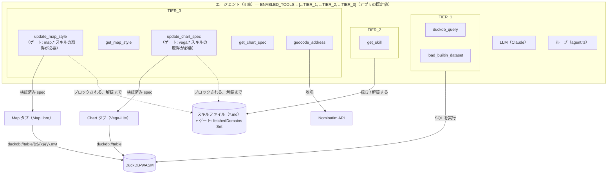
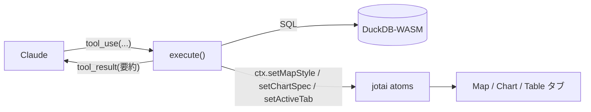
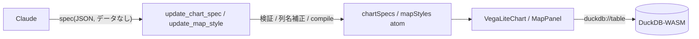

# 04. 専用ツール

> 3 章は勝利の途中で終わりました。`prefecture_areas.area_km2` は正しい——スキルが知識のギャップを埋めていた——そして続く「それを地図に出して」という素直な一言が、知識とは何の関係もない壁にぶつかりました。`ENABLED_TOOLS` はまだ `[...TIER_1, ...TIER_2]` のまま——リストの中に、何かを描けるツールは 1 つもありませんでした。本章はエージェントに最後の 3 つのツール——地図、グラフ、ジオコーディング——を手渡し、そのほとんどの時間を「`execute` 関数を足すだけ」ではまるで足りない理由に費やします: ツールの 4 つの部品がどう組み合わさるか、地図とグラフのツールがなぜモデルにコードではなく _データ_ を書かせる設計になっているか、そして両方が走る前に正しい作法が読まれたことを確かめる小さなゲート。

## ① これまでのエージェント

3 章の図は、`get_skill` がマークダウンの保管庫に届いていて、`地図 / グラフ` はまだ点線の向こうにありました。本章は残るギャップを一度に全部閉じます——`TIER_3` が 5 つのツールをもたらし、初めて図のすべてのノードに手が届くようになります。



```ts
export const TIER_3 = [
    'update_map_style',
    'get_map_style',
    'update_chart_spec',
    'get_chart_spec',
    'geocode_address',
] as const;
```

`ENABLED_TOOLS` は `[...TIER_1, ...TIER_2, ...TIER_3]` になります——`createTools()` が組み立て方を知っているツール全部です。これはワークショップだけの設定ではなく、実際に出荷されるアプリが最初から持っている値そのものです。ここから先、ラダーはもう「1 つの配列を編集して登る」ものではありません——すでに完全に組み上がっていて、本章の残りは「それを組み上げても安全であるために、何を作らなければならなかったか」の話になります。

この図には、1〜3 章にはなかった 2 つの新しさがあります。1 つ目: `update_map_style` と `update_chart_spec` には目に見える注記——「ゲート: `map.*`/`vega.*` スキルの取得が必要」——が付いています。これまでのどのツールとも違い、この 2 つは引数が正しい形をしていてさえ実行を拒否できるからです。2 つ目: `MapView` と `ChartView` から出た矢印が `DuckDB` へループして戻っています——地図とグラフのツールはデータそのものを一切運ばず、描画時に実行系が解決する `duckdb://<table>` という参照だけを運びます。この 2 つの設計判断が、本章の主題です。

## ② 新しいピース

### 1. ツールの解剖学 — 4 つの部品、1 つの手がかり

エージェントにとっての「ツール」とは、次の 4 つを持つオブジェクトです:

| 部品          | 役割                                                  | 誰が読むか     |
| ------------- | ----------------------------------------------------- | -------------- |
| `name`        | ツールの識別子（`duckdb_query` など）                 | モデルとアプリ |
| `description` | **何をするツールで、いつ・どう使うか** の自然言語説明 | **モデル**     |
| `inputSchema` | 引数の型（zod スキーマ）。モデルが埋める JSON の形    | モデルとアプリ |
| `execute`     | 実際に世界を触る TypeScript 関数。結果を返す          | **アプリ**     |

決定的に重要なのは、**モデルが `execute` の中身を一切見ない** ことです。モデルが読むのは `description` と `inputSchema` だけ。つまり:

> **ツールが賢く使われるかどうかは、`description` の書き方で決まる。**
> API 設計（ツール設計）は、そのままプロンプト設計（②の層）である。

`execute` は「手」、`description` は「手の使い方の説明書」。説明書が下手なら、どんなに良い手も使われません——このすぐ下の、description を空にする実験がそれを証明します。

#### 4 つの部品の実物 — `src/lib/ai/tools/duckdbQuery.ts`

`createDuckdbQueryTool()` は、AI SDK の `tool({...})` で 4 部品を組み立てています:

```ts
export function createDuckdbQueryTool(ctx: ToolContext) {
    return tool({
        description:
            'Run a single SQL statement against the DuckDB-WASM database (main schema, spatial extension loaded). ' +
            'Use it to explore data before answering (always LIMIT exploratory SELECTs) and to CREATE TABLE for results worth visualizing. ' +
            'Returns column types, up to 5 sample rows, the row count, and whether the result has a geometry column.',
        inputSchema: z.object({
            sql: z.string().describe('One SQL statement (no trailing extra statements).'),
            purpose: z
                .enum(['explore', 'result'])
                .optional()
                .describe('"explore" for inspecting data, "result" when creating a table to visualize.'),
        }),
        execute: async ({ sql }) => {
            // (elided: single-statement guard, executeQuery, error-as-result — see below for the return shape)
        },
    });
}
```

肝心なのは、description が **「単文だけ」「探索 SELECT には必ず LIMIT」「可視化する結果は CREATE TABLE」「返るのは列型・最大 5 行・行数・ジオメトリ有無」** と、使い方の作法まで書き出していることです。これは 2 章で読んだ system prompt の作法と **重複して念押し** します（大事なことは複数箇所に書く）。

#### 結果が次のステップの入力になる

`execute` が返すオブジェクトは、そのまま `tool_result` としてモデルに戻り、**次の一手を決める判断材料** になります。`duckdbQuery.ts` の実際の戻り値:

```ts
return { columns, rowCount: result.rowCount, sampleRows, hasGeometry, createdTable: created, hint };
```

- モデルを溢れさせないため、返すサンプル行は **最大 5 行**（`MAX_SAMPLE_ROWS`）、長い文字列は 200 文字で切ります（`sampleValue`）。地図・グラフ用の全データは DuckDB のテーブルに置いたまま、モデルには「要約」だけ渡す——**これがコンテキストを節約する定石** です。2 章が締めくくった規律と同じものです。
- `CREATE TABLE` を検知したら（`createdTableName(sql)`）、テーブル一覧を更新し、新しいテーブルにジオメトリ列があれば **次の一手を促す 1 文** を `hint` にそのまま書き込みます:

    ```ts
    hint = `Table "${created}" has a geometry column ("${geomCol.name}"); you can now style it with update_map_style.`;
    ```

    ツールの戻り値もまた、実は②プロンプトの一部です——ログファイルにではなく、モデルに語りかけているのです。

#### `toolContext` — ツールと UI 状態をつなぐ橋

ツールは **React も jotai も import しません**。代わりに `ToolContext` という細い窓を受け取り、それ経由でアプリの状態（jotai atom）に触れます。実物のインターフェースはこれで全部です:

```ts
// src/lib/ai/toolContext.ts
export interface ToolContext {
    refreshTables: () => Promise<void>;
    setSelectedTable: (table: string) => void;
    setActiveTab: (tab: WorkspaceTab) => void;
    getChartSpec: (table: string) => object | undefined;
    setChartSpec: (table: string, spec: object) => void;
    getMapStyle: (table: string) => TableMapStyle | undefined;
    setMapStyle: (table: string, style: TableMapStyle) => void;
}
```

`defaultToolContext()` は、この窓を意図的に **デフォルトの** jotai ストアの上に実装します（`main.tsx` にスコープ付き `<Provider>` は無いので、この React 抜きのツールコードと React 側の UI は、まったく同じ atom を共有しています）。だから `update_map_style` が `ctx.setMapStyle()` を呼ぶと、**Map タブが読むのと同じ atom** が更新され、地図が再描画されます。ツールは「純粋な関数」でありながら UI に届く——きれいな分離です。



#### ツールの登録 — `src/lib/ai/tools/index.ts`

`createTools()` が 8 つのツールを 1 つのオブジェクトにまとめ、`ENABLED_TOOLS` に入っているものだけをエージェントループに渡します:

```ts
/**
 * The tool registry handed to the agent loop. Each factory closes over the shared
 * ToolContext so tools can touch app state without importing React or jotai.
 * ENABLED_TOOLS in toolTiers.ts decides which of these the agent actually receives.
 *
 *   name                 | purpose
 *   ---------------------|----------------------------------------------------
 *   duckdb_query         | run one SQL statement; explore data / create tables
 *   load_builtin_dataset | load a bundled sample dataset (parquet) into a table
 *   get_skill            | fetch skill instructions; unlocks the gated tools below
 *   update_map_style  | set a table's MapLibre paint/layout (needs a map.* skill)
 *   get_map_style     | read a table's current (or default) map style
 *   update_chart_spec | set a table's Vega-Lite spec (needs a vega.* skill)
 *   get_chart_spec    | read a table's current chart spec
 *   geocode_address   | place name / address -> coordinates via Nominatim
 */
export function createTools(ctx: ToolContext, enabled: readonly ToolName[] = ENABLED_TOOLS) {
    const all = {
        duckdb_query: createDuckdbQueryTool(ctx),
        load_builtin_dataset: createLoadBuiltinDatasetTool(ctx),
        get_skill: createGetSkillTool(),
        update_map_style: requireSkill('map', 'map.styling', createUpdateMapStyleTool(ctx)),
        get_map_style: createGetMapStyleTool(ctx),
        update_chart_spec: requireSkill('vega', 'vega.basics', createUpdateChartSpecTool(ctx)),
        get_chart_spec: createGetChartSpecTool(ctx),
        geocode_address: createGeocodeTool(),
    };
    const entries = Object.entries(all).filter(([name]) => (enabled as readonly string[]).includes(name));
    return Object.fromEntries(entries) as typeof all;
}
```

**新しいツールは、ここに 1 行足すだけで初めてモデルに見えるようになります**——下の⑤の課題で、実際にそれをやります。2 つの地図・グラフ設定ツールを包んでいる `requireSkill(...)` に注目してください。これが **前提ゲート** で、下の②-3 でまるごと扱います。今は、8 つのうち 2 つが素のファクトリではなく、何かに包まれたファクトリになっている、とだけ記憶しておいてください。

#### 実験: description を空にする

**仮説: 「モデルはツールを `description` だけを頼りに選ぶ」。**

`src/lib/ai/tools/duckdbQuery.ts` の `description:` を、一時的に空文字にします:

```ts
// 変更前（抜粋）
description: 'Run a single SQL statement against the DuckDB-WASM database ... ',

// 変更後
description: '',
```

保存してリロードし、新しいチャットで SQL が要るプロンプトを打ちます:

```
自治体を都道府県ごとに色分けして地図に表示して
```

**観察**（モデルや運によって現れ方は変わりますが、傾向として）: モデルが **呼ぶべき場面で `duckdb_query` を呼ばない**、あるいは誤った使い方をします。「SQL を実行したいがツールが分からない」と口で言うだけになったり、探索なしにいきなり `update_map_style` へ飛んで失敗したりします。

> **見える原理**: `execute` の中身が完璧でも、**説明文が無ければ手は使われません**。モデルの唯一の手がかりは `description`。だから **ツール設計 = ②プロンプト設計** なのです。

確認したら、description を元に戻します。

### 2. 宣言的 spec という境界線

セクション 1 では「良いツールは良い `description` から」と学びました。本セクションはもう一段深く、`update_map_style` と `update_chart_spec` が具体的にモデルへ **何を書かせているか** を扱います。答えは、命令的なコードではなく、検証可能な **宣言的 spec（データ）**——これが AI と GIS を繋ぐ、このアプリの中心設計原理です。

#### LLM に地図を描かせる 2 つの方法

- **(A) 命令的コード生成** — 「地図を塗る JavaScript を書いて」と頼む。返ってくるのはコード、実行手順の列です。
- **(B) 宣言的 spec 生成** — 「この色ルールで塗って」という **設定データ（JSON）** を書かせ、アプリ側が描画する。

geo-chat は徹底して **(B)** を採ります。理由は、spec が **コードではなくデータ** だからであり、データであることの利点はそのまま生成 → 検証 → 修復のループに直結します:

| spec がデータだと…       | できること                                                     |
| ------------------------ | -------------------------------------------------------------- |
| **検証可能（validate）** | 適用前にスキーマ検証・コンパイルで「壊れた spec」を弾ける      |
| **差分可能（diff）**     | 現在の spec を読み、一部だけ変えて返せる（全部作り直さない）   |
| **修復可能（repair）**   | 誤った列名・不正な式を機械的に補正して通せる                   |
| **実行分離**             | 「何を描くか（spec）」と「どう描くか（アプリ）」が分かれている |

命令的コードでこれをやるのは困難です。任意の JS を「安全か・正しいか」機械判定するのは一般に不可能で、実行するしかなく、実行は副作用と危険を伴います。**宣言的 spec は『実行せずに正しさを検査できる』境界線を引きます**——ここが決定的な違いです。

#### ミニ解説 — MapLibre style と Vega-Lite

- **MapLibre GL JS** — OSS の地図描画ライブラリ（Mapbox GL JS のフォーク）。地図の見た目は **JSON の style spec** で宣言的に書きます。「この列の値に応じてこの色」という **データ駆動の式**（`["interpolate", ...]`, `["match", ...]`, `["get", "col"]`）もすべて JSON の配列で表現します。**AI との相性**: スタイルがコードでなくデータなので、生成された式を機械的に検証・修復・差分適用できます。
- **Vega-Lite** — 宣言的可視化文法。グラフを **JSON spec** で書くと、ライブラリが描画に変換します。書くのは `mark`（棒・線・点…）と `encoding`（どの列を x/y/色に割り当てるか）だけ。**AI との相性**: 同じく spec がデータなので、`compile()` による事前検証やスキーマ照合ができます。

#### `update_chart_spec` の 3 段階検証

`src/lib/ai/tools/updateChartSpec.ts` は `{ table, spec }` を受け取り、**適用前に 3 段階の検証** をかけます。

1. **注入キーの禁止** — `data` / `width` / `height` は **アプリが描画時に注入** するので、モデルが書いていたら弾きます。

    ```ts
    const INJECTED_KEYS = ['data', 'width', 'height'];
    // ...
    const present = INJECTED_KEYS.filter(k => k in parsed);
    if (present.length > 0) {
        return { error: `Remove [${present.join(', ')}] from the spec — they are injected automatically.` };
    }
    ```

2. **列名の照合と自動補正** — `encoding` の各 `field`（レイヤ／連結された副 spec も `eachEncodingField` で再帰的に）を実在列と照合し、差が大文字小文字か Unicode 正規化（NFC）だけなら **自動で直して** `corrected` に記録します。存在しない列なら、有効な列名一覧を添えて error にします:

    ```ts
    eachEncodingField(parsed, channel => {
        const field = channel.field as string;
        const match = matchColumn(field, columnNames);
        if (!match.ok) invalid ??= field;
        else if (match.corrected) {
            channel.field = match.name;
            corrections.push(`"${field}" → "${match.name}"`);
        }
    });
    if (invalid) {
        return { error: `Column "${invalid}" does not exist in "${table}". Valid columns: ${columnNames.join(', ')}.` };
    }
    ```

3. **コンパイル・プリフライト** — ダミーデータで Vega-Lite の `compile()` を実行し、**壊れた spec は UI に届く前にここで失敗** させます:

    ```ts
    try {
        compile({ ...parsed, data: { values: [] }, width: 300, height: 200 } as never);
    } catch (e) {
        return { error: `Vega-Lite compile failed: ${e instanceof Error ? e.message : String(e)}` };
    }
    ```

この 3 段は、まさに「検証 → 修復 → （失敗なら）エラーをモデルに返して再挑戦」のループです。モデルは返ってきた error を読んで自分で直せます——**spec がデータだからこそできる芸当** です。

#### `update_map_style` の paint 接頭辞検証と列名の自動補正

`src/lib/ai/tools/updateMapStyle.ts` は `{ table, geometryType, paint, layout? }` を受け取り、こう検証します。

1. **ジオメトリ列の存在確認** — 無ければ「地図に出せない」と error。
2. **paint 接頭辞の検証** — `geometryType` に対応する接頭辞以外の paint キーを弾きます:

    ```ts
    const PAINT_PREFIX: Record<GeometryKind, string> = { point: 'circle-', line: 'line-', polygon: 'fill-' };
    // ...
    const badKeys = Object.keys(paint).filter(k => !k.startsWith(prefix));
    if (badKeys.length > 0) {
        return {
            error: `Paint properties [${badKeys.join(', ')}] are not valid for a ${layerType} layer. Use ${prefix}* properties for ${geometryType} geometry.`,
        };
    }
    ```

    ポリゴンに `circle-color` を指定するようなミスは、適用前に説明付きで弾かれます。

3. **`["get", 列名]` の照合と自動補正** — paint / layout の中の全 `["get", col]` 参照を集め（`collectGetColumns`）、実在列と照合し、近いミスは適用前に **書き換え** ます（`rewriteGetColumns`）。存在しない列は error にします:

    ```ts
    for (const ref of referenced) {
        const match = matchColumn(ref, columnNames);
        if (!match.ok) {
            return { error: `Column "${ref}" does not exist in "${table}". Valid columns: ${columnNames.join(', ')}.` };
        }
        if (match.corrected) {
            rename.set(ref, match.name);
            corrections.push(`"${ref}" → "${match.name}"`);
        }
    }
    ```

`collectGetColumns` / `rewriteGetColumns` / `matchColumn` は `src/lib/ai/tools/columnMatch.ts` にあります。`matchColumn` は意図的に寛容です:

```ts
export function matchColumn(name: string, columns: string[]): ColumnMatch {
    if (columns.includes(name)) return { ok: true, name, corrected: false };
    const target = normalize(name); // NFC + lowercase
    const hit = columns.find(c => normalize(c) === target);
    if (hit) return { ok: true, name: hit, corrected: true };
    return { ok: false };
}
```

ポイントは、**「LLM はよく惜しいミスをする」という前提——とりわけ日本語の列名が招きやすい NFC 正規化と大文字小文字の揺れ——のうえで、それを機械的に補正できる余地を設計に組み込んでいる** ことです。最初のタイプミスで単純に弾いて終わりにはしません。

#### spec と実行の分離 — `duckdb://` スキーム

「何を描くか（spec）」と「データそのもの」は分離されています。spec には **データを一切書かず**、描画時に **`duckdb://<table>`** という URL が差し込まれ、実行系がそれを DuckDB から読み出します。グラフ側では、`src/components/chart/VegaLiteChart.tsx` がまさにその URL を横取りするカスタム Vega loader をインストールします:

```ts
load: async (uri: string, options?: unknown) => {
    if (uri.startsWith('duckdb://')) {
        const table = uri.slice('duckdb://'.length);
        const res = await executeQuery(`SELECT * FROM "${table}"`);
        return JSON.stringify(res.rows);
    }
    return base.load(uri, options as never);
},
```

`src/components/workspace/ChartPanel.tsx` が描画時に `data: { url: 'duckdb://${table}' }` と `width`/`height: 'container'` を **注入** します——だからこそ `update_chart_spec` の検証の第 1 段は、モデル自身がそれらのキーを書くことを禁じているのです。地図側も同じ発想（`duckdb://<table>/{z}/{x}/{y}.mvt`）を使い、その先にはずっと大きな実行系——MVT タイル生成——が控えています。詳しくは下の②-4「地図の下側」で扱います。



#### 実験: 「JS を書いて」vs.「spec を書いて」

エージェントに、同じ地図描画を **2 通り** で頼み、検証可能性を比べます。

**(A) 命令的コードを頼む:**

```
japan_cities を人口で塗り分ける JavaScript のコードを書いて
```

→ モデルはそれらしい JS を **テキストで** 返します。このアプリはそれを **実行しません**（地図は変わりません）。仮に実行できたとしても、その JS が事前に正しいか・安全かを検証する術はありません。列名が間違っていても気づけません——そして 2 章の④のとおり、そもそも `japan_cities` に `population` 列は存在しないので、「正しく見えるスクリプト」であっても間違った問いに答えていることになります。

**(B) spec を頼む（正規ルート）:**

```
japan_cities を都道府県ごとに塗り分けて地図に出して
```

→ モデルは `update_map_style` を呼び、`paint` の JSON を渡します。アプリは適用前に paint 接頭辞と列名を検証し、惜しいミスは補正して地図に反映します。**列名が間違っていれば error が返り、モデルは自分で直します。**

> **見える原理**: 命令的コードは「実行してみるまで正しさが分からない」。宣言的 spec は「実行せずに検証・修復・差分できる」。AI に仕事をさせるツールは、できるだけ **後者の境界線** の上に設計する——これが GIS × LLM 設計の中心原理です。

#### 手を動かす: Chart タブで spec を壊す

学習のために、geo-chat は **Chart タブに spec エディタを露出** しています（`src/components/workspace/ChartPanel.tsx`）。ここで手で spec を壊し、モデルを介さずに検証を直接体感します。

1. 任意のテーブルを選び Chart タブを開きます。左のエディタに Vega-Lite spec の雛形が出ます（`mark` + `encoding` だけ。`skeletonSpec()` が生成し、`data`/`width`/`height` は決して含まれません）。
2. **Apply** を押してグラフが出ることを確認します。
3. `encoding` の `field` を **存在しない列名** に書き換えて Apply。ここでは `matchColumn` も `compile()` も一切走りません——このエディタは `JSON.parse` しかしないので、悪い field 名は error にならず、静かに空/白紙のグラフを描くだけです。
4. わざと **不正な JSON**（閉じ括弧を消す）にして Apply。`apply()` の中の `catch (e)` がエディタ下にパースエラーを出すことを確認します。
5. `data` キー（例 `"data": {"url": "x"}`）を足して Apply——ここでは受け入れられます。このエディタは `update_chart_spec` の 3 段検証を一切通さず、`chartSpecsAtom` に直接書き込むからです。今度は同じことを、チャット経由でエージェントに頼んでみてください（チャートに `data` キーを足すよう頼む）——**ツール** はそれをきっぱり拒否します。

> エディタでの手編集は「検証ゼロ——アプリはあなたを完全に信用する」。チャット経由は「ツール（②プロンプト）の 3 段検証」。同じ壊れた入力が、片方では受け入れられ、もう片方では拒否される——検証がどの層に実際にあるかを、手を動かして具体的に見る機会であり、LLM に検証されていないアプリの状態を直接書かせることが、ツール経由とはまったく違う、ずっと危険な設計になる理由でもあります。

### 3. ゲート — description と system prompt は「頼む」、ゲートは「強制する」

ツールの description とスキルのカタログは **説得** です: モデルに「すべきこと」を伝えます。しかしここまでの仕組みは、モデルが `map.styling` を一度も読まないまま、当てずっぽうの paint プロパティで `update_map_style` を呼ぶのを、何も止めていませんでした。**前提ゲート** は、本章で唯一「説得」ではないもの——強制です。

#### `gate.ts` — 1 つの Set、3 つの関数

ゲートの全体は、モジュールレベルの `Set` 1 つで、丸ごと読めるくらい小さいものです:

```ts
// src/lib/ai/skills/gate.ts
const fetchedDomains = new Set<string>();

/** Record that a skill domain (e.g. `map`, `vega`) has been fetched this session. */
export function markFetched(domain: string): void {
    fetchedDomains.add(domain);
}

/** Has any skill of this domain been fetched this session? */
export function hasFetched(domain: string): boolean {
    return fetchedDomains.has(domain);
}

/** Forget everything — call when the chat session resets. */
export function resetGate(): void {
    fetchedDomains.clear();
}
```

`src/lib/ai/tools/getSkill.ts` の `get_skill` の `execute` は、無事に解決できたスキルすべてについて `markFetched(domainOf(id))` を呼びます:

```ts
// Unlock the gate for every fetched skill's domain.
const fetched = Object.keys(instructions);
for (const id of fetched) markFetched(domainOf(id));
```

3 章で見たとおり、スキル id の **domain** はただの最初のパスセグメントです（`map.styling` → domain `map`）。ゲートはどの具体的なスキルが取得されたかを気にせず、その domain に属する **何らかの** スキルが取得されたことだけを気にします。

#### `requireSkill` — 副作用なしで拒否する

`src/lib/ai/tools/index.ts` は、ゲートが必要な 2 つのツールを `requireSkill` で包みます:

```ts
function requireSkill<T extends Tool>(domain: string, suggestion: string, tool: T): T {
    const inner = tool.execute;
    if (!inner) return tool;
    return {
        ...tool,
        execute: (input: unknown, options: unknown) => {
            if (!hasFetched(domain)) {
                return {
                    error:
                        `Fetch the '${suggestion}' skill with get_skill before using this tool. ` +
                        `This loads the required ${domain} format documentation.`,
                };
            }
            return (inner as (i: unknown, o: unknown) => unknown)(input, options);
        },
    } as T;
}
```

そして、この 2 つを domain と具体的な提案付きで登録します:

```ts
update_map_style: requireSkill('map', 'map.styling', createUpdateMapStyleTool(ctx)),
update_chart_spec: requireSkill('vega', 'vega.basics', createUpdateChartSpecTool(ctx)),
```

ゲートが開くまで、`update_map_style` の本当の `execute` は **一度も実行されません**——SQL も、スキーマ照会も、部分的な状態変更も、何も起きません。拒否そのものが普通の `tool_result` なので、モデルは 2 章と同じループの、まさに次のステップでそれを読み、対応できます。

#### セッション単位のリセット

ゲートはアプリの生涯ではなく、1 つのチャットセッションにスコープされています。`useAgentChat.ts` は自前の `reset()` の中で `resetGate()` を呼び、これはユーザーが **New chat** を押すたびに発火します:

```ts
import { resetGate } from './skills/gate';
// ...
const reset = useCallback(
    () => {
        // ...
        resetGate();
    },
    [
        /* ... */
    ]
);
```

だから「`map.styling` は取得済みか」は _この会話_ についての事実であり、アプリがそれを過去に見たことがあるかどうかの事実ではありません。最初からやり直すということは、それをもう一度証明することを意味します。

#### 実験: スキルなしで複雑なコロプレスを頼む

前提ゲートが、単に description の作法を読ませるだけでなく、なぜ品質を上げるのかを自分の目で見ます。

1. **New chat** を押します（ゲートがリセットされ、`map` は未取得状態になります）。
2. すぐに、`map.styling` が定めているカテゴリ別色分けの作法——「1 つの `match` 式で 1 つのテーブルを塗り、カテゴリごとに別レイヤを作らない」——を要する依頼を投げます:

    ```
    japan_cities を都道府県ごとに塗り分けて、色の凡例がひと目でわかるようにして
    ```

3. **観察**: 探索のあと、モデルが `update_map_style` を呼ぶと、ツールは **エラーを返して拒否** します——「`get_skill` で先に `map.styling` スキルを取得してから、このツールを使ってください」。ツールカードでこの `tool_result` を開き、拒否メッセージをそのまま読んでください。
4. モデルはそれを読んで **自分で `get_skill(["map.styling"])` を呼びます**（次のツールカードにスキル id のバッジが付きます）。作法——paint 接頭辞の表、直接の `["get", …]` アクセス、共有の凡例のための「1 テーブル・1 `match` 式」というルール——を読んだうえで、**改めて `update_map_style` を呼び、今度は成功します。**

> **見える原理**: description と system prompt は、モデルに先に作法を読むよう **頼み** ます。ゲートは、モデルが従うかどうかに一切頼らず、それを機械的に **強制する** 唯一の部品です。前のセクションの検証（すり抜けた間違いを弾く）と組み合わさることで、**質の低い出力が構造的に出にくく** なります——これは単にモデルが自由に読み飛ばせるカタログではなく、牙を持った progressive disclosure です。

### 4. 地図の下側 — `duckdb://` タイルプロトコル（サイドバー）

セクション 2 は、地図の spec が一切データを運ばず、`duckdb://<table>` という参照だけを運ぶことを示しました。このサイドバーは、その参照が実際に解決される実行系——`update_map_style` が仕事を終えたあとに spec が委ねる先——です。

geo-chat はテーブルをサーバに送って描画させることをしません。**ブラウザ内の DuckDB spatial 拡張でベクタータイル（MVT）を生成** し、タイルごとに MapLibre へ渡します。すべて完全にブラウザの中で完結します。中心にあるのは `ST_AsMVT` です。

- `src/lib/map/mvtQuery.ts` の `generateVectorTileQuery()` が、1 タイル分の SQL を組み立てます: `ST_AsMVTGeom` がジオメトリをタイル座標へ変換し（`ST_Transform` の軸順引数を lon/lat として扱うよう設定して 4326 → 3857 へ再投影する——他の場所で使われる `always_xy := true` と同じ修正を、ここでは位置引数として渡しています——そして低いズームではより積極的に単純化する、`calculateSimplifyTolerance()` 経由で）、`ST_AsMVT` がその結果を MVT バイト列にエンコードします。ジオメトリ以外の列はフィーチャのプロパティとして乗りますが、上限 30 列で、`ST_AsMVT` がシリアライズできない型（構造体、リスト、対応外の整数幅）はシリアライズできる型にキャストされます。
- `src/lib/map/tileProtocol.ts` が `duckdb://<table>/{z}/{x}/{y}.mvt` を **カスタム MapLibre プロトコル** として登録します。MapLibre がタイルを必要とするたび——読み込み時、パン時、ズーム時——このプロトコルハンドラが呼ばれ、上の SQL を `getTileBytes()` 経由で実行し、生のバイト列を返します。テーブルごと、`z/x/y` ごとにキャッシュされる（`TileCache`）ので、同じ範囲へパンで戻ってきても DuckDB への再クエリは起きません:

    ```ts
    maplibregl.addProtocol(TILE_PROTOCOL, async params => {
        const parsed = parseTileUrl(params.url);
        // ... look up cached bytes, or generate + cache them
        const sql = generateVectorTileQuery({ table, geometryColumn, columns, zxy: { z, x, y } });
        const bytes = (await getTileBytes(sql)) ?? new Uint8Array();
        cache.set(key, bytes);
        return { data: new Uint8Array(bytes) };
    });
    ```

- `invalidateTable(table)` は、テーブルの元データが変わるたびにキャッシュ済みのスキーマ情報とキャッシュ済みタイルの両方を破棄します。だから `update_map_style` のやり直し（や新しい `CREATE TABLE`）が、古いタイルを出し続けて動けなくなることはありません。

つまり、**パンとズームのたびに毎回**、DuckDB は裏でひっそりと空間クエリを再実行しているのです——2 章の SQL タブで自分の手で触った、まさに同じデータベースと同じ `ST_*` 関数です。地図とグラフのどちらも、上の spec が委ねる実行系はこの 1 つの共有 DuckDB インスタンスです——だからこそ、壊れた spec はこの層に届く前に捕まえられますし、正しい spec は画面に出るために別途の「公開」ステップを必要としません。

## ③ 動かしてみる

`src/lib/ai/toolTiers.ts` を開き、今度は本当にこう設定します——これもまた、アプリが出荷される既定値に配列を戻すだけです:

```ts
export const ENABLED_TOOLS: readonly ToolName[] = [...TIER_1, ...TIER_2, ...TIER_3];
```

保存すると Vite が自動リロードします。**新しいチャット** を開始し、3 章が宙づりのまま残したプロンプトを、今度は 2 文ではなく 1 文で打ちます:

```
各都道府県の面積を km² で計算して、地図に塗り分けて
```

ツールカードを順番に追ってください:

1. **`get_skill`** — `deps` を通じて、少なくとも `duckdb.spatial`（3 章の投影レシピ）と `map.styling`（paint 接頭辞、`interpolate` 色ランプ）に解決される呼び出しが来るはずです。モデルが直接 `map.geospatial` に手を伸ばした場合は、`resolveWithDeps()` がその `deps` チェーンを通じて `map.styling` と `duckdb.spatial` の **両方** をただで引き込みます——1 回の呼び出しでコロプレス作業全体をカバーしてくれます。どちらの経路でも、ツールカードのスキル id バッジを確認してください: 何かが起きる前に、`map` と `duckdb` の両方の domain が取得済みと表示されているはずです。
2. **`duckdb_query`** — 測る前に投影する `CREATE TABLE`、3 章の結果と同じレシピです。今回はプロンプトが同じ息で地図も頼んでいるので、モデルが最初から `SELECT` リストに `geom` を残しているか観察してください（3 章のバージョンは計算だけ頼まれていたので、それを落としていました——当時はまだ何もそれを必要としていなかったからです）:

    ```sql
    CREATE TABLE prefecture_areas AS
    SELECT
        "N03_001" AS prefecture,
        "geom",
        ST_Area(ST_Transform("geom", 'EPSG:4326', 'EPSG:6677', always_xy := true)) / 1e6 AS area_km2
    FROM "japan_prefectures";
    ```

    それでも `geom` を落とした場合は、`area_km2` を `japan_prefectures` のジオメトリへ結合し直す **2 回目** の `duckdb_query` 呼び出しが来るはずです——`duckdb_query` 自身の `hint` は、作成されたテーブルが実際にジオメトリ列を持つときにしか「`update_map_style` で描けるよ」と発火しません。どちらの経路でも構いません。大事なのは、最終的に地図ツールに渡されるテーブルが、ジオメトリと指標の両方を持っていることです。

3. **`update_map_style`** — そして今回は **拒否されません**。ステップ 1 でこのセッションすでに `map.*` スキルを取得しているので、②-3 のゲートは開いており、呼び出しはそのまま検証に進みます: ポリゴンに対して `fill-` 接頭辞の paint キー、`["get", "area_km2"]` を読む `interpolate` ランプ、丸めた当て推量ではなく `SUMMARIZE` された百分位をそれらしく反映したブレークポイント。Map タブが開き、47 都道府県のコロプレスが塗られた地図が表示されます。

このトランスクリプトを 3 章の終わりと見比べてください: 「それを地図に出して」という、あのとき **ツール呼び出しが一切存在しなかった** 同じ 2 つ目の文が、今度は最後まで実行され、正しくゲートされ、正しく検証され、正しく描かれます。3 章と 4 章の間でモデル自身は何も変わっていません——変わったのはすべて、アプリがモデルに手渡したツールの方でした。

> **見える原理**: 3 章のギャップを閉じるのに、賢いモデルも長い system prompt も要りませんでした。要ったのはきっちり 3 つが揃って働くことだけです——行動できる **ツール**（`update_map_style`）、正しい作法が先に読まれることを確かめる **ゲート**、そしてモデルがまだ間違えるところを捕まえる **検証**。能力、強制、修復は 3 つの別々の仕組みであり、本章はその 3 つ全部を作るために費やされました。

## ④ ここで壊れる

同じ種類のプロンプトを、いくつもの新しいチャットにまたがって、言い回しを少しずつ変えながら何度も試してください: たった今計算した指標のコロプレスを頼む、結合結果を可視化するよう頼む、実はポリゴンテーブルであるものの「ヒートマップ」を頼む。**これはこれまでのどの章よりも柔らかい失敗で、1 つの確実な再現手順がありません**——これは正直にそう言うべきで、偽の再現手順をでっち上げるべきではありません。ある回は③とまったく同じようにすんなり通ります。他の回は、見覚えのある 2 つのやり方のどちらかでつまずきます:

- **ツール違い。** 「地図」と「グラフ」のどちらとも本当に取れる依頼——例えば「`japan_prefectures`の面積を可視化して」——はどちらの絵が欲しいかを言っていません。そのため時には `update_chart_spec`（47 都道府県の棒グラフ）が呼ばれ、あなたが地図を思い描いていた、あるいはその逆、ということが起こります。どちらの呼び出しもそれ単体としては間違っていません——プロンプトが単に言っていなかっただけです。とりわけ「地図」や「グラフ」という単語が文中にまったく無いときに注意して見てください。
- **パラメータ違い。** モデルが時折、②-2 のバリデータが弾く paint プロパティや式の形——ポリゴンテーブルに対する `heatmap-*` キーや、`DESCRIBE` で読んだばかりの列名ではなく半分記憶に頼った列名を狙った `["get", …]`——に手を伸ばすことがあります。これが起きると、ツールカードには②-2 が引用したのとまったく同じエラー文がそのまま出ます:

    ```text
    Paint properties [heatmap-color, heatmap-weight] are not valid for a fill layer. Use fill-* properties for polygon geometry.
    ```

    あるいは

    ```text
    Column "populaton" does not exist in "prefecture_areas". Valid columns: prefecture, geom, area_km2.
    ```

    たいていの場合、モデルはそのエラーを読んで、まさに次のツール呼び出しで自己修正します——2 章で最初に見た、素の SQL のタイプミスを処理したのと同じ `tool_use → tool_result → モデル` のループです。ときにはそうならず、諦めるか、代わりに文章で答えることもあります。

この 2 つの失敗パターンに共通することに注目してください: どちらもツールが無いわけではありません（③がそのツールの存在と動作を証明しました）し、どちらも知識が欠けているわけでもありません（スキルは取得済みで、ゲートは開いていました）。ツールは手元にあり、作法は読まれ、バリデータもチャンスがあれば仕事をしました——それでもモデルは時折、間違ったツールを選ぶか、検証に捕まる前に間違ったパラメータへ手を伸ばしました。これはこのワークショップがまだ組み立てていない仕組みではありません——ツール、スキル、ゲート、検証というこれまでのすべての仕組みは、これらの実行の中でも設計どおりに存在し、機能しています。

> **見える原理**: 仕組みと設計は別の問題です。本章が説明する強制の層——スキップできないゲート、騙せない検証——を全部作っても、エージェントは時折間違った手に手を伸ばします。「どの手か」は、そもそも仕組みの問題ではなかったからです。それを直すことは、時間をかけてツールスタック全体をどう選び取り、優先順位を付け、進化させるかという問題であって、バリデータにもう 1 つ `if` 文を足すことではありません。それがまさに [05. 自分のスタックを選び取る](./05-curate-your-stack.md) の主題です。

## ⑤ 手を動かす課題 — `buffer_analysis` ツールを AI に実装させる

2 章の④は、実世界の単位を正しく扱うところで壊れました: 投影されていない生の WGS84 ジオメトリに `ST_Area` をそのまま実行した km² のプロンプトと、半径検索でメートルと度を取り違えた 30km のプロンプトです。`duckdb_query` は頼まれた文を文句も言わず全部実行しました——モデルが誤って度のまま測ってしまうのを止めるものは何もなく、「投影してから測る/バッファする」を 1 つの確実なステップにまとめてくれるものも何もありませんでした。`ST_Buffer` は、まったく同じ罠の一族——同じ投影の踊り、同じ `always_xy` の要求——から来るもう 1 つの操作であり、2 章では一度も試されていません。ここまでで _専用_ ツールに実際に何が要るか——引き締まった `description`、検証済みの形、登録されたエントリ——を見てきた今、この操作に正しい投影処理を焼き込んだ、自分だけのツールを作りましょう。実装は **③開発プロンプト** から AI に書かせます。

新しいツール **`buffer_analysis`** を追加します。指定テーブルのフィーチャに `ST_Buffer` でバッファを掛け、**新しいテーブル** を作るツールです。手打ちではなく、Claude Code などにこれを貼って実装させます（これがワークショップの実装手段です）。

### 開発プロンプト（③の層 — これをコーディング AI に貼る）

```
このリポジトリに新しい AI ツール buffer_analysis を追加してください。

■ 目的
指定テーブルのジオメトリ列に ST_Buffer を掛けた新しいテーブルを作り、地図で描けるようにする。

■ 既存構造に合わせる
- src/lib/ai/tools/duckdbQuery.ts と updateMapStyle.ts をお手本に、同じ形で書く
  （tool({ description, inputSchema(zod), execute }) を返す createXxxTool(ctx) 関数）。
- src/lib/ai/toolContext.ts の ToolContext を受け取り、refreshTables / setSelectedTable /
  setActiveTab を使って UI に反映する。
- 実装後、src/lib/ai/tools/index.ts の createTools に buffer_analysis を登録する。

■ 入力スキーマ（zod）
- table: string（対象テーブル）
- distanceMeters: number（バッファ距離・メートル）
- outputTable: string（作成するテーブル名）

■ 挙動
- 対象テーブルにジオメトリ列があるか getTableSchema で確認し、無ければ error を返す。
- ST_Buffer は座標系の単位で効くため、EPSG:4326 を投影 CRS（例 EPSG:6677、always_xy := true）へ
  変換してからメートルでバッファし、結果は EPSG:4326 に戻して GEOMETRY 列として保存する。
- CREATE TABLE "<outputTable>" AS SELECT ... を executeQuery で実行する。
- 成功したら ctx.refreshTables / setSelectedTable(outputTable) / setActiveTab('map') を呼ぶ。
- モデルへの戻り値は「作成テーブル名・行数」など短い要約にする（全行は返さない）。

■ description（②プロンプト）を丁寧に書く
- いつ使うか（近接分析・到達圏など）、距離の単位がメートルであること、
  出力が新テーブルになることを 2〜3 文で明記する。

実装後、npm run typecheck が通ることを確認してください。
```

### 生成コードのレビュー観点

AI が書いたコードを **必ず自分で検分** します。次を確認してください:

- [ ] **inputSchema** は明確か（型・必須/任意・単位が `.describe()` に書かれているか）
- [ ] **単一責務** か（バッファ作成だけ。地図スタイルまで欲張っていないか）
- [ ] **結果の切り詰め** — モデルへ全行を返していないか（要約のみか）
- [ ] **投影の扱い** — メートルのバッファのため投影 → バッファ → 4326 戻しをしているか、`always_xy` があるか
- [ ] **index.ts に登録** したか（登録しないとモデルから見えない！ 2 章の `tools` 配列に出ない）
- [ ] **description** は「いつ・何を・何が返るか」を書けているか（＝②プロンプトの品質）

### 動作確認

登録できたら、チャットで:

```
japan_cities の中心 5 市に半径 2km のバッファを作って地図に出して
```

`buffer_analysis` のツールカードが現れ、新テーブルが Map タブに描かれれば成功です。この新しいツールは **地図** を描くので、ジオメトリ列を渡していれば直後に `update_map_style` が発火します——②-3 のとおり、この呼び出しにはこのセッションで `map` ドメインがすでに解錠されている必要があり、そうでなければ、思ったより 1 つ手前のツール呼び出しで、②-3 が示したのとまったく同じゲートの拒否を目にすることになります。

この課題は 5 章のチャレンジで `ST_Intersects` と組み合わせてさらに発展します——2 章を壊したのと同じ失敗の一族（実世界の単位、正しい投影）が、今や恒久的に、あなた自身の専用の検証済みツールになりました。

## ⑥ 開発プロンプト例

上の `buffer_analysis` プロンプトが、このセクションの具体例そのものです。汎用テンプレート（「ツールを追加する」「エージェントをデバッグする」）は [appendix-prompts.md](./appendix-prompts.md) に集約しています。**プロンプトに『どのファイルをお手本にするか』『どこに登録するか』『何を検証するか』を書く** ことが、良い生成の鍵です。

もう 1 つの例として、あなた（またはモデル）が書いたツールが、②-2 の宣言的 spec の原理にちゃんと従っているか——「命令的コードを生成する」方へ逆戻りしていないか——を AI に監査させるプロンプト:

```
このリポジトリの src/lib/ai/tools/updateMapStyle.ts と updateChartSpec.ts を読んで、
両者に共通する「宣言的 spec を LLM に書かせ、適用前に検証・列名補正・コンパイルする」
設計パターンを抽出して。そのうえで、私が追加した <ツール名> が同じパターンに
沿っているか（検証はあるか、命令的コードを生成させていないか）をレビューして。
```

次は [05. 自分のスタックを選び取る](./05-curate-your-stack.md)。ラダーのすべての仕組み——ツール、スキル、ゲート、検証——はもう組み上がって動いています。残っているのは足りないピースではなく、このワークショップが見たことのない問題に対して、どのピースを、どんな順番で足すかという判断です。
