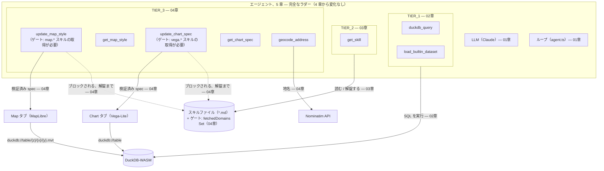
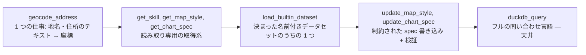

# 05. 自分のスタックを選び取る

> 4 章は、ラダー全体でもっとも柔らかい失敗で終わりました——ツールが足りないのでも、知識が足りないのでもなく、ツール・スキル・ゲートのすべてが設計どおりに働いていてさえ、モデルが時折違う手に手を伸ばす、という失敗です。その締めの一文が診断をそのまま名指ししていました: **「どの手か」は、そもそも仕組みの問題ではなかった。** それを直すことは、バリデータにもう 1 つ `if` 文を足すことではなく、時間をかけてツールスタック全体をどう選び取り、優先順位を付け、進化させるかという問題です。本章は新しい階層を足しません——`ENABLED_TOOLS` は 4 章が残したままです。代わりに、1〜4 章がその全体の弧を費やして証拠を積み上げてきた設計理論を手渡し、そのうえであなた自身のデータとチャレンジメニューへ送り出します。

## ① これまでのエージェント

これがラダーの最後の段です。このワークショップがエージェントに手渡すすべてのツールは、すでに盤面に揃っています——[04. 専用ツール](./04-specialized-tools.md) が残したとおりで、本章は新しい矢印を 1 本も生やしません。



- **LLM + ループ** — 1 章の骨組み: 頭脳と往復だけで、手は一切無い。
- **`duckdb_query`, `load_builtin_dataset`（`TIER_1`）** — 2 章の、たった 1 つの汎用ツール（1 章のデモを最後まで動かし続けるために必要だったローダーを含む）。
- **`get_skill`（`TIER_2`）** — 3 章のオンデマンド知識。system prompt に恒久的に埋め込む代わりに `*.md` ファイルから読む。
- **`update_map_style`, `get_map_style`, `update_chart_spec`, `get_chart_spec`, `geocode_address`（`TIER_3`）**、そして 2 つの設定ツールを包む **前提ゲート** —— 4 章が地図とグラフに与えた手と、どちらが走る前にも正しい作法が読まれることを保証する強制。

```ts
export const ENABLED_TOOLS: readonly ToolName[] = [...TIER_1, ...TIER_2, ...TIER_3];
```

`src/lib/ai/toolTiers.ts` のこの行は 4 章から変わっていません——そしてこれはアプリが **既定で出荷する** 値でもあります。本章はこの配列を伸ばしません——以下のどの課題も、まさに上の 8 つのツールの上で走ります。ラダーは完成しました。残っているのは足りないピースではなく、判断です: この 8 つのうちどれに手を伸ばすか、そしていつ、自分自身の問題が 9 つ目に値するか。

**欠けている④についての注記。** これまでのすべての章は「ここで壊れる」——次の章が存在して埋めることになる、有機的な破綻——で締めくくられてきました。本章にはそれがありません。見落としではありません。4 章自身の締めの段落が、その理由をすでに名指ししていました: 4 章が終わったところにあったツール違い・パラメータ違いのつまずきは、バリデータにもう 1 つルールを足せば済む仕組みの隙間ではなく——設計の問いです。下の②はその設計理論であり、⑤はそれを実際に適用する場所です。この先をさらに埋める 6 章は待っていません。

## ② 新しいピース — 設計理論

### 1. 専用 ↔ 汎用

エージェントが持つすべてのツールは、1 本の軸のどこかに位置しています——単純で誤用しにくい引数を持つ狭い仕事の側から、何を尋ねても意見を持たないフルの問い合わせ言語の側まで:



| ツール                                         | 仕事                                                          | 床 — 箱から出してすぐ正しく使えるか                                                                                                                       | 天井 — 最終的にどこまでできるか                                                                                          |
| ---------------------------------------------- | ------------------------------------------------------------- | --------------------------------------------------------------------------------------------------------------------------------------------------------- | ------------------------------------------------------------------------------------------------------------------------ |
| `geocode_address`                              | 地名 / 住所 → 座標                                            | 非常に低い——自由入力の文字列を 1 つ渡すと、順位付けされたマッチのリストが返る。誤用しにくい。                                                             | 低い——ジオコーディングしかしない。                                                                                       |
| `get_skill`, `get_map_style`, `get_chart_spec` | 読み取り専用の取得系（スキル本文 / 現在の spec）              | 非常に低い——スキル id のリストか素のテーブル名だけ。間違えようがない。                                                                                    | 設計上、低い——モデルに情報を伝えるだけで、世界に働きかけることは一切ない。                                               |
| `load_builtin_dataset`                         | 同梱された、決まった名前付きデータセットのうち 1 つを読み込む | 非常に低い——閉じた enum（`z.enum(TABLE_NAMES)`）。誤用しようがない。                                                                                      | 意図的に低い——「ローダーであって、2 つ目の汎用の手ではない」（2 章）。                                                   |
| `update_map_style`, `update_chart_spec`        | 制約された宣言的 spec を書く（paint/layout、mark/encoding）   | 中——先に `map.*`/`vega.*` スキルが取得されていることをゲートされ（4 章②-3）、それでもなお惜しいミスを捕まえるのに検証 + 自動修復（4 章②-2）に頼っている。 | 中〜高——paint 接頭辞 / mark+encoding のスキーマに縛られつつも、幅広い可視化ができる。                                    |
| `duckdb_query`                                 | 任意の単文 SQL を実行する                                     | 高い——自由入力の `sql` 文字列。正しく使うには正しい CRS・軸順・結合キーを知っている必要があり、まさに 2 章と 3 章が間違える様子を見せたその部分。         | 最高——天井そのもの: SQL + spatial 拡張で表現できることなら何でも、このワークショップがツールを書かなかった問いも含めて。 |

床と天井は 1 本の連続体ではなく、2 つの別々の軸です。**低い床** とは、モデルが毎回、最初から、何も追加で学ぶことなく正しくやれることを意味します——`geocode_address`、`load_builtin_dataset`、読み取り専用の取得系はみなそこにいます。**高い天井** とは、誰も予期していなかった問いにツールが答えられることを意味します——`duckdb_query` は、入力空間が「SQL で表現できることは何でも」であるレジストリ唯一のツールで、その端に 1 つだけで立っています。

**良いエージェントには両方が要ります。** 低い床の狭いツールだけで組み立てたエージェントは、設計者が予見しなかった問いには決して答えられません——「この住所から 30km 以内に自治体はいくつあるか」に対応する `geocode_address` 形のツールは存在しません。`duckdb_query` だけで組み立てたエージェントは、クエリのたびに CRS・軸順・結合キーを記憶から正しく引き出さなければなりません——これはまさに、2 章と 3 章がその全体の弧を費やして診断し、直してきた失敗そのものです。`update_map_style` と `update_chart_spec` が意図的に中間に座っているのも同じ理由です: 検証と自動修復（4 章②-2）が効くくらい制約されていて、それでいて誰も事前に書かなかった paint ルールや encoding を表現できるくらい汎用的です。スタックを選び取るとは、それぞれの端をどれだけ必要とするかを、意図的に選ぶことです。

### 2. 失敗パターン → 仕組み

このワークショップが出会った失敗はすべて本物です——仕込みは 1 つもありません。以下は、ラダー全体を 1 つの表にまとめたものです: 何が壊れたか、どこでその破綻を見届けたか、そしてどの仕組みがギャップを閉じたか。

| 経験した失敗                                                                                                                                                                                                                                       | 壊れた章                                                           | 何がそれを直したか                                                                                                                                     | 到着した章            |
| -------------------------------------------------------------------------------------------------------------------------------------------------------------------------------------------------------------------------------------------------- | ------------------------------------------------------------------ | ------------------------------------------------------------------------------------------------------------------------------------------------------ | --------------------- |
| **手が一切無い** — エージェントは実行するはずの SQL を説明できても、データに触れなかった。                                                                                                                                                         | 1 章④                                                              | **ツール** — `duckdb_query` と `load_builtin_dataset`。モデルが実際に呼べる手。                                                                        | 2 章                  |
| **知識の欠落** — `duckdb_query` はどの文も文句なく実行したが、生の WGS84 に対する `ST_Area` とメートル/度の取り違えは、モデルがどの CRS か・どのフラグか・どの単位かを確実には知らないことを示した。能力のギャップではなく、知識のギャップだった。 | 2 章④                                                              | **オンデマンドで取得するスキル**（progressive disclosure）— `get_skill` と `duckdb.spatial`。system prompt を恒久的に太らせる代わりに。                | 3 章                  |
| **信頼できない作法** — `map.styling` / `vega.basics` を一度も読まないまま、当てずっぽうの paint プロパティで `update_map_style` / `update_chart_spec` を呼ぶのを、何も止めていなかった。                                                           | 4 章②-3 で名指し                                                   | **ゲート** — `requireSkill` は、正しい domain のスキルがこのセッションで取得されるまで実行を拒否する。モデルが従うことを選ぶかどうかには一切頼らない。 | 4 章                  |
| **惜しいミスのパラメータ** — NFC・大文字小文字が揺れた列名、ジオメトリの種類に合わない paint 接頭辞、コンパイルできない Vega-Lite spec。                                                                                                           | 4 章④の「パラメータ違い」の箇条書きで実演済み（仕組みは②-2で構築） | **検証 + 自動修復** — `matchColumn` が惜しいミスを直し、paint 接頭辞チェックが残りを弾き、`compile()` が壊れた spec を UI に届く前に捕まえる。         | 4 章                  |
| **ツール選択の誤り** — 曖昧なプロンプト（「…の面積を可視化して」）が、地図を思い描いていたのにグラフになる、あるいはその逆になることがある——ツール・スキル・ゲートのすべてが設計どおりに働いていたにもかかわらず。                                 | 4 章④の「ツール違い」の箇条書き                                    | **より鋭い description とその発火条件** — このワークショップが用意した仕組みではなく、本章があなた自身に適用するよう教えている設計判断。               | 4 章 → **今、あなた** |

「壊れた章」の列と「到着した章」の列を並べて下へ読んでいくと、あるパターンが飛び出してきます: 最後の 1 行を除くすべての修正が、アプリが出荷する新しい仕組みとして、まさに次の章に着地しています。最後の行だけが意図的に違います——「発火条件」ツールをあなたに手渡してくれる 6 章はありません。より良い `description` を書くこと、ツールが主張する範囲を狭めること、1 つの欲張ったツールを 2 つの単一責務のツールに分けること——これらはすべて同じ種類の修正であり、ここから先はあなた自身のツールの上で、あなた自身が行うものです。

### 3. 自分のスタックを進化させる

上の 8 つのツールは、誰かが一気に書いた spec から生まれたものではありません。それぞれが存在するのは、汎用ツールが同じ形の問いで、章を追うごとにつまずき続けたからです——上の表は、まさにそのプロセスを 1 つの長い実例としてまとめたものです。同じプロセスを、あなた自身のデータの上で繰り返すのはあなたの番です:

1. **まず汎用から始める。** `duckdb_query`——それと、あなたが書くスキル（3 章）——を、まずあなた自身のデータセットに向けます。地図やグラフに描く以外のほとんど全部をこれが運びますし、アプリはそちらのためにもすでに `TIER_3` を有効にして出荷されています（①参照）。
2. **エージェントが実際にすることを記録する。** ツールカードを開きます。1 つの質問あたりのツール呼び出し数を数えます——2 章の DevTools 考古学と 4 章④の監査が、あなたに叩き込んだのと同じ習慣です。次のステップで自己修正する 1 回きりの間違った呼び出し（2 章の `pref` タイプミス、4 章の惜しいミスの列名）は、ループが設計どおりに働いているだけです——それは行動すべき合図ではありません。
3. **1 回の間違いではなく、繰り返される形を見る。** すべての近接分析の質問が 4〜5 回の `duckdb_query` 往復を必要とし、そのうち 1 回が自己修正する前に必ず間違った投影に着地しているなら、それは「モデルが SQL が下手」なのではありません——2 章が名指しした失敗の一族（間違った単位での `ST_Buffer` / `ST_DWithin`）が、あなた自身の仕事の中で名前を付けるに値するほどありふれたタスクの形の上で、繰り返し起きているのです。
4. **スキルかツールかを決める。** 欠けているものが事実や作法——投影のレシピ、色ランプのルール——なら、スキルを書きます（3 章: markdown 1 ファイル、コード変更なし）。欠けているものが、自分自身の検証済みの形と自分自身の単一の仕事を持つ、繰り返される多段階の操作なら、ツールを切り出します（4 章の `buffer_analysis` がその実例です: 2 章が一度も試さなかった同じ投影の罠を、毎回記憶から導き直す代わりに、検証済みの `execute` に 1 度だけ焼き込んだもの）。
5. **経験則: 1 つの質問あたりのツール呼び出しが多すぎることが、においの正体です。** 同じタスクの形の上で `duckdb_query` の往復が 1 回増えるたびに、投影・結合キー・単位を間違えるチャンスがもう 1 つ増えます——まさに `buffer_analysis` が 4 章で 1 回の検証済み呼び出しに畳み込んだ、あの罠です。新しいチャットをまたいでも同じ種類の質問で呼び出し数が増え続けるなら、それはモデルがそのツールが下手なのではなく、そのツールがモデルにとって難しすぎるということです。

これが、ラダー全体が 1 章ずつ実演してきたループです: 汎用ツールを作る（または借りる）、それが実データで失敗するのを見届ける、その失敗が求めるピース——スキルかツール——をちょうどだけ足す。1 章から 4 章までは、それを geo-chat 自身のサンプルデータセットの上でやりました。ここから先は、あなた自身のデータの上で走らせるのはあなたの番です。

## ③ 動かしてみる

本章で試す新しいツールはありません——`ENABLED_TOOLS` はすでに 4 章が残した値、アプリの出荷時の既定値のままです。今回「動かしてみる」とは、その完成したスタックを、ワークショップのサンプルデータセットではなく **あなた自身の** データに向けることを意味します。それが下のチャレンジメニューです。

## ⑤ 手を動かす課題 — チャレンジメニュー

> ここまでで、エージェント = LLM + ツール + ループ + コンテキストを分解し、ツール（4 章）とスキル（3 章）を自分で作れるようになりました。最後は、それを **自分のデータと業務課題** に適用します。難易度順に並べたメニューから、興味のあるものを選んでください。全部やる必要はありません。**1 つを最後までやり切る** 方が学びが深いです。

各課題は **ゴール / ヒント / 学べること** の 3 点で書いています。詰まったら [appendix-troubleshooting.md](./appendix-troubleshooting.md) と、各スキル md 本文を頼ってください。

---

### (1) 自分の CSV を都道府県にコロプレス表示 ★

**ゴール**: 手元の CSV（都道府県別の何かの指標）を読み込み、`japan_prefectures` に結合して、指標でコロプレス（塗り分け）地図を作る。

**ヒント**:

- SQL タブか、チャットで「この URL の CSV を読み込んで」。CSV は `read_csv_auto`。
- 結合キーは都道府県名かコード。両テーブルを `DESCRIBE` して名前と型を合わせる（全角/半角・NFC の揺れに注意。`duckdb.basics` スキル参照）。
- `japan_prefectures` は GeoParquet なので `geom` は読込時点で `GEOMETRY`（変換不要）。自分で用意した空間データを使う場合は、まず `DESCRIBE` で型を確認し、`BLOB`(WKB) や WKT 文字列なら `ST_GeomFromWKB` / `ST_GeomFromText` で `GEOMETRY` に変換する。
- 結合結果を `CREATE TABLE` し、`SUMMARIZE` で指標の実レンジを見てから `update_map_style` の `interpolate` の区切りに使う。
- **さらに簡単な拡張**: よく使うデータなら、`src/lib/ai/builtinDatasets.ts` に 1 行足して **組み込みデータセット** にすると、以後はチャットで名前を言うだけでエージェントが自分で読み込みます（[00-setup.md](./00-setup.md) で触れた仕組み。system prompt 経由でモデルに教える②の層）。

**学べること**: 属性テーブルとジオメトリの空間結合、`SUMMARIZE` 起点の色設計、自分のデータを最短でエージェントに載せる流れ。

---

### (2) `ST_Buffer` + `ST_Intersects` の近接分析ツール ★★

**ゴール**: 4 章で作った `buffer_analysis` を発展させ、「ある地物から N メートル以内に入る別テーブルの地物」を抽出する **近接分析ツール** を作る（到達圏・影響圏の定番）。

**ヒント**:

- 4 章のツールをお手本に、`ST_Buffer`（投影 → メートル → 4326 戻し）でバッファを作り、`ST_Intersects` / `ST_DWithin` で相手テーブルと交差判定する 1 本の `CREATE TABLE` にまとめる。
- `ST_DWithin(a, b, 距離)` は距離が座標系の単位。緯度経度のままなら「度」なので、投影してから使うか `ST_Distance_Sphere` を使う（`duckdb.spatial` スキル参照）。
- description（②プロンプト）に「入力 2 テーブル・距離の単位・出力は交差した地物」を明記。
- `src/lib/ai/tools/index.ts` への **登録を忘れない**。

**学べること**: 複数テーブルをまたぐ空間ツールの設計、投影と距離単位の扱い、「単一責務のツールを組み合わせる」という設計判断。

---

### (3) 業務で繰り返す作業をスキル化する ★★

**ゴール**: あなたが仕事で毎回やる分析・前処理・可視化の手順を、スキル md 1 枚にする。

**ヒント**:

- 3 章のテンプレートを使い、`<domain>/<name>.md` として `src/lib/ai/skills/` に置く。
- 本文に「いつ使うか」「具体的な SQL / spec の型」「よくある間違いと直し方」を書く——既存の `duckdb/spatial.md` や `map/geospatial.md` の粒度が良いお手本。
- `tasks` に日本語キーワードを入れておくと、日本語プロンプトから引かれやすい。
- 追加後は **開発サーバを再起動** し、`get_skill` のカタログに出るか確認。

**学べること**: 暗黙知を「エージェントが読める作法」に言語化する力。これが翌週から自分の業務に効く、いちばん実用的な転移。

---

### (4) PLATEAU の 3D 都市モデル属性を API で取得してテーブル化 ★★★

**ゴール**: PLATEAU（国交省の 3D 都市モデル）の属性データを配信 API から取得し、DuckDB のテーブルに載せて分析・可視化する。

**ヒント**:

- PLATEAU 配信サービス（`api.plateauview.mlit.go.jp`）の REST / GraphQL API で、データカタログや配信 URL、属性情報を取得できる。詳細は PLATEAU の[配信サービスのドキュメント](https://www.mlit.go.jp/plateau/)と API 仕様を参照。
- API のレスポンス（JSON）を DuckDB で `read_json_auto` から読み込むか、取得した GeoJSON / MVT を `ST_Read` で読む。
- 建物単位の属性（用途・階数・高さ等）が取れたら、`update_map_style` の `match` / `step` で用途別に塗り分ける。属性が多いので `DESCRIBE` で構造把握を丁寧に。

**学べること**: 外部 GIS API とエージェントの接続、JSON 属性の SQL 化、実データの「汚れ」に対処するツール設計（型の揺れ・欠損）。

---

### (5) Overture Maps の Parquet を DuckDB で直接読む ★★★

**ゴール**: Overture Maps の巨大 GeoParquet を、ダウンロードせずに DuckDB から直接クエリして、関心領域だけ抽出・可視化する。

**ヒント**:

- DuckDB の `spatial` / `httpfs` で、リモート Parquet を `read_parquet('s3://...')` や `https://...` から読む。bbox でプッシュダウンして必要な範囲だけ取ると軽い。
- ブラウザ内 DuckDB-WASM ではメモリ上限（4GB）に注意。まず `LIMIT` と `WHERE bbox...` で絞る。`spatial` を LOAD した状態で GeoParquet を読めば `geom` は通常 `GEOMETRY` になるが、**ジオメトリ列が `BLOB`(WKB) のままの場合** は `ST_GeomFromWKB` で変換する（`DESCRIBE` で確認）。
- 抽出結果を `CREATE TABLE` し、いつもの `update_map_style` で描く。

**学べること**: クラウド上の大規模 GeoParquet を「その場で」扱う DuckDB の強み、ブラウザ内実行の制約（メモリ・CORS）と、それを踏まえたクエリ設計。

---

### (6) フリー: 自分のデータのために「ツール 1 個 + スキル 1 枚」を設計する ★★★

**ゴール**: あなたの業務データを 1 つ選び、それに対して **ツールを 1 個** と **スキルを 1 枚** 設計・実装し、エージェントから使えるようにする。

**ヒント**:

- ツール = 「アプリが実際に実行する処理」、スキル = 「その処理を正しく使う作法」。この 2 つの役割分担（4章・3章）を意識して切り分ける。
- 開発プロンプトのテンプレートは [appendix-prompts.md](./appendix-prompts.md)。
- 「1 ツール = 1 責務」「description に使いどころを書く」「index.ts に登録」を守る。

**学べること**: 転移ゴールそのもの——自分の課題に対してツールとスキルを設計し、その挙動を API レベルで説明できる状態。

---

### クロージング — 自分の言葉にする

最後は解説ではなく、**問い** で終えます。手を止めて、次の一文を書いてください。

> **あなたの仕事のデータで、エージェントに最初に持たせるツールは何ですか？
> その `description` を 1 文で書いてください。**

書けたら、隣の参加者と **交換** してみてください。相手の 1 文を読んで、「そのツールはいつ呼ばれるべきか」「引数は何か」「何を返すべきか」が想像できるか話します。

`description` が書ければ、ツールが設計できます。
ツールが設計できれば、エージェントが作れます。
——それが、このワークショップの持ち帰りゴールに、あなたが到達したという証拠です。

お疲れさまでした。越えられない壁は、もうありません。

## ⑥ 開発プロンプト例

このワークショップが使ったすべての開発プロンプトのテンプレート——4 章で `buffer_analysis` を作ったもの、3 章でスキル md の下書きを作ったもの、そして汎用の「ツールを追加する」「スキルを追加する」「エージェントをデバッグする」テンプレート——は [appendix-prompts.md](./appendix-prompts.md) に集約されています。上のどのチャレンジを選んでも、同じ 3 原則が当てはまります: お手本ファイルを名指しする、制約を明示する（入力スキーマ、単一責務、結果の切り詰め、登録先）、そして検証を要求する（`npm run typecheck`、「`index.ts` に登録されているか」、「description に使いどころが書かれているか」）。⑤のクロージングの問いで書いた `description` を「ツールを追加する」テンプレートに書き込んで、Claude Code などに渡してください——その 1 文だけで、プロンプトの大部分はもう出来上がっています。

---

前の章: [04. 専用ツール](./04-specialized-tools.md)。[コースアウトラインと付録](./README.md) に戻る。
