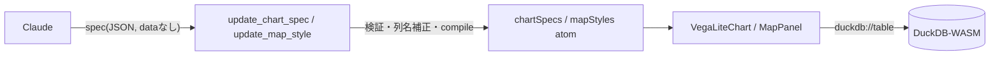

# 05. 宣言的 spec という境界線

> 04 章で「良いツールは良い `description` から」と学びました。本章はもう一段深く、
> **ツールが何を LLM に書かせるべきか** を扱います。答えは「命令的なコードではなく、
> 検証できる **宣言的な spec（データ）**」。これが AI と GIS を繋ぐ設計の中心原理です。

## ① 概念解説 — なぜ spec 駆動が AI に強いのか

LLM に「地図を塗る処理」を作らせる方法は 2 つあります:

- **(A) 命令的コード生成** — 「地図を塗る JavaScript を書いて」と頼む。
  返ってくるのは実行手順のコード。
- **(B) 宣言的 spec 生成** — 「この色ルールで塗って」という **設定データ（JSON）** を書かせ、
  アプリ側が描画する。

geo-chat は徹底して **(B)** を採ります。理由は、spec が **コードではなくデータ** だからです。
データであることの利点は、そのまま「生成 → 検証 → 修復のループが回せる」ことに直結します:

| spec がデータだと…       | できること                                                     |
| ------------------------ | -------------------------------------------------------------- |
| **検証可能（validate）** | 適用前にスキーマ検証・コンパイルで「壊れた spec」を弾ける      |
| **差分可能（diff）**     | 現在の spec を読み、一部だけ変えて返せる（全部作り直さない）   |
| **修復可能（repair）**   | 誤った列名・不正な式を機械的に補正して通せる                   |
| **実行分離**             | 「何を描くか（spec）」と「どう描くか（アプリ）」が分かれている |

命令的コードでこれをやるのは困難です。任意の JS を「安全か・正しいか」機械判定するのは
一般に不可能で、実行するしかなく、実行は副作用と危険を伴います。**宣言的 spec は
『実行せずに正しさを検査できる』境界線** を引いてくれる——ここが決定的な違いです。

この構図（spec = データだから検証・修復できる）は、02 章で触れた 3 つの基盤技術に共通します。
本章では地図（MapLibre style）とグラフ（Vega-Lite）の 2 つで具体的に見ます。

## ①-b ミニ解説 — MapLibre style と Vega-Lite

- **MapLibre GL JS** — OSS の地図描画ライブラリ（Mapbox GL JS のフォーク）。
  地図の見た目は **JSON の style spec** で宣言的に書きます。「この列の値に応じてこの色」
  という **データ駆動の式**（`["interpolate", ...]`, `["match", ...]`, `["get", "col"]`）も
  すべて JSON の配列で表現します。**AI との相性**: スタイルがコードでなくデータなので、
  生成された式を機械的に検証・修復・差分適用できます。
- **Vega-Lite** — 宣言的可視化文法。グラフを **JSON spec** で書くと、ライブラリが描画に変換。
  `mark`（棒・線・点…）と `encoding`（どの列を x/y/色に割り当てるか）を書くだけ。
  **AI との相性**: 同じく spec がデータなので、`compile()` による事前検証や
  スキーマ照合ができます。

## ② コードの読みどころ — 検証と修復が仕込まれた 2 つのツール

### グラフツール — `src/lib/ai/tools/updateChartSpec.ts`

`update_chart_spec` は `{ table, spec }` を受け取り、**適用前に 3 段階の検証** をかけます。

1. **注入キーの禁止** — `data` / `width` / `height` は **アプリが描画時に注入** するので、
   モデルが書いていたら弾きます。

    ```ts
    const INJECTED_KEYS = ['data', 'width', 'height'];
    const present = INJECTED_KEYS.filter(k => k in parsed);
    if (present.length > 0) return { error: `Remove [${present.join(', ')}] ...` };
    ```

2. **列名の照合と自動補正** — `encoding` の各 `field` が実在列か照合し、
   大文字小文字や Unicode 正規化（NFC）の差なら **自動で直して** `corrected` に記録します
   （`eachEncodingField` + `matchColumn`）。存在しない列なら、有効な列名一覧を添えて error。

3. **コンパイル・プリフライト** — ダミーデータで `compile()` を実行し、
   **壊れた spec は UI に届く前にここで失敗** させます。エラーはそのままモデルに返します。

    ```ts
    compile({ ...parsed, data: { values: [] }, width: 300, height: 200 } as never);
    ```

この 3 段は、まさに「検証 → 修復 → （失敗なら）エラーをモデルに返して再挑戦」のループです。
モデルは返ってきた error を読んで自分で直せます——**spec がデータだからできる芸当** です。

### 地図ツール — `src/lib/ai/tools/updateMapStyle.ts`

`update_map_style` は `{ table, geometryType, paint, layout? }` を受け取り、こう検証します。

1. **ジオメトリ列の存在確認** — 無ければ「地図に出せない」と error。
2. **paint 接頭辞の検証** — `geometryType` に対応する接頭辞以外の paint キーを弾きます。

    ```ts
    const PAINT_PREFIX = { point: 'circle-', line: 'line-', polygon: 'fill-' };
    const badKeys = Object.keys(paint).filter(k => !k.startsWith(prefix));
    if (badKeys.length > 0) return { error: `Paint properties [...] are not valid ...` };
    ```

    （ポリゴンに `circle-color` を指定するようなミスを、適用前に説明付きで弾く。）

3. **`["get", 列名]` の照合と自動補正** — 式の中の全 `["get", col]` を集め
   （`collectGetColumns`）、実在列と照合し、近いミスは **書き換えて** から適用します
   （`rewriteGetColumns`）。日本語列名で頻発する **NFC 正規化・大小文字の揺れ** を
   `matchColumn` が吸収します。存在しない列は error。

`collectGetColumns` / `rewriteGetColumns` / `matchColumn` は
`src/lib/ai/tools/columnMatch.ts` にあります。**「LLM はよく惜しいミスをする」前提で、
機械的に補正できる余地を設計に組み込んでいる** のがポイントです。

### spec と実行の分離 — `duckdb://` スキーム（両側）

「何を描くか（spec）」と「データそのもの」は分離されています。spec には **データを書かず**、
描画時に **`duckdb://<table>`** という URL を差し込み、実行系が DuckDB から読み出します。

- **グラフ側** `src/components/chart/VegaLiteChart.tsx` — カスタム Vega Loader が
  `duckdb://<table>` を横取りし、`SELECT * FROM "<table>"` を実行して行を返します。
  `src/components/workspace/ChartPanel.tsx` の描画時に `data: { url: "duckdb://<table>" }`、
  `width/height: 'container'` を **注入** します（だから spec 側で書いてはいけない）。
- **地図側** `src/lib/map/tileProtocol.ts` — MapLibre に `duckdb://<table>/{z}/{x}/{y}.mvt`
  プロトコルを登録し、タイル要求のたびに DuckDB で MVT を生成して返します（02 章の深掘り）。

同じ `duckdb://` の発想が地図とグラフの両側にあり、**spec は「設計図」、データは実行時に
DuckDB から供給** という統一構造になっています。



## ③ 壊す実験 #5 — 「JS を書いて」vs「spec を書いて」

エージェントに、同じ地図描画を **2 通り** で頼み、検証可能性を比べます。

**(A) 命令的コードを頼む:**

```
japan_cities を人口で塗り分ける JavaScript のコードを書いて
```

→ モデルはそれらしい JS を **テキストで** 返します。しかしこのアプリはそれを
**実行しません**（地図は変わりません）。仮に実行できたとして、その JS が正しいか・
安全かを事前に検証する術はありません。列名が違っても気づけません。

**(B) spec を頼む（正規ルート）:**

```
japan_cities を人口で塗り分けて地図に出して
```

→ モデルは `update_map_style` を呼び、`paint` の JSON を渡します。アプリは適用前に
paint 接頭辞・列名を検証し、惜しいミスは補正し、地図に反映します。**列名を間違えれば
error が返り、モデルは自分で直します。**

> **見える原理**: 命令的コードは「実行してみるまで正しさが分からない」。
> 宣言的 spec は「実行せずに検証・修復・差分できる」。AI に仕事をさせるツールは、
> できるだけ **後者の境界線** の上に設計する——これが GIS × LLM 設計の中心原理です。

## ④ 手を動かす課題 — Chart タブで spec を壊す

geo-chat は学習のために **Chart タブに spec エディタを露出** しています
（`src/components/workspace/ChartPanel.tsx`）。ここで手で spec を壊し、検証を体感します。

1. 任意のテーブルを選び Chart タブを開く。左のエディタに Vega-Lite spec の雛形が出ます
   （`data`/`width`/`height` を含まない `mark` + `encoding` だけ）。
2. **Apply** を押してグラフが出ることを確認。
3. `encoding` の `field` を **存在しない列名** に書き換えて Apply。何が起きるか観察する。
4. わざと **不正な JSON**（閉じ括弧を消す）にして Apply。エディタ下に
   パースエラーが出ることを確認する。
5. `data` キー（例 `"data": {"url": "x"}`）を足して Apply、あるいは同じ spec を
   チャットからエージェントに渡してみて、**ツール側が `data` を禁止する** 挙動と比べる。

> エディタの手編集は「アプリのローカル検証」、チャット経由は「ツール（②プロンプト）の検証」。
> 同じ壊れ方でも、どこで・どんなメッセージで弾かれるかを見比べると、
> 検証がどの層にあるかが立体的に見えます。

## ⑤ 開発プロンプト例

自作ツールを「命令的」ではなく「宣言的 spec」設計にできているか、AI にレビューさせる例:

```
このリポジトリの src/lib/ai/tools/updateMapStyle.ts と updateChartSpec.ts を読んで、
両者に共通する「宣言的 spec を LLM に書かせ、適用前に検証・列名補正・コンパイルする」
設計パターンを抽出して。そのうえで、私が追加した <ツール名> が同じパターンに
沿っているか（検証はあるか、命令的コードを生成させていないか）をレビューして。
```

次は [06. スキル = md ファイル 1 枚](./06-skill-system.md)。ここまでで
「地図やグラフの spec には作法がある」と分かりました。その作法を **必要なときだけ**
モデルに注入する仕組み——スキルシステム——を分解し、自分でスキルを 1 枚書きます。
