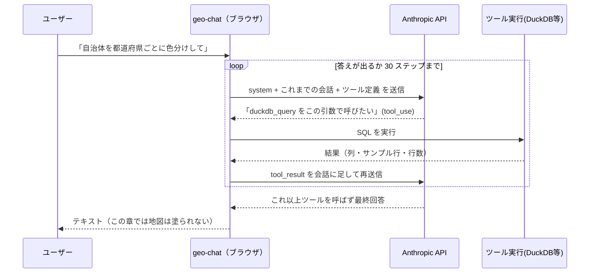

# 20. 最初のツールとループ — データに触れる手

> 10 章のエージェントは口だけでした。ここで **手を 3 本**（SQL 実行・データ読込・
> ジオコーディング）持たせます。すると初めて「エージェントループ」が動き出します。
> このワークショップの心臓部——**約 100 行のコード** と **DevTools の生の HTTP 往復** の
> 両方から、ループとステートレス性を分解します。

## ① この章の状態

```bash
git switch chapter/01-data
# 開発サーバを再起動（Ctrl+C → npm run dev）
```

このブランチには **データ層まで** が入っています。`createTools()` の
`// CHAPTER SEAM: data tools` が復活し、3 つのツールが載ります:

| ツール                 | 何をするか                                              |
| ---------------------- | ------------------------------------------------------- |
| `duckdb_query`         | SQL を **1 文** 実行し、列型・サンプル行・行数を返す    |
| `load_builtin_dataset` | 組み込みデータ（`japan_cities` 等）をテーブルに読み込む |
| `geocode_address`      | 地名 / 住所を座標に変換（Nominatim）                    |

- **ある**: データを読む・SQL を回す・テーブルを作る手。
- **無い**: 地図を塗るツール・グラフを作るツール・スキル。
  つまり **データは触れるが、可視化はまだできない**。

## ② 観察

### 観察 1: through-line プロンプト — データは回るが、地図は塗れない

```
自治体を都道府県ごとに色分けして地図に表示して
```

**実機での挙動**（ツールカードの並び順）:

1. `load_builtin_dataset(japan_cities)` — 組み込みデータを **自分で** 読み込む。
2. `duckdb_query`（`SELECT … LIMIT 5`）— スキーマとサンプルを探索。
3. `duckdb_query`（都道府県ごとの `COUNT`）— 集計してみる。
4. `duckdb_query`（**`CREATE TABLE cities_by_prefecture`** … `ORDER BY` prefecture, city）—
   結果テーブルを作る。

ここまでは 10 章から劇的な進歩です。実データを読み、本物の SQL を回し、テーブルを作った。
**ところが、地図は塗り分けられません。** 地図を塗るツールがこのブランチには無いからです。

そしてここが観察の肝——エージェントはこう報告します:

> 「**Map タブをクリックすると、都道府県ごとに異なる色で自治体が表示されます。**
> 同じ都道府県内の自治体は同じ色でグループ化されています。」

**これは過剰約束（over-claim）です。** 既定の地図スタイルは **単色** なので、Map タブを
開いても色分けは起きません。モデルは「地図を塗るツールを持っていない」ことと
「既定の地図が単色である」ことを知らないため、**できないことを『できた（タブを開けば見える）』
かのように言ってしまう** のです。限界を「できない」ではなく「準備は整った・タブを見て」と
言い換えてしまう——これはツール不足が生む典型的なズレです。

> **持ち帰り**: データ層だけのエージェントは、**準備して説明することはできるが、
> 描画はできない**。しかも自分の限界に気づかず過剰約束することがある。この隙間こそ、
> 次章の可視化ツールが埋める部分です。

### 観察 2: ループを DevTools で暴く

コードに入る前に、ループが **実際に流れる HTTP** であることを目で見ます。

1. ブラウザの **DevTools** を開き、**Network** タブを選ぶ。
2. フィルタに `api.anthropic.com` と入力する。
3. 上の through-line プロンプトをもう一度送る。
4. `messages` へのリクエストが **複数本** 現れる。**この本数を数えてください。**

「1 質問 = 1 API 呼び出し」ではありません。ツールを呼ぶたびに往復が起きるので、
上の例なら 4〜5 回の SQL 実行に対応して複数のリクエストが並びます。**リクエスト本数 =
ループが回った回数** です。

さらに、**2 本目以降のリクエストの `messages`** を開いてください。1 本目には無かった
`tool_use`（モデルの要求）と `tool_result`（実行結果）が **追記** されているのが見えます。
これが次に説明する「ステートレス」の実物証拠です。

## ③ なぜ — ループとステートレス、そしてツールの解剖

### エージェントループの正体

10 章で「エージェント = LLM + ツール + ループ + コンテキスト」と言いました。
その **ループ** の実体は、驚くほど単純な往復です:



### `src/lib/ai/agent.ts` を精読する（約 100 行）

`runAgent()` はワークショップの「教材ファイル」です。要点だけ追います。

**ブラウザから直接 Anthropic を呼ぶ:**

```ts
const anthropic = createAnthropic({
    apiKey: options.apiKey,
    headers: { 'anthropic-dangerous-direct-browser-access': 'true' },
});
```

通常 Anthropic はブラウザからの直接呼び出しを **ブロック** します（キー漏洩防止）。
このヘッダはそれを **明示的にオプトイン** します。許されるのは、
**ユーザー自身が自分のキーを入れているワークショップ用アプリ** だからです
（本番のマルチユーザーアプリなら、キーはサーバに置いてプロキシします）。

**streamText — ループの宣言:**

```ts
const result = streamText({
    model: anthropic(options.model),
    system: buildSystemPrompt(options.promptContext), // ← コンテキスト（②プロンプト）
    messages: options.messages, // ← これまでの全会話
    tools: options.tools, // ← この章では 3 つのツール定義
    temperature: 0, // 再現性重視
    maxOutputTokens: 8000,
    stopWhen: stepCountIs(30), // ← ループの停止条件
    abortSignal: options.abortSignal,
});
```

Vercel AI SDK の `streamText` がループそのものを引き受けます。核心は
**`stopWhen: stepCountIs(30)`**——「モデルがツールを呼ばずに回答するまでステップ
（ツール呼び出し→結果→モデル）を繰り返し、最大 30 で安全に打ち切る」。この 1 行が
「ループを回す」の正体です。あなたが書くのは停止条件だけ。

**豊かなストリームを 5 種類のイベントに翻訳:** `result.fullStream` にはテキスト断片・
`tool-call`・`tool-result`・`tool-error`・`error` が流れてきます。`runAgent` はそれを
UI に必要な **5 種類の `AgentEvent`** に絞って `onEvent` で通知します（DevTools の
Network 実験で見た往復は、このイベント越しにツールカードとして描かれます）。

**会話履歴を返す:**

```ts
const { messages } = await result.response;
return messages; // このターンで生成されたメッセージ（ツール呼び出し含む）
```

このターンで生じたメッセージ（テキスト＋ツール呼び出し＋結果）を返し、
呼び出し側（`useAgentChat`）が履歴に積みます。**次のターンでこれを丸ごと送り直す**
から、モデルは自分の過去のツール呼び出しを「覚えて」いられます。

### 実は、AI はステートレス

上の 2 点をつなぐと、いちばん意外な結論が出ます:

> **モデルは API 呼び出しの間、記憶を一切持たない。** ツール結果を「ただのメッセージ」として
> 会話履歴に追記し、次のリクエストで **履歴まるごと**（system prompt ＋ 全メッセージ ＋
> ツール定義）を **再送信** する。エージェントの「記憶」は、この再送で成り立っている。

これが、観察 2 で DevTools に見えたもの——2 本目のリクエストに `tool_use` と `tool_result` が
追記されていた——の意味です。`streamText` がこの往復を隠すので、かえって意外に映ります。

> **補足**: サーバ側で状態を持つ会話型 API（例: OpenAI の Responses API）や、
> **プロンプトキャッシュ**（Anthropic 対応）で再送コストは下げられますが、**原理そのものは
> 変わりません**。既定のメンタルモデルは「毎回、履歴を丸ごと再送」。これを掴むと、
> **コンテキストウィンドウの上限** や **長いエージェントセッションがなぜ高くつくか** が
> 腑に落ちます。

### ミニ解説: ツールは 4 つの部品でできている

DevTools の 1 本目のリクエストで見た `tools` 配列は、コードでは **4 部品** です。
`src/lib/ai/tools/duckdbQuery.ts` が検体です:

| 部品          | 役割                                                  | 誰が読むか     |
| ------------- | ----------------------------------------------------- | -------------- |
| `name`        | ツールの識別子（`duckdb_query`）                      | モデルとアプリ |
| `description` | **何をするツールで、いつ・どう使うか** の自然言語説明 | **モデル**     |
| `inputSchema` | 引数の型（zod）。モデルが埋める JSON の形             | モデルとアプリ |
| `execute`     | 実際に世界を触る TypeScript 関数。結果を返す          | **アプリ**     |

決定的に重要なのは、**モデルが `execute` の中身を一切見ない** ことです。読むのは
`description` と `inputSchema` だけ。`duckdb_query` の description は
「単文だけ」「探索 SELECT には必ず LIMIT」「可視化する結果は CREATE TABLE」
「返るのは列型・最大 5 行・行数・ジオメトリ有無」と、**使い方の作法** まで書いています。

> **ツールが賢く使われるかは、`description` の書き方で決まる。**
> API 設計（ツール設計）は、そのままプロンプト設計（②の層）である。

そして `execute` の戻り値も②プロンプトの一部です。`duckdbQuery.ts` はモデルを溢れさせない
ため、サンプル行を **最大 5 行**、長い文字列を 200 文字で切り、`CREATE TABLE` を検知したら
「`update_map_style` で描けるよ」という **次の一手を促す hint** を返します（次章で効きます）。

### ミニ解説: DuckDB-WASM — ブラウザの中の空間 DB

エージェントの手 `duckdb_query` が叩いているのは **DuckDB-WASM** です。要点:

- **列指向の分析 DB**（「分析界の SQLite」）。集計・フィルタが速い。
- **Parquet / CSV / JSON / GeoJSON を直接 SQL で読む**。事前 ETL 不要。
- **spatial 拡張**で `ST_Read` / `ST_Area` / `ST_Intersects` など **PostGIS 相当** が使える
  （`globalDB.ts` が起動時に `INSTALL/LOAD spatial` 済み）。
- **WebAssembly でブラウザ内完結**。サーバ不要・データが外に出ない。

そして **SQL は LLM が最も得意な言語の 1 つ**。スキーマとサンプル数行を見せるだけで、
かなり正確なクエリを書きます（自然言語 → LLM → SQL → DuckDB → 結果）。だからエージェントに
良い仕事をさせる鍵は「どうスキーマを見せるか」——それを担うのが `systemPrompt.ts` の
**動的部分** です。`buildSystemPrompt()` は毎ターン、末尾に **現在日付** と
**今 DB にあるテーブルとスキーマ** を差し込みます。02 章で観察した「実データを見て答える」は、
この動的スキーマ注入があって初めて成立します。

**手を動かす（任意・SQL タブ）**: right ペインの SQL タブで、`DESCRIBE "japan_cities";`
→ `SUMMARIZE "japan_cities";` → `SELECT prefecture, count(*) FROM "japan_cities" GROUP BY prefecture ORDER BY 2 DESC;`
を実行してみてください。**エージェントが観察 1 で自動でやったこと** を、あなたが素手で
再現しているのが分かります。ついでに `SUMMARIZE` に **人口列が無い** ことも確認を——
10 章で「埼玉県 63」と誤答したのは、この列が無いのに記憶で答えたからでした。

## ④ 次の章で足すもの — 可視化ツール（ただし検証なし）

観察 1 の過剰約束（「タブを開けば色分けされている」——実際はされない）が、次章の動機です。

> **30 章で足すのは、地図とグラフを実際に塗る可視化ツールです。**
> `update_map_style`（MapLibre の paint を適用）と `update_chart_spec`（Vega-Lite spec を適用）。
> これで through-line プロンプトは、**本当に 47 色のコロプレス** になります。

ただし 30 章の可視化ツールは **わざと検証を外した「素朴（naive）版」** です。
うまくいくときは綺麗に塗れますが、その裏に潜む危うさを暴くのが 30 章の主眼になります。

## ⑤ diff の読みどころ — 可視化層は何を足すか

```bash
git diff --stat chapter/01-data..chapter/02-viz-naive
```

主に現れるファイル:

- `src/lib/ai/tools/updateMapStyle.ts` — 地図に paint を適用する **書き込みツール**（naive）。
- `src/lib/ai/tools/updateChartSpec.ts` — Vega-Lite spec を適用する書き込みツール（naive）。
- `src/lib/ai/tools/getMapStyle.ts` / `getChartSpec.ts` — 現在の spec を **読む** ツール。
- `src/lib/ai/tools/index.ts` — `// CHAPTER SEAM: visualization tools` の中身が復活し、
  4 つのツールが registry に載る。
- `src/lib/ai/systemPrompt.ts` — `VISUALIZATION_GUIDANCE` セクションが足される
  （「polygon → fill-\* を使え」「`["get","col"]` 直接アクセス」等の作法）。

継ぎ目 `// CHAPTER SEAM: visualization tools` の 1 ブロックが、まるごと「可視化層」です。
次章では、この層が加わって **地図が塗れるようになる** ——が、その塗り方が検証されないと
どうなるかを観察します。

次は [30. 可視化ツール（検証なし）](./30-viz-naive.md)。
