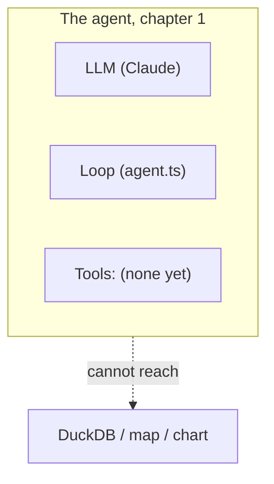

# Workshop Capability-Ladder Redesign Implementation Plan

> **For agentic workers:** REQUIRED SUB-SKILL: Use superpowers:subagent-driven-development (recommended) or superpowers:executing-plans to implement this plan task-by-task. Steps use checkbox (`- [ ]`) syntax for tracking.

**Goal:** Restructure the workshop curriculum (`docs/en` + `docs/ja`) into a failure-driven capability ladder, backed by two small app changes: a single-source tool-tier constant and a tier-aware system prompt.

**Architecture:** A new `src/lib/ai/toolTiers.ts` declares three tool tiers and one editable `ENABLED_TOOLS` constant; both `createTools()` and `buildSystemPrompt()` consume it so the agent's hands and its self-description can never disagree. The docs are rewritten as five chapters named by what the agent _has_, each ending in an organic "Where this fails" section that motivates the next chapter.

**Tech Stack:** TypeScript + Vitest (jsdom unit tests), Markdown + mermaid for docs. No new dependencies.

**Spec:** `docs/superpowers/specs/2026-07-24-workshop-ladder-redesign-design.md` — read it before starting any task.

## Global Constraints

- Branch: `feature/workshop-ladder-redesign` (PR #115). **Never push to `main`.**
- Commit messages: conventional style (`docs:`, `feat:`, `test:`), no `Co-Authored-By` trailer, user's normal git identity.
- **No attribution**: never mention any external talk, speaker, company, or workshop that inspired this format — in docs, code comments, commits, or PR text. The format is presented on its own terms.
- Optimize for readability over cleverness (repo CLAUDE.md); code must stay generic, never dataset-specific.
- Run `npm run check` before every commit; it must pass (it auto-formats, so `git add` after running it).
- English docs first (Tasks 3–10), Japanese parity after (Task 11). File names identical across `docs/en/` and `docs/ja/`.
- Old chapter files are deleted only in the task that ports their content — never earlier.
- Every new chapter follows the six-part skeleton: **① The agent so far ② The new piece ③ Run it ④ Where this fails ⑤ Hands-on ⑥ Development prompts** (chapter 5 replaces ④ with the design-theory synthesis and has no failure).
- Demo prompts are given in Japanese with an English gloss in parentheses, matching the existing docs' convention.

---

### Task 1: Tool tiers — `toolTiers.ts` + `createTools` filtering

**Files:**

- Create: `src/lib/ai/toolTiers.ts`
- Modify: `src/lib/ai/tools/index.ts`
- Test: `src/lib/ai/tools/index.test.ts` (extend)

**Interfaces:**

- Consumes: nothing new.
- Produces: `TIER_1`, `TIER_2`, `TIER_3` (readonly string-literal arrays), `type ToolName`, `ENABLED_TOOLS: readonly ToolName[]` — all exported from `src/lib/ai/toolTiers.ts`. `createTools(ctx: ToolContext, enabled: readonly ToolName[] = ENABLED_TOOLS)` — Task 2 and the docs rely on these exact names.

- [ ] **Step 1: Write the failing tests** — append to `src/lib/ai/tools/index.test.ts`:

```ts
import { ENABLED_TOOLS, TIER_1 } from '../toolTiers';

describe('tool tiers', () => {
    it('hands the agent every tool by default', () => {
        const tools = createTools(fakeContext());
        expect(Object.keys(tools).sort()).toEqual([...ENABLED_TOOLS].sort());
        expect(Object.keys(tools)).toHaveLength(8);
    });

    it('filters the registry to the enabled tiers', () => {
        const tools = createTools(fakeContext(), TIER_1);
        expect(Object.keys(tools).sort()).toEqual(['duckdb_query', 'load_builtin_dataset']);
    });

    it('returns an empty registry for the bare model', () => {
        expect(Object.keys(createTools(fakeContext(), []))).toHaveLength(0);
    });
});
```

- [ ] **Step 2: Run to verify failure** — `npx vitest run src/lib/ai/tools/index.test.ts`
      Expected: FAIL — `Cannot find module '../toolTiers'`.

- [ ] **Step 3: Create `src/lib/ai/toolTiers.ts`:**

```ts
/**
 * The workshop's capability ladder. The agent only receives the tools listed
 * in ENABLED_TOOLS, and the system prompt only describes those tools. Each
 * curriculum chapter enables one more tier by editing that one line:
 *
 *   Chapter 1 (a bare model):          []
 *   Chapter 2 (one general-purpose):   [...TIER_1]
 *   Chapter 3 (knowledge on demand):   [...TIER_1, ...TIER_2]
 *   Chapter 4+ (specialized tools):    [...TIER_1, ...TIER_2, ...TIER_3]
 */
export const TIER_1 = ['duckdb_query', 'load_builtin_dataset'] as const;
export const TIER_2 = ['get_skill'] as const;
export const TIER_3 = [
    'update_map_style',
    'get_map_style',
    'update_chart_spec',
    'get_chart_spec',
    'geocode_address',
] as const;

export type ToolName = (typeof TIER_1)[number] | (typeof TIER_2)[number] | (typeof TIER_3)[number];

// Workshop participants edit this line — one tier per chapter.
export const ENABLED_TOOLS: readonly ToolName[] = [...TIER_1, ...TIER_2, ...TIER_3];
```

- [ ] **Step 4: Filter in `createTools`** — in `src/lib/ai/tools/index.ts`, add the import and change only the function body's return:

```ts
import { ENABLED_TOOLS, type ToolName } from '../toolTiers';

export function createTools(ctx: ToolContext, enabled: readonly ToolName[] = ENABLED_TOOLS) {
    const all = {
        duckdb_query: createDuckdbQueryTool(ctx),
        load_builtin_dataset: createLoadBuiltinDatasetTool(ctx),
        get_skill: createGetSkillTool(),
        update_map_style: requireSkill('map', 'map.styling', createUpdateMapStyleTool(ctx)),
        get_map_style: createGetMapStyleTool(ctx),
        update_chart_spec: requireSkill('vega', 'vega.basics', createUpdateChartSpecTool(ctx)),
        get_chart_spec: createGetChartSpecTool(ctx),
        geocode_address: createGeocodeTool(),
    };
    // Keys outside `enabled` are absent at runtime. The cast keeps the full
    // static type: the default tier set includes every tool, and workshop
    // tiers are only ever narrowed by editing ENABLED_TOOLS.
    const entries = Object.entries(all).filter(([name]) => (enabled as readonly string[]).includes(name));
    return Object.fromEntries(entries) as typeof all;
}
```

Also extend the registry comment block above `createTools` with one line noting that `ENABLED_TOOLS` in `toolTiers.ts` decides which of these the agent actually receives.

- [ ] **Step 5: Run tests** — `npx vitest run src/lib/ai/tools/index.test.ts` → PASS (existing gate tests plus the 3 new ones).
- [ ] **Step 6: `npm run check`** → passes.
- [ ] **Step 7: Commit** — `feat: add tool tiers so the workshop can stage the agent's toolkit`

---

### Task 2: Tier-aware system prompt

**Files:**

- Modify: `src/lib/ai/systemPrompt.ts`
- Test: `src/lib/ai/systemPrompt.test.ts` (extend; existing 4 tests must keep passing unchanged)

**Interfaces:**

- Consumes: `ENABLED_TOOLS`, `ToolName`, `TIER_1` from `src/lib/ai/toolTiers.ts` (Task 1).
- Produces: `buildSystemPrompt(context: PromptContext, enabled: readonly ToolName[] = ENABLED_TOOLS): string`. `agent.ts` call site is untouched (default parameter).

- [ ] **Step 1: Write the failing tests** — append to `src/lib/ai/systemPrompt.test.ts`:

```ts
import { TIER_1 } from './toolTiers';

describe('tier-aware sections', () => {
    it('describes only the enabled tools for a tier-1 agent', () => {
        const prompt = buildSystemPrompt({ now, tables: [] }, TIER_1);
        expect(prompt).toContain('duckdb_query');
        expect(prompt).toContain('Built-in datasets');
        expect(prompt).not.toContain('get_skill');
        expect(prompt).not.toContain('update_map_style');
        expect(prompt).not.toContain('update_chart_spec');
        expect(prompt).not.toContain('geocode_address');
    });

    it('drops every tool section for the bare model', () => {
        const prompt = buildSystemPrompt({ now, tables: [] }, []);
        expect(prompt).toContain('geospatial data assistant');
        expect(prompt).toContain('Current date');
        expect(prompt).not.toContain('How to work');
        expect(prompt).not.toContain('Built-in datasets');
        expect(prompt).not.toContain('duckdb_query');
    });
});
```

- [ ] **Step 2: Run to verify failure** — `npx vitest run src/lib/ai/systemPrompt.test.ts`
      Expected: FAIL — tier-1 prompt still contains `update_map_style` (current monolithic `BASE_PROMPT`).

- [ ] **Step 3: Restructure `systemPrompt.ts`.** Split `BASE_PROMPT` into a constant plus four section builders; every string is carried over verbatim from the current file — only regrouped. Shape:

```ts
import { ENABLED_TOOLS, type ToolName } from './toolTiers';

const ROLE_AND_ENV = `You are a geospatial data assistant running entirely in the user's web browser.

## Environment
- Data lives in a DuckDB-WASM database (schema \`main\`) with the spatial extension loaded, so PostGIS-style functions (ST_Read, ST_Point, ST_GeometryType, ST_Area, ST_Distance, …) are available.
- You have no filesystem or network access except through your tools. The user sees three visual tabs — Table, Map, and Chart — that render whatever table is selected.
- Tables with a GEOMETRY column can be drawn on the map; any table can be charted.`;

/** "## How to work" — steps renumber themselves as tiers grow. */
function howToWorkSection(has: (t: ToolName) => boolean): string | null {
    const steps: string[] = [];
    if (has('duckdb_query')) {
        steps.push(
            'Explore before you answer. Use `duckdb_query` to inspect schemas and sample rows. Always add a LIMIT to exploratory SELECTs.'
        );
        steps.push(
            'When a result is worth visualizing, CREATE TABLE it (a stable, named table the visual tabs can read) rather than returning a huge SELECT.'
        );
    }
    if (has('update_map_style') || has('update_chart_spec')) {
        steps.push(
            'To draw a map, call `update_map_style` with the table, its geometry kind, and MapLibre paint properties. To make a chart, call `update_chart_spec` with a Vega-Lite spec. Read the current state first with `get_map_style` / `get_chart_spec` when adjusting an existing visualization.'
        );
    }
    if (has('geocode_address')) {
        steps.push(
            'Use `geocode_address` to turn a place name or address into coordinates when the user gives you one instead of data.'
        );
    }
    return steps.length ? `## How to work\n${steps.map((s, i) => `${i + 1}. ${s}`).join('\n')}` : null;
}

function builtinDatasetsSection(has: (t: ToolName) => boolean): string | null {
    /* current "## Built-in datasets" text, only when has('load_builtin_dataset') */
}
function skillsSection(has: (t: ToolName) => boolean): string | null {
    /* current "## Skills" text, only when has('get_skill'); keep the gate sentence only when has('update_map_style') || has('update_chart_spec') */
}
function rulesSection(has: (t: ToolName) => boolean): string {
    /* MapLibre + geometry-kind rules only when has('update_map_style'); Vega data/width/height rule only when has('update_chart_spec'); the concise/reply-in-user-language rule always */
}
```

`buildSystemPrompt(context, enabled = ENABLED_TOOLS)` builds `has = (t) => enabled.includes(t)`, assembles `[ROLE_AND_ENV, howToWorkSection(has), builtinDatasetsSection(has), skillsSection(has), rulesSection(has)].filter(Boolean).join('\n\n')`, then appends the existing `## Context` block unchanged. Also change the empty-tables fallback line: `'No tables yet. Load data first (e.g. read a Parquet/CSV/GeoJSON file with duckdb_query).'` → keep the sentence only when `has('duckdb_query')`, else just `'No tables yet.'` (the bare-model test asserts no `duckdb_query` mention).

- [ ] **Step 4: Run tests** — `npx vitest run src/lib/ai/systemPrompt.test.ts` → PASS: all 4 existing tests (default = full prompt, byte-identical sections) plus the 2 new ones.
- [ ] **Step 5: `npm run check`** → passes.
- [ ] **Step 6: Commit** — `feat: assemble the system prompt from tier-aware sections`

---

### Task 3: `docs/en/README.md` rewrite + `00-setup.md` pointer

**Files:**

- Modify: `docs/en/README.md` (full rewrite), `docs/en/00-setup.md` (last line only)

**Interfaces:**

- Produces: the chapter file names all later tasks link to: `01-bare-model.md`, `02-general-purpose-tool.md`, `03-skills.md`, `04-specialized-tools.md`, `05-curate-your-stack.md`.

- [ ] **Step 1: Rewrite `docs/en/README.md`** with this structure (port prose from the current file where it already says the right thing; title and goal are new):
    - **Title**: `# Building a Geospatial Agent, One Failure at a Time — GIS × LLM from the inside`. Intro paragraph: keep the current geo-chat description sentences, add one sentence naming the format: the agent starts bare and gains one tier of capability per chapter, and every chapter ends with a real geospatial request that breaks the current stack.
    - **Transfer Goal** blockquote — replace with the spec's revised transfer goal, verbatim from the spec's "Transfer goal (revised)" section.
    - **Learning outcomes** — the spec's 3 bullets, verbatim.
    - **Audience and Prerequisites** — unchanged from current.
    - **"Learn by breaking"** section — rewrite: failures are now _organic_ chapter-ending breaks rather than only sabotage; keep the fail-first philosophy paragraph; present the six-part chapter skeleton (① the agent so far ② the new piece ③ run it ④ where this fails ⑤ hands-on ⑥ development prompts).
    - **Course outline table** (replaces the timetable table) with columns `Time | Chapter | The agent gains | Where it fails`, rows exactly:

| Time      | Chapter                                                      | The agent gains                                   | Where it fails                                      |
| --------- | ------------------------------------------------------------ | ------------------------------------------------- | --------------------------------------------------- |
| (setup)   | [00-setup.md](./00-setup.md)                                 | a running app + API key                           | —                                                   |
| 0:00–0:30 | [01. A bare model](./01-bare-model.md)                       | nothing — LLM + loop, zero tools                  | all talk: it can describe SQL, it cannot touch data |
| 0:30–1:20 | [02. One general-purpose tool](./02-general-purpose-tool.md) | `duckdb_query`, `load_builtin_dataset`            | spatial requests: degrees-vs-meters garbage         |
| 1:20–1:55 | [03. Knowledge on demand](./03-skills.md)                    | `get_skill` + skill files                         | right numbers, trapped in text — no map, no chart   |
| 1:55–2:35 | [04. Specialized tools](./04-specialized-tools.md)           | map / chart / geocode tools, validation, the gate | occasional wrong tool or wrong parameters           |
| 2:35–3:00 | [05. Curate your stack](./05-curate-your-stack.md)           | a design theory + your own challenge              | —                                                   |

- **Appendices** section — unchanged links.
- **The 3 layers of "prompt"** table — keep verbatim, update the "Chapters" column references: ① experienced in 01–02, ② read in 02–03, written in 03–04, ③ from 04 on.
- [ ] **Step 2: Update the last line of `00-setup.md`** to `When you are ready, go on to [01. A bare model](./01-bare-model.md).`
- [ ] **Step 3: `npm run check`** → passes. Commit — `docs: rewrite curriculum README around the capability ladder (en)`

---

### Task 4: Chapter 1 — `01-bare-model.md`

**Files:**

- Create: `docs/en/01-bare-model.md`
- Delete: `docs/en/01-what-is-an-agent.md` (after porting)

**Blueprint** (six-part skeleton; port from `01-what-is-an-agent.md` — read it fully first):

- **① The agent so far** — mermaid stack diagram, the ladder's base state. Use this diagram as the series template; later chapters add nodes:



- **② The new piece** — port, lightly edited for the new frame: the opening magic demo (full-tier app, the choropleth prompt) explicitly labeled _"a preview of hour 3 — now we rewind to zero"_; the ChatGPT question; the GeoAI positioning map; the agent = LLM + tools + loop + context skeleton; the full "tool calling is just token prediction" section including the Opus 4.8 court aside; the 3-layers-of-prompt recap; "where to read the code" (agent.ts / tools/index.ts / systemPrompt.ts / useAgentChat.ts). New addition: introduce `src/lib/ai/toolTiers.ts` and `ENABLED_TOOLS` as "the workshop's throttle."
- **③ Run it** — set `export const ENABLED_TOOLS: readonly ToolName[] = [];` in `toolTiers.ts`, ask 「自治体を都道府県ごとに色分けして地図に表示して」. The old break-it experiment #1 observation text ports here as the _expected result_: the model narrates the SQL it would run, no tool cards, no tabs change, sometimes tool-call-shaped XML leaks as prose.
- **④ Where this fails** — this chapter IS the failure; close with: a model without tools is a proposer, not an agent. Handoff sentence: "In chapter 2 we hand it exactly one tool — and it turns out one good general-purpose tool goes a very long way."
- **⑤ Hands-on** — port exercises 1–3 from the old chapter (empty-tools question, tool-card `input`/`output` inspection after restoring `[...TIER_1]` briefly, concept-map drawing), adjusted to use `ENABLED_TOOLS` edits instead of `tools: {}` in `useAgentChat.ts`.
- **⑥ Development prompts** — pointer to appendix, as the old chapter's §⑤.

- [ ] **Step 1: Write the file** per blueprint. **Step 2: Delete `01-what-is-an-agent.md`.** **Step 3: `npm run check`** → passes. **Step 4: Commit** — `docs: chapter 1, the bare model (en)`

---

### Task 5: Chapter 2 — `02-general-purpose-tool.md`

**Files:**

- Create: `docs/en/02-general-purpose-tool.md`
- Delete: `docs/en/03-agent-loop.md` (after porting; `02-duckdb-wasm.md` is deleted in Task 7)

**Blueprint** (port from `02-duckdb-wasm.md` §① concept + hands-on SQL sections, and ALL of `03-agent-loop.md` — read both fully first):

- **① The agent so far** — the chapter-1 diagram plus a `duckdb_query` + `load_builtin_dataset` tools node connected to DuckDB; map/chart still unreachable. `ENABLED_TOOLS = [...TIER_1]`.
- **② The new piece** — three sub-sections:
    1. _The substrate_: DuckDB / DuckDB-WASM concept, why SQL is the language LLMs speak best, the serialized-connection queue (from old 02).
    2. _The loop, witnessed_: the entire old chapter 03 — sequence diagram, statelessness surprise, `agent.ts` close reading, system-prompt dissection (note the prompt is now assembled from tier-aware sections — show the tier-1 prompt and point out what is _absent_), DevTools network archaeology. The archaeology lands here because multi-round-trips exist only now that a tool does.
    3. _Aggregation belongs in the tool_: `duckdb_query` returns ≤5 sample rows + row count; "how many municipalities per prefecture" runs COUNT in SQL rather than retrieving rows for the model to count — context economy as a design principle.
- **③ Run it** — participants first hand-write 2–3 SQL statements in the SQL tab (port the old 02 hands-on exercises), then delegate the same questions to the agent and diff the SQL it writes. Include one deliberate SQL typo prompt to show error → self-correction in the tool cards.
- **④ Where this fails** — the organic break. Prompts in order of reliability, run each on a fresh chat:
    1. 「各都道府県の面積を km² で計算して」 (compute each prefecture's area in km²) — `ST_Area` on EPSG:4326 returns degrees².
    2. 「東京駅から 30km 以内の市を探して」 (cities within 30 km of Tokyo Station) — `ST_DWithin` with 30000 in degree units.
       Observation text: absurd numbers or zero rows; discuss _zero results: valid answer or failure mode?_. **Fallback paragraph (required):** if the model gets it right from prior knowledge, inspect the transcript for everything it had to already know (projected CRS choice, `always_xy`, unit conversion) and frame chapter 3 as making that reliable instead of lucky. Close: the model lacked _knowledge_, not capability — cliffhanger to skills.
- **⑤ Hands-on** — the hand-written SQL exercises plus DevTools request-counting (old 03 exercises 1–3).
- **⑥ Development prompts** — old 03 §⑤ prompt (explaining `runAgent` in 5 lines), unchanged.

- [ ] **Step 1: Write the file.** **Step 2: Delete `03-agent-loop.md`.** **Step 3: `npm run check`** → passes. **Step 4: Commit** — `docs: chapter 2, one general-purpose tool (en)`

---

### Task 6: Chapter 3 — `03-skills.md`

**Files:**

- Create: `docs/en/03-skills.md`
- Delete: `docs/en/06-skill-system.md` (after porting)

**Blueprint** (port from `06-skill-system.md`, minus the gate sections which move to chapter 4 — read it fully first):

- **① The agent so far** — diagram gains `get_skill` + a "skill files (\*.md)" store node. `ENABLED_TOOLS = [...TIER_1, ...TIER_2]`.
- **② The new piece** — open with chapter 2's failure diagnosis; present the band-aid escalation ("just add the projection rule to the system prompt… then the next rule, then the whole spatial manual") and its dead end: context is a finite resource. Then progressive disclosure, ported: skill file format, frontmatter, `idFromPath`, build-time glob, catalog embedded in `get_skill`'s description, `resolveWithDeps`. Include the key excerpt of `duckdb/spatial.md` (the projection caveat + `always_xy` trap) as _the knowledge that was missing in chapter 2_.
- **③ Run it** — rerun chapter 2's exact failing prompt on a fresh chat. Expected: the model fetches `duckdb.spatial` (tool card with skill-id badge), then writes correct project → measure → 4326 SQL. Put the two transcripts side by side.
- **④ Where this fails** — ask 「その結果を地図に表示して」 (show that result on the map). The agent has no map tool — it can only apologize or print a table. Deterministic failure. Cliffhanger: knowledge fixed the _what_, chapter 4 adds specialized _hands_ — and shows why they deserve more than a bare `execute`.
- **⑤ Hands-on** — port "write one skill of your own" (heatmap template, dev-server restart, catalog verification) unchanged.
- **⑥ Development prompts** — port old 06 §⑤ skill-drafting prompt.

- [ ] **Step 1: Write the file.** **Step 2: Delete `06-skill-system.md`.** **Step 3: `npm run check`** → passes. **Step 4: Commit** — `docs: chapter 3, knowledge on demand (en)`

---

### Task 7: Chapter 4 — `04-specialized-tools.md`

**Files:**

- Create: `docs/en/04-specialized-tools.md`
- Delete: `docs/en/02-duckdb-wasm.md`, `docs/en/04-building-tools.md`, `docs/en/05-declarative-specs.md` (after porting)

**Blueprint** (port from `04-building-tools.md` + `05-declarative-specs.md` + the gate half of old `06-skill-system.md` + the MVT/tile deep-dive from old `02-duckdb-wasm.md` — read all four fully first):

- **① The agent so far** — full stack diagram: all 8 tools, skills store, gate badge on `update_map_style`/`update_chart_spec`. `ENABLED_TOOLS = [...TIER_1, ...TIER_2, ...TIER_3]` (the app's default — the ladder is complete).
- **② The new piece** — four sub-sections:
    1. _Tool anatomy_ (old 04): name / description / inputSchema / execute; the model never sees `execute`; description = the model's only clue. Keep the empty-description experiment as an in-chapter experiment (not the chapter break).
    2. _The declarative-spec boundary_ (old 05, whole): imperative vs declarative, the 4-property table (validatable/diffable/repairable/execution-separated), `updateChartSpec.ts` 3-stage validation, `updateMapStyle.ts` paint-prefix + `["get", col]` auto-correction, the "write JS vs write a spec" A/B experiment, spec editor exercise.
    3. _The gate_ (from old 06): `gate.ts` Set, `requireSkill`, per-session reset; run the complex-choropleth-without-skill experiment (refusal → self-fetch → success). Framing sentence: descriptions and system prompts _ask_; the gate _enforces_.
    4. _Under the map_ (from old 02): the `duckdb://` tile protocol / MVT pipeline as a sidebar — the execution layer the specs delegate to.
- **③ Run it** — chapter 3's failing prompt now succeeds end-to-end: 「各都道府県の面積を km² で計算して、地図に塗り分けて」 (compute the areas and shade the map). Follow the tool cards: skill fetch → SQL → gate-passing `update_map_style`.
- **④ Where this fails** — softer break: occasionally the model still picks the wrong tool or fumbles parameters (e.g., charts a table when asked for a map, or guesses a paint property the validator rejects). No single reliable repro — say so honestly, show what the validation errors look like when it happens. These residual failures are a _design_ problem, not a mechanism problem → chapter 5.
- **⑤ Hands-on** — the `buffer_analysis` development-prompt exercise (old 04 §④, verbatim including the review checklist), reframed: _the query class that broke chapter 2 becomes your own specialized, validated tool_.
- **⑥ Development prompts** — old 04/05 §⑤ prompts, unchanged.

- [ ] **Step 1: Write the file.** **Step 2: Delete the three old files.** **Step 3: `npm run check`** → passes. **Step 4: Commit** — `docs: chapter 4, specialized tools (en)`

---

### Task 8: Chapter 5 — `05-curate-your-stack.md`

**Files:**

- Create: `docs/en/05-curate-your-stack.md`
- Delete: `docs/en/07-challenge.md` (after porting)

**Blueprint** (new synthesis material + port all of `07-challenge.md` — read it fully first):

- **① The agent so far** — the full diagram one last time, now annotated with tiers 1–3 and the chapter numbers where each arrived.
- **② The new piece — a design theory** (new prose, ~3 sections):
    1. _Specialized ↔ general-purpose_: plot the 8 tools on one axis (mermaid or a table): `geocode_address` (one job, simple params, hard to misuse) → `update_map_style`/`update_chart_spec` (constrained spec writing + validation) → `duckdb_query` (full query language, the ceiling). Low floor = tools the model uses correctly out of the box; high ceiling = tools that handle the questions you didn't anticipate. A good agent needs both.
    2. _Failure modes → mechanisms_: a recap table mapping each failure met in chapters 1–4 to what fixed it — no hands → tools; missing knowledge → skills (progressive disclosure); unreliable conventions → gate; near-miss parameters → validation + auto-repair; wrong tool choice → descriptions and their trigger conditions/relationships.
    3. _Evolving your own stack_: start with the general-purpose tool for your data; log the agent's behavior; when you see repeated multi-call fumbling on one task shape, carve out a specialized tool or skill for it. The rule of thumb: too many tool calls per question is the signal that the tool is too hard for the model.
- **③ Run it / ⑤ Hands-on** — port the entire challenge menu (1)–(6) and the closing articulation ("write your first tool's `description` in one sentence", neighbor exchange) from old 07, updating internal chapter references (old ch. 04 → new ch. 4, old ch. 06 → new ch. 3).
- **⑥ Development prompts** — appendix pointer.

- [ ] **Step 1: Write the file.** **Step 2: Delete `07-challenge.md`.** **Step 3: `npm run check`** → passes. **Step 4: Commit** — `docs: chapter 5, curate your stack (en)`

---

### Task 9: English appendices — fix cross-references

**Files:**

- Modify: `docs/en/appendix-prompts.md`, `docs/en/appendix-troubleshooting.md`

- [ ] **Step 1:** In `appendix-prompts.md`: `### 1-a … (chapter 04)` → `(chapter 4)`; `### 1-b A skill md (chapter 06)` → `(chapter 3)`; the line "it doesn't appear in chapter 03's `tools` array" → "chapter 2's `tools` array". Then `grep -n "chapter 0" docs/en/*.md` and fix any remaining old-numbering hits (also grep for the deleted file names: `grep -rn "what-is-an-agent\|duckdb-wasm\|agent-loop\|building-tools\|declarative-specs\|skill-system\|07-challenge" docs/en/`).
- [ ] **Step 2:** Same greps over `appendix-troubleshooting.md`; expected: no hits beyond prose that survives review.
- [ ] **Step 3: `npm run check`** → passes. Commit — `docs: update appendix cross-references to the new chapter layout (en)`

---

### Task 10: Root README pointer update

**Files:**

- Modify: `README.md` (repo root)

- [ ] **Step 1:** Line ~48: replace the workshop title with `a 3-hour workshop, "Building a Geospatial Agent, One Failure at a Time."` Line ~79: `docs/en/07-challenge.md` → `docs/en/05-curate-your-stack.md`. Then `grep -n "docs/en\|docs/ja" README.md CLAUDE.md` and fix any other stale chapter links (CLAUDE.md has none today; verify).
- [ ] **Step 2: `npm run check`** → passes. Commit — `docs: point root README at the new curriculum`

---

### Task 11: Japanese parity — rewrite `docs/ja/`

**Files:**

- Create: `docs/ja/01-bare-model.md`, `docs/ja/02-general-purpose-tool.md`, `docs/ja/03-skills.md`, `docs/ja/04-specialized-tools.md`, `docs/ja/05-curate-your-stack.md`
- Modify: `docs/ja/README.md` (full rewrite), `docs/ja/00-setup.md` (last-line pointer), `docs/ja/appendix-prompts.md`, `docs/ja/appendix-troubleshooting.md` (cross-references)
- Delete: `docs/ja/01-what-is-an-agent.md`, `02-duckdb-wasm.md`, `03-agent-loop.md`, `04-building-tools.md`, `05-declarative-specs.md`, `06-skill-system.md`, `07-challenge.md`

- [ ] **Step 1:** For each English file from Tasks 3–9, produce the Japanese counterpart. **Reuse the existing `docs/ja/` translations for every ported section** (the old ja files contain human-quality Japanese for all migrated content — port paragraphs from them, do not re-translate from English). Only genuinely new material (chapter framing, "Where this fails" sections, chapter-5 design theory) is translated fresh. Demo prompts are already Japanese; drop the English glosses in the ja tree, matching current convention.
- [ ] **Step 2:** Delete the seven old ja files. Run the Task 9 greps over `docs/ja/`.
- [ ] **Step 3: `npm run check`** → passes. Commit — `docs: japanese parity for the capability-ladder curriculum`

---

### Task 12: Final verification and PR update

- [ ] **Step 1:** Link check: `grep -rn "](\./" docs/en docs/ja | grep -o "(\./[^)]*)" | sort -u` — every referenced file must exist (`ls` each; a tiny fish loop is fine). Expected: zero missing targets.
- [ ] **Step 2:** Stale-reference check: `grep -rn "what-is-an-agent\|agent-loop\|building-tools\|declarative-specs\|skill-system\|07-challenge\|duckdb-wasm" docs/ README.md CLAUDE.md` → zero hits.
- [ ] **Step 3:** `npm run check` → passes. `npm run test:browser` if the environment allows (code changes touched only unit-tested files; browser suite should be unaffected).
- [ ] **Step 4:** Push the branch; update PR #115's description checklist to mark implementation landed. Do not merge — the user merges after review.
- [ ] **Step 5 (manual, presenter):** Dry-run the ladder with a live API key per the spec's Verification section — each chapter's Run-it prompts succeed at that tier, each break fails or falls back as documented. This is a human step; note the outcome in the PR.
